# ANÁLISIS COMPLETO DE MIGRACIÓN - ERP SIGRE 2.0
## De PowerBuilder 2025 a Arquitectura Moderna Frontend/Backend

---

## 📋 TABLA DE CONTENIDOS

1. [Resumen Ejecutivo](#resumen-ejecutivo)
2. [Estado Actual del Sistema](#estado-actual-del-sistema)
3. [Arquitectura Propuesta](#arquitectura-propuesta)
4. [Stack Tecnológico](#stack-tecnológico)
5. [Análisis de Módulos](#análisis-de-módulos)
6. [Base de Datos Oracle 11gR2](#base-de-datos-oracle-11gr2)
7. [Plan de Migración](#plan-de-migración)
8. [Roadmap de Implementación](#roadmap-de-implementación)
9. [Consideraciones Técnicas](#consideraciones-técnicas)
10. [Riesgos y Mitigación](#riesgos-y-mitigación)

---

## 🎯 RESUMEN EJECUTIVO

### **Contexto del Proyecto**

El ERP SIGRE es un sistema integral desarrollado en **PowerBuilder 2025** para una empresa pesquera/agroindustrial, con **más de 10,000 archivos de código fuente** distribuidos en **25+ módulos funcionales**. El sistema gestiona:

- ✅ Operaciones pesqueras (flota, capturas, procesamiento)
- ✅ Gestión agroindustrial y producción
- ✅ Contabilidad, finanzas y tesorería
- ✅ Recursos humanos (1300+ trabajadores)
- ✅ Almacenes e inventarios
- ✅ Compras, ventas y comercialización
- ✅ Mantenimiento y operaciones

### **Objetivo de la Migración**

Transformar el sistema monolítico PowerBuilder en una **arquitectura moderna de microservicios** con:

- 🎨 **Frontend**: Aplicación web moderna y responsive
- ⚙️ **Backend**: Microservicios REST independientes
- 💾 **Base de Datos**: Oracle 11gR2 (mantener estructura actual)
- 🔄 **Integración**: APIs RESTful y mensajería asíncrona
- 📱 **Accesibilidad**: Multi-dispositivo (web, tablet, móvil)

### **Beneficios Esperados**

| Aspecto | Actual (PowerBuilder) | Futuro (Web/Microservicios) |
|---------|----------------------|----------------------------|
| **Acceso** | Solo desktop Windows | Web, móvil, tablet |
| **Escalabilidad** | Limitada (monolítico) | Alta (microservicios) |
| **Mantenimiento** | Complejo, acoplado | Modular, independiente |
| **Tecnología** | PowerBuilder (legacy) | Stack moderno, vigente |
| **Costo de licencias** | Alto (PB + Oracle Client) | Reducido (solo Oracle DB) |
| **Desarrollo** | Equipo especializado PB | Desarrolladores web estándar |
| **Integración** | Limitada | APIs REST abiertas |
| **Performance** | Cliente pesado | Cliente ligero, cacheable |

---

## 🏗️ ESTADO ACTUAL DEL SISTEMA

### **Arquitectura PowerBuilder Actual**


### **Características Técnicas Actuales**

#### **Conexión a Base de Datos**
```sql
-- Configuración actual en PowerBuilder
SQLCA.DBMS = "O10 Oracle10g (10.1.0)"
SQLCA.LogId = "esquema_usuario"
SQLCA.LogPass = "password_encriptado"
SQLCA.ServerName = "servidor_oracle"
SQLCA.AutoCommit = False
SQLCA.DBParm = "PBCatalogOwner='esquema'"
```

#### **Estructura de Módulos**

| Módulo | Archivos | Líneas Código (est.) | Complejidad | Prioridad Migración |
|--------|----------|---------------------|-------------|---------------------|
| **CoreLibrary** | 460 | ~50,000 | 🔴 Alta | 1 - Fundación |
| **Seguridad** | 87 | ~10,000 | 🟡 Media | 1 - Fundación |
| **Contabilidad** | 816 | ~120,000 | 🔴 Muy Alta | 1 - Fundación |
| **Finanzas** | 1,072 | ~150,000 | 🔴 Muy Alta | 1 - Fundación |
| **Almacén** | 480 | ~70,000 | 🔴 Alta | 2 - Core |
| **RRHH** | 1,315 | ~180,000 | 🔴 Muy Alta | 2 - Core |
| **Producción** | 826 | ~110,000 | 🔴 Muy Alta | 2 - Core |
| **Flota** | 440 | ~65,000 | 🔴 Alta | 2 - Core |
| **Ventas** | 518 | ~75,000 | 🔴 Alta | 3 - Comercial |
| **Compras** | 658 | ~90,000 | 🔴 Alta | 3 - Comercial |
| **Otros (15+)** | ~2,500 | ~350,000 | Variable | 4-5 - Soporte |

**Total estimado**: ~10,000+ archivos, ~1.3M líneas de código

### **Mecanismo de Integración Contable (Crítico)**

```mermaid
sequenceDiagram
    participant M as Módulo Operativo<br/>(Almacén/Ventas/RRHH)
    participant MC as Matrices Contables
    participant PA as Pre-Asientos
    participant C as Contabilidad
    participant O as Oracle DB
    
    M->>M: Genera Transacción<br/>(Movimiento, Venta, Planilla)
    M->>MC: Consulta Matriz<br/>por Concepto
    MC->>MC: Determina Cuentas<br/>Debe/Haber
    M->>PA: Crea Pre-Asiento<br/>en Tablas Temporales
    PA->>C: Transfiere a<br/>Módulo Contabilidad
    C->>C: Valida y Consolida
    C->>O: Inserta en<br/>Libro Diario Oficial
    O-->>C: Confirmación
    C-->>M: Asiento Generado
    
    Note over M,O: Proceso Automático mediante<br/>Conceptos y Matrices Configurables
```



#### **Tablas Clave del Sistema Actual**

```sql
-- Tablas de Integración Contable
MATRIZ_CONTABLE          -- Configuración de matrices contables
CONCEPTO_FINANCIERO      -- Conceptos financieros
PRE_ASIENTO              -- Pre-asientos temporales
ASIENTO_CONTABLE         -- Asientos contables oficiales
PLAN_CUENTAS             -- Plan de cuentas contable
CENTRO_COSTOS            -- Centros de costos

-- Tablas de Operaciones
VALE_MOV_ALM             -- Movimientos de almacén
DOC_X_PAGAR              -- Documentos por pagar
DOC_X_COBRAR             -- Documentos por cobrar
ORDEN_TRABAJO            -- Órdenes de trabajo
TRABAJADOR               -- Maestro de trabajadores
RH_CONCEPTO_CALCULO      -- Conceptos de planilla
```

---

## 🚀 ARQUITECTURA PROPUESTA

### **Arquitectura de Microservicios - SIGRE 2.0**

```mermaid
graph TB
    subgraph "FRONTEND - Capa Presentación"
        WEB[Web App Angular/React<br/>Responsive Design]
        MOB[Mobile App<br/>Opcional]
    end
    
    subgraph "API GATEWAY & SEGURIDAD"
        GW[API Gateway<br/>Spring Cloud Gateway]
        AUTH[Auth Service<br/>JWT + OAuth2]
        DISC[Service Discovery<br/>Eureka/Consul]
    end
    
    subgraph "MICROSERVICIOS DE NEGOCIO"
        ACC[Accounting Service<br/>Contabilidad]
        FIN[Finance Service<br/>Finanzas]
        INV[Inventory Service<br/>Almacén]
        HR[HR Service<br/>Recursos Humanos]
        PROD[Production Service<br/>Producción]
        FLEET[Fleet Service<br/>Flota Pesquera]
        SALES[Sales Service<br/>Ventas]
        PUR[Purchasing Service<br/>Compras]
    end
    
    subgraph "SERVICIOS TRANSVERSALES"
        NOTIF[Notification Service<br/>Email/SMS/Push]
        FILE[File Service<br/>Documentos]
        RPT[Reporting Service<br/>Reportes]
        INT[Integration Service<br/>APIs Externas]
    end
    
    subgraph "CAPA DE DATOS"
        ORACLE[(Oracle 11gR2<br/>Base de Datos Central)]
        REDIS[(Redis Cache<br/>Caché Distribuido)]
        MONGO[(MongoDB<br/>Logs y Auditoría)]
    end
    
    subgraph "INFRAESTRUCTURA"
        MSG[Message Queue<br/>RabbitMQ/Kafka]
        LOG[Logging<br/>ELK Stack]
        MON[Monitoring<br/>Prometheus/Grafana]
    end
    
    WEB --> GW
    MOB --> GW
    
    GW --> AUTH
    GW --> ACC
    GW --> FIN
    GW --> INV
    GW --> HR
    GW --> PROD
    GW --> FLEET
    GW --> SALES
    GW --> PUR
    
    AUTH --> DISC
    ACC --> DISC
    FIN --> DISC
    INV --> DISC
    HR --> DISC
    PROD --> DISC
    FLEET --> DISC
    SALES --> DISC
    PUR --> DISC
    
    ACC --> ORACLE
    FIN --> ORACLE
    INV --> ORACLE
    HR --> ORACLE
    PROD --> ORACLE
    FLEET --> ORACLE
    SALES --> ORACLE
    PUR --> ORACLE
    
    ACC --> REDIS
    FIN --> REDIS
    INV --> REDIS
    
    ACC --> MSG
    FIN --> MSG
    INV --> MSG
    HR --> MSG
    
    NOTIF --> MSG
    FILE --> ORACLE
    RPT --> ORACLE
    INT --> ORACLE
    
    ACC --> LOG
    FIN --> LOG
    INV --> LOG
    
    ACC --> MON
    FIN --> MON
    
    INT --> MONGO
    
    style WEB fill:#3498db,color:#fff
    style GW fill:#e67e22,color:#fff
    style AUTH fill:#e74c3c,color:#fff
    style ORACLE fill:#2ecc71,color:#fff
    style MSG fill:#9b59b6,color:#fff
```



### **Flujo de Integración Contable en Nueva Arquitectura**


---

## 💻 STACK TECNOLÓGICO

### **Frontend - Opción 1: Angular (Recomendado)**


**Justificación Angular**:
- ✅ Framework enterprise-grade con TypeScript nativo
- ✅ Arquitectura robusta para aplicaciones grandes
- ✅ Excelente tooling y CLI
- ✅ Angular Material (componentes UI empresariales)
- ✅ RxJS para manejo de streams de datos
- ✅ Gran comunidad y soporte de Google

### **Frontend - Opción 2: React**


**Justificación React**:
- ✅ Mayor flexibilidad y ecosistema
- ✅ Renderizado más eficiente (Virtual DOM)
- ✅ Amplia disponibilidad de desarrolladores
- ✅ Librerías de UI maduras (MUI, Ant Design)
- ✅ React Query para gestión de server state

### **Backend - Java Spring Boot (Recomendado)**


**Stack Backend Detallado**:

```yaml
Lenguaje: Java 17+ LTS
Framework: Spring Boot 3.x
Build: Maven o Gradle
ORM: Spring Data JPA + Hibernate
Base de Datos: Oracle 11gR2
Cache: Redis
Mensajería: RabbitMQ o Apache Kafka
API: REST (Spring Web)
Seguridad: Spring Security + JWT
Documentación: OpenAPI/Swagger
Testing: JUnit 5, Mockito, TestContainers
```

### **Arquitectura de un Microservicio Típico**


### **Ejemplo de Estructura de Código - Microservicio**

```
accounting-service/
├── src/
│   ├── main/
│   │   ├── java/
│   │   │   └── com/sigre/accounting/
│   │   │       ├── AccountingServiceApplication.java
│   │   │       ├── controller/
│   │   │       │   ├── AccountingController.java
│   │   │       │   ├── AccountEntryController.java
│   │   │       │   └── ChartOfAccountsController.java
│   │   │       ├── service/
│   │   │       │   ├── AccountingService.java
│   │   │       │   ├── AccountEntryService.java
│   │   │       │   ├── MatrixService.java
│   │   │       │   └── impl/
│   │   │       ├── repository/
│   │   │       │   ├── AccountingRepository.java
│   │   │       │   ├── AccountEntryRepository.java
│   │   │       │   └── MatrixRepository.java
│   │   │       ├── model/
│   │   │       │   ├── entity/
│   │   │       │   │   ├── AsientoContable.java
│   │   │       │   │   ├── PlanCuentas.java
│   │   │       │   │   └── MatrizContable.java
│   │   │       │   └── dto/
│   │   │       │       ├── AccountEntryDTO.java
│   │   │       │       └── AccountingResponseDTO.java
│   │   │       ├── config/
│   │   │       │   ├── SecurityConfig.java
│   │   │       │   ├── DatabaseConfig.java
│   │   │       │   └── RedisConfig.java
│   │   │       ├── exception/
│   │   │       │   ├── GlobalExceptionHandler.java
│   │   │       │   └── AccountingException.java
│   │   │       ├── messaging/
│   │   │       │   ├── AccountingEventPublisher.java
│   │   │       │   └── AccountingEventConsumer.java
│   │   │       └── util/
│   │   │           └── AccountingUtils.java
│   │   └── resources/
│   │       ├── application.yml
│   │       ├── application-dev.yml
│   │       ├── application-prod.yml
│   │       └── db/
│   │           └── migration/
│   └── test/
│       └── java/
│           └── com/sigre/accounting/
│               ├── controller/
│               ├── service/
│               └── integration/
├── pom.xml
└── Dockerfile
```

---

## 📊 ANÁLISIS DETALLADO DE MÓDULOS

### **Módulos Core - Primera Fase**

#### **1. CoreLibrary Service**

```mermaid
graph TB
    subgraph "CoreLibrary Service - Funcionalidades Compartidas"
        A[Gestión de Sesiones]
        B[Validaciones Comunes]
        C[Utilidades de Fecha/Número]
        D[Manejo de Errores]
        E[Logs y Auditoría]
        F[Configuración Global]
        G[Helpers de BD]
    end
    
    H[Otros Microservicios] --> A
    H --> B
    H --> C
    H --> D
    H --> E
    H --> F
    H --> G
    
    style A fill:#3498db,color:#fff
```



**Responsabilidades**:
- Funciones comunes reutilizables
- Validaciones de negocio transversales
- Utilidades de conversión y formateo
- Gestión centralizada de configuración
- Auditoría y logging

#### **2. Auth Service (Seguridad)**

```mermaid
graph LR
    A[Cliente] -->|1. Login| B[Auth Service]
    B -->|2. Valida| C[(Oracle DB<br/>USUARIO table)]
    C -->|3. Usuario Válido| B
    B -->|4. Genera JWT| D[JWT Token]
    B -->|5. Retorna Token| A
    A -->|6. Request + Token| E[API Gateway]
    E -->|7. Valida JWT| B
    B -->|8. Token Válido| E
    E -->|9. Forward| F[Microservicio]
    
    style B fill:#e74c3c,color:#fff
    style D fill:#f39c12,color:#fff
```



**Funcionalidades**:
- Autenticación con JWT
- Gestión de roles y permisos
- SSO (Single Sign-On)
- Control de sesiones
- Políticas de contraseñas

#### **3. Accounting Service (Contabilidad)**


**APIs Principales**:

```yaml
POST   /api/accounting/entries              # Crear asiento contable
GET    /api/accounting/entries/{id}         # Obtener asiento
PUT    /api/accounting/entries/{id}         # Modificar asiento
DELETE /api/accounting/entries/{id}         # Anular asiento

GET    /api/accounting/chart-of-accounts    # Plan de cuentas
POST   /api/accounting/chart-of-accounts    # Crear cuenta

GET    /api/accounting/cost-centers         # Centros de costos
POST   /api/accounting/cost-centers         # Crear centro

POST   /api/accounting/matrices             # Configurar matriz
GET    /api/accounting/matrices/{concept}   # Obtener matriz

GET    /api/accounting/reports/balance      # Balance de comprobación
GET    /api/accounting/reports/ledger       # Libro mayor
GET    /api/accounting/reports/journal      # Libro diario

POST   /api/accounting/closing/monthly      # Cierre mensual
POST   /api/accounting/closing/annual       # Cierre anual
```

#### **4. Finance Service (Finanzas)**

```mermaid
graph TB
    subgraph "Finance Service"
        A[Cuentas por Cobrar]
        B[Cuentas por Pagar]
        C[Tesorería]
        D[Bancos]
        E[Flujo de Caja]
        F[Cobranzas]
        G[Pagos]
    end
    
    A --> C
    B --> C
    C --> D
    C --> E
    A --> F
    B --> G
    
    H[Ventas] --> A
    I[Compras] --> B
    
    J[Accounting Service] -.->|Eventos Contables| A
    J -.-> B
    
    style C fill:#2ecc71,color:#fff
```



**APIs Principales**:

```yaml
# Cuentas por Cobrar
POST /api/finance/receivables              # Crear documento por cobrar
GET  /api/finance/receivables/pending      # Pendientes de cobro
POST /api/finance/receivables/collect      # Registrar cobranza

# Cuentas por Pagar
POST /api/finance/payables                 # Crear documento por pagar
GET  /api/finance/payables/pending         # Pendientes de pago
POST /api/finance/payables/pay             # Registrar pago

# Tesorería
POST /api/finance/treasury/income          # Ingreso de caja
POST /api/finance/treasury/expense         # Egreso de caja
GET  /api/finance/treasury/cash-flow       # Flujo de caja

# Bancos
GET  /api/finance/banks/accounts           # Cuentas bancarias
POST /api/finance/banks/transactions       # Movimientos bancarios
GET  /api/finance/banks/reconciliation     # Conciliación bancaria
```

---

### **Módulos Operativos - Segunda Fase**

#### **5. Inventory Service (Almacén)**

```mermaid
graph TB
    subgraph "Inventory Service - Control de Inventarios"
        A[Maestro de Artículos]
        B[Almacenes]
        C[Movimientos]
        D[Kardex]
        E[Valorización]
        F[Lotes y Series]
        G[Inventario Físico]
    end
    
    C --> D
    C --> E
    A --> F
    B --> G
    
    H[Production] -->|Consumo| C
    I[Sales] -->|Salida| C
    J[Purchasing] -->|Ingreso| C
    
    C -->|Evento| K[Accounting Service]
    
    style C fill:#e67e22,color:#fff
    style E fill:#f39c12,color:#fff
```



**Funcionalidades Clave**:
- Gestión de almacenes múltiples
- Control de movimientos (entradas/salidas)
- Kardex valorizado en tiempo real
- Manejo de lotes y fechas de vencimiento
- Trazabilidad completa
- Inventarios físicos
- Integración contable automática

#### **6. HR Service (Recursos Humanos)**


**Integración con Stored Procedures**:

```java
// Ejemplo de llamada a SP desde Spring Boot
@Repository
public interface PayrollRepository extends JpaRepository<Payroll, Long> {
    
    @Procedure(name = "USP_RH_CAL_CALCULA_PLANILLA")
    void calculatePayroll(
        @Param("p_empresa") String empresa,
        @Param("p_origen") String origen,
        @Param("p_trabajador") Long trabajadorId,
        @Param("p_fecha_proceso") Date fechaProceso
    );
    
    @Procedure(name = "USP_RH_GEN_DOC_PAGO_PLLA")
    void generatePaymentDocuments(
        @Param("p_empresa") String empresa,
        @Param("p_periodo") String periodo
    );
}
```

#### **7. Production Service (Producción)**

```mermaid
graph TB
    subgraph "Production Service"
        A[Órdenes de Trabajo]
        B[Partes de Producción]
        C[Control de Calidad]
        D[Costos de Producción]
        E[Productos Terminados]
    end
    
    A --> B
    B --> C
    B --> D
    B --> E
    
    F[Inventory] -->|Consumo MP| B
    E -->|Ingreso PT| F
    
    D --> G[Accounting Service]
    
    style A fill:#1abc9c,color:#fff
    style D fill:#e67e22,color:#fff
```



#### **8. Fleet Service (Flota Pesquera)**


---

## 💾 BASE DE DATOS ORACLE 11gR2

### **Estrategia de Migración de Base de Datos**

```mermaid
graph LR
    A[BD Actual<br/>Oracle 11gR2<br/>PowerBuilder] -->|Mantener| B[BD Nueva<br/>Oracle 11gR2<br/>Microservicios]
    
    subgraph "Cambios Mínimos"
        C[Mismas Tablas]
        D[Mismos SPs]
        E[Ajustes Índices]
        F[Nuevas Tablas<br/>Auditoría]
    end
    
    B --> C
    B --> D
    B --> E
    B --> F
    
    style B fill:#2ecc71,color:#fff
```



**Principio**: **Mantener máxima compatibilidad** con la BD actual

### **Esquema de Base de Datos por Dominio**


### **Tablas Principales del Sistema**

#### **Módulo de Contabilidad**

```sql
-- Plan de Cuentas
CREATE TABLE PLAN_CUENTAS (
    EMPRESA         VARCHAR2(10) NOT NULL,
    CNTA_CNTBL      VARCHAR2(20) NOT NULL,
    DESCRIPCION     VARCHAR2(200),
    NIVEL           NUMBER(2),
    TIPO_CUENTA     VARCHAR2(1), -- A=Activo, P=Pasivo, I=Ingreso, G=Gasto
    MONEDA          VARCHAR2(3),
    ESTADO          VARCHAR2(1),
    PRIMARY KEY (EMPRESA, CNTA_CNTBL)
);

-- Centros de Costos
CREATE TABLE CENTRO_COSTOS (
    EMPRESA         VARCHAR2(10) NOT NULL,
    CENCOS          VARCHAR2(20) NOT NULL,
    DESCRIPCION     VARCHAR2(200),
    NIVEL           NUMBER(2),
    CENCOS_PADRE    VARCHAR2(20),
    TIPO            VARCHAR2(2), -- PR=Producción, AD=Administrativo
    ESTADO          VARCHAR2(1),
    PRIMARY KEY (EMPRESA, CENCOS)
);

-- Matrices Contables (Core de la Integración)
CREATE TABLE MATRIZ_CONTABLE (
    EMPRESA             VARCHAR2(10) NOT NULL,
    TIPO_MATRIZ         VARCHAR2(10) NOT NULL, -- VS=Ventas, AL=Almacén, etc
    CODIGO              VARCHAR2(20) NOT NULL,
    CONCEPTO_FIN        VARCHAR2(20),
    CNTA_CNTBL_DEBE     VARCHAR2(20),
    CNTA_CNTBL_HABER    VARCHAR2(20),
    CENCOS_DEBE         VARCHAR2(20),
    CENCOS_HABER        VARCHAR2(20),
    PRIMARY KEY (EMPRESA, TIPO_MATRIZ, CODIGO)
);

-- Asientos Contables
CREATE TABLE ASIENTO_CONTABLE (
    EMPRESA             VARCHAR2(10) NOT NULL,
    LIBRO               VARCHAR2(10) NOT NULL,
    ORIGEN              VARCHAR2(10) NOT NULL,
    PERIODO             VARCHAR2(6) NOT NULL,
    NRO_ASIENTO         NUMBER NOT NULL,
    LINEA               NUMBER NOT NULL,
    FECHA_ASIENTO       DATE,
    CNTA_CNTBL          VARCHAR2(20),
    CENCOS              VARCHAR2(20),
    COD_RELACION        VARCHAR2(20),
    TIPO_DOC            VARCHAR2(10),
    NRO_DOC             VARCHAR2(30),
    GLOSA               VARCHAR2(500),
    DEBE_MN             NUMBER(18,2),
    HABER_MN            NUMBER(18,2),
    DEBE_ME             NUMBER(18,2),
    HABER_ME            NUMBER(18,2),
    TC                  NUMBER(10,6),
    ESTADO              VARCHAR2(1),
    PRIMARY KEY (EMPRESA, LIBRO, ORIGEN, PERIODO, NRO_ASIENTO, LINEA)
);
```

#### **Módulo de Almacén**

```sql
-- Movimientos de Almacén
CREATE TABLE VALE_MOV_ALM (
    EMPRESA         VARCHAR2(10) NOT NULL,
    TIPO_MOV        VARCHAR2(10) NOT NULL,
    ALMACEN         VARCHAR2(10) NOT NULL,
    NRO_VALE        VARCHAR2(30) NOT NULL,
    FECHA_MOV       DATE,
    COD_RELACION    VARCHAR2(20),
    CENCOS          VARCHAR2(20),
    ESTADO          VARCHAR2(1), -- P=Pendiente, A=Aprobado, C=Contabilizado
    CONTABILIZADO   VARCHAR2(1),
    PRIMARY KEY (EMPRESA, TIPO_MOV, ALMACEN, NRO_VALE)
);

-- Detalle de Movimientos
CREATE TABLE VALE_MOV_ALM_DET (
    EMPRESA         VARCHAR2(10) NOT NULL,
    TIPO_MOV        VARCHAR2(10) NOT NULL,
    ALMACEN         VARCHAR2(10) NOT NULL,
    NRO_VALE        VARCHAR2(30) NOT NULL,
    LINEA           NUMBER NOT NULL,
    COD_ART         VARCHAR2(30),
    CANTIDAD        NUMBER(18,4),
    PRECIO_UNIT     NUMBER(18,6),
    IMPORTE         NUMBER(18,2),
    LOTE            VARCHAR2(50),
    PRIMARY KEY (EMPRESA, TIPO_MOV, ALMACEN, NRO_VALE, LINEA)
);

-- Saldos de Inventario
CREATE TABLE SALDO_ARTICULO (
    EMPRESA         VARCHAR2(10) NOT NULL,
    ALMACEN         VARCHAR2(10) NOT NULL,
    COD_ART         VARCHAR2(30) NOT NULL,
    SALDO_FISICO    NUMBER(18,4),
    SALDO_VALORIZADO NUMBER(18,2),
    PRECIO_PROMEDIO NUMBER(18,6),
    ULTIMA_ACT      DATE,
    PRIMARY KEY (EMPRESA, ALMACEN, COD_ART)
);
```

#### **Módulo de RRHH**

```sql
-- Trabajadores
CREATE TABLE TRABAJADOR (
    EMPRESA             VARCHAR2(10) NOT NULL,
    ORIGEN              VARCHAR2(10) NOT NULL,
    COD_TRABAJADOR      VARCHAR2(20) NOT NULL,
    APELLIDO_PATERNO    VARCHAR2(100),
    APELLIDO_MATERNO    VARCHAR2(100),
    NOMBRES             VARCHAR2(100),
    TIPO_DOC            VARCHAR2(2),
    NRO_DOC             VARCHAR2(20),
    FECHA_INGRESO       DATE,
    FECHA_CESE          DATE,
    ESTADO              VARCHAR2(1), -- A=Activo, C=Cesado
    CENCOS              VARCHAR2(20),
    CARGO               VARCHAR2(20),
    PRIMARY KEY (EMPRESA, ORIGEN, COD_TRABAJADOR)
);

-- Conceptos de Cálculo de Planilla
CREATE TABLE RH_CONCEPTO_CALCULO (
    EMPRESA         VARCHAR2(10) NOT NULL,
    CONCEPTO        VARCHAR2(20) NOT NULL,
    DESCRIPCION     VARCHAR2(200),
    TIPO            VARCHAR2(1), -- G=Ganancia, D=Descuento
    FORMULA         VARCHAR2(4000),
    CONCEPTO_FIN    VARCHAR2(20), -- Para integración financiera
    PRIMARY KEY (EMPRESA, CONCEPTO)
);

-- Planilla Calculada
CREATE TABLE RH_PLANILLA_CALCULO (
    EMPRESA             VARCHAR2(10) NOT NULL,
    ORIGEN              VARCHAR2(10) NOT NULL,
    TIPO_TRABAJADOR     VARCHAR2(10) NOT NULL,
    FECHA_PROCESO       DATE NOT NULL,
    COD_TRABAJADOR      VARCHAR2(20) NOT NULL,
    CONCEPTO            VARCHAR2(20) NOT NULL,
    IMPORTE             NUMBER(18,2),
    PRIMARY KEY (EMPRESA, ORIGEN, TIPO_TRABAJADOR, FECHA_PROCESO, 
                 COD_TRABAJADOR, CONCEPTO)
);
```

### **Stored Procedures Críticos a Mantener**

```sql
-- Procedimiento de cálculo de planilla
CREATE OR REPLACE PROCEDURE USP_RH_CAL_CALCULA_PLANILLA (
    p_empresa           IN VARCHAR2,
    p_origen            IN VARCHAR2,
    p_tipo_trabajador   IN VARCHAR2,
    p_fecha_proceso     IN DATE,
    p_trabajador        IN VARCHAR2,
    p_resultado         OUT NUMBER,
    p_mensaje           OUT VARCHAR2
) AS
BEGIN
    -- Lógica compleja de cálculo de planilla
    -- Aplicación de fórmulas por concepto
    -- Cálculo de aportes patronales
    -- Generación de registros en RH_PLANILLA_CALCULO
    NULL;
END;
/

-- Procedimiento de generación de documentos por pagar
CREATE OR REPLACE PROCEDURE USP_RH_GEN_DOC_PAGO_PLLA (
    p_empresa       IN VARCHAR2,
    p_origen        IN VARCHAR2,
    p_periodo       IN VARCHAR2,
    p_resultado     OUT NUMBER,
    p_mensaje       OUT VARCHAR2
) AS
BEGIN
    -- Genera documentos por pagar de planilla
    -- Agrupa por concepto financiero
    -- Crea registros en DOC_X_PAGAR
    -- Prepara para contabilización
    NULL;
END;
/
```

### **Índices Recomendados para Performance**

```sql
-- Índices para Contabilidad
CREATE INDEX IDX_ASIENTO_FECHA ON ASIENTO_CONTABLE(EMPRESA, FECHA_ASIENTO);
CREATE INDEX IDX_ASIENTO_CUENTA ON ASIENTO_CONTABLE(EMPRESA, CNTA_CNTBL);
CREATE INDEX IDX_ASIENTO_CENCOS ON ASIENTO_CONTABLE(EMPRESA, CENCOS);

-- Índices para Almacén
CREATE INDEX IDX_VALE_FECHA ON VALE_MOV_ALM(EMPRESA, FECHA_MOV);
CREATE INDEX IDX_VALE_ESTADO ON VALE_MOV_ALM(EMPRESA, ESTADO, CONTABILIZADO);
CREATE INDEX IDX_SALDO_ART ON SALDO_ARTICULO(EMPRESA, COD_ART);

-- Índices para RRHH
CREATE INDEX IDX_TRAB_ESTADO ON TRABAJADOR(EMPRESA, ESTADO);
CREATE INDEX IDX_TRAB_CENCOS ON TRABAJADOR(EMPRESA, CENCOS);
CREATE INDEX IDX_PLANILLA_FECHA ON RH_PLANILLA_CALCULO(EMPRESA, FECHA_PROCESO);
```

---

## 🗺️ PLAN DE MIGRACIÓN

### **Estrategia General: Migración Incremental**

```mermaid
graph TB
    A[Sistema PowerBuilder<br/>ACTUAL] -->|Fase 1| B[Sistema Híbrido<br/>PB + Microservicios]
    B -->|Fase 2| C[Sistema Híbrido<br/>Mayoría Microservicios]
    C -->|Fase 3| D[Sistema Nuevo<br/>100% Microservicios]
    
    subgraph "Convivencia"
        B
        C
    end
    
    style A fill:#e74c3c,color:#fff
    style D fill:#2ecc71,color:#fff
```



### **Fases de Migración Detalladas**


### **Fase 1: Fundación (4-5 meses)**

#### **Objetivos**
- ✅ Establecer infraestructura base
- ✅ Implementar servicios core
- ✅ Validar arquitectura con módulos simples

#### **Entregables**

```mermaid
graph LR
    A[Infraestructura<br/>Cloud/On-Premise] --> B[API Gateway]
    A --> C[Service Discovery]
    A --> D[Config Server]
    
    B --> E[Auth Service]
    B --> F[CoreLibrary Service]
    
    E --> G[(Oracle DB)]
    F --> G
    
    style A fill:#3498db,color:#fff
    style E fill:#e74c3c,color:#fff
```

**Tareas Detalladas**:

1. **Setup Infraestructura** (2-3 semanas)
   - Configurar entornos (Dev, QA, Prod)
   - Setup Oracle 11gR2 para microservicios
   - Configurar CI/CD (Jenkins/GitLab CI)
   - Setup Docker + Kubernetes (si aplica)

2. **API Gateway** (2-3 semanas)
   - Implementar Spring Cloud Gateway
   - Configurar routing a servicios
   - Implementar rate limiting
   - CORS y políticas de seguridad

3. **Auth Service** (3-4 semanas)
   - Implementar autenticación JWT
   - Migrar tabla USUARIO
   - Sistema de roles y permisos
   - Integración con PB (temporal)

4. **CoreLibrary Service** (4-6 semanas)
   - Migrar funciones comunes
   - Utilidades de fecha/número
   - Validaciones de negocio
   - Helpers de BD

### **Fase 2: Contable-Financiero (5-6 meses)**

#### **Objetivo**: Migrar el CORAZÓN del sistema

```mermaid
graph TB
    subgraph "Módulos Críticos Migrados"
        A[Accounting Service]
        B[Finance Service]
    end
    
    subgraph "Integración con PB"
        C[Módulo Almacén PB]
        D[Módulo Ventas PB]
        E[Módulo RRHH PB]
    end
    
    C -->|API REST| A
    D -->|API REST| B
    E -->|API REST| B
    
    A <-->|Mensajería| B
    
    style A fill:#e74c3c,color:#fff
    style B fill:#2ecc71,color:#fff
```

**Estrategia de Convivencia**:

1. **Accounting Service recibe eventos** de:
   - Almacén (aún en PB) vía API REST
   - Ventas (aún en PB) vía API REST
   - RRHH (aún en PB) vía API REST

2. **Finance Service recibe**:
   - Documentos por pagar de Compras (PB)
   - Documentos por cobrar de Ventas (PB)
   - Documentos de RRHH (PB)

**APIs de Integración Temporal**:

```yaml
# API para que PowerBuilder llame a Accounting Service
POST /api/v1/accounting/legacy/movement
  Request:
    - tipo_movimiento: string
    - datos_movimiento: object
    - aplicar_matriz: boolean
  Response:
    - asiento_generado: object
    - numero_asiento: string

# API para que PowerBuilder llame a Finance Service
POST /api/v1/finance/legacy/document
  Request:
    - tipo_documento: string
    - concepto_financiero: string
    - detalles: array
  Response:
    - documento_id: long
    - estado: string
```

### **Fase 3: Operaciones Core (6-8 meses)**

#### **Prioridades**:
1. **Inventory Service** (más usado, impacto directo)
2. **HR Service** (complejo, crítico)
3. **Production Service** (específico negocio)
4. **Fleet Service** (específico negocio)

```mermaid
graph TB
    A[Inventory Service<br/>NUEVO] -->|Genera Eventos| B[Accounting Service]
    
    C[HR Service<br/>NUEVO] -->|Genera Docs| D[Finance Service]
    D --> B
    
    E[Production Service<br/>NUEVO] -->|Consume MP| A
    E -->|Genera PT| A
    E -->|Costos| B
    
    F[Fleet Service<br/>NUEVO] -->|MP Pescado| A
    F -->|Liquidaciones| D
    
    style A fill:#e67e22,color:#fff
    style C fill:#9b59b6,color:#fff
    style E fill:#1abc9c,color:#fff
    style F fill:#3498db,color:#fff
```

### **Fase 4: Comercial y Compras (4-6 meses)**

```mermaid
graph LR
    A[Sales Service] -->|Salidas| B[Inventory Service]
    A -->|Docs x Cobrar| C[Finance Service]
    
    D[Purchasing Service] -->|Ingresos| B
    D -->|Docs x Pagar| C
    
    C --> E[Accounting Service]
    
    style A fill:#2ecc71,color:#fff
    style D fill:#f39c12,color:#fff
```

### **Fase 5: Módulos de Soporte (3-4 meses)**

**Módulos Finales**:
- Attendance Service (Asistencia)
- Cafeteria Service (Comedor)
- Maintenance Service (Mantenimiento)
- Fixed Assets Service (Activo Fijo)
- Audit Service (Auditoría)
- Reporting Service (Reportes ejecutivos)

---

## 📅 ROADMAP DE IMPLEMENTACIÓN

### **Timeline General (18-24 meses)**

```mermaid
timeline
    title Roadmap SIGRE 2.0 - Migración Completa
    
    section Q1 2025
        Enero : Análisis detallado
              : Setup infraestructura
        Febrero : CoreLibrary Service
                : Auth Service en desarrollo
        Marzo : API Gateway
              : Primeras pruebas
    
    section Q2 2025
        Abril : Accounting Service
              : Diseño BD migrada
        Mayo : Finance Service
             : Integración contable
        Junio : Testing módulos core
              : Ajustes y fixes
    
    section Q3 2025
        Julio : Go-Live Contabilidad
              : Inventory Service
        Agosto : HR Service
               : Production Service
        Septiembre : Fleet Service
                   : Testing integrado
    
    section Q4 2025
        Octubre : Sales Service
                : Purchasing Service
        Noviembre : Testing comercial
                  : Optimizaciones
        Diciembre : Módulos soporte
                  : Capacitación
    
    section Q1-Q2 2026
        Enero-Marzo : Migración módulos restantes
                    : Testing exhaustivo
        Abril-Junio : Go-Live completo
                    : Desmantelamiento PB
```

### **Hitos Críticos (Milestones)**

```mermaid
graph LR
    M1[M1: Infraestructura<br/>Ready] -->|2 meses| M2[M2: Auth & Core<br/>Operativos]
    M2 -->|3 meses| M3[M3: Contabilidad<br/>en Producción]
    M3 -->|4 meses| M4[M4: Inventario & RRHH<br/>Migrados]
    M4 -->|3 meses| M5[M5: Comercial<br/>Completo]
    M5 -->|4 meses| M6[M6: Sistema Completo<br/>Migrado]
    
    style M1 fill:#3498db,color:#fff
    style M3 fill:#e74c3c,color:#fff
    style M6 fill:#2ecc71,color:#fff
```

| Hito | Fecha Objetivo | Criterios de Aceptación |
|------|---------------|------------------------|
| **M1: Infraestructura Ready** | Feb 2025 | ✅ Entornos configurados<br/>✅ CI/CD funcionando<br/>✅ Oracle conectado |
| **M2: Auth & Core Operativos** | Abr 2025 | ✅ Login funcionando<br/>✅ API Gateway activo<br/>✅ Funciones core migradas |
| **M3: Contabilidad en Producción** | Jul 2025 | ✅ Asientos contables OK<br/>✅ Matrices funcionando<br/>✅ Reportes básicos |
| **M4: Inventario & RRHH Migrados** | Nov 2025 | ✅ Movimientos almacén<br/>✅ Planillas calculadas<br/>✅ Integración contable |
| **M5: Comercial Completo** | Feb 2026 | ✅ Ventas y compras<br/>✅ CxC y CxP<br/>✅ Facturación electrónica |
| **M6: Sistema Completo Migrado** | Jun 2026 | ✅ Todos los módulos<br/>✅ PowerBuilder descontinuado<br/>✅ Sistema estable |

---

## ⚙️ CONSIDERACIONES TÉCNICAS

### **Patrones de Diseño Recomendados**

#### **1. Event-Driven Architecture para Integración Contable**

```mermaid
sequenceDiagram
    participant INV as Inventory Service
    participant MQ as Message Queue
    participant ACC as Accounting Service
    participant DB as Oracle DB
    
    INV->>DB: Guarda Movimiento
    DB-->>INV: OK
    INV->>MQ: Publish<br/>InventoryMovementCreated
    Note over MQ: Evento Asíncrono
    
    MQ-->>ACC: Subscribe Evento
    ACC->>ACC: Procesa Matriz Contable
    ACC->>DB: Genera Pre-Asiento
    ACC->>DB: Valida y Confirma
    ACC->>MQ: Publish<br/>AccountingEntryCreated
    
    Note over INV,DB: Desacoplamiento Total<br/>Sin Bloqueos
```

**Ventajas**:
- ✅ Desacoplamiento total entre servicios
- ✅ Sin bloqueos (procesamiento asíncrono)
- ✅ Resiliencia (reintentos automáticos)
- ✅ Auditoría completa (eventos guardados)
- ✅ Escalabilidad independiente

#### **2. API Gateway Pattern**

```mermaid
graph TB
    CLIENT[Clientes<br/>Web/Mobile] -->|HTTP| GW[API Gateway]
    
    GW -->|Auth| A[Auth Service]
    GW -->|Accounting| B[Accounting Service]
    GW -->|Inventory| C[Inventory Service]
    GW -->|HR| D[HR Service]
    
    subgraph "Gateway Responsibilities"
        GW1[Rate Limiting]
        GW2[Authentication]
        GW3[Request Routing]
        GW4[Load Balancing]
        GW5[Logging]
    end
    
    GW --> GW1
    GW --> GW2
    GW --> GW3
    GW --> GW4
    GW --> GW5
    
    style GW fill:#e67e22,color:#fff
```

#### **3. Circuit Breaker Pattern**

```mermaid
stateDiagram-v2
    [*] --> Closed
    Closed --> Open: Fallas > Umbral
    Open --> HalfOpen: Timeout
    HalfOpen --> Closed: Success
    HalfOpen --> Open: Falla
    
    Closed: Peticiones Normales
    Open: Rechaza Peticiones<br/>Respuesta Fallback
    HalfOpen: Prueba Recuperación
```

**Implementación con Resilience4j**:

```java
@Service
public class AccountingService {
    
    @CircuitBreaker(name = "accounting", fallbackMethod = "fallbackGetBalance")
    @Retry(name = "accounting")
    @Bulkhead(name = "accounting")
    public BalanceDTO getBalance(String empresa, String cuenta) {
        // Llamada al servicio
        return accountingRepository.getBalance(empresa, cuenta);
    }
    
    // Método fallback si falla el servicio
    public BalanceDTO fallbackGetBalance(String empresa, String cuenta, Exception e) {
        log.error("Fallback activado para getBalance", e);
        return BalanceDTO.builder()
            .cuenta(cuenta)
            .saldo(BigDecimal.ZERO)
            .mensaje("Servicio temporalmente no disponible")
            .build();
    }
}
```

### **Seguridad**

#### **Flujo de Autenticación JWT**

```mermaid
sequenceDiagram
    participant C as Cliente
    participant GW as API Gateway
    participant AUTH as Auth Service
    participant SVC as Business Service
    participant DB as Oracle DB
    
    C->>AUTH: POST /auth/login<br/>{user, password}
    AUTH->>DB: Valida credenciales
    DB-->>AUTH: Usuario válido
    AUTH->>AUTH: Genera JWT Token
    AUTH-->>C: {token, refreshToken}
    
    Note over C: Cliente guarda token
    
    C->>GW: GET /api/accounting/balance<br/>Header: Authorization Bearer {token}
    GW->>AUTH: Valida Token
    AUTH-->>GW: Token válido + Claims
    GW->>SVC: Forward request + User context
    SVC->>DB: Query data
    DB-->>SVC: Result
    SVC-->>GW: Response
    GW-->>C: Response
```

**Estructura del JWT Token**:

```json
{
  "header": {
    "alg": "HS256",
    "typ": "JWT"
  },
  "payload": {
    "sub": "usuario123",
    "empresa": "EMPRESA01",
    "nombre": "Juan Pérez",
    "roles": ["ROLE_USER", "ROLE_CONTABILIDAD"],
    "permisos": ["VER_ASIENTOS", "CREAR_ASIENTOS"],
    "iat": 1609459200,
    "exp": 1609545600
  },
  "signature": "..."
}
```

### **Performance y Optimización**

#### **Estrategia de Caché**

```mermaid
graph TB
    A[Cliente] -->|Request| B[API Gateway]
    B --> C{Cache Hit?}
    C -->|Sí| D[Redis Cache]
    C -->|No| E[Microservicio]
    E --> F[(Oracle DB)]
    F --> E
    E --> D
    D --> B
    E --> B
    B --> A
    
    style D fill:#e74c3c,color:#fff
    style F fill:#2ecc71,color:#fff
```

**Datos a Cachear**:
- ✅ Plan de cuentas (raramente cambia)
- ✅ Centros de costos
- ✅ Maestro de artículos
- ✅ Tipos de cambio del día
- ✅ Configuraciones del sistema
- ✅ Permisos de usuario

**Ejemplo de implementación**:

```java
@Service
public class ChartOfAccountsService {
    
    @Autowired
    private RedisTemplate<String, ChartOfAccountsDTO> redisTemplate;
    
    @Cacheable(value = "chartOfAccounts", key = "#empresa")
    public List<ChartOfAccountsDTO> getChartOfAccounts(String empresa) {
        // Si está en cache, retorna directo
        // Si no, ejecuta query y guarda en cache
        return chartRepository.findByEmpresa(empresa);
    }
    
    @CacheEvict(value = "chartOfAccounts", key = "#empresa")
    public void invalidateCache(String empresa) {
        // Invalida cache cuando hay cambios
    }
}
```

### **Logging y Monitoreo**

```mermaid
graph TB
    subgraph "Microservicios"
        A[Service 1]
        B[Service 2]
        C[Service 3]
    end
    
    A --> D[Logstash]
    B --> D
    C --> D
    
    D --> E[Elasticsearch]
    E --> F[Kibana<br/>Dashboards]
    
    A --> G[Prometheus]
    B --> G
    C --> G
    
    G --> H[Grafana<br/>Metrics]
    
    style E fill:#00bfb3,color:#fff
    style G fill:#e74c3c,color:#fff
```

**Métricas Clave a Monitorear**:

1. **Técnicas**:
   - Tiempo de respuesta por endpoint
   - Throughput (requests/segundo)
   - Tasa de errores
   - Uso de CPU/Memoria
   - Conexiones a BD

2. **Negocio**:
   - Asientos contables generados/hora
   - Movimientos de almacén/día
   - Planillas calculadas/mes
   - Documentos por cobrar/pagar
   - Tiempo de procesamiento de reportes

---

## ⚠️ RIESGOS Y MITIGACIÓN

### **Matriz de Riesgos**

| Riesgo | Probabilidad | Impacto | Severidad | Mitigación |
|--------|-------------|---------|-----------|------------|
| **Pérdida de lógica de negocio** | Media | Muy Alto | 🔴 Crítico | Documentación exhaustiva, revisión código a código |
| **Problemas de performance** | Media | Alto | 🟡 Alto | Pruebas de carga, optimización BD, caché |
| **Incompatibilidad de datos** | Baja | Muy Alto | 🔴 Crítico | Mantener esquema BD, pruebas exhaustivas |
| **Resistencia al cambio** | Alta | Medio | 🟡 Alto | Capacitación continua, UX intuitivo |
| **Bugs en producción** | Media | Alto | 🟡 Alto | Testing riguroso, rollback plan, monitoreo |
| **Sobrecostos** | Media | Medio | 🟡 Medio | Planning detallado, sprints cortos, control |
| **Delays en cronograma** | Alta | Medio | 🟡 Medio | Buffer en estimaciones, priorización clara |
| **Integración contable** | Media | Muy Alto | 🔴 Crítico | POC temprano, validación continua |

### **Estrategias de Mitigación Detalladas**

#### **1. Riesgo: Pérdida de Lógica de Negocio**

**Plan de Mitigación**:
```mermaid
graph TD
    A[Código PowerBuilder] --> B[Análisis Línea a Línea]
    B --> C[Documentación Funcional]
    C --> D[Casos de Prueba]
    D --> E[Implementación Nueva]
    E --> F[Testing Comparativo]
    F --> G{Resultados<br/>Idénticos?}
    G -->|No| B
    G -->|Sí| H[Aprobado]
    
    style A fill:#e74c3c,color:#fff
    style H fill:#2ecc71,color:#fff
```

**Acciones**:
1. ✅ Crear matriz de trazabilidad función PB → función nueva
2. ✅ Documentar cada algoritmo crítico (planillas, costos, matrices)
3. ✅ Generar casos de prueba con datos reales
4. ✅ Validación cruzada: resultados PB vs nuevo sistema
5. ✅ Revisión por usuarios clave del negocio

#### **2. Riesgo: Problemas de Performance**

**Plan de Mitigación**:

```yaml
Acciones:
  - Pruebas de carga desde etapas tempranas
  - Identificar queries lentos (>2 seg)
  - Implementar caché Redis para datos frecuentes
  - Optimizar índices en Oracle
  - Paginación en todas las consultas grandes
  - Procesamiento asíncrono para tareas pesadas
  - Monitoring con alertas de performance
  
SLA Objetivo:
  - Tiempo respuesta API: < 500ms (p95)
  - Generación reportes: < 10 seg
  - Cálculo planilla: < 30 seg por trabajador
  - Cierre mensual: < 2 horas
```

#### **3. Riesgo: Integración Contable**

**Plan de Mitigación**:

1. **POC (Proof of Concept) Temprano** (Mes 2-3)
   - Implementar UN flujo completo end-to-end
   - Ejemplo: Movimiento Almacén → Matriz → Asiento
   - Validar con datos reales
   - Ajustar diseño según resultados

2. **Validación Paralela** (Durante toda la migración)
   ```mermaid
   graph LR
       A[Transacción] --> B[Sistema PB]
       A --> C[Sistema Nuevo]
       B --> D[Resultado PB]
       C --> E[Resultado Nuevo]
       D --> F[Comparador]
       E --> F
       F --> G{Idénticos?}
       G -->|No| H[Alerta]
       G -->|Sí| I[OK]
   ```

3. **Testing de Matrices**
   - Validar TODAS las matrices configuradas
   - Casos de prueba por cada tipo de movimiento
   - Comparar asientos generados PB vs nuevo

---

## 📊 ESTIMACIÓN DE ESFUERZO

### **Esfuerzo por Componente (Persona-Mes)**

| Componente | Análisis | Desarrollo | Testing | Total PM | Equipo |
|------------|----------|------------|---------|----------|--------|
| **Infraestructura** | 1 | 2 | 1 | 4 | DevOps |
| **API Gateway** | 0.5 | 1.5 | 1 | 3 | Backend |
| **Auth Service** | 1 | 2 | 1 | 4 | Backend |
| **CoreLibrary Service** | 2 | 4 | 2 | 8 | Backend |
| **Accounting Service** | 3 | 8 | 3 | 14 | Backend + Funcional |
| **Finance Service** | 3 | 8 | 3 | 14 | Backend + Funcional |
| **Inventory Service** | 2 | 6 | 2 | 10 | Backend |
| **HR Service** | 3 | 10 | 3 | 16 | Backend + Funcional |
| **Production Service** | 2 | 6 | 2 | 10 | Backend |
| **Fleet Service** | 2 | 5 | 2 | 9 | Backend |
| **Sales Service** | 2 | 5 | 2 | 9 | Backend |
| **Purchasing Service** | 2 | 5 | 2 | 9 | Backend |
| **Otros Servicios** | 3 | 8 | 3 | 14 | Backend |
| **Frontend Web** | 3 | 12 | 4 | 19 | Frontend |
| **Testing E2E** | - | - | 6 | 6 | QA |
| **Documentación** | - | 3 | - | 3 | Todos |
| **Capacitación** | 1 | 2 | - | 3 | Funcional |
| **TOTAL** | **30** | **87.5** | **37** | **154.5 PM** | |

### **Composición del Equipo**

```mermaid
pie title "Distribución de Esfuerzo por Rol"
    "Backend Developers" : 45
    "Frontend Developers" : 20
    "DevOps/Infra" : 10
    "QA/Testing" : 15
    "Arquitecto/Tech Lead" : 5
    "Analista Funcional" : 5
```

**Equipo Recomendado**:

| Rol | Cantidad | Dedicación | Duración |
|-----|----------|------------|----------|
| **Arquitecto/Tech Lead** | 1 | 100% | 24 meses |
| **Backend Developer Senior** | 3 | 100% | 20 meses |
| **Backend Developer Mid** | 2 | 100% | 18 meses |
| **Frontend Developer Senior** | 2 | 100% | 18 meses |
| **Frontend Developer Mid** | 1 | 100% | 15 meses |
| **DevOps Engineer** | 1 | 100% | 24 meses |
| **QA Engineer** | 2 | 100% | 20 meses |
| **Analista Funcional** | 1 | 50% | 24 meses |
| **DBA Oracle** | 1 | 25% | 24 meses |

**Costo Estimado** (Perú - Rangos USD/mes):

| Rol | Salario Promedio | Costo Anual |
|-----|------------------|-------------|
| Arquitecto Senior | $5,000 | $60,000 |
| Developer Senior | $3,500 | $42,000 |
| Developer Mid | $2,500 | $30,000 |
| DevOps Engineer | $3,500 | $42,000 |
| QA Engineer | $2,000 | $24,000 |

**Costo Total Estimado**: $800,000 - $1,200,000 USD (equipo completo por 2 años)

---

## 🎓 CAPACITACIÓN Y GESTIÓN DEL CAMBIO

### **Plan de Capacitación**

```mermaid
graph TB
    A[Usuarios Finales] --> B[Capacitación Básica<br/>40 horas]
    B --> C[Práctica Supervisada<br/>2 semanas]
    C --> D[Go-Live con Soporte]
    
    E[Usuarios Power] --> F[Capacitación Avanzada<br/>80 horas]
    F --> G[Configuración Sistema<br/>4 semanas]
    G --> D
    
    H[Equipo TI] --> I[Capacitación Técnica<br/>120 horas]
    I --> J[Mantenimiento y Soporte<br/>Continuo]
    
    style B fill:#3498db,color:#fff
    style F fill:#e67e22,color:#fff
    style I fill:#e74c3c,color:#fff
```

### **Estrategia de Adopción**

1. **Comunicación Temprana**
   - Presentación ejecutiva del proyecto
   - Beneficios esperados
   - Timeline y expectativas

2. **Pilotos por Módulo**
   - Grupo reducido de usuarios clave
   - Validación funcional
   - Feedback temprano

3. **Go-Live por Fases**
   - No big-bang
   - Migración gradual
   - Rollback plan siempre disponible

4. **Soporte Post-Go-Live**
   - Equipo dedicado 24/7 primera semana
   - Soporte extendido primer mes
   - Hotline permanente

---

## 📝 CONCLUSIONES Y RECOMENDACIONES

### **Conclusiones Clave**

1. ✅ **Proyecto Viable**: La migración es técnicamente factible y estratégicamente necesaria
2. ✅ **Riesgo Controlado**: Migración incremental reduce riesgos significativamente
3. ✅ **ROI Positivo**: Beneficios a largo plazo justifican la inversión
4. ✅ **Mantener BD**: Oracle 11gR2 actual es adecuado, no requiere cambio mayor
5. ✅ **Stack Moderno**: Java Spring Boot + Angular/React es apropiado para el contexto

### **Recomendaciones Finales**

#### **✅ Hacer (DO)**

1. **Iniciar con POC** de integración contable (crítico)
2. **Documentar exhaustivamente** lógica de negocio actual
3. **Mantener equipo estable** durante toda la migración
4. **Automatizar testing** desde el inicio
5. **Implementar monitoring** robusto
6. **Capacitar continuamente** a usuarios

#### **❌ No Hacer (DON'T)**

1. **NO hacer big-bang**: Migrar gradualmente
2. **NO cambiar BD**: Mantener Oracle 11gR2
3. **NO sobrecomplej**: Mantener arquitectura simple inicialmente
4. **NO subestimar** complejidad de módulos contables/RRHH
5. **NO descuidar** documentación y capacitación

### **Próximos Pasos Inmediatos**

```mermaid
graph LR
    A[Aprobación<br/>Proyecto] --> B[Conformar<br/>Equipo]
    B --> C[Setup<br/>Infraestructura]
    C --> D[POC<br/>Contabilidad]
    D --> E[Fase 1<br/>Inicio]
    
    style A fill:#e74c3c,color:#fff
    style E fill:#2ecc71,color:#fff
```

1. **Semana 1-2**: Aprobación proyecto y presupuesto
2. **Semana 3-4**: Reclutamiento equipo técnico
3. **Mes 2**: Setup completo de infraestructura
4. **Mes 2-3**: POC de integración contable
5. **Mes 4**: Inicio oficial Fase 1

---

## 📚 ANEXOS

### **A. Glosario de Términos**

| Término | Descripción |
|---------|-------------|
| **Microservicio** | Servicio independiente que implementa una capacidad de negocio específica |
| **API Gateway** | Punto de entrada único que enruta peticiones a microservicios |
| **JWT** | JSON Web Token, estándar para tokens de autenticación |
| **Circuit Breaker** | Patrón que previene cascadas de fallos entre servicios |
| **Event-Driven** | Arquitectura basada en eventos asincrónicos |
| **Redis** | Base de datos en memoria para caché |
| **Matriz Contable** | Configuración que mapea transacciones a cuentas contables |

### **B. Referencias Tecnológicas**

- Spring Boot: https://spring.io/projects/spring-boot
- Angular: https://angular.io
- React: https://react.dev
- Oracle JDBC: https://www.oracle.com/database/technologies/appdev/jdbc.html
- Redis: https://redis.io
- RabbitMQ: https://www.rabbitmq.com
- Docker: https://www.docker.com
- Kubernetes: https://kubernetes.io

---

**Documento**: ANALISIS_MIGRACION_COMPLETO.md  
**Versión**: 1.0  
**Fecha**: Noviembre 2025  
**Autor**: Equipo de Arquitectura SIGRE 2.0  
**Estado**: Propuesta Inicial

---

*Este documento es una guía completa para la migración del ERP SIGRE de PowerBuilder 2025 a una arquitectura moderna de microservicios. Debe ser revisado y ajustado según las necesidades específicas del negocio y recursos disponibles.*

