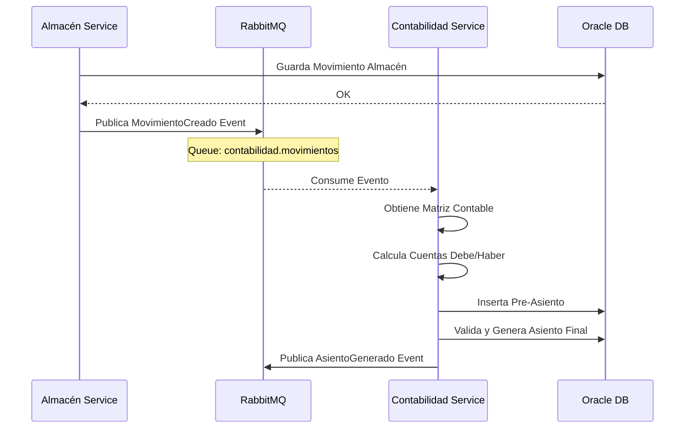
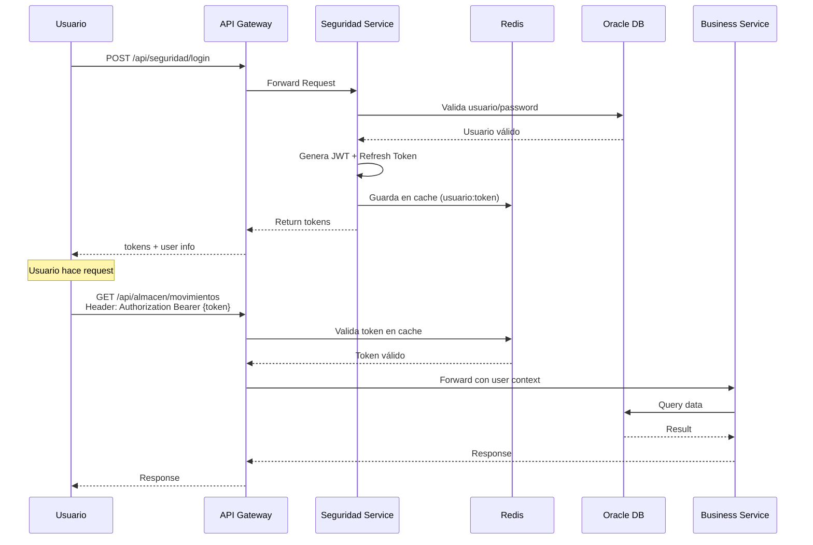
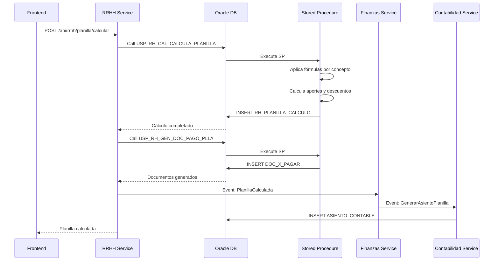

# Arquitectura Técnica - SIGRE 2.0 Backend

## Documentación Completa de Arquitectura de Microservicios

---

## 📐 Principios de Arquitectura

### 1. Separación de Responsabilidades
Cada microservicio es responsable de un dominio de negocio específico del ERP.

### 2. Base de Datos Compartida (Transitorio)
- **Fase actual**: Todos los microservicios acceden a la misma BD Oracle 11gR2
- **Razón**: Mantener compatibilidad con esquema actual de PowerBuilder
- **Futuro**: Migrar gradualmente a base de datos por microservicio

### 3. Comunicación
- **Sincrónica**: REST APIs para operaciones CRUD
- **Asincrónica**: RabbitMQ para eventos (ej: integración contable)

### 4. Seguridad
- **Autenticación**: JWT con refresh tokens
- **Autorización**: Roles y permisos por usuario
- **Gateway**: Punto único de entrada con validación de tokens

---

## 🔄 Flujos de Integración Clave

### Flujo 1: Integración Contable Asíncrona



### Flujo 2: Autenticación y Autorización



### Flujo 3: Cálculo de Planilla RRHH



---

## 📦 Estructura de un Microservicio Típico

```
contabilidad-service/
├── pom.xml
├── Dockerfile
├── README.md
├── src/
│   ├── main/
│   │   ├── java/
│   │   │   └── com/
│   │   │       └── sigre/
│   │   │           └── contabilidad/
│   │   │               ├── ContabilidadApplication.java
│   │   │               ├── controller/          # REST Controllers
│   │   │               │   ├── AsientoController.java
│   │   │               │   ├── PlanCuentasController.java
│   │   │               │   └── CentroCostosController.java
│   │   │               ├── service/             # Lógica de Negocio
│   │   │               │   ├── AsientoService.java
│   │   │               │   ├── MatrizService.java
│   │   │               │   └── impl/
│   │   │               ├── repository/          # Acceso a Datos
│   │   │               │   ├── AsientoRepository.java
│   │   │               │   ├── PlanCuentasRepository.java
│   │   │               │   └── MatrizRepository.java
│   │   │               ├── model/
│   │   │               │   ├── entity/          # Entidades JPA
│   │   │               │   │   ├── AsientoContable.java
│   │   │               │   │   ├── PlanCuentas.java
│   │   │               │   │   └── MatrizContable.java
│   │   │               │   └── dto/             # DTOs para APIs
│   │   │               │       ├── AsientoDTO.java
│   │   │               │       └── AsientoRequestDTO.java
│   │   │               ├── config/              # Configuración
│   │   │               │   ├── SecurityConfig.java
│   │   │               │   ├── DatabaseConfig.java
│   │   │               │   ├── RedisConfig.java
│   │   │               │   └── SwaggerConfig.java
│   │   │               ├── messaging/           # RabbitMQ
│   │   │               │   ├── EventPublisher.java
│   │   │               │   └── EventConsumer.java
│   │   │               ├── exception/           # Manejo de Errores
│   │   │               │   ├── GlobalExceptionHandler.java
│   │   │               │   └── ContabilidadException.java
│   │   │               ├── mapper/              # MapStruct
│   │   │               │   └── AsientoMapper.java
│   │   │               └── util/                # Utilidades
│   │   │                   └── ContabilidadUtils.java
│   │   └── resources/
│   │       ├── application.yml
│   │       ├── application-dev.yml
│   │       ├── application-prod.yml
│   │       └── db/
│   │           └── migration/                   # Flyway (opcional)
│   └── test/
│       └── java/
│           └── com/
│               └── sigre/
│                   └── contabilidad/
│                       ├── controller/
│                       ├── service/
│                       └── integration/
└── target/
```

---

## 🗄️ Mapeo de Tablas Oracle a Entidades JPA

### Ejemplo: Contabilidad Service

```java
// Tabla: ASIENTO_CONTABLE
@Entity
@Table(name = "ASIENTO_CONTABLE")
public class AsientoContable {
    @EmbeddedId
    private AsientoId id;
    
    @Column(name = "FECHA_ASIENTO")
    private LocalDate fechaAsiento;
    
    @Column(name = "GLOSA", length = 500)
    private String glosa;
    
    @Column(name = "DEBE_MN", precision = 18, scale = 2)
    private BigDecimal debeMn;
    
    @Column(name = "HABER_MN", precision = 18, scale = 2)
    private BigDecimal haberMn;
    
    // Relaciones
    @ManyToOne
    @JoinColumns({
        @JoinColumn(name = "EMPRESA", referencedColumnName = "EMPRESA", insertable = false, updatable = false),
        @JoinColumn(name = "CNTA_CNTBL", referencedColumnName = "CNTA_CNTBL")
    })
    private PlanCuentas cuenta;
}

// Clave compuesta
@Embeddable
public class AsientoId implements Serializable {
    @Column(name = "EMPRESA", length = 10)
    private String empresa;
    
    @Column(name = "LIBRO", length = 10)
    private String libro;
    
    @Column(name = "ORIGEN", length = 10)
    private String origen;
    
    @Column(name = "PERIODO", length = 6)
    private String periodo;
    
    @Column(name = "NRO_ASIENTO")
    private Long nroAsiento;
    
    @Column(name = "LINEA")
    private Long linea;
}
```

---

## 🔐 Configuración de Seguridad

### application.yml (común a todos los servicios)

```yaml
spring:
  application:
    name: contabilidad-service
  
  datasource:
    url: jdbc:oracle:thin:@${ORACLE_HOST:localhost}:${ORACLE_PORT:1521}:${ORACLE_SERVICE:ORCL}
    username: ${ORACLE_USERNAME:sigre_user}
    password: ${ORACLE_PASSWORD:sigre_password}
    driver-class-name: oracle.jdbc.OracleDriver
    hikari:
      maximum-pool-size: 10
      minimum-idle: 5
      connection-timeout: 30000
      idle-timeout: 600000
      max-lifetime: 1800000
  
  jpa:
    database-platform: org.hibernate.dialect.Oracle10gDialect
    hibernate:
      ddl-auto: validate
      naming:
        physical-strategy: org.hibernate.boot.model.naming.PhysicalNamingStrategyStandardImpl
        implicit-strategy: org.hibernate.boot.model.naming.ImplicitNamingStrategyLegacyJpaImpl
    show-sql: false
    properties:
      hibernate:
        format_sql: true
        use_sql_comments: false
  
  # Redis Cache
  cache:
    type: redis
  data:
    redis:
      host: ${REDIS_HOST:localhost}
      port: ${REDIS_PORT:6379}
      timeout: 60000
  
  # RabbitMQ
  rabbitmq:
    host: ${RABBITMQ_HOST:localhost}
    port: ${RABBITMQ_PORT:5672}
    username: ${RABBITMQ_USERNAME:admin}
    password: ${RABBITMQ_PASSWORD:admin123}
  
  # Security
  security:
    oauth2:
      resourceserver:
        jwt:
          issuer-uri: http://localhost:8081

# Eureka Client
eureka:
  client:
    serviceUrl:
      defaultZone: ${EUREKA_CLIENT_SERVICEURL_DEFAULTZONE:http://localhost:8761/eureka/}
    register-with-eureka: true
    fetch-registry: true
  instance:
    prefer-ip-address: true
    lease-renewal-interval-in-seconds: 10

# Actuator
management:
  endpoints:
    web:
      exposure:
        include: health,info,metrics,prometheus
  endpoint:
    health:
      show-details: always
  metrics:
    export:
      prometheus:
        enabled: true

# OpenAPI/Swagger
springdoc:
  api-docs:
    path: /v3/api-docs
  swagger-ui:
    path: /swagger-ui.html
    
# Logging
logging:
  level:
    com.sigre: DEBUG
    org.springframework.web: INFO
    org.hibernate: WARN
  pattern:
    console: "%d{yyyy-MM-dd HH:mm:ss} - %msg%n"

server:
  port: 8082
```

---

## 🎯 Convenciones de Código

### 1. Nombres de Paquetes
```
com.sigre.<modulo>
├── controller      # REST endpoints
├── service         # Lógica de negocio
├── repository      # Acceso a datos
├── model           # Entidades y DTOs
├── config          # Configuración
├── messaging       # Eventos
├── exception       # Excepciones
├── mapper          # Mappers
└── util            # Utilidades
```

### 2. Nombres de Clases
- **Controllers**: `*Controller.java`
- **Services**: `*Service.java`, impl en `*ServiceImpl.java`
- **Repositories**: `*Repository.java`
- **Entities**: Nombre de tabla en CamelCase
- **DTOs**: `*DTO.java`, `*Request.java`, `*Response.java`

### 3. Endpoints REST
```
GET    /api/<modulo>/<recurso>           # Listar
GET    /api/<modulo>/<recurso>/{id}      # Obtener uno
POST   /api/<modulo>/<recurso>           # Crear
PUT    /api/<modulo>/<recurso>/{id}      # Actualizar
DELETE /api/<modulo>/<recurso>/{id}      # Eliminar
PATCH  /api/<modulo>/<recurso>/{id}      # Actualizar parcial
```

### 4. Respuestas HTTP
- `200 OK`: Éxito
- `201 Created`: Recurso creado
- `204 No Content`: Eliminación exitosa
- `400 Bad Request`: Error de validación
- `401 Unauthorized`: No autenticado
- `403 Forbidden`: No autorizado
- `404 Not Found`: Recurso no encontrado
- `500 Internal Server Error`: Error del servidor

---

## 📊 Gestión de Transacciones

### Stored Procedures Oracle

Muchos módulos (especialmente RRHH) usan stored procedures. Ejemplo:

```java
@Repository
public interface PlanillaRepository extends JpaRepository<PlanillaCalculo, PlanillaId> {
    
    @Procedure(name = "USP_RH_CAL_CALCULA_PLANILLA")
    void calcularPlanilla(
        @Param("p_empresa") String empresa,
        @Param("p_origen") String origen,
        @Param("p_tipo_trabajador") String tipoTrabajador,
        @Param("p_fecha_proceso") LocalDate fechaProceso,
        @Param("p_trabajador") String codigoTrabajador
    );
    
    @Procedure(name = "USP_RH_GEN_DOC_PAGO_PLLA")
    void generarDocumentosPago(
        @Param("p_empresa") String empresa,
        @Param("p_periodo") String periodo
    );
}
```

---

## 🔄 Versionado de APIs

Las APIs usan versionado en la URL:

```
/api/v1/contabilidad/asientos
/api/v2/contabilidad/asientos  # Nueva versión
```

---

## 📈 Monitoreo y Observabilidad

### Métricas Clave por Microservicio

1. **Técnicas**:
   - Latencia P50, P95, P99
   - Throughput (req/seg)
   - Tasa de errores
   - Uso de CPU/Memoria
   - Conexiones BD activas

2. **Negocio**:
   - Asientos generados/hora
   - Movimientos de almacén/día
   - Planillas calculadas/mes
   - Documentos emitidos/día

### Logs Centralizados

Formato JSON para todos los servicios:

```json
{
  "timestamp": "2025-11-17T10:30:00",
  "level": "INFO",
  "service": "contabilidad-service",
  "traceId": "abc123",
  "spanId": "def456",
  "message": "Asiento contable generado",
  "userId": "admin",
  "empresa": "EMPRESA01",
  "data": {
    "asientoId": "12345",
    "libro": "DIARIO",
    "monto": 1500.00
  }
}
```

---

## 🚀 Despliegue

### Docker Build

Cada microservicio tiene su `Dockerfile`:

```dockerfile
FROM eclipse-temurin:17-jre-alpine
VOLUME /tmp
ARG JAR_FILE=target/*.jar
COPY ${JAR_FILE} app.jar
ENTRYPOINT ["java","-jar","/app.jar"]
```

### Kubernetes (Futuro)

```yaml
apiVersion: apps/v1
kind: Deployment
metadata:
  name: contabilidad-service
spec:
  replicas: 3
  selector:
    matchLabels:
      app: contabilidad-service
  template:
    metadata:
      labels:
        app: contabilidad-service
    spec:
      containers:
      - name: contabilidad-service
        image: sigre/contabilidad-service:latest
        ports:
        - containerPort: 8082
        env:
        - name: ORACLE_HOST
          valueFrom:
            secretKeyRef:
              name: oracle-secret
              key: host
```

---

**Última actualización**: Noviembre 2025

