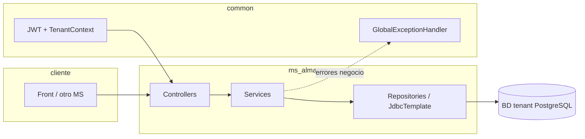
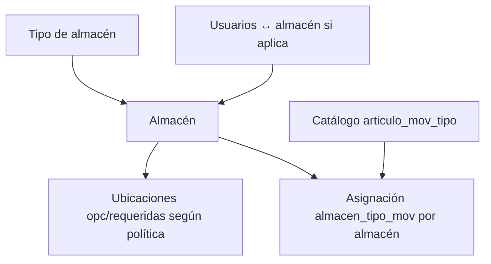
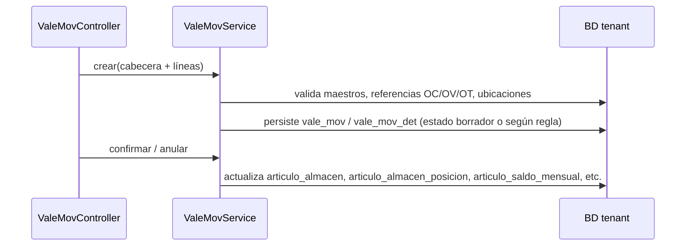
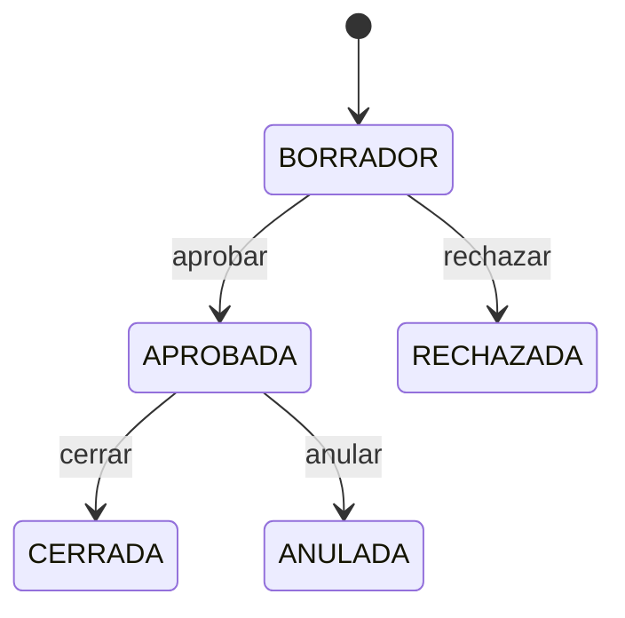

# Flujo completo — `ms-almacen`

Documento orientado a **entender el recorrido de negocio y técnico** del microservicio de almacenes: qué piezas intervienen, en qué orden y hacia qué persistencia apuntan. Complementa la lista detallada de rutas en [`RESUMEN_LOGICA_Y_ENDPOINTS.md`](./RESUMEN_LOGICA_Y_ENDPOINTS.md), la **orquestación por procedimiento** en [`../../05. Documentacion/orquestacion/ORQUESTACION_MS-ALMACEN.md`](../../05.%20Documentacion/orquestacion/ORQUESTACION_MS-ALMACEN.md) y los contratos en `05. Documentacion/markdown/Contratos/ms-almacen/`. La **normativa transversal de JSON** (respuestas con FK y auditoría resuelta a `security.usuario`, cuerpos `POST`/`PUT` documentados de forma cerrada) está en **`05. Documentacion/markdown/Contratos/ms-almacen/CONTRATO_API_MOVIMIENTOS_ALMACEN.md` §2.4**.

---

## 1. Rol del microservicio

| Ámbito | Contenido |
|--------|-----------|
| **Maestros** | Tipos de almacén, almacenes, ubicaciones, tipos de movimiento (`articulo_mov_tipo`), asignación tipo↔almacén, motivos de traslado, bonificaciones, lotes/pallets. |
| **Operación** | Vale de movimiento (ingreso/salida/ajuste), órdenes de traslado, guías de remisión, solicitudes de salida, toma de inventario. |
| **Integración** | Recepción desde OC, salida desde OV, ejecución de traslado — delegan en la misma lógica central de movimientos. |
| **Batch** | Recálculo de costo promedio desde kardex, cuadre stock agregado vs suma por posición, actualización automática (cuadre + recálculo). |
| **Integración async** | Consumo de `produccion.costeo.completado` (RabbitMQ): actualiza costo en vales tipo `P` confirmados y `articulo_almacen`. |
| **Utilidades** | Export/import Excel, PDF (Jasper), migración admin puntual, seed de prueba demo (`TestDataAdminController`, activo por configuración). |

---

## 2. Contexto técnico (cómo “vive” el servicio)

- **Arranque:** `AlmacenApplication` escanea `pe.restaurant.almacen` y `pe.restaurant.common`.
- **Multitenant:** la conexión JDBC/JPA al esquema **`almacen`** (y esquemas relacionados en la misma BD tenant, p. ej. `compras`, `ventas`, `core`) la resuelve el stack **common** (routing por contexto de tenant tras JWT / filtro). No se usa `DataSourceAutoConfiguration` estándar único en este MS.
- **Seguridad:** filtros y permisos compartidos desde **common** (`JwtTenantAuthFilter`, `@RequirePermission` donde aplique).
- **Feign:** `@EnableFeignClients` para llamadas salientes necesarias (catálogos u otros MS según implementación).
- **Respuestas API:** patrón habitual `ApiResponse<T>` envuelto por controladores.

---

## 3. Flujo de configuración (antes de operar)

Sin esta base, los movimientos fallan por validación de permisos de tipo o por datos incompletos.

1. Definir **tipo de almacén** y **almacenes** activos.
2. Crear **ubicaciones** (`ubicacion_almacen`) cuando el proceso use stock por posición.
3. Mantener el **catálogo de tipos de movimiento** (`flag_clase_mov` I/V/T, flags de referencia a documento, etc.).
4. **Asignar** qué tipos de movimiento puede usar cada almacén (`almacen_tipo_mov`).
5. Opcional: **usuarios asignados** al almacén (`almacen_user`).

---

## 4. Núcleo: vale de movimiento (`ValeMovService`)

Es el **corazón del stock** y del kardex: casi todo impacto físico pasa por aquí (manual o vía integración).

**Ideas clave:**

- **Registrar (`POST /movimientos`)** construye el documento con líneas; puede quedar en estado editable según tipo y validaciones.
- **Confirmar (`POST /movimientos/confirmar`)** aplica cantidades y valorización al inventario y al **kardex** mensual.
- **Referencia:** según `tipo_referencia_origen` y flags del `articulo_mov_tipo`, se exige OC, OV, proveedor, ubicación, etc.
- **Devoluciones:** flujos dedicados calculan lo devolvible y generan un movimiento espejo/reverso acotado.
- **Excel / PDF:** lectura de los mismos datos persistidos; PDF vía Jasper (plantillas bajo `src/main/resources/reports/`).

---

## 5. Integraciones (`IntegracionAlmacenService` → `ValeMovService.crear`)

Otros módulos disparan movimientos sin pasar por la pantalla manual.

| Endpoint | Origen datos | Tipo mov esperado | Notas |
|----------|----------------|-------------------|--------|
| `POST /integraciones/recepcion-orden-compra` | `compras.orden_compra(_det)` | Clase **I**, `flag_solicita_ref = 1` | Filtra líneas pendientes por `almacenId`; arma `ordenCompraId`, líneas con `ocDetId`. |
| `POST /integraciones/salida-orden-venta` | `ventas.orden_venta(_det)` | Clase **V**, `flag_solicita_ref = 1` | Análogo para OV. |
| `POST /integraciones/traslado-ejecutar` | `orden_traslado` + detalle | Clase **T**, `flag_mov_entre_alm` según traslado | Puede generar vale salida y espejo de ingreso. |

**Roadmap:** salida automática disparada desde **factura simplificada emitida** (ms-ventas issue 5) puede requerir nuevo contrato o extensión; no confundir con la fila anterior. Ver [ORQUESTACION_MS-VENTAS.md §14](../../05.%20Documentacion/orquestacion/ORQUESTACION_MS-VENTAS.md).

**Validación común:** `cargarTipoIntegracion` compra estado activo del tipo, **referencia obligatoria**, clase correcta y flags adicionales (traslado entre almacenes).

---

## 6. Órdenes de traslado (`OrdenTrasladoOperacionService` + dominio)

- La OT **documenta intención** origen/destino y líneas; el **impacto de stock** suele materializarse con **vales** (incluido flujo de integración que ejecuta el traslado).
- Estados y transiciones están acotados por servicio; PDF/Excel para operación y trazabilidad.

---

## 7. Guías de remisión

Flujo propio de cabecera/líneas y estados (creación → tránsito → entrega / anulación). Relación con movimientos según diseño de negocio (véase contratos); no reemplaza al vale como fuente de stock si el modelo separa ambos.

---

## 8. Toma de inventario (`InventarioConteo`)

1. Alta / edición de fichas de conteo por almacén-artículo-fecha.
2. Transiciones **comparar** → **cerrar** (o **anular**): comparan saldo sistema vs conteo y pueden disparar ajustes vía movimientos según implementación.

---

## 9. Solicitudes de salida

CRUD + cambio de estado (`PATCH .../estado`): documento previo a la salida física; la ejecución efectiva suele enlazarse con movimientos según reglas del servicio.

---

## 10. Procesos batch (`AlmacenProcesoService`)

| Proceso | Qué hace | Tablas principales |
|---------|-----------|-------------------|
| **Recálculo precios promedio** | Copia último `saldo_costo_unitario` del kardex a `articulo_almacen.costo_promedio`. | `articulo_saldo_mensual`, `articulo_almacen` |
| **Cuadre stock** | Iguala `articulo_almacen.cantidad_disponible` con la suma de `articulo_almacen_posicion` por artículo/almacén. | `articulo_almacen_posicion`, `ubicacion_almacen`, `articulo_almacen` |
| **Actualización automática** | Ejecuta **cuadre** y luego **recálculo** en la misma operación. | Las anteriores |

**Requisito de esquema:** debe existir `almacen.articulo_almacen_posicion` para cuadre y actualización automática; si la BD tenant es antigua, aplicar parche DDL (`patch-almacen` en `database-deploy.bat` o script en repo).

---

## 11. Administración y herramientas

| Recurso | Uso |
|---------|-----|
| `POST /admin/migrate` | Migración puntual controlada (columnas en `vale_mov`). |
| `POST /api/almacen/admin/test-data/seed` | Carga masiva demo en tablas `almacen.*` (y dependencias mínimas). El bean **`TestDataAdminController` solo se registra** si `app.testdata.enabled=true`. En `application.yml` el valor por defecto es **`${APP_TESTDATA_ENABLED:true}`** (habilitado salvo que se defina `false`). En **producción** debe forzarse explícitamente `APP_TESTDATA_ENABLED=false`. Si el endpoint no existe (flag en `false`), la petición obtiene **404** (no 403). |

**Numeración correlativa:** varios altas (p. ej. vale de movimiento, solicitud de salida, orden de traslado) usan **`NumeradorDocumentoService`** en `common` → PostgreSQL `core.fn_get_document_number` (12 caracteres). Ver implementaciones en `service/impl`.

---

## 12. Datos maestros compartidos (otros esquemas)

El MS lee (y a veces escribe vía movimientos) información en:

- **`core`:** artículos, etc.
- **`compras` / `ventas`:** órdenes para integración.
- **`auth` / usuarios:** según validaciones de cabecera.

La consistencia depende de que el **tenant** tenga DDL alineado (`02-almacen.sql` + parches).

---

## 12. Integración costeo de producción (RabbitMQ)

Tras `POST /api/produccion/costeos/procesar`, **ms-produccion** publica en `rpe.events` el routing key `produccion.costeo.completado`.

**ms-almacen** (cola `almacen.produccion.costeo.completado`):

1. Establece `TenantContext` desde el evento (`empresaId`, sucursal, usuario).
2. Lee `produccion.costeo_produccion` del período.
3. Actualiza `vale_mov_det.costo_unitario` en vales de ingreso por producción (`tipo_referencia_origen = 'P'`, estado cerrado `2`) vinculados a la OT.
4. Sincroniza `articulo_almacen.costo_promedio` con el `costo_unitario` del costeo para artículos producidos en el mes.

Pre-asiento hacia contabilidad: desactivado por defecto (`APP_MESSAGING_PRE_ASIENTO_ENABLED=false`). Cuando se active, publica en exchange `pre-asientos` con routing `almacen.pre_asiento.costo_produccion` (consumo pendiente en **ms-contabilidad**).

Configuración: `app.messaging.enabled`, `app.messaging.pre-asiento.enabled` en `application.yml`.

---

## 13. Dónde profundizar

| Necesidad | Documento |
|-----------|-----------|
| Lista de endpoints por controlador | [`RESUMEN_LOGICA_Y_ENDPOINTS.md`](./RESUMEN_LOGICA_Y_ENDPOINTS.md) |
| Reglas funcionales detalladas | `05. Documentacion/markdown/Contratos/ms-almacen/*.md` |
| Modelo de datos | `05. Documentacion/markdown/DISENO_BASE_DATOS.md` |
| DDL tenant | `03. Base de datos/ddl/tenant/02-almacen.sql` y parches |

---

*Última actualización orientativa al contenido del repo; ante divergencias, prima el código y el DDL versionados.*
