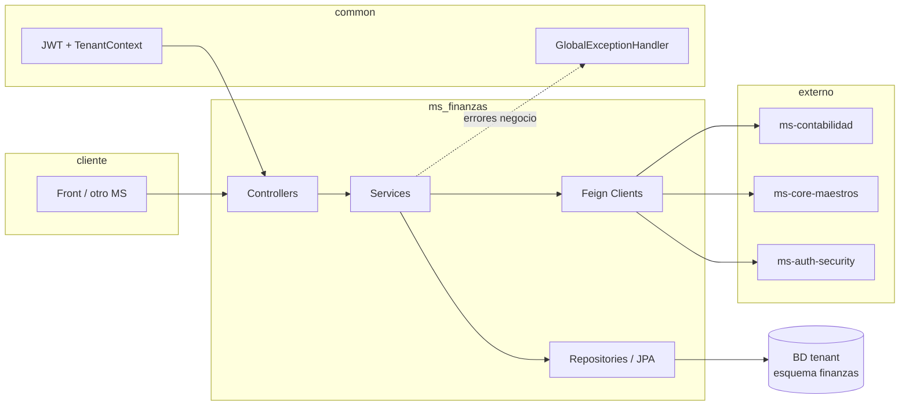
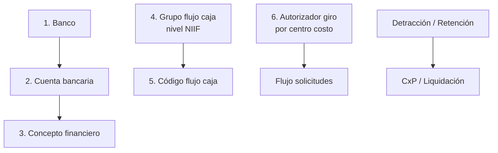
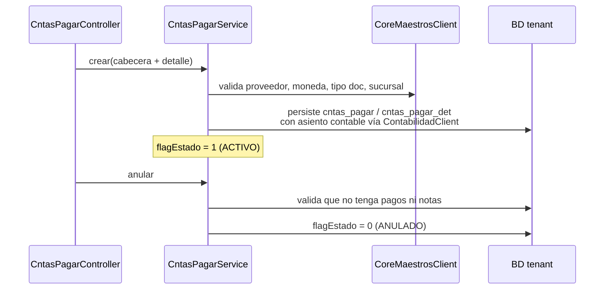
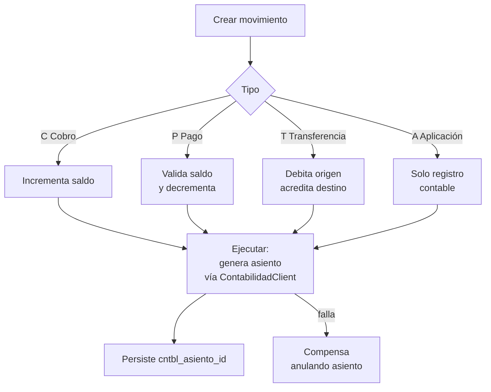
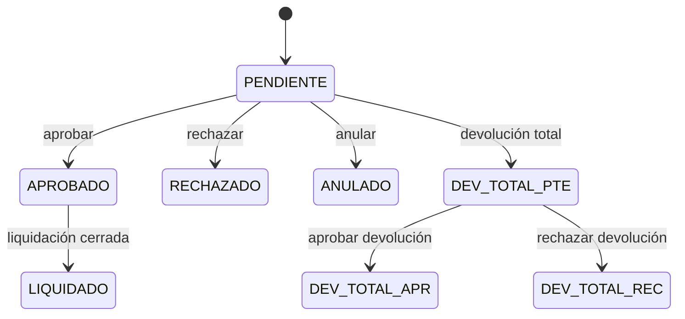
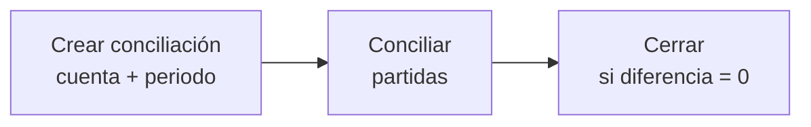

# Flujo completo — `ms-finanzas`

Documento orientado a **entender el recorrido de negocio y técnico** del microservicio financiero: qué piezas intervienen, en qué orden y hacia qué persistencia apuntan. Complementa la lista detallada de rutas en [`RESUMEN_LOGICA_Y_ENDPOINTS.md`](./RESUMEN_LOGICA_Y_ENDPOINTS.md), la **orquestación por procedimiento** en [`../../05. Documentacion/orquestacion/ORQUESTACION_MS-FINANZAS.md`](../../05.%20Documentacion/orquestacion/ORQUESTACION_MS-FINANZAS.md), el **catálogo de procesos** en [`../../05. Documentacion/orquestacion/CATALAGO_DE_PROCESOS_MS-FINANZAS.md`](../../05.%20Documentacion/orquestacion/CATALAGO_DE_PROCESOS_MS-FINANZAS.md) y los contratos en `05. Documentacion/markdown/Contratos/ms-finanzas/`.

---

## 1. Rol del microservicio

| Ámbito | Contenido |
|--------|-----------|
| **Maestros** | Bancos, cuentas bancarias, conceptos financieros, grupos/códigos de flujo de caja (NIIF), autorizadores de giro, detracciones SPOT, retenciones IGV. |
| **Cuentas por Pagar (FI304)** | Registro de CxP (facturas), notas débito/crédito (FI320), documentos directos sin OC, pagos y programación de pagos (FI356). |
| **Solicitudes de Giro (FI307/FI308)** | Flujo de aprobación (pendiente → aprobado/rechazado), devolución total con doble aprobación (FI333). |
| **Liquidaciones (FI323/FI324)** | Liquidaciones asociadas a solicitudes de giro con validación de cierre y asiento contable. |
| **Tesorería (FI309/FI310/FI312/FI326)** | Movimientos de caja/bancos (cobro, pago, transferencia, aplicación de documentos), ejecución con actualización de saldos y generación de asientos contables vía Feign a `ms-contabilidad`. |
| **Conciliación Bancaria (FI347)** | Conciliación por cuenta + periodo, marcado de partidas, cierre con diferencia cero. |
| **Letras y Canje** | Conversión de facturas en letras de cambio con validación de saldos y anulación controlada. |
| **Integración** | Comunicación sincrónica vía Feign con `ms-core-maestros` (monedas, proveedores, catálogos SUNAT, plan contable) y `ms-contabilidad` (generación/anulación de asientos). |
| **Seed demo** | `TestDataAdminController` activo por configuración (`app.testdata.enabled`); inserta data condicional en core, rrhh, finanzas y contabilidad. |

---

## 2. Contexto técnico (cómo "vive" el servicio)

- **Arranque:** `FinanzasApplication` escanea `pe.restaurant.finanzas`.
- **Puerto:** `9005`.
- **Base URL (dev):** `https://api.dev.contabilidad.restaurant.pe/api/finanzas`
- **Multitenant:** conexión JDBC/JPA al esquema **`finanzas`** resuelta por el stack common (routing por contexto de tenant tras JWT).
- **Seguridad:** `FinanzasSecurityConfig` + `FinanzasJwtAuthenticationFilter` + `TokensSessionVerifier`. Endpoints públicos: `/actuator/**`, `/swagger-ui/**`, `/v3/api-docs/**`. Protegidos: `/api/finanzas/**` (requiere **Token Definitivo** con claims `empresaId`, `sucursalId`, `usuarioId`).
- **Feign:** 3 clientes: `AuthSecurityClient` (ms-auth-security), `ContabilidadClient` (ms-contabilidad), `CoreMaestrosClient` (ms-core-maestros). Los headers `Authorization`, `X-User-Id`, `X-Empresa-Id`, `X-Sucursal-Id` se propagan vía `FeignConfig.RequestInterceptor`.
- **Respuestas API:** `ApiResponse<T>` con `success/message/errorCode/data/timestamp`.
- **Errores:** códigos estandarizados `FIN-xxx` vía `FinanzasErrorCodes`.
- **Eventos/Async:** Sin uso; RabbitMQ configurado pero sin listeners ni publishers. Paquetes `event/listener/` y `event/publisher/` vacíos.
- **Swagger:** `/api/finanzas/swagger-ui.html` y `/api/finanzas/v3/api-docs`.

---

## 3. Flujo de configuración (antes de operar)

Sin esta base, las operaciones fallan por catálogos vacíos o FKs inválidas.

**Orden recomendado:**

1. **Bancos** → `POST /api/finanzas/bancos`
2. **Cuentas bancarias** → `POST /api/finanzas/cuentas-bancarias` (requiere banco + moneda de core)
3. **Conceptos financieros** → `POST /api/finanzas/conceptos-financieros` (requiere plan contable de core)
4. **Grupos de flujo de caja** → `POST /api/finanzas/grupos-codigo-flujo-caja` (nivel NIIF: 1=Operativas, 2=Inversión, 3=Financiamiento)
5. **Códigos de flujo de caja** → `POST /api/finanzas/codigos-flujo-caja` (requiere grupo)
6. **Autorizadores de giro** → `POST /api/finanzas/autorizadores-giro` (requiere usuario + centro costo)
7. **Detracciones / Retenciones** → maestro tributario opcional según necesidad

**Maestros externos (ms-core-maestros vía Feign):** monedas, proveedores/entidades, tipos de documento SUNAT, formas de pago, plan contable, centros de costo, series, numeradores, impuestos.

---

## 4. Núcleo: Cuentas por Pagar — ciclo completo (FI304)

Es la **base de la operación financiera**: todos los compromisos de pago con proveedores se registran aquí.

**Estados CxP:** ACTIVO(1) → ANULADO(0) → PARCIAL(4) → PAGADO(5)

**Flujo típico:**
1. Registrar **CxP** (con o sin referencia a OC). Genera asiento contable automático vía `ms-contabilidad`.
2. Si aplica, registrar **notas débito/crédito** (FI320) que modifican el saldo de la CxP existente.
3. Si es un gasto sin OC, usar **documento directo** (CXP-DIRECTO).
4. Cuando se programa un pago y se ejecuta, se reduce el saldo de la CxP; si llega a cero, pasa a **PAGADO(5)**.
5. Opcional: **canje** (convierte facturas en letras de cambio) — bloque §9.

---

## 5. Caja y Bancos — Tesorería (FI309 / FI310 / FI312 / FI326)

El **motor de ejecución financiera**: todo movimiento que afecta saldos bancarios pasa por aquí.

**Tipos de movimiento:**
- **C** — Cobro (cartera cobros)
- **P** — Pago (cartera pagos)
- **T** — Transferencia entre cuentas
- **A** — Aplicación de documentos

**Estados:** ACTIVO(1) → EJECUTADO(2) → ANULADO(0)

Al ejecutar (`POST /{id}/ejecutar`):
1. Valida que no esté ejecutado ni anulado.
2. Según tipo: actualiza saldo de cuenta bancaria.
3. Genera asiento contable en `ms-contabilidad` vía Feign con estructura híbrida DEBE/HABER.
4. Si falla el asiento, compensa anulándolo (rollback manual).
5. Persiste `cntbl_asiento_id` en la entidad.

---

## 6. Solicitud de Giro y Aprobación (FI307 / FI308)

Documento de **autorización** para disponer de fondos (adelantos).

**Estados:** PENDIENTE(3) → APROBADO(1) → RECHAZADO(2) → ANULADO(0)

1. Se crea la **solicitud** con importe, centro de costo, concepto financiero y datos del beneficiario.
2. Pasa por **aprobación/rechazo** (el aprobador debe ser autorizador del centro de costo).
3. La aprobación genera automáticamente una **orden de giro** (interna) y la solicitud queda disponible para liquidación.
4. Opcional: **devolución total** con flujo de doble aprobación (solicitar → aprobar/rechazar).

---

## 7. Liquidación de Órdenes de Giro (FI323 / FI324)

Rendición de cuentas del gasto girado.

| Etapa | Acción |
|-------|--------|
| Crear | Asocia una liquidación a una solicitud aprobada |
| Editar | Agrega/modifica detalles con comprobantes |
| Validar cierre | Cuadra importe neto vs suma de detalles |
| Cerrar | Genera asiento contable y cambia estado a CERRADO |
| Anular | Solo si no está cerrada |

**Estados:** ACTIVO(1) → CERRADO(2) → ANULADO(0)

Al cerrar se genera asiento contable vía `ms-contabilidad` (tipo liquidación de giro).

---

## 8. Programación de Pagos (FI356)

Planificación y ejecución de pagos a proveedores.

1. Crear **programación** con fecha programada y detalles apuntando a una o más CxP.
2. Al **ejecutar** (`POST /{id}/ejecutar`):
   - Genera registros `Pago` por cada CxP seleccionada.
   - Reduce el saldo de cada CxP.
   - Si saldo llega a cero, CxP pasa a **PAGADO(5)**.
   - Programación pasa a **EJECUTADO(2)**.

**Estados programación:** PROGRAMADO(1) → EJECUTADO(2)

---

## 9. Letras y Canje de Documentos

Conversión de facturas (CxP origen) en letras de cambio (CxP destino) con nueva numeración SUNAT.

1. Toma documentos **CxP origen** (facturas pendientes).
2. Crea nuevos documentos **CxP destino** (letras) con numeración SUNAT.
3. Reduce saldo de origen; crea letras con saldo completo.
4. Validaciones: proveedor coherente, moneda coherente, saldos suficientes, balance de montos.
5. **Anulación:** restaura saldos de orígenes y anula destinos (solo si no tienen pagos aplicados).

---

## 10. Retenciones IGV (FI331)

Registro de certificados de retención (3% del IGV) asociados a movimientos de caja/bancos.

- FK a `caja_bancos`: cada retención se vincula al movimiento de pago que la genera.
- Estados: activo/inactivo (no se anulan, se desactivan).

---

## 11. Detracciones SPOT (FI334)

Registro de constancias de detracción (Sistema de Pago de Obligaciones Tributarias).

- Aplica a operaciones sujetas al SPOT según normativa SUNAT.
- Estados: activo/inactivo.

---

## 12. Notas Débito / Crédito (FI320)

Modifican el saldo de una CxP existente.

- **Nota débito:** incrementa el saldo de la CxP.
- **Nota crédito:** reduce el saldo de la CxP.
- Generan asiento contable automático vía `ms-contabilidad`.
- Se listan como sub-recurso de CxP (`/cuentas-pagar/notas`).

---

## 13. Documentos Directos (CXP-DIRECTO)

CxP sin orden de compra: gastos administrativos, servicios públicos, alquileres, etc.

- Misma tabla `cntas_pagar` pero sin referencia a OC.
- No genera asiento contable automático (a diferencia de la CxP regular).
- Se gestionan como sub-recurso de CxP (`/cuentas-pagar/directos`).

---

## 14. Conciliación Bancaria (FI347)

Cuadre de movimientos de caja/bancos vs extracto bancario por periodo.

1. Se crea por **cuenta bancaria + periodo**.
2. Se marcan partidas de `caja_bancos` como conciliadas.
3. **Solo puede cerrarse si diferencia = 0.**
4. Al cerrar, queda inmovilizada para el periodo.

**Estados:** ABIERTO(1) → CERRADO(2)

---

## 15. Integración con Contabilidad (asientos automáticos)

Toda operación financiera que afecta cuentas genera asiento en `ms-contabilidad`:

| Operación | Endpoint Feign en ms-contabilidad |
|-----------|----------------------------------|
| CxP (registro) | `POST /asientos/generar/registro-cntas-pagar` |
| Caja/Bancos — Cobro | `POST /asientos/generar/cartera-cobros` |
| Caja/Bancos — Pago | `POST /asientos/generar/cartera-pagos` |
| Caja/Bancos — Transferencia | `POST /asientos/generar/transferencias` |
| Caja/Bancos — Aplicación | `POST /asientos/generar/aplicacion-documentos` |
| Liquidación de giro | `POST /asientos/generar/liquidacion-giro` |
| Anulación | `POST /asientos/{id}/anular` |

Si falla la generación del asiento, la operación se compensa (rollback manual vía anulación del asiento).

---

## 16. Dependencias con otros microservicios

| Microservicio | Rol | Dato que consume |
|--------------|-----|-----------------|
| `ms-auth-security` | Autenticación y autorización | Token JWT definitivo, usuarios, sesiones |
| `ms-core-maestros` | Maestros compartidos vía Feign | Monedas, sucursales, entidades, tipos doc, catálogos SUNAT, plan contable, centros costo, formas pago, numeradores, series, impuestos |
| `ms-contabilidad` | Asientos contables vía Feign | Generación y anulación de asientos |
| `ms-compras` | Roadmap | Generación automática de CxP al aprobar OC (no implementado) |

---

## 17. Procesos implementados (códigos FI)

| Código | Proceso | Controller |
|--------|---------|-----------|
| FI304 | Cuentas por Pagar | `CntasPagarController` |
| FI307/FI308 | Solicitud de Giro + Aprobación | `SolicitudGiroController` |
| FI309/FI310/FI312/FI326 | Caja y Bancos (C/P/T/A) | `CajaBancosController` |
| FI320 | Notas Débito/Crédito | `NotaController` |
| FI323/FI324 | Liquidación + Cierre | `LiquidacionController` |
| FI331 | Retenciones IGV | `RetencionController` |
| FI333 | Devoluciones de Liquidación | `SolicitudGiroController` |
| FI334 | Detracciones SPOT | `DetraccionController` |
| FI347 | Conciliación Bancaria | `ConciliacionBancariaController` |
| FI356 | Programación de Pagos | `ProgramacionPagoController` |
| CXP-LETRAS-CANJE | Letras y Canje | `LetraCanjeController` |
| CXP-DIRECTO | Documentos Directos | `DocumentoDirectoController` |

---

## 18. Datos maestros compartidos (otros esquemas)

El MS lee (y a veces escribe vía Feign) información en:

- **`core`:** monedas, sucursales, entidades contribuyentes, catálogos SUNAT, tipos de documento, plan contable, centros de costo, formas de pago, series, impuestos, artículos.
- **`contabilidad`:** asientos contables (generación y anulación).
- **`auth`:** usuarios y sesiones.
- **`rrhh`:** personal, áreas, cargos, AFP (para seed de prueba).

La consistencia depende de que el **tenant** tenga DDL alineado (`09-finanzas.sql` + parches).

---

## 19. Dónde profundizar

| Necesidad | Documento |
|-----------|-----------|
| Lista de endpoints por controlador | [`RESUMEN_LOGICA_Y_ENDPOINTS.md`](./RESUMEN_LOGICA_Y_ENDPOINTS.md) |
| Orquestación por procedimiento (paso a paso con requests) | [`../../05. Documentacion/orquestacion/ORQUESTACION_MS-FINANZAS.md`](../../05.%20Documentacion/orquestacion/ORQUESTACION_MS-FINANZAS.md) |
| Catálogo cerrado de procesos y dependencias | [`../../05. Documentacion/orquestacion/CATALAGO_DE_PROCESOS_MS-FINANZAS.md`](../../05.%20Documentacion/orquestacion/CATALAGO_DE_PROCESOS_MS-FINANZAS.md) |
| Reglas funcionales detalladas y HU | `05. Documentacion/markdown/Contratos/ms-finanzas/*.md` |
| Modelo de datos | `05. Documentacion/markdown/DISENO_BASE_DATOS.md` |
| DDL tenant | `03. Base de datos/ddl/tenant/09-finanzas.sql` y parches |
| Diagrama ER Mermaid | `docs/vigente/diagrama-er-finanzas.md` |

---

*Última actualización orientativa al contenido del repo; ante divergencias, prima el código, la orquestación y el DDL versionados. Ver `ORQUESTACION_MS-FINANZAS.md` §A para inventario completo de endpoints.*
