# Diagrama de Relaciones - Módulo Finanzas

```mermaid
---
config:
  layout: elk
---
erDiagram
    core.moneda {
        id bigint PK
        codigo varchar
        nombre varchar
        simbolo varchar
    }
    
    core.sucursal {
        id bigint PK
        codigo varchar
        nombre varchar
        direccion varchar
    }
    
    core.entidad_contribuyente {
        id bigint PK
        tipo_doc varchar
        nro_doc varchar
        razonsocial varchar
    }
    
    core.doc_tipo {
        id bigint PK
        codigo varchar
        nombre varchar
    }
    
    core.forma_pago {
        id bigint PK
        codigo varchar
        nombre varchar
    }
    
    auth.usuario {
        id bigint PK
        username varchar
        nombres varchar
        apellidos varchar
        flag_estado varchar
    }
    
    finanzas.banco {
        id bigint PK
        cod_banco varchar UK
        nom_banco varchar
        swift varchar
        direccion varchar
    }
    
    finanzas.banco_cnta {
        id bigint PK
        cod_ctabco varchar UK
        banco_id bigint FK
        moneda_id bigint FK
        descripcion varchar
        tipo_ctabco varchar
        saldo_disponible decimal
        sldo_contable decimal
        flag_estado varchar
    }
    
    finanzas.concepto_financiero {
        id bigint PK
        codigo varchar UK
        nombre varchar
        tipo varchar
        flag_estado varchar
    }
    
    finanzas.grupo_codigo_flujo_caja {
        id bigint PK
        codigo varchar UK
        nombre varchar
        flag_reporte varchar
        factor varchar
        orden int
        cod_actividad varchar
        flag_estado varchar
    }
    
    finanzas.codigo_flujo_caja {
        id bigint PK
        codigo varchar UK
        grupo_codigo_flujo_caja_id bigint FK
        nombre varchar
        tipo varchar
        factor decimal
        factor_flujo_caja int
        orden int
        flag_estado varchar
    }
    
    finanzas.cntas_pagar {
        id bigint PK
        sucursal_id bigint FK
        proveedor_id bigint FK
        doc_tipo_id bigint FK
        moneda_id bigint FK
        serie varchar
        numero varchar
        fecha_emision date
        fecha_vencimiento date
        monto_total decimal
        saldo_pendiente decimal
        flag_estado varchar
    }
    
    finanzas.cntas_pagar_det {
        id bigint PK
        cntas_pagar_id bigint FK
        fecha_mov date
        monto decimal
        descripcion varchar
        tipo_mov varchar
    }
    
    finanzas.caja_bancos {
        id bigint PK
        banco_cnta_id bigint FK
        cod_origen varchar
        nro_registro int
        fecha date
        descripcion varchar
        monto decimal
        tipo_mov varchar
        flag_estado varchar
    }
    
    finanzas.caja_bancos_det {
        id bigint PK
        caja_bancos_id bigint FK
        cntas_pagar_id bigint FK
        item int
        monto decimal
        descripcion varchar
        moneda_id bigint FK
        tipo_cambio decimal
    }
    
    finanzas.conciliacion_bancaria {
        id bigint PK
        banco_cnta_id bigint FK
        periodo_anio int
        periodo_mes int
        fecha_inicio date
        fecha_fin date
        saldo_banco decimal
        saldo_contable decimal
        diferencia decimal
        flag_estado varchar
    }
    
    finanzas.conciliacion_det {
        id bigint PK
        conciliacion_id bigint FK
        caja_bancos_id bigint FK
        tipo_ajuste varchar
        monto decimal
        descripcion varchar
        fecha date
    }
    
    finanzas.solicitud_giro {
        id bigint PK
        solicitante_id bigint
        proveedor_id bigint FK
        fecha_solicitud date
        monto_solicitado decimal
        motivo varchar
        flag_estado varchar
    }
    
    finanzas.orden_giro {
        id bigint PK
        solicitud_giro_id bigint FK
        numero varchar UK
        fecha_emision date
        monto decimal
        aprobado_por bigint
        flag_estado varchar
    }
    
    finanzas.liquidacion {
        id bigint PK
        orden_giro_id bigint FK
        numero varchar UK
        doc_tipo_id bigint FK
        entidad_contribuyente_id bigint FK
        moneda_id bigint FK
        concepto_financiero_id bigint FK
        usuario_id bigint FK
        fecha date
        monto_total decimal
        flag_estado varchar
    }
    
    finanzas.liquidacion_det {
        id bigint PK
        liquidacion_id bigint FK
        item int
        moneda_id bigint FK
        concepto_financiero_id bigint FK
        cntas_pagar_id bigint FK
        monto decimal
        descripcion varchar
        tipo_gasto varchar
    }
    
    finanzas.autorizador_giro {
        id bigint PK
        centros_costo_id bigint
        usuario_id bigint FK
        nombre varchar
        monto_maximo decimal
        sucursal_id bigint
        activo boolean
    }
    
    finanzas.programacion_pago {
        id bigint PK
        fecha_programada date
        estado varchar
        descripcion varchar
        monto_total decimal
        flag_estado varchar
    }
    
    finanzas.programacion_pago_det {
        id bigint PK
        programacion_id bigint FK
        cntas_pagar_id bigint FK
        monto decimal
        fecha_pago date
        flag_estado varchar
    }
    
    finanzas.fondo_fijo {
        id bigint PK
        sucursal_id bigint FK
        responsable_id bigint
        monto_asignado decimal
        monto_disponible decimal
        descripcion varchar
        flag_estado varchar
    }
    
    finanzas.rendicion_gasto {
        id bigint PK
        fondo_fijo_id bigint FK
        fecha date
        monto_total decimal
        descripcion varchar
        rendido_por bigint
        aprobado_por bigint
        flag_estado varchar
    }
    
    finanzas.pago {
        id bigint PK
        cntas_pagar_id bigint FK
        banco_cnta_id bigint FK
        forma_pago_id bigint FK
        fecha_pago date
        monto decimal
        nro_operacion varchar
        descripcion varchar
        flag_estado varchar
    }
    
    finanzas.flujo_caja_proyectado {
        id bigint PK
        fecha date
        tipo varchar
        monto_ingresos decimal
        monto_egresos decimal
        monto_neto decimal
        descripcion varchar
    }
    
    finanzas.solicitud_giro_liq_det {
        id bigint PK
        solicitud_giro_id bigint FK
        fecha date
        monto decimal
        descripcion varchar
        tipo_detalle varchar
    }
    
    finanzas.detraccion {
        id bigint PK
        cntas_pagar_id bigint FK
        nro_detraccion varchar UK
        fecha_detraccion date
        monto_detraccion decimal
        tasa_detraccion decimal
        flag_estado varchar
    }
    
    finanzas.retencion {
        id bigint PK
        cntas_pagar_id bigint FK
        nro_certificado varchar UK
        fecha_retencion date
        monto_retencion decimal
        tasa_retencion decimal
        flag_estado varchar
    }
    
    finanzas.flujo_caja {
        id bigint PK
        sucursal_id bigint FK
        anio int
        mes int
        monto_ingresos decimal
        monto_egresos decimal
        saldo_final decimal
        fecha_cierre date
        flag_estado varchar
    }

    %% Relaciones entre tablas del módulo finanzas
    finanzas.banco ||--o{ finanzas.banco_cnta : "tiene"
    finanzas.grupo_codigo_flujo_caja ||--o{ finanzas.codigo_flujo_caja : "agrupa"
    finanzas.cntas_pagar ||--o{ finanzas.cntas_pagar_det : "detalla"
    finanzas.banco_cnta ||--o{ finanzas.caja_bancos : "movimientos"
    finanzas.caja_bancos ||--o{ finanzas.caja_bancos_det : "detalla"
    finanzas.banco_cnta ||--o{ finanzas.conciliacion_bancaria : "concilia"
    finanzas.conciliacion_bancaria ||--o{ finanzas.conciliacion_det : "detalla"
    finanzas.solicitud_giro ||--o{ finanzas.orden_giro : "genera"
    finanzas.orden_giro ||--o{ finanzas.liquidacion : "liquida"
    finanzas.liquidacion ||--o{ finanzas.liquidacion_det : "detalla"
    finanzas.solicitud_giro ||--o{ finanzas.solicitud_giro_liq_det : "detalla"
    finanzas.programacion_pago ||--o{ finanzas.programacion_pago_det : "detalla"
    finanzas.fondo_fijo ||--o{ finanzas.rendicion_gasto : "rende"
    finanzas.cntas_pagar ||--o{ finanzas.detraccion : "detracción"
    finanzas.cntas_pagar ||--o{ finanzas.retencion : "retención"
    finanzas.cntas_pagar ||--o{ finanzas.pago : "cancela"

    %% Relaciones con tablas de otros esquemas
    core.moneda ||--o{ finanzas.banco_cnta : "moneda"
    core.moneda ||--o{ finanzas.cntas_pagar : "moneda"
    core.moneda ||--o{ finanzas.caja_bancos_det : "moneda"
    core.moneda ||--o{ finanzas.liquidacion : "moneda"
    core.moneda ||--o{ finanzas.liquidacion_det : "moneda"
    core.sucursal ||--o{ finanzas.cntas_pagar : "sucursal"
    core.sucursal ||--o{ finanzas.fondo_fijo : "sucursal"
    core.sucursal ||--o{ finanzas.flujo_caja : "sucursal"
    core.entidad_contribuyente ||--o{ finanzas.cntas_pagar : "proveedor"
    core.entidad_contribuyente ||--o{ finanzas.solicitud_giro : "proveedor"
    core.entidad_contribuyente ||--o{ finanzas.liquidacion : "entidad"
    core.doc_tipo ||--o{ finanzas.cntas_pagar : "documento"
    core.doc_tipo ||--o{ finanzas.liquidacion : "documento"
    core.forma_pago ||--o{ finanzas.pago : "forma_pago"
    auth.usuario ||--o{ finanzas.liquidacion : "usuario"
    auth.usuario ||--o{ finanzas.autorizador_giro : "autorizador"

    %% Relaciones cruzadas con otros módulos
    finanzas.caja_bancos_det }o--|| ventas.cntas_cobrar : "cancela"
    finanzas.liquidacion_det }o--|| ventas.cntas_cobrar : "aplica"
```

## Resumen de Relaciones Principales

### Grupo 1: Maestros y Configuración
- **banco** es la tabla maestra de entidades bancarias del sistema
- Se relaciona con **banco_cnta** mediante una relación uno-a-muchos para las cuentas bancarias
- **concepto_financiero** es catálogo independiente sin dependencias
- **grupo_codigo_flujo_caja** agrupa los **codigo_flujo_caja** para clasificación de flujos de tesorería

### Grupo 2: Cuentas por Pagar (CxP)
- **cntas_pagar** es la tabla central de gestión de obligaciones de pago
- Se relaciona con **cntas_pagar_det** para el detalle de movimientos
- Conecta con entidades externas: **core.sucursal**, **core.entidad_contribuyente**, **core.doc_tipo**, **core.moneda**
- **pago** cancela las cuentas por pagar registradas

### Grupo 3: Tesorería y Movimientos Bancarios
- **caja_bancos** gestiona todos los movimientos de tesorería
- **caja_bancos_det** contiene el detalle de cada movimiento bancario
- **conciliacion_bancaria** y **conciliacion_det** manejan el proceso de conciliación mensual
- **banco_cnta** es la tabla base para todas las operaciones bancarias

### Grupo 4: Gestión de Giros y Liquidaciones
- **solicitud_giro** inicia el flujo de autorización de giros
- **orden_giro** representa la solicitud aprobada
- **liquidacion** se genera a partir de una orden de giro con detalle completo
- **liquidacion_det** contiene el desglose de conceptos y montos

### Grupo 5: Fondos Fijos y Rendiciones
- **fondo_fijo** asigna montos por sucursal para gastos menores
- **rendicion_gasto** documenta el uso y devolución de fondos fijos
- Ambas tablas conectan con **core.sucursal** para asignación por local

### Grupo 6: Programación y Control de Pagos
- **programacion_pago** planifica pagos futuros
- **programacion_pago_det** detalla cada cuenta por pagar programada
- **detraccion** y **retencion** gestionan tributos asociados a pagos

### Grupo 7: Flujo de Caja y Reportes
- **flujo_caja_proyectado** contiene proyecciones de tesorería
- **flujo_caja** registra los movimientos reales consolidados por período
- Ambas tablas se agrupan por **core.sucursal** para control por local

### Grupo 8: Autorizaciones
- **autorizador_giro** define los usuarios con permisos para aprobar giros
- Conecta con **auth.usuario** para validación de identidades
- Incluye **centros_costo_id** (FK diferida) y **sucursal_id** para ámbito de autorización

## Descripción de Cada Grupo de Relaciones

### Maestros y Configuración
Este grupo contiene las tablas catálogo que definen las entidades base del módulo finanzas. **banco** y **banco_cnta** gestionan la información bancaria, mientras que **concepto_financiero** clasifica los movimientos financieros. Los códigos de flujo de caja se organizan jerárquicamente mediante **grupo_codigo_flujo_caja**.

### Gestión de Cuentas por Pagar
El subsistema de CxP permite registrar y seguir todas las obligaciones de pago del sistema. **cntas_pagar** almacena la cabecera con información del proveedor, documento y montos, mientras que **cntas_pagar_det** registra los movimientos y ajustes. El proceso se completa con **pago** que cancela las obligaciones.

### Tesorería y Operaciones Bancarias
Gestiona el flujo real de dinero a través de las cuentas bancarias. **caja_bancos** registra cada movimiento de entrada o salida, con su detalle en **caja_bancos_det**. El proceso de conciliación asegura que los registros contables coincidan con los extractos bancarios.

### Gestión de Giros y Liquidaciones
Controla el proceso de autorización y ejecución de giros de dinero. Desde la **solicitud_giro** inicial hasta la **orden_giro** aprobada y la **liquidacion** final con todos los detalles contables y de concepto.

### Fondos Fijos y Rendiciones
Administra los fondos asignados para gastos operativos menores. Cada **fondo_fijo** se asigna a una sucursal y sus rendiciones se documentan en **rendicion_gasto** con control de saldos.

### Programación de Pagos
Permite planificar pagos futuros para mejor gestión de flujo de caja. **programacion_pago** agrupa los pagos por fecha, mientras que **programacion_pago_det** detalla cada cuenta por pagar incluida.

### Tributos (Detracciones y Retenciones)
Gestiona los tributos asociados a los pagos. **detraccion** y **retencion** se conectan directamente con las cuentas por pagar para registrar los montos tributarios correspondientes.

### Flujo de Caja y Control
Proporciona visión consolidada de los movimientos de tesorería. **flujo_caja_proyectado** permite planificación, mientras que **flujo_caja** registra los resultados reales por período y sucursal.
