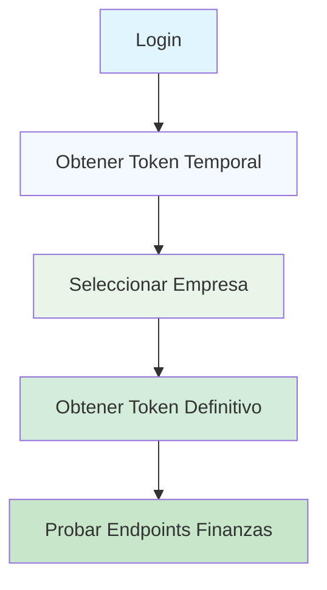

# Instrucciones de Autenticación para Colección Postman - MS-Finanzas

## 🚀 Configuración Inicial

### 1. Importar la Colección
1. Abrir Postman
2. Importar el archivo: `MS-FINANZAS-Collection.postman_collection.json`
3. La colección se importará con la carpeta "Maestras Generales"

### 2. Configurar Variables de Entorno
Ir a **Settings > Environments** y crear las siguientes variables:

```
baseUrl        http://localhost:9005/api/finanzas
token          {{token}}
tempToken       {{tempToken}}
```

## 🔐 Flujo de Autenticación

### Paso 1: Login (Obtener Token Temporal)
**Endpoint**: `POST http://aea6a227ef85d4072b2c24693172d1dc-205144200.us-east-1.elb.amazonaws.com/api/auth/login`

**Body**:
```json
{
  "email": "jramirez@npssac.com.pe",
  "password": "bxmuoLXS87hcR4IfUhEjS4Btmeo2SQ==",
  "passwordHash": "009389e3858fa09ccdabb98c29170408f65bbe7dc76268e7e4d37c79b97efafc",
  "ipAddress": "127.0.0.1",
  "ipPrivada": "192.168.1.10",
  "browser": "PostmanRuntime/7.44.0",
  "sistemaOperativo": "Windows 11"
}
```

**Script Automático**:
```javascript
if (pm.response.code === 200) {
    const response = pm.response.json();
    if (response.data && response.data.accessToken) {
        pm.collectionVariables.set('tempToken', response.data.accessToken);
        console.log('✅ Token temporal guardado: ' + response.data.accessToken);
    }
}
```

### Paso 2: Seleccionar Empresa (Obtener Token Definitivo)
**Endpoint**: `POST http://aef5a596bf4324a0ca5b204c4e4a24d8-735945928.us-east-1.elb.amazonaws.com/api/auth/seleccionar-empresa`

**Headers**:
```
Authorization: Bearer {{tempToken}}
Content-Type: application/json
```

**Body**:
```json
{
  "empresaId": 2,
  "sucursalId": 3,
  "ipAddress": "127.0.0.1",
  "ipPrivada": "192.168.1.10",
  "browser": "PostmanRuntime/7.44.0",
  "sistemaOperativo": "Windows 11"
}
```

**Script Automático**:
```javascript
if (pm.response.code === 200) {
    const response = pm.response.json();
    if (response.data && response.data.accessToken) {
        pm.collectionVariables.set('token', response.data.accessToken);
        console.log('✅ Token definitivo guardado: ' + response.data.accessToken);
    }
}
```

## 📋 Ejecución de Pruebas

### Orden Recomendado:
1. **Ejecutar Login** → Obtener token temporal
2. **Ejecutar Selección de Empresa** → Obtener token definitivo
3. **Probar Endpoints de Finanzas** → Usar token definitivo

### Verificación:
- Revisar que la variable `token` esté configurada correctamente
- Los endpoints de finanzas usarán automáticamente el token en el header `Authorization: Bearer {{token}}`

## 🔧 Scripts Automáticos Incluidos

La colección incluye scripts que:

1. **Detectan endpoints de autenticación** y omiten token para login
2. **Validan presencia de token** para endpoints protegidos
3. **Guardan tokens** en variables de colección
4. **Registran logs** en consola para debugging

## ⚠️ Notas Importantes

- **Token Temporal**: Solo válido para seleccionar empresa
- **Token Definitivo**: Válido para todas las operaciones del sistema
- **Variables**: Se actualizan automáticamente durante el flujo
- **Logs**: Revisar consola de Postman para seguimiento

## 🚨 Troubleshooting

### Si el login falla:
1. Verificar credenciales en el body
2. Revisar URL del endpoint de login
3. Validar conexión a internet

### Si la selección de empresa falla:
1. Verificar que el token temporal esté guardado
2. Validar que `empresaId` y `sucursalId` sean correctos
3. Revisar headers de autorización

### Si los endpoints de finanzas fallan:
1. Verificar que el token definitivo esté configurado
2. Revisar URL base: `http://localhost:9005/api/finanzas`
3. Validar que el microservicio esté corriendo

## 📊 Variables de Colección

| Variable | Valor Inicial | Actualizado Por | Descripción |
|----------|----------------|------------------|-------------|
| `baseUrl` | `http://localhost:9005/api/finanzas` | Manual | URL base del microservicio |
| `token` | `{{token}}` | Script de selección de empresa | Token JWT para autenticación |
| `tempToken` | `{{tempToken}}` | Script de login | Token temporal del login |

## 🔄 Flujo Completo



## 📱 Uso en Postman

1. **Importar** la colección completa
2. **Configurar** las variables de entorno
3. **Ejecutar** en el orden indicado
4. **Verificar** logs y respuestas
5. **Probar** diferentes endpoints de maestras

La colección está configurada para manejar automáticamente todo el flujo de autenticación y permitir las pruebas de los endpoints del microservicio Finanzas.
