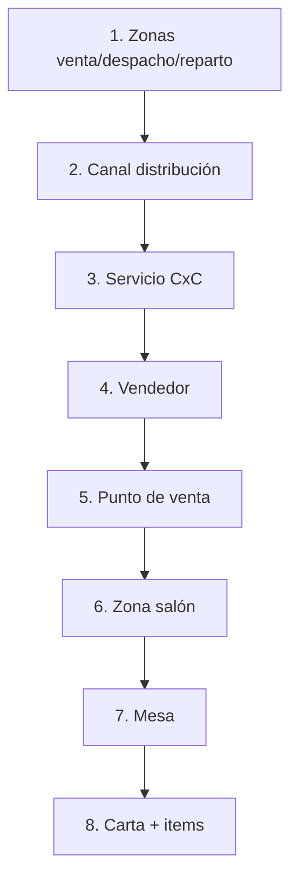
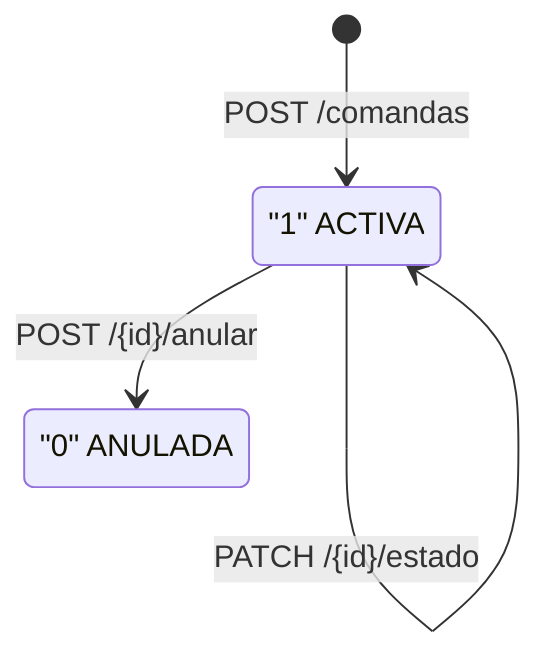
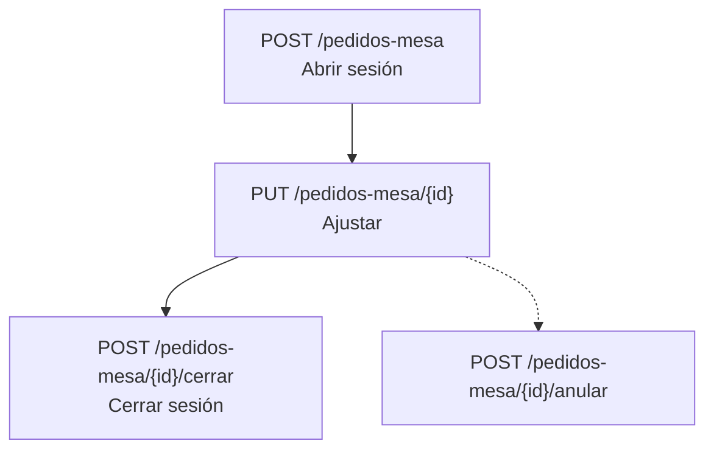
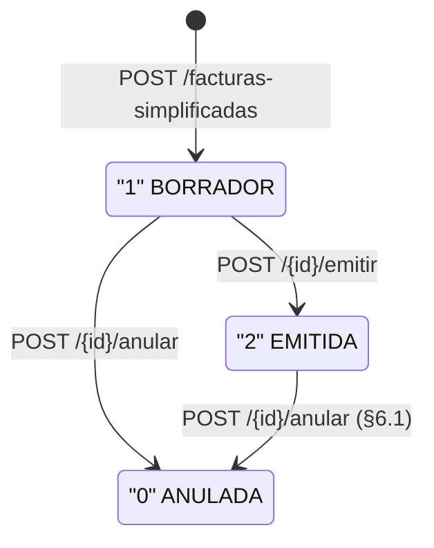
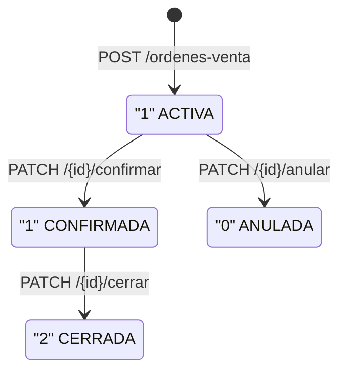
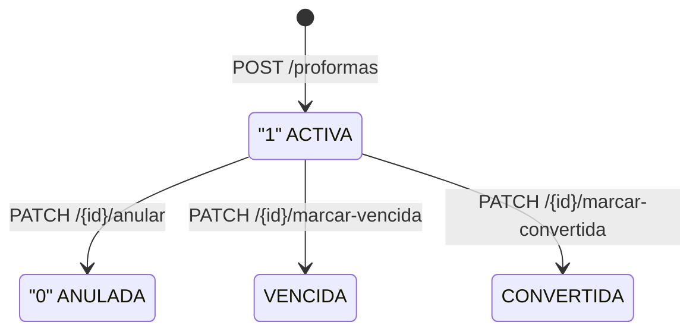
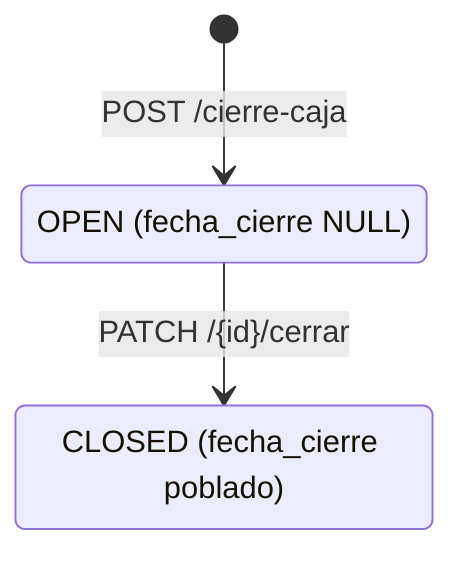
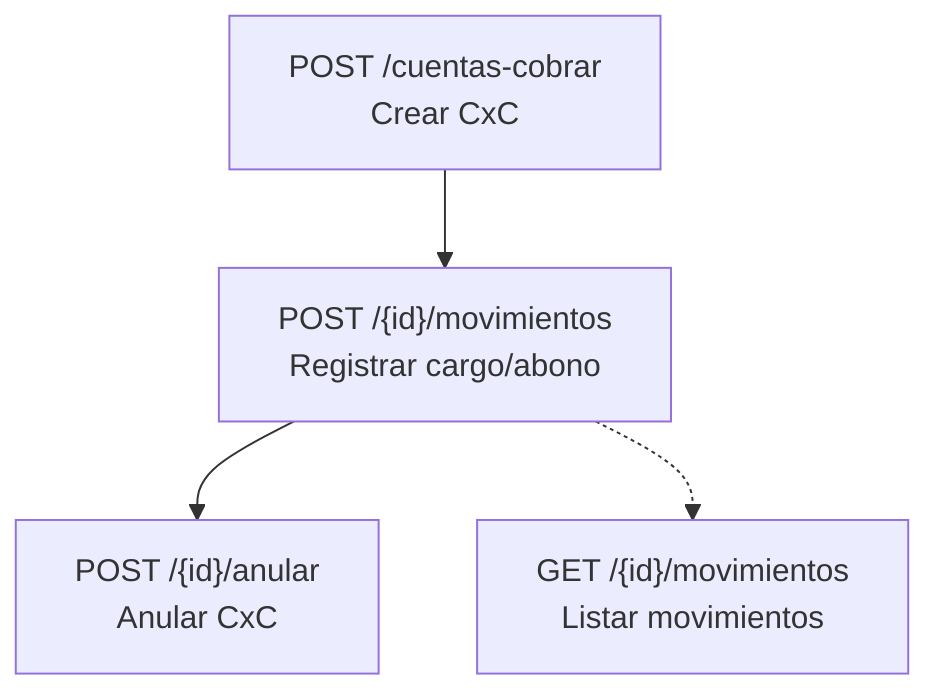
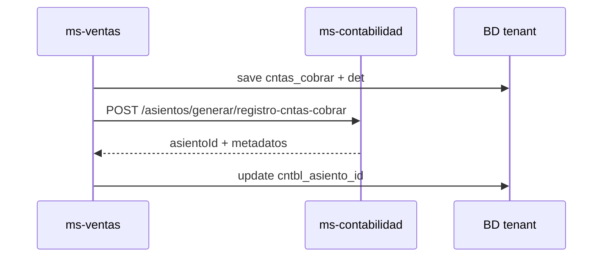

# Flujo completo — `ms-ventas`

Documento orientado a **entender el recorrido de negocio y técnico** del microservicio de ventas/POS: qué piezas intervienen, en qué orden y hacia qué persistencia apuntan.

Complementa:

- Lista detallada de rutas: [`RESUMEN_LOGICA_Y_ENDPOINTS.md`](./RESUMEN_LOGICA_Y_ENDPOINTS.md)
- Orquestación paso a paso con requests HTTP: [`../../05. Documentacion/orquestacion/ORQUESTACION_MS-VENTAS.md`](../../05.%20Documentacion/orquestacion/ORQUESTACION_MS-VENTAS.md)
- Procesos multi-paso (tablas de rutas): [`PROCESOS_VENTAS.md`](./PROCESOS_VENTAS.md)
- Guías y notas internas en [`docs/`](./docs/)(incluye [`docs/test-data-y-pruebas.md`](./docs/test-data-y-pruebas.md))
- Contratos y HU en `05. Documentacion/markdown/Contratos/ms-ventas/`
- DDL tenant: `03. Base de datos/ddl/tenant/04-ventas.sql`

---

## 1. Rol del microservicio

| Ámbito | Contenido |
|--------|-----------|
| **Maestros** | Punto de venta, mesas/zona, carta, canal de distribución, vendedor, servicios CxC, zonas comerciales (venta/despacho/reparto). |
| **Operación POS** | Comandas (cocina/barra), pedido por mesa, facturación simplificada (borrador → emitir → anular). |
| **Documentos comerciales (Fase 4)** | Orden de venta B2B, proforma, cierre de caja, descuentos/promociones. Numeración correlativa vía `NumeradorDocumentoService` → `core.fn_get_document_number`. |
| **Gestión crediticia** | Cuentas por cobrar (cabecera + movimientos), créditos por entidad y trazabilidad contable con asiento vía Feign. |
| **POS extendido (issue 5)** | Propinas, reservaciones (+ detalle), límites de crédito CxC por entidad — contratos listos, APIs implementadas. |
| **Integración** | Llamadas salientes vía Feign a `ms-contabilidad` (asientos CxC); integración con `ms-almacen` (despacho por OV). |
| **Utilidades** | Seed demo (`TestDataAdminController`, activo por `APP_TESTDATA_ENABLED`) y `VentasTestDataFactory` para tests. |

---

## 2. Contexto técnico (cómo "vive" el servicio)

- **Arranque:** `VentasApplication` escanea `pe.restaurant.ventas` y `pe.restaurant.common`.
- **Puerto interno:** `9010` (no expuesto; todo el tráfico pasa por API Gateway puerto `9080`).
- **Base URL (dev):** `https://api.dev.contabilidad.restaurant.pe`
- **Prefijo API:** `/api/ventas`
- **Multitenant:** conexión JDBC/JPA resuelta por el stack `common` (routing datasource + tenant context).
- **Seguridad:** `VentasJwtAuthenticationFilter` + `TokensSessionVerifier`. Endpoints públicos: `/actuator/**`, `/swagger-ui/**`, `/v3/api-docs/**`. Protegidos: `/api/ventas/**` (requiere **Token Definitivo** JWT con `empresaId`, `sucursalId`, `usuarioId`).
- **Feign:** 1 cliente implementado (`ContabilidadClient` → `ms-contabilidad`). Pendiente: `AlmacenClient` (roadmap §17). Los headers `Authorization`, `X-User-Id`, `X-Empresa-Id`, `X-Sucursal-Id` se propagan vía `FeignConfig.RequestInterceptor`.
- **Respuestas API:** `ApiResponse<T>` con `success/message/errorCode/data/timestamp`.
- **Errores:** códigos estandarizados `VEN-xxx` vía `VentasErrorCodes` + `GlobalExceptionHandler`.
- **Eventos/Async:** Sin uso; RabbitMQ configurado pero sin listeners ni publishers.
- **Swagger:** `/api/ventas/swagger-ui.html` y `/api/ventas/v3/api-docs`.

```mermaid
flowchart LR
  subgraph cliente
    FE[Front / otro MS]
  end
  subgraph ms_ventas
    C[Controllers]
    S[Services]
    R[Repositories / JdbcTemplate]
    FC[Feign Clients]
  end
  subgraph common
    JWT[JWT + TenantContext]
    EX[GlobalExceptionHandler]
  end
  subgraph externo
    MC[ms-contabilidad]
    CM[ms-core-maestros (lectura JPA)]
    AU[ms-auth-security]
  end
  DB[(BD tenant<br/>esquema ventas)]
  FE --> C
  C --> S
  S --> R
  R --> DB
  S --> FC
  FC --> MC
  JWT --> C
  S -.->|errores negocio| EX
```

---

## 3. Flujo de configuración (antes de operar)

Sin esta base, las operaciones POS y documentos fallan por maestros vacíos o FKs inválidas.



**Orden recomendado:**

| Paso | Maestro | Endpoint | Dependencia externa |
|:----:|---------|----------|---------------------|
| 1 | **Zonas comerciales** (venta, despacho, reparto) | `POST /zonas-venta`, `/zonas-despacho`, `/zonas-reparto` | — |
| 2 | **Canal de distribución** | `POST /canales-distribucion` | — |
| 3 | **Servicio CxC** | `POST /servicios-cxc` | — |
| 4 | **Vendedor** | `POST /vendedores` | `usuarioId` en `auth.usuario` |
| 5 | **Punto de venta** | `POST /puntos-venta` | `sucursalId` en `auth.sucursal`, `almacenId` en `almacen.almacen` |
| 6 | **Zona de salón** | `POST /zonas` | `sucursalId` en `auth.sucursal` |
| 7 | **Mesa** | `POST /mesas` | `zonaId` en `ventas.zona` |
| 8 | **Carta + items** | `POST /cartas` | `articuloId` en `core.articulo` |

**Maestros externos requeridos (configurar antes en ms-core-maestros):** artículos, clientes/entidades, monedas, tipos de documento SUNAT, formas de pago, unidades de medida.

---

## 4. Comanda (cocina/barra)

La comanda es el pedido que atiende cocina o barra. Tablas: `ventas.comanda` + `ventas.comanda_det`.

### Diagrama de estados



### Secuencia típica

| Paso | Método | Endpoint | Descripción |
|:----:|--------|----------|-------------|
| 1 | `POST` | `/comandas` | Crear comanda con ítems (`ComandaCabeceraRequest`). |
| 2 | `POST` | `/comandas/{id}/items` | Agregar ítems adicionales. |
| 3 | `PATCH` | `/comandas/{id}/estado` | Cambiar estado operativo (`ComandaEstadoRequest`). |
| 4 | `POST` | `/comandas/{id}/anular` | Anular comanda. |

### Reglas de negocio

- Solo se puede editar cabecera en estado **ACTIVA** (`flag_estado = '1'`).
- La anulación es irreversible (baja lógica a `flag_estado = '0'`).

---

## 5. Pedido por mesa

Representa la **sesión de atención en una mesa** del salón. Tabla: `ventas.pedido_mesa`.

### Diagrama de flujo



### Secuencia típica

| Paso | Método | Endpoint | Descripción |
|:----:|--------|----------|-------------|
| 1 | `POST` | `/pedidos-mesa` | Abrir sesión en mesa (`tipo`, `mesaId`, `meseroId`, `comensales`). |
| 2 | `PUT` | `/pedidos-mesa/{id}` | Ajustar comensales, observaciones. |
| 3 | `POST` | `/pedidos-mesa/{id}/cerrar` | Cerrar sesión. |
| — | `POST` | `/pedidos-mesa/{id}/anular` | Anular sesión. |

---

## 6. Factura simplificada

Es el comprobante de venta del POS (boleta/factura electrónica). Tablas: `ventas.fs_factura_simpl` + `fs_factura_simpl_det` + `fs_factura_simpl_pagos`.

### Diagrama de estados



### Secuencia típica

| Paso | Método | Endpoint | Descripción |
|:----:|--------|----------|-------------|
| 1 | `POST` | `/facturas-simplificadas` | Registrar borrador (cabecera + items + pagos). |
| 2 | `PUT` | `/facturas-simplificadas/{id}` | Actualizar borrador. |
| 3 | `POST` | `/facturas-simplificadas/{id}/emitir` | Emitir comprobante (`flag_estado = "2"`). |
| 4 | `GET` | `/facturas-simplificadas/{id}/pagos` | Listar pagos del comprobante. |
| — | `POST` | `/facturas-simplificadas/{id}/anular` | Anular (solo emitido, ver §6.1). |

### 6.1 Orquestación de anulación de factura emitida

**Precondición:** `flag_estado = '2'` (emitida). Otro estado → error `VEN-081`.

Ejecución en **una sola transacción** (`FacturaSimplificadaServiceImpl.anular`):

| Orden | Acción | Detalle |
|:-----:|--------|---------|
| 1 | **Validar reservación** | Si existe `reservacion` con `fs_factura_simpl_id = {id}` y `estado = 'CONFIRMADA'` → **409** `VEN-088`. |
| 2 | **Desactivar propinas** | Filas en `propina` con ese `fs_factura_simpl_id` y `flag_estado = '1'` → `flag_estado = '0'` (automático). |
| 3 | **Anular cabecera** | `fs_factura_simpl.flag_estado = '0'` (anulada). |
| 4 | **Anular CxC** | Si `cntas_cobrar_id` está informado, se invoca anulación. Si la CxC tiene **abonos aplicados** → error `VEN-STATE` y rollback total. |

**Códigos de error — anulación:**

| Código | HTTP | Mensaje |
|--------|:----:|---------|
| `VEN-081`/`FS_STATE` | 409 | `La factura no está en estado emitido` |
| `VEN-088`/`FS_ANULAR_RESERVACION_PENDIENTE` | 409 | `Existe reservación confirmada vinculada a esta factura` |
| `VEN-STATE` | 409 | `No se puede anular: la cuenta tiene abonos aplicados` |

---

## 7. Orden de venta (B2B)

Documento comercial para operaciones B2B (despacho, exportación). Tablas: `ventas.orden_venta` + `orden_venta_det`.

**Numeración automática:** si `nroOrdenVenta` vacío en POST, asigna vía `NumeradorDocumentoService` → `core.fn_get_document_number('ventas.orden_venta', sucursalId, año)` — 12 caracteres.

### Diagrama de estados



### Secuencia típica

| Paso | Método | Endpoint | Descripción |
|:----:|--------|----------|-------------|
| 1 | `POST` | `/ordenes-venta` | Crear OV + líneas. |
| 2 | `PUT` | `/ordenes-venta/{id}` | Ajustar cabecera y líneas. |
| 3 | `PATCH` | `/ordenes-venta/{id}/confirmar` | Confirmar OV. |
| 4 | `PATCH` | `/ordenes-venta/{id}/cerrar` | Cerrar OV. |
| — | `PATCH` | `/ordenes-venta/{id}/anular` | Anular OV. |

### Reglas de negocio — edición post-confirmación

1. La OV **confirmada** puede seguir editándose hasta que se despache el **primer item**.
2. Por línea: solo se puede editar un item mientras ese item **no haya sido despachado**.

---

## 8. Integración: despacho de stock (ms-almacen)

El endpoint `POST /api/almacen/integraciones/salida-orden-venta` pertenece a **ms-almacen**, no a ventas. Los despachos registrados condicionan si la OV sigue siendo editable (ver §7).

| Método | Endpoint (ms-almacen) | Token |
|--------|-----------------------|:-----:|
| `POST` | `/api/almacen/integraciones/salida-orden-venta` | **Definitivo** |

Body ref: `ordenVentaId`, `articuloMovTipoId`, `almacenId`, `fechaMov`. Ver [ORQUESTACION_MS-ALMACEN.md §12](../../05.%20Documentacion/orquestacion/ORQUESTACION_MS-ALMACEN.md).

---

## 9. Proforma

Cotización comercial con validez temporal. Tablas: `ventas.proforma` + `proforma_det`.

**Numeración automática:** si `numero` vacío en POST, asigna vía `NumeradorDocumentoService` → `core.fn_get_document_number('ventas.proforma', sucursalId, año)`. En ese caso `sucursalId` es obligatoria.

### Diagrama de estados



### Secuencia típica

| Paso | Método | Endpoint | Descripción |
|:----:|--------|----------|-------------|
| 1 | `POST` | `/proformas` | Alta proforma con detalles. |
| 2 | `PUT` | `/proformas/{id}` | Actualizar (solo activa). |
| 3 | `PATCH` | `/proformas/{id}/anular` | Anular. |
| 4 | `PATCH` | `/proformas/{id}/marcar-vencida` | Marcar vencida. |
| 5 | `PATCH` | `/proformas/{id}/marcar-convertida` | Marcar convertida a OV. |

### Contrato de lectura

- **Listado** (`GET /proformas`): solo cabecera; `detalles` en `null` (evita lazy fuera de TX con `open-in-view=false`).
- **Detalle** (`GET /proformas/{id}`): cabecera **con** líneas.

---

## 10. Cierre de caja

Apertura y cierre de turno de caja con cuadre de montos. Tabla: `ventas.cierre_caja`.

### Diagrama de estados



### Secuencia típica

| Paso | Método | Endpoint | Descripción |
|:----:|--------|----------|-------------|
| 1 | `POST` | `/cierre-caja` | Apertura de turno (fondo inicial, ventas por tipo). |
| 2 | `PATCH` | `/cierre-caja/{id}/cerrar` | Cerrar turno con cuadre (fondo final, diferencia). |

El response incluye `estadoCierre` derivado: `OPEN` / `CLOSED`.

---

## 11. Descuentos y promociones

Ofertas con vigencia, horario y monto mínimo. Tabla: `ventas.descuento_promocion`.

### Secuencia típica

| Paso | Método | Endpoint | Descripción |
|:----:|--------|----------|-------------|
| 1 | `POST` | `/descuentos-promocion` | Alta promoción. |
| 2 | `PUT` | `/descuentos-promocion/{id}` | Editar. |
| — | `PATCH` | `/descuentos-promocion/{id}/activar` | Activar. |
| — | `PATCH` | `/descuentos-promocion/{id}/desactivar` | Desactivar. |
| — | `DELETE` | `/descuentos-promocion/{id}` | Baja lógica. |

El response puede incluir `vigenciaDerivada` calculado: `OFF` (inactiva), `SCHEDULED` (futura), `ON` (vigente), `EXPIRED` (vencida).

---

## 12. Cuentas por Cobrar + Contabilidad

Gestión de cartera de deuda de clientes. Tablas: `ventas.cntas_cobrar` + `cntas_cobrar_det`.

**Permisos:** `@PreAuthorize` con autoridades `VENTAS_CONSULTAR`, `VENTAS_CREAR`, `VENTAS_EDITAR`, `VENTAS_ELIMINAR` según operación.

### Diagrama de flujo



### Secuencia típica

| Paso | Método | Endpoint | Descripción |
|:----:|--------|----------|-------------|
| 1 | `POST` | `/cuentas-cobrar` | Cabecera + movimientos iniciales. |
| 2 | `GET` | `/cuentas-cobrar/{id}` | Detalle con movimientos. |
| 3 | `POST` | `/cuentas-cobrar/{id}/movimientos` | Cargo/abono/ajuste (`conceptoFinancieroId` obligatorio). |
| 4 | `POST` | `/cuentas-cobrar/{id}/anular` | Anular (rechaza si hay abonos aplicados → `VEN-STATE`). |

### Integración contable

Cuando aplica, se genera asiento contable vía Feign a `ms-contabilidad`:



---

## 13. Integración con Contabilidad (asientos automáticos)

| Operación | Endpoint Feign en ms-contabilidad |
|-----------|----------------------------------|
| Registro CxC | `POST /api/contabilidad/asientos/generar/registro-cntas-cobrar` |

---

## 14. Dependencias con otros microservicios

| Microservicio | Rol | Dato que consume |
|--------------|-----|-----------------|
| `ms-auth-security` | Autenticación y autorización | Token JWT definitivo, usuarios, sesiones |
| `ms-core-maestros` | Maestros compartidos vía JPA Ref | Artículos, clientes, monedas, tipos doc SUNAT, formas pago, unidades medida, impuestos |
| `ms-contabilidad` | Asientos contables vía Feign | Generación de asientos de CxC |
| `ms-almacen` | Despacho de stock vía Feign (roadmap) | Salida de stock por OV y factura (pendiente issue 5) |
| `ms-finanzas` | Conceptos financieros (FK) | `concepto_financiero_id` en movimientos CxC |

---

## 15. Procesos implementados

| Proceso | Controller |
|---------|-----------|
| Maestros comerciales (zonas, canales, servicios CxC, vendedores) | `ZonaVentaController`, `ZonaDespachoController`, `ZonaRepartoController`, `CanalDistribucionController`, `ServiciosCxCController`, `VendedorController` |
| Punto de venta y sala | `PuntoVentaController`, `ZonaController` (salón), `MesaController` |
| Carta menú | `CartaController`, `CartaItemController` |
| Comanda | `ComandaController` |
| Pedido por mesa | `PedidoMesaController` |
| Factura simplificada | `FacturaSimplificadaController` |
| Orden de venta (B2B) | `OrdenVentaController` |
| Proforma | `ProformaController` |
| Cierre de caja | `CierreCajaController` |
| Descuentos y promociones | `DescuentoPromocionController` |
| Cuentas por cobrar | `CuentaCobrarController` |
| Propinas | `PropinaController` |
| Reservaciones | `ReservacionController` |
| Créditos CxC por entidad | `EntidadCreditosCxcController` |
| Seed demo | `TestDataAdminController` |

---

## 16. Datos maestros compartidos (otros esquemas)

El MS lee información en:

- **`core`:** artículos, clientes/entidades, monedas, tipos de documento SUNAT, formas de pago, unidades de medida, impuestos.
- **`auth`:** usuarios, sesiones, sucursales.
- **`almacen`:** almacenes (FK en `punto_venta`, `orden_venta_det`).
- **`finanzas`:** conceptos financieros (FK en `cntas_cobrar_det`).
- **`contabilidad`:** asientos contables (generación vía Feign).

La consistencia depende de que el **tenant** tenga DDL alineado (`04-ventas.sql` + parches).

---

## 17. Roadmap issue 5 — propinas, reservaciones, límites crédito e integración factura

- **APIs locales:** implementadas bajo `/api/ventas/propinas`, `/reservaciones`, `/creditos-cxc`. Contratos en `05. Documentacion/markdown/Contratos/ms-ventas/`.
- **Integraciones pendientes:**
  - Factura emitida → `ms-almacen` (salida de stock automática).
  - Factura emitida → `ms-finanzas` (CxC automática según forma de pago).

---

## 18. Datos de prueba (demo vs tests)

- **Demo masiva:** [`PROCESOS_VENTAS.md`](./PROCESOS_VENTAS.md) — por defecto `APP_TESTDATA_ENABLED=true` en YAML local; usar `false` en producción.
- **Tests idempotentes:** `VentasTestDataFactory` y smoke IT en [`docs/test-data-y-pruebas.md`](./docs/test-data-y-pruebas.md).

### Ejecución de tests

| Alcance | Comando |
|---------|---------|
| Unitarios + JaCoCo (gate ≥ 80%) | `mvn test -pl ms-ventas` desde `02. Backend` |
| IT con BD (`@Tag("integration")`) | `mvn test -pl ms-ventas -Dgroups=integration` |
| IT factory extendido | `mvn test -pl ms-ventas -Dventas.it=true -Dtest=VentasTestDataExtendedIT,VentasTestDataFactorySmokeIT` |

---

## 19. Dónde profundizar

| Necesidad | Documento |
|-----------|-----------|
| Lista de endpoints por controlador | [`RESUMEN_LOGICA_Y_ENDPOINTS.md`](./RESUMEN_LOGICA_Y_ENDPOINTS.md) |
| Orquestación paso a paso con requests HTTP | [`../../05. Documentacion/orquestacion/ORQUESTACION_MS-VENTAS.md`](../../05.%20Documentacion/orquestacion/ORQUESTACION_MS-VENTAS.md) |
| Procesos agrupados (rutas multi-paso) | [`PROCESOS_VENTAS.md`](./PROCESOS_VENTAS.md) |
| Contratos técnicos e historias de usuario | `05. Documentacion/markdown/Contratos/ms-ventas/*.md` |
| DDL tenant | `03. Base de datos/ddl/tenant/04-ventas.sql` |
| Guía de pruebas y test data | [`docs/test-data-y-pruebas.md`](./docs/test-data-y-pruebas.md) |
| Índice de documentación interna | [`docs/README.md`](./docs/README.md) |
| Diseño de base de datos | `05. Documentacion/markdown/DISENO_BASE_DATOS.md` |

---

*Última actualización orientativa al contenido del repo; ante divergencias, prima el código, la orquestación y el DDL versionados. Ver `ORQUESTACION_MS-VENTAS.md` Anexo A para inventario completo de endpoints (~170 rutas).*
