# Diagrama de Relaciones - Módulo Ventas

```mermaid
---
config:
  layout: elk
---
erDiagram
    auth.sucursal {
        id bigint PK
        codigo varchar
        nombre varchar
    }
    
    core.entidad_contribuyente {
        id bigint PK
        nro_documento varchar
        nombre varchar
    }
    
    core.articulo {
        id bigint PK
        codigo varchar
        nombre varchar
    }
    
    core.moneda {
        id bigint PK
        codigo varchar
        nombre varchar
    }
    
    core.doc_tipo {
        id bigint PK
        codigo varchar
        nombre varchar
    }
    
    core.unidad_medida {
        id bigint PK
        codigo varchar
        nombre varchar
    }
    
    core.forma_pago {
        id bigint PK
        codigo varchar
        nombre varchar
    }
    
    almacen.almacen {
        id bigint PK
        codigo varchar
        nombre varchar
    }
    
    almacen.articulo_mov_tipo {
        id bigint PK
        codigo varchar
        nombre varchar
    }
    
    compras.orden_compra_det {
        id bigint PK
        cantidad decimal
        precio_unitario decimal
    }
    
    ventas.punto_venta {
        id bigint PK
        sucursal_id bigint FK
        almacen_id bigint FK
        codigo varchar
        nombre varchar
        serie_boleta varchar
        serie_factura varchar
    }
    
    ventas.comanda {
        id bigint PK
        sucursal_id bigint FK
        punto_venta_id bigint FK
        cliente_id bigint FK
        mesa varchar
        fecha_hora date
        estado varchar
        total decimal
    }
    
    ventas.comanda_det {
        id bigint PK
        comanda_id bigint FK
        articulo_id bigint FK
        cantidad decimal
        precio_unitario decimal
        subtotal decimal
        observacion varchar
    }
    
    ventas.fs_factura_simpl {
        id bigint PK
        sucursal_id bigint FK
        punto_venta_id bigint FK
        cliente_id bigint FK
        doc_tipo_id bigint FK
        serie varchar
        numero varchar
        fecha_emision date
        moneda_id bigint FK
        subtotal decimal
        impuesto decimal
        total decimal
        estado varchar
    }
    
    ventas.fs_factura_simpl_det {
        id bigint PK
        fs_factura_simpl_id bigint FK
        articulo_id bigint FK
        unidad_medida_id bigint FK
        cantidad decimal
        precio_unitario decimal
        subtotal decimal
    }
    
    ventas.fs_factura_simpl_pagos {
        id bigint PK
        fs_factura_simpl_id bigint FK
        forma_pago_id bigint FK
        monto decimal
        referencia varchar
        fecha_pago date
    }
    
    ventas.cntas_cobrar {
        id bigint PK
        sucursal_id bigint FK
        cliente_id bigint FK
        doc_tipo_id bigint FK
        serie varchar
        numero varchar
        fecha_emision date
        fecha_vencimiento date
        moneda_id bigint FK
        total decimal
        saldo decimal
        estado varchar
    }
    
    ventas.cntas_cobrar_det {
        id bigint PK
        cntas_cobrar_id bigint FK
        fecha_mov date
        tipo_mov varchar
        monto decimal
        referencia varchar
    }
    
    ventas.entidad_creditos_cxc {
        id bigint PK
        entidad_contribuyente_id bigint FK
        moneda_id bigint FK
        limite_credito decimal
        dias_credito int
    }
    
    ventas.zona {
        id bigint PK
        sucursal_id bigint FK
        nombre varchar
        capacidad int
    }
    
    ventas.mesa {
        id bigint PK
        zona_id bigint FK
        numero varchar
        capacidad int
        estado varchar
    }
    
    ventas.pedido_mesa {
        id bigint PK
        sucursal_id bigint FK
        mesa_id bigint FK
        tipo varchar
        numero varchar
        comensales int
        apertura date
        cierre date
        estado varchar
        observaciones text
    }
    
    ventas.vendedor {
        id bigint PK
        usuario_id bigint FK
        nombre varchar
        comision_porcentaje decimal
    }
    
    ventas.orden_venta {
        id bigint PK
        sucursal_id bigint FK
        nro_orden_venta varchar
        cliente_id bigint FK
        comprador_final_id bigint FK
        vendedor_id bigint FK
        fecha_emision date
        moneda_id bigint FK
        forma_pago_id bigint FK
        doc_tipo_id bigint FK
        monto_total decimal
        monto_facturado decimal
        estado varchar
    }
    
    ventas.articulo_mov_proy {
        id bigint PK
        sucursal_id bigint FK
        articulo_id bigint FK
        articulo_mov_tipo_id bigint FK
        almacen_id bigint FK
        orden_compra_det_id bigint FK
        cant_proyectada decimal
        cant_procesada decimal
        cant_facturada decimal
        precio_unitario decimal
    }
    
    ventas.orden_venta_det {
        id bigint PK
        orden_venta_id bigint FK
        articulo_id bigint FK
        almacen_id bigint FK
        articulo_mov_proy_id bigint FK
        cant_proyectada decimal
        cant_procesada decimal
        cant_facturada decimal
        valor_unitario decimal
        subtotal decimal
    }
    
    ventas.proforma {
        id bigint PK
        sucursal_id bigint FK
        cliente_id bigint FK
        numero varchar
        fecha date
        fecha_validez date
        moneda_id bigint FK
        subtotal decimal
        igv decimal
        total decimal
        estado varchar
    }
    
    ventas.proforma_det {
        id bigint PK
        proforma_id bigint FK
        articulo_id bigint FK
        descripcion varchar
        cantidad decimal
        precio_unitario decimal
        descuento decimal
        subtotal decimal
    }
    
    ventas.cierre_caja {
        id bigint PK
        turno_id bigint FK
        ventas_efectivo decimal
        ventas_tarjeta decimal
        ventas_digital decimal
        ventas_total decimal
        propinas_total decimal
        fondo_inicial decimal
        fondo_final decimal
        diferencia decimal
        fecha_cierre date
    }
    
    ventas.descuento_promocion {
        id bigint PK
        nombre varchar
        tipo varchar
        valor decimal
        fecha_inicio date
        fecha_fin date
        dias_aplicacion varchar
        monto_minimo decimal
    }
    
    ventas.facturacion_electronica {
        id bigint PK
        fs_factura_simpl_id bigint FK
        xml_enviado text
        xml_cdr text
        hash_cpe varchar
        ticket_ose varchar
        estado_sunat varchar
        fecha_envio date
        fecha_respuesta date
    }
    
    ventas.propina {
        id bigint PK
        fs_factura_simpl_id bigint FK
        trabajador_id bigint FK
        monto decimal
        fecha date
    }
    
    ventas.reservacion {
        id bigint PK
        sucursal_id bigint FK
        cliente_id bigint FK
        mesa_id bigint FK
        fecha date
        hora time
        comensales int
        estado varchar
        observaciones text
    }
    
    ventas.reservacion_det {
        id bigint PK
        reservacion_id bigint FK
        articulo_id bigint FK
        cantidad decimal
        observacion text
    }
    
    ventas.carta {
        id bigint PK
        sucursal_id bigint FK
        nombre varchar
        descripcion text
    }
    
    ventas.carta_det {
        id bigint PK
        carta_id bigint FK
        articulo_id bigint FK
        precio decimal
        orden int
    }
    
    ventas.canal_distribucion {
        id bigint PK
        codigo varchar
        nombre varchar
    }
    
    ventas.servicios_cxc {
        id bigint PK
        cod_servicio varchar
        desc_servicio varchar
        tarifa decimal
        flag_afecto_igv varchar
    }
    
    ventas.vta_zona_venta {
        id bigint PK
        zona_venta varchar
        desc_zona_venta varchar
        ubigeo varchar
    }
    
    ventas.vta_zona_despacho {
        id bigint PK
        zona_despacho varchar
        desc_zona_despacho varchar
        ubigeo varchar
    }
    
    ventas.vta_zona_reparto {
        id bigint PK
        zona_reparto varchar
        desc_zona_reparto varchar
        ubigeo varchar
    }

    auth.sucursal ||--o{ ventas.punto_venta : "tiene"
    auth.sucursal ||--o{ ventas.comanda : "opera en"
    auth.sucursal ||--o{ ventas.fs_factura_simpl : "emite en"
    auth.sucursal ||--o{ ventas.cntas_cobrar : "genera en"
    auth.sucursal ||--o{ ventas.zona : "contiene"
    auth.sucursal ||--o{ ventas.pedido_mesa : "atiende en"
    auth.sucursal ||--o{ ventas.orden_venta : "registra en"
    auth.sucursal ||--o{ ventas.proforma : "crea en"
    auth.sucursal ||--o{ ventas.reservacion : "recibe en"
    auth.sucursal ||--o{ ventas.carta : "gestiona en"
    auth.sucursal ||--o{ ventas.articulo_mov_proy : "proyecta en"
    
    almacen.almacen ||--o{ ventas.punto_venta : "asociado a"
    almacen.almacen ||--o{ ventas.orden_venta_det : "despacha desde"
    almacen.almacen ||--o{ ventas.articulo_mov_proy : "almacena en"
    almacen.articulo_mov_tipo ||--o{ ventas.articulo_mov_proy : "clasifica"
    
    core.entidad_contribuyente ||--o{ ventas.comanda : "cliente de"
    core.entidad_contribuyente ||--o{ ventas.fs_factura_simpl : "cliente de"
    core.entidad_contribuyente ||--o{ ventas.cntas_cobrar : "deudor"
    core.entidad_contribuyente ||--o{ ventas.entidad_creditos_cxc : "acreditado"
    core.entidad_contribuyente ||--o{ ventas.orden_venta : "cliente de"
    core.entidad_contribuyente ||--o{ ventas.proforma : "cliente de"
    core.entidad_contribuyente ||--o{ ventas.reservacion : "cliente de"
    
    core.articulo ||--o{ ventas.comanda_det : "artículo de"
    core.articulo ||--o{ ventas.fs_factura_simpl_det : "facturado"
    core.articulo ||--o{ ventas.orden_venta_det : "vendido"
    core.articulo ||--o{ ventas.articulo_mov_proy : "movimiento"
    core.articulo ||--o{ ventas.proforma_det : "cotizado"
    core.articulo ||--o{ ventas.reservacion_det : "reservado"
    core.articulo ||--o{ ventas.carta_det : "en carta"
    
    core.moneda ||--o{ ventas.fs_factura_simpl : "moneda de"
    core.moneda ||--o{ ventas.cntas_cobrar : "moneda de"
    core.moneda ||--o{ ventas.entidad_creditos_cxc : "moneda de"
    core.moneda ||--o{ ventas.orden_venta : "moneda de"
    core.moneda ||--o{ ventas.proforma : "moneda de"
    core.moneda ||--o{ ventas.articulo_mov_proy : "moneda de"
    
    core.doc_tipo ||--o{ ventas.fs_factura_simpl : "tipo de"
    core.doc_tipo ||--o{ ventas.cntas_cobrar : "tipo de"
    core.doc_tipo ||--o{ ventas.orden_venta : "tipo de"
    
    core.unidad_medida ||--o{ ventas.fs_factura_simpl_det : "unidad de"
    core.forma_pago ||--o{ ventas.orden_venta : "forma de pago"
    core.forma_pago ||--o{ ventas.fs_factura_simpl_pagos : "forma de pago"
    
    ventas.punto_venta ||--o{ ventas.comanda : "genera"
    ventas.punto_venta ||--o{ ventas.fs_factura_simpl : "emite"
    
    ventas.comanda ||--o{ ventas.comanda_det : "detalla"
    ventas.fs_factura_simpl ||--o{ ventas.fs_factura_simpl_det : "detalla"
    ventas.fs_factura_simpl ||--o{ ventas.fs_factura_simpl_pagos : "pagos de"
    ventas.fs_factura_simpl ||--o{ ventas.facturacion_electronica : "electrónica"
    ventas.fs_factura_simpl ||--o{ ventas.propina : "propina de"
    
    ventas.cntas_cobrar ||--o{ ventas.cntas_cobrar_det : "movimientos"
    
    ventas.zona ||--o{ ventas.mesa : "contiene"
    ventas.mesa ||--o{ ventas.pedido_mesa : "asignada a"
    ventas.mesa ||--o{ ventas.reservacion : "reservada"
    
    ventas.vendedor ||--o{ ventas.orden_venta : "vende"
    
    ventas.orden_venta ||--o{ ventas.orden_venta_det : "detalla"
    ventas.articulo_mov_proy ||--o{ ventas.orden_venta_det : "proyecta"
    compras.orden_compra_det ||--o{ ventas.articulo_mov_proy : "referencia"
    
    ventas.proforma ||--o{ ventas.proforma_det : "detalla"
    ventas.reservacion ||--o{ ventas.reservacion_det : "detalla"
    ventas.carta ||--o{ ventas.carta_det : "detalla"
```

## Resumen de Relaciones Principales

### Grupo 1: Operaciones de Restaurante
- **comanda** es la tabla central para pedidos de cocina/barra
- Se relaciona con **comanda_det** para los artículos solicitados
- Conecta con **punto_venta** y **auth.sucursal** para el contexto operativo
- **pedido_mesa** gestiona las sesiones de atención en salón

### Grupo 2: Facturación Electrónica
- **fs_factura_simpl** es la tabla principal para boletas/facturas
- Se relaciona con **fs_factura_simpl_det** para el detalle de artículos
- Conecta con **fs_factura_simpl_pagos** para las formas de pago
- **facturacion_electronica** gestiona la comunicación con SUNAT

### Grupo 3: Cuentas por Cobrar
- **cntas_cobrar** gestiona los créditos y deudas de clientes
- Se relaciona con **cntas_cobrar_det** para el seguimiento de pagos
- **entidad_creditos_cxc** controla los límites de crédito por cliente

### Grupo 4: Gestión de Mesas y Reservaciones
- **zona** organiza las áreas del restaurante
- **mesa** representa cada mesa individual
- **pedido_mesa** controla las sesiones de atención
- **reservacion** gestiona las reservas futuras

### Grupo 5: Ventas Comerciales (B2B)
- **orden_venta** es la tabla central para órdenes comerciales ERP/SIGRE
- Se relaciona con **orden_venta_det** para el detalle de artículos
- **articulo_mov_proy** gestiona movimientos proyectados polimórficos
- Conecta con **almacen.almacen** para gestión de inventario

### Grupo 6: Gestión de Menú y Precios
- **carta** representa las cartas/menús por sucursal
- **carta_det** detalla los artículos y precios en cada carta
- **descuento_promocion** gestiona ofertas y descuentos

### Grupo 7: Control Operativo
- **cierre_caja** controla las operaciones diarias de caja
- **propina** gestiona las propinas por trabajador
- **canal_distribucion** define los canales de venta

### Grupo 8: Maestros SIGRE
- **servicios_cxc** maestro de servicios para cuentas por cobrar
- **vta_zona_venta** zonas comerciales de venta
- **vta_zona_despacho** zonas de despacho
- **vta_zona_reparto** zonas de reparto

## Descripción de cada grupo de relaciones

### Operaciones de Restaurante
Este grupo gestiona el flujo completo de atención en restaurante: desde que el cliente se sienta en una mesa, se toma la comanda (pedido a cocina), se preparan los alimentos, hasta finalmente se genera la factura. Las tablas principales son `comanda` y `comanda_det`, que registran qué artículos se solicitaron y en qué cantidad.

### Facturación Electrónica
Gestiona toda la emisión de documentos fiscales (boletas, facturas) con sus detalles, formas de pago y comunicación electrónica con SUNAT. La tabla `fs_factura_simpl` es central, conectándose con el detalle de artículos y los registros de pago.

### Cuentas por Cobrar
Controla el crédito otorgado a clientes y el seguimiento de pagos. Incluye límites de crédito por cliente y el registro histórico de todos los movimientos de cobro.

### Gestión de Mesas y Reservaciones
Organiza el espacio físico del restaurante mediante zonas y mesas, gestiona las reservaciones futuras y controla las sesiones de atención actual en cada mesa.

### Ventas Comerciales (B2B)
Maneja las órdenes de venta comerciales tipo ERP/SIGRE, distintas de las operaciones de restaurante. Incluye proyecciones de inventario, despachos y facturación B2B.

### Gestión de Menú y Precios
Administra las cartas/menús disponibles, los precios por artículo y las promociones vigentes, permitiendo una gestión flexible de la oferta comercial.

### Control Operativo
Registra las operaciones diarias de caja, incluyendo cierres de turno, propinas y diferencias, asegurando el control financiero diario.

### Maestros SIGRE
Tablas maestras que mantienen información de referencia para la integración con sistemas SIGRE, incluyendo servicios, zonas geográficas y configuraciones comerciales.
