# Módulo Agropecuario (Campo + Pecuario) — Diseño funcional

Pecuario **no es un módulo aparte**: es una extensión de **Campo**, así que las ventanas usan el mismo prefijo PowerBuilder que ya existe para Campo (`w_cam###`, confirmado en `ws_objects/Campo`) en vez de un prefijo propio. Las tablas sí mantienen su propio prefijo `PC_*` (Pecuario) para distinguirlas claramente de las tablas agrícolas (`CAMPO_*`) dentro del mismo esquema — solo cambia la numeración de ventanas, no las tablas.

Este documento es la **única fuente de verdad** del diseño (no se crean documentos adicionales). Incluye, además del diseño de tablas, el análisis completo de cada módulo existente que se investigó para integrar Pecuario correctamente — así no hay que volver a investigarlos.

**El script (`pecuario_ddl_san_martin.sql`) es idempotente**: se puede ejecutar cuantas veces sea necesario. Al inicio, un bloque PL/SQL elimina (`DROP ... CASCADE CONSTRAINTS`) únicamente las tablas y secuencias con prefijo `PC_*`/`SEQ_PC_*` — nunca ninguna otra tabla del ERP (`ORIGEN`, `ARTICULO`, `ORDEN_TRABAJO`, etc. quedan intactas). `CASCADE CONSTRAINTS` elimina automáticamente las FK que otras tablas `PC_*` tengan hacia la que se borra, así que el orden de eliminación no importa. Los datos que el script inserta en tablas **compartidas** (`ORIGEN`, `OT_TIPO`, `ALMACEN`, `TIPO_PRODUCTO`, `ORDEN_TRABAJO`, `ORDEN_VENTA`) usan `INSERT ... WHERE NOT EXISTS` en vez de tocarlas de forma destructiva.

## 1. Regla de numeración de ventanas (confirmada por el usuario)

Dentro de cada módulo, el número de ventana se asigna **por tipo de opción de menú**, no por área funcional:

| Rango | Tipo de opción |
|---|---|
| 000–299 | Tablas (catálogos/parametrización — se configuran una vez, rara vez cambian) |
| 300–499 | Operaciones (registro transaccional del día a día) |
| 500–699 | Consultas (búsqueda/visualización, no modifican datos) |
| 700–899 | Reportes (impresión/exportación) |
| 900–999 | Procesos (batch, sin interacción de usuario) |

Campo (caña) ya ocupa: `001–060` y `200–201` (Tablas), `301–390` y `412–434` (Operaciones), `700–715` y `752–758` (Reportes). **No se numera simplemente continuando después del último código usado**: se rellena el primer hueco contiguo lo bastante grande dentro de cada rango (ej. entre `CAM060` y `CAM200` hay un hueco de 139 números libres — ahí es donde va Pecuario, no después de `CAM201`):

| Tipo | Hueco usado (tamaño) | Bloque asignado a Pecuario |
|---|---|---|
| Tablas | `061`–`199` (139 libres) | `CAM061`–`CAM069` (9) |
| Operaciones | `391`–`411` (21 libres) | `CAM391`–`CAM406` (16) |
| Consultas | `500`–`699` (todo libre) | `CAM500`–`CAM506` (7) |
| Reportes | `716`–`751` (36 libres) | `CAM716`–`CAM722` (7) |
| Procesos | `900`–`999` (todo libre) | `CAM900`–`CAM905` (6) |

**Criterio de clasificación** (mismo que ya usa el módulo de Activo Fijo para su "Maestro de Activo Fijo"): el maestro de cada *especimen individual* (acá `PC_ANIMAL`) va en **Operaciones**, no en Tablas — porque es un registro vivo que crece todos los días, a diferencia de un catálogo de parametrización.

## 2. Objetivo y alcance

Llevar el control operativo, sanitario, reproductivo y productivo del hato ganadero de **cualquier especie pecuaria** (bovino, porcino, caprino, ovino, equino, etc. — no exclusivo de vacunos, ver `PC_ESPECIE` en la sección 6), y dejar la trazabilidad necesaria para SENASA (DTA) y una base de datos lista para integrarse a Contabilidad como activo biológico (NIC 41). El diseño no depende de una empresa ni de un giro de negocio en particular; los ejemplos de este documento (vacas lecheras, concentrado, cliente Laive) ilustran un caso de uso real, pero el modelo de datos es genérico.

No reemplaza ni modifica el módulo Campo existente (caña): es un árbol de tablas nuevo (`PC_*`) y opciones de menú nuevas (usando los bloques de la tabla anterior) que solo comparten el concepto de `cod_origen` (fundo/sucursal) y el mismo prefijo de ventana con el resto de Campo.

## 3. Convención de claves primarias (obligatoria, sin excepción)

Regla confirmada por el usuario: **toda tabla debe tener un campo como PK**. Hay tres casos:

1. **Tablas-documento** (la identidad de la fila es un número de documento interno, igual concepto que `nro_orden`/`nro_os`/`nro_orden_compra` en el resto del ERP): la PK es **una sola columna** `CHAR(10)`, formato `cod_origen(2) + correlativo(8, zero-padded)` — ej. `SU00000001`. El `cod_origen` queda embebido en el propio número, por eso **no** es PK compuesta con `cod_origen` — `cod_origen` sigue existiendo como columna aparte (con su propia FK a `ORIGEN`) solo para filtrar/consultar. Se genera con un trigger `BEFORE INSERT` que usa la tabla genérica `NUM_TABLAS` — el mismo mecanismo que ya usa el resto del sistema (ver sección 5.5). Tablas de este tipo en Pecuario: `PC_ANIMAL` (`cod_animal`), `PC_SERVICIO` (`nro_servicio`).
2. **Tablas-documento externo** (el número lo asigna un tercero, ej. SENASA): PK = `reckey` interno (caso 3), y el número externo queda como columna de texto libre `UNIQUE`, **no autogenerada**. Tabla de este tipo: `PC_DTA` (`nro_dta` lo asigna SENASA, no nuestro sistema).
3. **Todo el resto** (catálogos, detalle, eventos): PK = `reckey NUMBER(10)`, autonumérico vía `SEQUENCE` + trigger `BEFORE INSERT` — el mismo patrón que ya usa `ARTICULO_MOV.nro_mov` (`SEQ_ALM_ARTICULO_MOV` + `TIB_ARTICULO_MOV_NRO_MOV`, ver sección 5.5). Los códigos de negocio (`cod_raza`, `cod_potrero`, etc.) se mantienen como columnas con `UNIQUE` (no PK), así las FK de otras tablas que ya apuntaban a esos códigos no cambian.

**Regla adicional**: sin excepción, toda tabla que tenga columna `cod_origen` debe tener FK a `CANTABRIA.ORIGEN(cod_origen)` (confirmado como patrón real en `ORDEN_SERVICIO.FK_ORDEN_SERVICIO_ORIGEN`).

## 4. Estructura de menú completa

| Menú Principal | Código | Ventana / Proceso | Tabla | Descripción |
|---|---|---|---|---|
| **TABLAS** | CAM061 | Razas | `PC_RAZA` | Razas (de cualquier especie) |
| TABLAS | CAM062 | Categorías | `PC_CATEGORIA` | Etapas del animal (ternero, vaquillona, novilla, vaca en producción/seca/descarte, toro) — viene precargada |
| TABLAS | CAM063 | Potreros | `PC_POTRERO` | Potreros de pastoreo por fundo, con capacidad de carga |
| TABLAS | CAM064 | Sementales | `PC_SEMENTAL` | Catálogo de sementales/pajillas para inseminación artificial |
| TABLAS | CAM065 | Productos sanitarios | `PC_PRODUCTO_SANITARIO` | Vacunas, desparasitantes, medicamentos, con período de retiro |
| TABLAS | CAM066 | Enfermedades | `PC_ENFERMEDAD` | Catálogo de enfermedades/diagnósticos |
| TABLAS | CAM067 | Dietas | `PC_DIETA` + `PC_DIETA_COMPONENTE` | Raciones por categoría, con insumos referenciados a `ARTICULO` (Almacén) |
| TABLAS | CAM068 | Especies | `PC_ESPECIE` | Bovino, porcino, caprino, ovino, equino, etc. — agrupa las razas |
| TABLAS | CAM069 | Recetas de concentrado | `PC_RECETA` + `PC_RECETA_DET` | Fórmula de fabricación propia de concentrado/insumos (materia prima → producto terminado) |
| **OPERACIONES** | CAM391 | Maestro de animal | `PC_ANIMAL` | Alta y mantenimiento del hato (identificación, genealogía, categoría, ubicación) |
| OPERACIONES | CAM392 | Registro de celo | `PC_CELO` | Detección de celo (visual, podómetro/collar, hormonal) |
| OPERACIONES | CAM393 | Registro de servicio | `PC_SERVICIO` | Monta natural o inseminación artificial |
| OPERACIONES | CAM394 | Diagnóstico de preñez | `PC_DIAGNOSTICO_PRENEZ` | Confirmación/descarte de preñez (tacto rectal o ecografía) |
| OPERACIONES | CAM395 | Registro de parto | `PC_PARTO` | Parto, alta automática de la cría |
| OPERACIONES | CAM396 | Lactancia | `PC_LACTANCIA` | Apertura automática al parto; cierre (secado) manual |
| OPERACIONES | CAM397 | Ordeño diario | `PC_ORDENO` | Litros por turno (mañana/tarde/noche) |
| OPERACIONES | CAM398 | Control lechero | `PC_CONTROL_LECHERO` | Muestreo periódico de calidad (grasa, proteína, CCS) |
| OPERACIONES | CAM399 | Condición corporal | `PC_CONDICION_CORPORAL` | Evaluación BCS (escala 1-5) |
| OPERACIONES | CAM400 | Consumo de alimento | `PC_ALIMENTACION_CONSUMO` | Consumo diario de dieta por potrero/lote |
| OPERACIONES | CAM401 | Eventos sanitarios | `PC_SANIDAD_EVENTO` | Vacunas, desparasitaciones, tratamientos, diagnósticos |
| OPERACIONES | CAM402 | Muestras de laboratorio | `PC_LABORATORIO` + `PC_LABORATORIO_DET` | Toma de muestra y carga de resultados (sangre, leche, fecal, semen, tejido) |
| OPERACIONES | CAM403 | Movimiento de potrero | `PC_MOVIMIENTO_POTRERO` | Traslado/rotación de potreros |
| OPERACIONES | CAM404 | Documento de Tránsito Animal | `PC_DTA` + `PC_DTA_DETALLE` | Emisión de DTA para venta o traslado (SENASA) |
| OPERACIONES | CAM405 | Baja de animal | `PC_BAJA` | Venta (con FK a `ORDEN_VENTA`), muerte o descarte; desactiva el animal (trigger) |
| OPERACIONES | CAM406 | Vinculación de animales a OT | `PC_OT_ANIMAL` | Asocia una Orden de Trabajo Pecuaria (`ORDEN_TRABAJO`, `ot_adm='PECU'`) con el/los animal(es) que cubre |
| **CONSULTAS** | CAM500 | Ficha del animal | — | Vista 360°: datos generales + genealogía + historial reproductivo + producción + sanidad |
| CONSULTAS | CAM501 | Historial reproductivo | — | Por animal o por rango de fechas (celos, servicios, diagnósticos, partos) |
| CONSULTAS | CAM502 | Producción de leche | — | Por animal, por potrero o por período |
| CONSULTAS | CAM503 | Calendario sanitario | — | Próximos refuerzos y fin de período de retiro vigente |
| CONSULTAS | CAM504 | Trazabilidad SENASA | — | DTA por animal |
| CONSULTAS | CAM505 | Resultados de laboratorio | — | Pendientes y con resultado, por animal o por tipo de muestra |
| CONSULTAS | CAM506 | Historial de consumibles por animal | — | Alimentación + medicinas, leídas de `ARTICULO_MOV` real (vía `PC_OT_ANIMAL` → `ORDEN_TRABAJO` → `OPERACIONES`), no de una tabla propia de Pecuario |
| **REPORTES** | CAM716 | Resumen del hato | — | Inventario de animales por categoría, potrero y estado reproductivo |
| REPORTES | CAM717 | Indicadores reproductivos | — | Intervalo entre partos, días abiertos, tasa de preñez, % distocias |
| REPORTES | CAM718 | Producción de leche | — | Mensual, consolidado y por vaca |
| REPORTES | CAM719 | Control lechero | — | Calidad de leche (grasa/proteína/CCS) por período |
| REPORTES | CAM720 | Costos de alimentación | — | Por potrero/categoría, cruzando `PC_ALIMENTACION_CONSUMO` con costo de `ARTICULO` |
| REPORTES | CAM721 | Sanitario | — | Vacunas aplicadas, próximos vencimientos, período de retiro vigente |
| REPORTES | CAM722 | Bajas del período | — | Ventas, muertes y descartes |
| **PROCESOS** | CAM900 | Recategorización automática | — | Recalcula `PC_ANIMAL.cod_categoria` según edad y estado reproductivo |
| PROCESOS | CAM901 | Actualización de estado reproductivo | — | Recalcula `PC_ANIMAL.flag_estado_repro` según el último evento (celo/servicio/diagnóstico/parto) |
| PROCESOS | CAM902 | Cierre automático de lactancia | — | Marca `fec_secado` cuando se alcanza la fecha proyectada |
| PROCESOS | CAM903 | Recálculo de litros de lactancia | — | Recalcula `PC_LACTANCIA.litros_totales` sumando `PC_ORDENO` |
| PROCESOS | CAM904 | Revaluación NIC 41 | — | Ajuste periódico a valor razonable del activo biológico (ver sección 15) |
| PROCESOS | CAM905 | Cálculo de vencimientos sanitarios | — | Recalcula `fec_prox_refuerzo` y `fec_fin_retiro` en `PC_SANIDAD_EVENTO` |

## 5. Análisis de módulos existentes (investigación persistida — no repetir)

Esta sección documenta, con cita `archivo:línea`, todo lo investigado en el ERP para integrar Pecuario. Es la referencia definitiva; si hay que tocar algo de esto de nuevo, se parte de aquí.

### 5.1 Operaciones_OT — Órdenes de Trabajo

Ventana principal: `w_ope302_orden_trabajo.srw` (Operaciones_OT). Tabla cabecera **`ORDEN_TRABAJO`** (`tablas_cantabria.sql:4288`), PK **`nro_orden`** (columna única, sin `cod_origen` — `PK_ORDEN_TRABAJO (NRO_ORDEN)`, `tablas_cantabria.sql:4459`):

```
cod_origen, nro_orden CHAR(10) not null (PK), flag_estado, fec_solicitud, fec_estimada,
fec_inicio, cencos_rsp, cencos_slc, cod_usr, nro_solicitud, cliente, descripcion,
cod_maquina, ot_adm, ot_tipo, fec_registro, nro_proceso, prog_mnt, mnt_und_act_proy,
mnt_und_act_real, flag_replicacion, flag_programado, responsable, fecha_fin_estimada,
flag_estructura, fecha_ult_pd, titulo VARCHAR2(40) not null, costo_estimado,
costo_ejecutado, fecha_prox_mtto, flag_costo_tipo, cod_activo, centro_benef,
lote_campo, variedad, nro_ov
```

`ot_adm` es un discriminador de texto libre (confirmado en `USP_ACT_CAMPO`, que fija `ot_adm='CAMPO'` para las OT que vienen de `CAMPO_CICLO`) — Pecuario usa **`ot_adm='PECU'`**, mismo patrón. `ORDEN_TRABAJO` es genérica y **no exclusiva de un módulo**: la referencian `OPERACIONES`, `ORDEN_COMPRA`, `ORDEN_VENTA`, `ORDEN_SERVICIO`, `CAMPO_CICLO`, `TG_PARTE_EMPAQUE`, `AF_OPERACIONES`, `PD_OT_DET`, entre otras — Campo, Mantenimiento, Producción y Comercial ya la comparten.

**No existe una tabla "detalle de consumo" en la OT.** El consumo de materiales fluye por una cadena de FK reales:

```
ORDEN_TRABAJO (nro_orden, ot_adm='PECU')
   │  FK  OPERACIONES.nro_orden → ORDEN_TRABAJO.nro_orden   (FK_OPERACIO_REF_29557_ORDEN_TR, :17538)
   ▼
OPERACIONES (oper_sec)
   │  FK  ARTICULO_MOV.oper_sec → OPERACIONES.oper_sec       (FK_ARTICULO_MOV_OPERSEC, :23082)
   ▼
ARTICULO_MOV (cod_art, cant_procesada, nro_vale, cencos, ...)
   │  FK  ARTICULO_MOV.nro_vale → VALE_MOV(cod_origen, nro_vale)  (FK_ARTICULO_MOV_VALE_MOV, :23097)
   ▼
VALE_MOV (numero de vale, tipo_mov, almacen, ...)
```

`ARTICULO_MOV` ya trae artículo + cantidad + vale juntos — exactamente lo pedido ("OT + nro_vale + artículo + cantidad"). Antes de llegar a `ARTICULO_MOV` (movimiento real posteado), existe `ARTICULO_MOV_PROY` (cantidad **planeada**, `cant_proyect`) — el reporte `USP_OPE_REQ_MATERIAL_OT` (`procedures_cantabria.sql:178737`) calcula lo pendiente (`cant_proyect - cant_procesada`) uniendo `orden_trabajo ot, operaciones op, articulo_mov_proy amp WHERE ot.nro_orden=op.nro_orden AND op.oper_sec=amp.oper_sec`.

**Flujo de UI** (`w_ope302_orden_trabajo.srw`, `w_ope723_requerim_material_ot.srw`, `w_ope766_atencion_materiales.srw`): 1) crear cabecera de OT; 2) agregar operaciones/labores y materiales planeados (`dw_det_art`, guarda en `ARTICULO_MOV_PROY`); 3) Almacén despacha el material real (vale + `ARTICULO_MOV`, incrementando `cant_procesada`); 4) OPE766 permite consultar lo realmente entregado por OT/almacén/artículo/fecha.

**Decisión de diseño confirmada con el usuario**: una "OT Pecuaria" es **por evento/período operativo** (ej. "alimentación potrero Norte 02-04 jul", "campaña de vacunación febrero"), **nunca** de por vida del animal ni por etapa — porque `ORDEN_TRABAJO` tiene `fec_inicio`/`fecha_fin_estimada`/`costo_estimado`/`costo_ejecutado`: en todo el ERP es una unidad de trabajo **acotada y cerrable**, no algo que dura años. `PC_OT_ANIMAL` es la tabla muchos-a-muchos que resuelve esto: una OT cubre varios animales, un animal pasa por muchas OTs en su vida.

### 5.2 Almacén — movimiento I09 y producto terminado

**`ARTICULO_MOV_TIPO`** (`tablas_cantabria.sql:16543`, PK `tipo_mov`): catálogo de tipos de movimiento. Seed real (`metadata SIGRE/data/ARTICULO_MOV_TIPO.json:1539`): `I09 = "INGRESOS POR PRODUCCION"`, `factor_sldo_total=1` (suma stock), `flag_solicita_ref=1`. El discriminador `flag_clase_mov` usa el mapa (`triggers_cantabria.sql:9825`): `I=Ingreso por compra, C=Consumo interno, V=Ventas, T=Traslado, G=Guía de recepción MP, P=Ingreso por producción` — y (`:9846`) `if flag_clase_mov='P' then tipo_mov_ref := 'I09'`.

**`ARTICULO_MOV`** (`tablas_cantabria.sql:22665`, PK `cod_origen, nro_mov`): columnas clave `cod_art, cant_procesada, nro_vale, cencos, oper_sec, precio_unit, fec_registro`. El tipo de movimiento **no** vive en esta tabla — se hereda de `VALE_MOV.tipo_mov` (vía `nro_vale`). El PK autonumérico se genera con `SEQ_ALM_ARTICULO_MOV.nextval` en el trigger `TIB_ARTICULO_MOV_NRO_MOV` (`triggers_cantabria.sql:11565`) — este es el patrón exacto que se copió para el `reckey` de todas las tablas de Pecuario (sección 3, caso 3).

**`TIPO_PRODUCTO`** (`tablas_cantabria.sql:20981`, PK `cod_prod`): `cod_prod, desc_prod, cod_art (FK ARTICULO), tipo, und, cod_iso, flag_estado`. Es la forma en que un `ARTICULO` se convierte en "producto terminado" — no hay flag en `ARTICULO` mismo (se confirmó por grep que no existe `tipo_articulo`/`flg_terminado` en sus ~110 columnas). Tanto la leche (`LECHE000001`) como el concentrado (`CONCENT0001`) se modelan así.

**`ALMACEN`** (`tablas_cantabria.sql:10627`, PK `almacen CHAR(6)`): columnas `cencos, cod_responsable, flag_tipo_almacen, desc_almacen, cod_origen, flag_estado`.

### 5.3 Compras — Orden de Servicio

**`ORDEN_SERVICIO`** (`tablas_cantabria.sql:17554`, PK `cod_origen, nro_os`), ya revisada antes en esta sesión (pantalla `w_cm314_orden_servicios`): trae `proveedor, monto_total, monto_facturado, forma_pago, flag_provision` y **FK directa a `ORDEN_TRABAJO`** (`FK_ORDEN_SERVICIO_OT foreign key (NRO_ORDEN) references ORDEN_TRABAJO (NRO_ORDEN)`, `:17738`). Esto confirma el mecanismo para "todo tratamiento médico o servicio también debe ser una orden de servicio": cuando hay costo externo (veterinario, laboratorio de terceros), se crea una `ORDEN_SERVICIO` ligada a la misma OT.

### 5.4 Comercialización — Orden de Venta y facturación

**`ORDEN_VENTA`** (`tablas_cantabria.sql:14252`, PK **`nro_ov`** — columna única, sin `cod_origen` en la clave): `cod_origen, flag_estado, fec_registro, cliente, comprador_final, monto_total, monto_facturado, tipo_doc, vendedor`.

El comprobante/factura real vive en **`CNTAS_COBRAR`** (cabecera, PK `tipo_doc, nro_doc`) / **`CNTAS_COBRAR_DET`** (detalle, PK `tipo_doc, nro_doc, item`; columnas `cod_art, cantidad, precio_unitario, descuento`), con FK `CNTAS_COBRAR.nro_ov → ORDEN_VENTA.nro_ov` y **FK directa al movimiento de almacén**: `CNTAS_COBRAR_DET.(org_am, nro_am) → ARTICULO_MOV(cod_origen, nro_mov)` (`:35955`) — mismo patrón que `ORDEN_SERVICIO`/`ORDEN_TRABAJO`.

**Decisión de diseño**: `PC_BAJA.nro_ov` referencia `ORDEN_VENTA(nro_ov)` (la orden/venta, el nivel más simple y suficiente para trazabilidad); si se necesita el detalle de factura línea por línea, se llega a través de `CNTAS_COBRAR_DET`, sin duplicar esa relación en Pecuario.

### 5.5 NUM_TABLAS — mecanismo real de numeración de documentos

**`NUM_TABLAS`** (`tablas_cantabria.sql:79370`, PK `tabla, origen`): `tabla VARCHAR2(30), origen CHAR(2) default '1', ult_nro NUMBER(10)` — una fila por combinación (nombre de tabla, fundo), que guarda el último correlativo usado. No existe una función centralizada (`USF_NUM_TABLAS` no existe, se comprobó con grep) — cada tabla-documento resuelve el numerador con su propio trigger `BEFORE INSERT`, con esta lógica (ejemplo real adaptado del patrón `tb_asistencia_ht580`, `triggers_cantabria.sql:13` — citado solo como referencia de sintaxis, ese trigger específico pertenece al módulo de asistencia y no se toca):

```sql
select count(*) into ln_count from NUM_TABLAS where tabla=:t and origen=:new.cod_origen;
if ln_count = 0 then
  insert into NUM_TABLAS(tabla, origen, ult_nro) values (:t, :new.cod_origen, 1);
end if;
select ult_nro into ln_ult_nro from NUM_TABLAS where tabla=:t and origen=:new.cod_origen for update;
:new.<columna_doc> := trim(:new.cod_origen) || lpad(to_char(ln_ult_nro), 8, '0');
update NUM_TABLAS set ult_nro = ln_ult_nro + 1 where tabla=:t and origen=:new.cod_origen;
```

Este es el trigger que usan `TIB_PC_ANIMAL` y `TIB_PC_SERVICIO` en el script (con `tabla='PC_ANIMAL'` / `'PC_SERVICIO'` respectivamente), generando un documento `CHAR(10)` = `cod_origen(2) + correlativo(8)`, ej. `SU00000001`.

### 5.6 Activo Fijo y Contabilidad (matriz contable, pre-asientos) — ya documentado

Ver sección 15 (Contabilización NIC 41): `AF_MAESTRO`/`ACTIVO_FIJO`, `AF_MATRIZ_CONTABLE` (resuelve cuenta contable por `tipo_activo`+`cencos`), `CNTBL_PRE_ASIENTO`/`CNTBL_PRE_ASIENTO_DET` (pre-asientos, `flag_debhab` D/H) y `CNTBL_ASIENTO`/`CNTBL_ASIENTO_DET` (libro oficial, tras mayorización). `USP_AF_ASI_DEPRECIACION` es el ejemplo end-to-end de cómo un proceso genera pre-asientos reales.

## 6. Diagrama de base de datos (Mermaid)

```mermaid
erDiagram
    PC_ESPECIE ||--o{ PC_RAZA : "agrupa"
    PC_RAZA ||--o{ PC_ANIMAL : "raza"
    PC_CATEGORIA ||--o{ PC_ANIMAL : "categoria"
    PC_POTRERO ||--o{ PC_ANIMAL : "ubicacion actual"
    PC_SEMENTAL ||--o{ PC_ANIMAL : "padre (IA)"
    PC_CATEGORIA ||--o{ PC_DIETA : "aplica a"
    PC_DIETA ||--o{ PC_DIETA_COMPONENTE : "insumos"
    ARTICULO ||--o{ PC_DIETA_COMPONENTE : "articulo (Almacen)"
    ARTICULO ||--o{ PC_PRODUCTO_SANITARIO : "articulo real"
    TIPO_PRODUCTO ||--o{ PC_RECETA : "producto fabricado"
    PC_RECETA ||--o{ PC_RECETA_DET : "materia prima"
    ARTICULO ||--o{ PC_RECETA_DET : "materia prima"

    PC_ANIMAL ||--o{ PC_CELO : "detecciones de celo"
    PC_ANIMAL ||--o{ PC_SERVICIO : "servicios (historial)"
    PC_SEMENTAL ||--o{ PC_SERVICIO : "semental IA"
    PC_SERVICIO ||--o{ PC_DIAGNOSTICO_PRENEZ : "diagnosticos"
    PC_ANIMAL ||--o{ PC_PARTO : "partos"
    PC_SERVICIO ||--o| PC_PARTO : "origino"
    PC_PARTO ||--o| PC_ANIMAL : "cria (auto-referencia)"
    PC_PARTO ||--o{ PC_LACTANCIA : "lactancias"
    PC_LACTANCIA ||--o{ PC_ORDENO : "ordenos diarios"
    PC_ANIMAL ||--o{ PC_CONTROL_LECHERO : "controles de calidad"
    PC_ANIMAL ||--o{ PC_CONDICION_CORPORAL : "evaluaciones BCS"

    ORDEN_TRABAJO ||--o{ PC_OT_ANIMAL : "cubre"
    PC_ANIMAL ||--o{ PC_OT_ANIMAL : "cubierto por"
    ORDEN_TRABAJO ||--o{ PC_ALIMENTACION_CONSUMO : "consumo real via"
    ORDEN_TRABAJO ||--o{ PC_ORDENO : "misma OT del consumo"
    ORDEN_TRABAJO ||--o{ PC_SANIDAD_EVENTO : "consumo propio"
    ORDEN_SERVICIO ||--o{ PC_SANIDAD_EVENTO : "costo externo"
    ORDEN_TRABAJO }o--|| OPERACIONES : "detalle"
    OPERACIONES ||--o{ ARTICULO_MOV : "movimiento real"
    ARTICULO_MOV }o--|| VALE_MOV : "nro_vale"

    PC_PRODUCTO_SANITARIO ||--o{ PC_SANIDAD_EVENTO : "producto aplicado"
    PC_ENFERMEDAD ||--o{ PC_SANIDAD_EVENTO : "diagnostico"
    PC_ANIMAL ||--o{ PC_SANIDAD_EVENTO : "eventos veterinarios"
    PC_SANIDAD_EVENTO ||--o| PC_LABORATORIO : "muestra asociada"
    PC_ANIMAL ||--o{ PC_LABORATORIO : "muestreado"
    PC_SEMENTAL ||--o{ PC_LABORATORIO : "control de semen"
    PC_LABORATORIO ||--o{ PC_LABORATORIO_DET : "parametros"

    PC_ANIMAL ||--o{ PC_MOVIMIENTO_POTRERO : "traslados de potrero"
    PC_DTA ||--o{ PC_DTA_DETALLE : "animales incluidos"
    PC_ANIMAL ||--o{ PC_DTA_DETALLE : "trazabilidad SENASA"
    PC_DTA ||--o| PC_BAJA : "sustenta traslado"
    ORDEN_VENTA ||--o| PC_BAJA : "venta"
    PC_ANIMAL ||--o| PC_BAJA : "venta / muerte / descarte"
```



## 7. Catálogos maestros (CAM061–CAM069)

- **`PC_ESPECIE`** (CAM068, nuevo): agrupa las razas por tipo de animal (bovino, porcino, caprino, ovino, equino, etc.) — el módulo no es exclusivo de vacunos.
- **`PC_RAZA`** (CAM061): FK a `PC_ESPECIE`.
- **`PC_CATEGORIA`** (CAM062): viene precargada con ternero/vaquillona/novilla/vaca en producción-seca-descarte/toro (nomenclatura bovina; para otra especie se cargarían categorías análogas, ej. lechón/gorrino/cerda para porcinos).
- **`PC_POTRERO`** (CAM063), **`PC_SEMENTAL`** (CAM064), **`PC_PRODUCTO_SANITARIO`** (CAM065), **`PC_ENFERMEDAD`** (CAM066), **`PC_DIETA`** + **`PC_DIETA_COMPONENTE`** (CAM067).
- **`PC_RECETA`** + **`PC_RECETA_DET`** (CAM069, nuevo): fórmula de fabricación de un insumo propio (típicamente concentrado) — ver sección 11.

Estas tablas se configuran una sola vez (o rara vez) antes de operar.

## 8. Maestro de animal — CAM391 (`PC_ANIMAL`)

Ventana tabular tipo maestro (clasificada como Operación porque el registro crece todos los días, igual criterio que "Maestro de Activo Fijo"). Cada fila es un animal individual, identificado por **`cod_animal`**, que ahora es un **documento generado por el sistema** (`cod_origen` + correlativo de 8 dígitos vía `NUM_TABLAS`, ej. `SU00000001`) — no un campo libre. Para el arete/chapa física que la empresa ya usa (y que no necesariamente sigue este formato), existe **`cod_interno` VARCHAR2(20)**, de texto libre.

Captura: raza, sexo, fecha de nacimiento, genealogía (padre/madre, propios o por IA), categoría actual, potrero actual, procedencia (nacido en el predio vs. comprado), peso de nacimiento y peso actual.

El campo `flag_estado_repro` (vacía / servida / preñada / recién parida) se mantiene desnormalizado en el maestro para que la ficha del animal (CAM500) no tenga que hacer joins contra `PC_SERVICIO`/`PC_PARTO` cada vez — se actualiza por el proceso batch CAM901 cuando ocurre un evento reproductivo.

La recategorización (ternero → vaquillona → novilla → vaca) es el proceso batch CAM900, que evalúa edad y estado reproductivo contra `PC_CATEGORIA.edad_min_meses/edad_max_meses`.

## 9. Integración con Orden de Trabajo — "OT Pecuaria" (CAM406)

Requisito explícito: el historial de **todo consumible** (alimento, vacunas, medicinas) tiene que salir de los movimientos reales de Almacén, no de cantidades escritas a mano. El mecanismo completo (investigado en la sección 5.1) se reutiliza tal cual — no se crea ninguna tabla paralela.

Una **OT Pecuaria** es una fila de `ORDEN_TRABAJO` con `ot_adm = 'PECU'`. Es **por evento/período operativo** (ej. "alimentación potrero Norte 02-04 jul", "campaña de vacunación febrero"), nunca de por vida del animal ni por etapa (ver razonamiento completo en 5.1). `PC_OT_ANIMAL` (CAM406) vincula esa OT con los animales que cubre.

`PC_ALIMENTACION_CONSUMO` (CAM400) y `PC_SANIDAD_EVENTO` (CAM401) ya no guardan `cod_art`/cantidad/costo propios: solo `nro_orden`. El historial de consumibles de un animal (CAM506) se arma uniendo `PC_OT_ANIMAL → ORDEN_TRABAJO → OPERACIONES → ARTICULO_MOV → ARTICULO`.

**Tratamientos y servicios con costo externo → Orden de Servicio**: `PC_SANIDAD_EVENTO` tiene dos FK opcionales e independientes: `nro_orden` (consumo propio vía Almacén) y `nro_os` (costo externo vía `ORDEN_SERVICIO`, ya vinculada a `ORDEN_TRABAJO` — sección 5.3). Un mismo evento puede tener una, otra, ambas o ninguna.

**Producción de leche → ingreso real (I09)**: `PC_ORDENO` (CAM397) lleva `cod_almacen`, `cod_producto` (FK `TIPO_PRODUCTO`) y `nro_orden` — la misma OT que agrupó el consumo de alimento de ese potrero/día, cerrando el círculo: la misma orden de trabajo que "gastó" alimento es la que "produjo" leche (movimiento `I09`, sección 5.2).

## 10. Reproducción (CAM392–CAM395)

Flujo secuencial: **celo (CAM392) → servicio (CAM393) → diagnóstico de preñez (CAM394) → parto (CAM395)**.

- `PC_CELO`: registro de detección de celo (visual, podómetro/collar, hormonal).
- `PC_SERVICIO`: monta natural (con toro propio, `cod_animal_toro`) o inseminación artificial (con `cod_semental`). Calcula `fec_prob_parto` = `fec_servicio` + 283 días. **Es un historial**: `nro_servicio` es un número de documento (PK de una sola columna, `cod_origen` embebido — sección 3), no un correlativo por animal; `cod_animal` es columna normal (FK), así un mismo animal tiene tantas filas de `PC_SERVICIO` como servicios reciba en su vida.
- `PC_DIAGNOSTICO_PRENEZ`: confirma o descarta el servicio. Si "vacía", el animal reinicia el ciclo.
- `PC_PARTO`: cierra el ciclo. Registra tipo de parto, asistencia, retención de placenta, y **da de alta a la cría como un nuevo `PC_ANIMAL`** (vínculo `cod_animal_cria`).

Los indicadores (intervalo entre partos, días abiertos, tasa de preñez, % distocias) se calculan en el reporte CAM717.

## 11. Producción de leche y nutrición (CAM396–CAM400, CAM069)

- `PC_LACTANCIA` (CAM396): se abre automáticamente al parto; se cierra por el proceso CAM902.
- `PC_ORDENO` (CAM397): detalle diario (hasta 3 turnos), con `cod_almacen`/`cod_producto`/`nro_orden` para el ingreso I09 (sección 9).
- `PC_CONTROL_LECHERO` (CAM398): calidad de leche (grasa, proteína, CCS).
- `PC_CONDICION_CORPORAL` (CAM399): BCS, escala 1-5.
- `PC_ALIMENTACION_CONSUMO` (CAM400): planificación (potrero/dieta/cabezas) amarrada a la OT; el consumo real vive en `ARTICULO_MOV`.

**Fabricación de concentrado** (`PC_RECETA`/`PC_RECETA_DET`, CAM069): la empresa puede fabricar su propio concentrado (la dieta de las vacas) en vez de comprarlo. El concentrado tiene una **receta** (bill of materials): `PC_RECETA` define el producto terminado (FK `TIPO_PRODUCTO`) y el rendimiento por lote; `PC_RECETA_DET` lista la materia prima (FK `ARTICULO`) y su cantidad por lote. La fabricación en sí **es otra OT Pecuaria** (una OT distinta de la que alimenta a los animales): consume materia prima (egreso real vía `ARTICULO_MOV`, igual mecanismo que cualquier consumo) y produce concentrado (ingreso real `I09`, igual mecanismo que la leche) hacia un almacén de concentrado (`ALMACEN`, ej. `ALM002`). No se necesita ninguna tabla nueva de "producción de concentrado": es el mismo patrón `ORDEN_TRABAJO` → `ARTICULO_MOV` ya usado en todo el módulo, solo con otra receta y otro destino.

## 12. Sanidad (CAM401)

`PC_SANIDAD_EVENTO` es una tabla única para vacunas, desparasitaciones, tratamientos y diagnósticos (discriminada por `flag_tipo_evento`) — simplifica el calendario sanitario (consulta CAM503, recalculado por CAM905) y el control de período de retiro (`fec_fin_retiro`, cruzado contra `PC_ORDENO.flag_descarte`).

Cada evento puede tener, independientemente: `nro_orden` (OT Pecuaria, consumo propio) y/o `nro_os` (Orden de Servicio, costo externo) — ver sección 9.

## 13. Resultados de laboratorio (CAM402)

Cubre tanto exámenes veterinarios (serología, coprológico, perfil metabólico) como control de calidad de semen **y** análisis de calidad de leche que pide el cliente.

- `PC_LABORATORIO`: cabecera (animal opcional, tipo de muestra, laboratorio, estado). Enlace opcional a `PC_SANIDAD_EVENTO`.
- `PC_LABORATORIO_DET`: detalle por parámetro/analito (valor, unidad, rango de referencia, interpretación).
- **Caso Laive** (`flag_origen`): cuando el cliente que compra la leche (ej. Laive) hace su propio análisis y **descuenta el costo de la factura de venta** en vez de facturarlo aparte, se registra con `flag_origen='C'` (Cliente), `cliente`, `costo_analisis` y `flag_facturado` — sin Orden de Servicio, porque no es un pago que la empresa hace, es un descuento que el cliente aplica. Diseño preliminar hasta integrarlo con Ventas/Facturación.

## 14. Movimientos, trazabilidad y bajas (CAM403–CAM405)

- `PC_MOVIMIENTO_POTRERO` (CAM403): histórico de rotación de potreros.
- `PC_DTA` + `PC_DTA_DETALLE` (CAM404): Documento de Tránsito Animal SENASA. **`PC_DTA` es un documento EXTERNO** (lo asigna SENASA, no nuestro sistema): PK = `reckey` interno, `nro_dta` es texto libre `UNIQUE` (sección 3, caso 2).
- `PC_BAJA` (CAM405): venta, muerte o descarte; trigger desactiva el animal. **Si `flag_motivo='V'`, referencia `ORDEN_VENTA(nro_ov)`** (módulo Comercialización, sección 5.4) — la orden/venta real, no un campo de texto libre.

## 15. Contabilización — Activo biológico (NIC 41)

Análisis completo del módulo de Activo Fijo/Contabilidad (investigado para replicar su patrón de integración contable en Pecuario — todo el detalle queda aquí, sin referencias a documentos externos).

### 15.1 Maestro de Activo Fijo (el análogo más cercano a "animal como activo")

Existen dos implementaciones en el esquema:

- **`ACTIVO_FIJO`** (legacy, PK `nro_activo` CHAR(10)): `flag_estado, descripcion, tipo_activo, sub_tipo_activo, cencos (FK CENTROS_COSTO), cod_maquina, fecha_adquisicion, fecha_inicio_depre, fecha_cierre_oper, fecha_venta, tipo_doc_ref, nro_doc_ref, marca, modelo, nro_serie, cod_moneda, valor_orig_sol, valor_orig_dol, flag_situacion, flag_depreciacion, flag_tipo_compra, flag_revaluacion, flag_repotenciacion, obs`. Histórico de depreciación en **`ACTIVO_FIJO_HISTORICO`** (PK `nro_activo, ano_proceso, mes_proceso`): `valor_original, depre_mensual, rei_activo, rei_depre, saldo_activo, saldo_depre`.
- **`AF_MAESTRO`** (activo, PK `cod_activo` CHAR(10)): superset de columnas, incluye `cencos, cod_origen, valor_adq_sol/dol, flag_depreciacion, fecha_ini_depreciacion, tasa_dep, tasa_dep_trib, meses_dep, cod_sub_clase, monto_residual_sol` — la tasa de depreciación vive **directamente en el maestro del activo** (por activo, no por clase).

### 15.2 Cálculo de depreciación (método línea recta)

Confirmado en `USP_AFI_DEPREC_ACUMULADA`:
```
MONTO_DEPRECIAR = ROUND((valor_adq_sol * (tasa_dep/100)) / 12 * MONTHS_BETWEEN(fecha_proceso, fecha_ini_depreciacion), 2)
```
El resultado se inserta en `AF_CALCULO_CNTBL` (PK `cod_activo, calculo_tipo, ano, mes, item`).

**Generación del asiento**, procedimiento `USP_AF_ASI_DEPRECIACION`:
1. Elimina cualquier pre-asiento previo del mismo origen/libro/mes (recalculo idempotente).
2. Lee el tipo de cambio de `CALENDARIO`.
3. Determina/crea un `nro_provisional` desde `CNTBL_LIBRO`.
4. Inserta la cabecera en `CNTBL_PRE_ASIENTO`.
5. Recorre `ACTIVO_FIJO` unido a `ACTIVO_FIJO_HISTORICO` del mes (cursor agrupado por `tipo_activo, cencos`).
6. **Resuelve la cuenta de cargo (débito)** desde `AF_MATRIZ_CONTABLE` por `(tipo_activo, cencos)` — inserta una línea `D` por `cencos` en `CNTBL_PRE_ASIENTO_DET`.
7. **Resuelve la cuenta de abono (crédito)** desde `ACTIVO_FIJO_TIPO.cnta_haber_depre` por `tipo_activo` — inserta una línea `H`.
8. Recalcula y actualiza los totales de la cabecera.

### 15.3 Mecanismo de "matriz contable"

Varias tablas matriz, siempre con el mismo patrón (columnas-dimensión como PK compuesta → una columna de salida `cnta_ctbl`):

- **`AF_MATRIZ_CONTABLE`**: PK `(cencos, tipo_activo)` → `cnta_cntbl`. Es la que usa el procedimiento de depreciación de arriba para resolver la cuenta de cargo.
- **`AF_MATRIZ_CNTBL`**: PK `(cencos, cnta_ctbl, cnt_cnta_ctbl)` — mapea una cuenta origen (por cencos) a una contra-cuenta.
- **`AF_CUENTA_CNTBL`**: PK `(cnta_ctbl, cod_sub_clase, calculo_tipo)`, con columnas `matriz` (FK a `MATRIZ_CNTBL_FINAN`), `tasa_dep_cont`, `tasa_dep_trib`, `factor` — dimensión más granular: sub-clase de activo + tipo de cálculo (depreciación/revaluación/etc.) → cuenta contable.
- **`CNTBL_MATRIZ`**: PK `(cnta_cntbl, cencos)`, con `cnta_cntbl_new/cencos_new` — tabla de remapeo/migración de cuentas, no una matriz de resolución en sí.

**Ejemplo concreto de resolución**: para depreciar el `tipo_activo='101'` en el `cencos='0010000001'`: `SELECT m.cnta_cntbl FROM af_matriz_contable m WHERE m.tipo_activo='101' AND m.cencos='0010000001'` da la cuenta de cargo; la cuenta de abono (depreciación acumulada) sale de `ACTIVO_FIJO_TIPO.cnta_haber_depre` para ese mismo `tipo_activo` (sin dimensión de `cencos` en el crédito — una sola cuenta global de depreciación acumulada por tipo de activo).

### 15.4 Estructura del asiento contable (pre-asiento → libro oficial)

**Etapa de pre-asiento** (staging, alimentada por todos los módulos operativos):
- `CNTBL_PRE_ASIENTO` (PK `origen, nro_libro, nro_provisional`): `cod_moneda, tasa_cambio, tipo_nota, nro_proceso, desc_glosa, fec_cntbl, fec_registro, cod_usr, flag_estado, flag_mayoriz, tot_soldeb, tot_solhab, tot_doldeb, tot_dolhab`.
- `CNTBL_PRE_ASIENTO_DET` (PK `origen, nro_libro, nro_provisional, item`): `cnta_ctbl, fec_cntbl, det_glosa, flag_gen_aut, flag_debhab` ('D'/'H'), `cencos, cod_ctabco, tipo_docref/nro_docref1/nro_docref2, cod_relacion, imp_movsol, imp_movdol, imp_movaju, centro_benef`.

**Libro oficial** (tras "mayorización", `flag_mayoriz` en la cabecera):
- `CNTBL_ASIENTO` (PK `origen, ano, mes, nro_libro, nro_asiento`): mismo formato de cabecera.
- `CNTBL_ASIENTO_DET` (PK `origen, ano, mes, nro_libro, nro_asiento, item`): `cnta_ctbl, flag_debhab, cencos, cencos_transferencia, cod_relacion, imp_movsol, imp_movdol, imp_movaju, org_am/nro_am` (trazabilidad hacia el asiento origen).

El débito/crédito es un solo flag `flag_debhab` por línea (no columnas separadas debe/haber); los montos siempre van en positivo, el signo lo da el flag.

`USP_AF_ASI_DEPRECIACION` **nunca escribe directamente en `CNTBL_ASIENTO`** — solo en el pre-asiento. La transferencia al libro oficial (mayorización) es un paso aparte, manual o automático según `flag_mayoriz`. **Actualmente en Activo Fijo esa generación automática está deshabilitada** (transferencia manual) — decisión de negocio pendiente para Pecuario: si se replica igual (auto-post apagado) o se activa desde el inicio.

### 15.5 Centro de costos

**`CENTROS_COSTO`** (PK `cencos` CHAR(10)): `cod_n1, cod_n2, cod_n3` (jerarquía de 3 niveles), `origen, desc_cencos, flag_estado, flag_tipo, flag_mod_presup, flag_cta_presup, grp_cntbl`. Referenciada desde decenas de tablas de casi todos los módulos (`ACTIVO_FIJO`, `AF_MAESTRO`, `ARTICULO_MOV`, `ORDEN_COMPRA_DET`, `CNTAS_PAGAR_DET`, `CAMPO`, `ORDEN_TRABAJO` vía `cencos_rsp`/`cencos_slc`, `CNTBL_ASIENTO_DET`, etc.). Punto abierto (sección 17, ítem 3): si `PC_ANIMAL` necesita un `cod_centro_costo` directo, siguiendo el mismo patrón que `AF_MAESTRO`.

### 15.6 Aplicación a Pecuario bajo NIC 41

Bajo NIC 41, el ganado **no se deprecia** — se revalúa periódicamente a valor razonable menos costos de venta, con la variación a resultados (no a una cuenta de depreciación acumulada). Esto significa que la matriz contable de Pecuario necesita conceptos distintos a los de Activo Fijo: en vez de (activo / depreciación acumulada / gasto por depreciación), sería (activo biológico / ingreso o gasto por cambio en valor razonable) — una nueva "matriz contable Pecuario" análoga a `AF_MATRIZ_CONTABLE`, con dimensión `(cencos, cod_categoria)` en vez de `(cencos, tipo_activo)`.

Hechos económicos que necesitarían generar un pre-asiento, replicando el patrón de `USP_AF_ASI_DEPRECIACION`:
1. **Alta** (nacimiento o compra, CAM391) — reconocimiento inicial del activo biológico a valor razonable.
2. **Revaluación periódica** (proceso CAM904, mensual o anual) — ajuste a valor razonable, con contrapartida a resultados.
3. **Baja por venta** (CAM405, con `ORDEN_VENTA`) — retiro del activo + reconocimiento de ingreso por venta.
4. **Baja por muerte/descarte** (CAM405) — retiro del activo con pérdida.
5. (Opcional) **Costeo de leche producida** — la leche es inventario (NIC 2), no activo biológico; en la cosecha (el ordeño, CAM397) se reconoce como producto agrícola a valor razonable en el punto de cosecha.

## 16. Diccionario de datos

Columna por columna. "Null" = admite nulo. El tipo de PK de cada tabla sigue la convención de la sección 3.

### Catálogos

#### `PC_ESPECIE` — Especies animales (PK reckey)
| Columna | Tipo | Null | Descripción |
|---|---|---|---|
| `reckey` | NUMBER(10) | PK | Autonumérica (`SEQ_PC_ESPECIE` + `TIB_PC_ESPECIE`) |
| `cod_especie` | CHAR(4) | UNIQUE | Código de especie |
| `nom_especie` | VARCHAR2(200) | No | Nombre (Bovino, Porcino, Caprino, Ovino, Equino...) |
| `flag_estado` | CHAR(1) | No | 1=Activo, 0=Inactivo |

#### `PC_RAZA` — Razas (PK reckey)
| Columna | Tipo | Null | Descripción |
|---|---|---|---|
| `reckey` | NUMBER(10) | PK | Autonumérica |
| `cod_especie` | CHAR(4) | No | FK → `PC_ESPECIE` |
| `cod_raza` | CHAR(4) | UNIQUE | Código de raza (de cualquier especie, no solo bovina) |
| `nom_raza` | VARCHAR2(200) | No | Nombre de la raza |
| `flag_tipo` | CHAR(1) | No | L=Lechera, C=Carne, M=Doble propósito, F=Fibra/lana, T=Trabajo/tracción, R=Reproducción/genética |
| `flag_estado` | CHAR(1) | No | 1=Activo, 0=Inactivo |

#### `PC_POTRERO` — Potreros (PK reckey)
| Columna | Tipo | Null | Descripción |
|---|---|---|---|
| `reckey` | NUMBER(10) | PK | Autonumérica |
| `cod_origen` | CHAR(2) | No | FK → `ORIGEN` |
| `cod_potrero` | CHAR(6) | UNIQUE (con `cod_origen`) | Código de potrero |
| `nom_potrero` | VARCHAR2(200) | No | Nombre |
| `area_has` | NUMBER(8,2) | Sí | Área en hectáreas |
| `tipo_pasto` | VARCHAR2(200) | Sí | Tipo de pasto |
| `capacidad_cab` | NUMBER(6) | Sí | Capacidad de carga (cabezas) |
| `flag_estado` | CHAR(1) | No | 1=Activo, 0=Inactivo |

#### `PC_CATEGORIA` — Etapas del animal (PK reckey)
| Columna | Tipo | Null | Descripción |
|---|---|---|---|
| `reckey` | NUMBER(10) | PK | Autonumérica |
| `cod_categoria` | CHAR(3) | UNIQUE | TER, VAQ, NOV, VPR, VSC, VDE, TOR, TDE |
| `nom_categoria` | VARCHAR2(200) | No | Nombre |
| `flag_sexo` | CHAR(1) | Sí | M/H, null=ambos |
| `edad_min_meses` / `edad_max_meses` | NUMBER(4) | Sí | Rango de edad |
| `flag_estado` | CHAR(1) | No | 1=Activo, 0=Inactivo |

#### `PC_SEMENTAL` — Sementales/pajillas IA (PK reckey)
| Columna | Tipo | Null | Descripción |
|---|---|---|---|
| `reckey` | NUMBER(10) | PK | Autonumérica |
| `cod_semental` | CHAR(10) | UNIQUE | Código |
| `nom_semental` | VARCHAR2(200) | No | Nombre |
| `cod_raza` | CHAR(4) | No | FK → `PC_RAZA` |
| `proveedor` | VARCHAR2(200) | Sí | Central de inseminación |
| `registro_genet` | VARCHAR2(40) | Sí | Registro genealógico |
| `flag_estado` | CHAR(1) | No | 1=Activo, 0=Inactivo |

#### `PC_PRODUCTO_SANITARIO` — Vacunas/medicamentos (PK reckey)
| Columna | Tipo | Null | Descripción |
|---|---|---|---|
| `reckey` | NUMBER(10) | PK | Autonumérica |
| `cod_prod_san` | CHAR(10) | UNIQUE | Código |
| `nom_producto` | VARCHAR2(200) | No | Nombre |
| `flag_tipo` | CHAR(1) | No | V=Vacuna, D=Desparasitante, M=Medicamento, S=Suplemento |
| `cod_art` | CHAR(12) | Sí | FK → `ARTICULO` — artículo real de stock (la unidad de medida se lee de ahí, no se repite en esta tabla) |
| `dias_refuerzo` | NUMBER(4) | Sí | Días al refuerzo |
| `periodo_retiro` | NUMBER(3) | Sí | Días de retiro |
| `flag_estado` | CHAR(1) | No | 1=Activo, 0=Inactivo |

#### `PC_ENFERMEDAD` — Enfermedades (PK reckey)
| Columna | Tipo | Null | Descripción |
|---|---|---|---|
| `reckey` | NUMBER(10) | PK | Autonumérica |
| `cod_enfermedad` | CHAR(6) | UNIQUE | Código |
| `nom_enfermedad` | VARCHAR2(200) | No | Nombre |
| `flag_reproductiva` | CHAR(1) | Sí | 1=afecta ciclo reproductivo |
| `flag_estado` | CHAR(1) | No | 1=Activo, 0=Inactivo |

#### `PC_DIETA` — Cabecera de dieta/ración (PK reckey)
| Columna | Tipo | Null | Descripción |
|---|---|---|---|
| `reckey` | NUMBER(10) | PK | Autonumérica |
| `cod_dieta` | CHAR(6) | UNIQUE | Código |
| `nom_dieta` | VARCHAR2(200) | No | Nombre |
| `cod_categoria` | CHAR(3) | No | FK → `PC_CATEGORIA` |
| `costo_kg_prom` | NUMBER(10,4) | Sí | Costo promedio/kg |
| `flag_estado` | CHAR(1) | No | 1=Activo, 0=Inactivo |

#### `PC_DIETA_COMPONENTE` — Detalle de dieta (PK reckey; tabla separada, FK a `PC_DIETA`)
| Columna | Tipo | Null | Descripción |
|---|---|---|---|
| `reckey` | NUMBER(10) | PK | Autonumérica |
| `cod_dieta` | CHAR(6) | UNIQUE (con `item`) | FK → `PC_DIETA` |
| `item` | NUMBER(3) | No | Correlativo |
| `cod_art` | CHAR(12) | No | FK → `ARTICULO` |
| `cantidad_kg` | NUMBER(8,3) | No | Kg por animal/día |
| `flag_estado` | CHAR(1) | No | 1=Activo, 0=Inactivo |

#### `PC_RECETA` — Cabecera de receta de fabricación (PK reckey)
| Columna | Tipo | Null | Descripción |
|---|---|---|---|
| `reckey` | NUMBER(10) | PK | Autonumérica |
| `cod_receta` | CHAR(6) | UNIQUE | Código |
| `nom_receta` | VARCHAR2(200) | No | Nombre |
| `cod_producto` | CHAR(12) | No | FK → `TIPO_PRODUCTO` (el concentrado que se fabrica) |
| `rendimiento_kg` | NUMBER(10,3) | No | Kg de producto que rinde un lote |
| `flag_estado` | CHAR(1) | No | 1=Activo, 0=Inactivo |

#### `PC_RECETA_DET` — Detalle de receta (PK reckey; tabla separada, FK a `PC_RECETA`)
| Columna | Tipo | Null | Descripción |
|---|---|---|---|
| `reckey` | NUMBER(10) | PK | Autonumérica |
| `cod_receta` | CHAR(6) | UNIQUE (con `item`) | FK → `PC_RECETA` |
| `item` | NUMBER(3) | No | Correlativo |
| `cod_art` | CHAR(12) | No | FK → `ARTICULO` (materia prima) |
| `cantidad_kg` | NUMBER(10,3) | No | Kg de materia prima por lote |

### Maestro de animal

#### `PC_ANIMAL` — Ganado individual (PK documento, una sola columna)
| Columna | Tipo | Null | Descripción |
|---|---|---|---|
| `cod_animal` | CHAR(10) | **PK (documento)** | `cod_origen(2)+correlativo(8)`, generado por `TIB_PC_ANIMAL` vía `NUM_TABLAS` (ej. `SU00000001`) |
| `cod_origen` | CHAR(2) | No | FK → `ORIGEN` (también embebido en `cod_animal`) |
| `cod_interno` | VARCHAR2(20) | Sí | Código interno/arete físico de la empresa (libre, distinto del documento) |
| `nom_animal` | VARCHAR2(200) | Sí | Apodo |
| `cod_raza` | CHAR(4) | No | FK → `PC_RAZA` |
| `flag_sexo` | CHAR(1) | No | M=Macho, H=Hembra |
| `fec_nacimiento` | DATE | No | Fecha de nacimiento |
| `cod_animal_padre` / `cod_animal_madre` | CHAR(10) | Sí | FK genealogía (auto-referencia) |
| `cod_semental_padre` | CHAR(10) | Sí | FK → `PC_SEMENTAL`, si IA |
| `color` | VARCHAR2(40) | Sí | Marcas distintivas |
| `cod_categoria` | CHAR(3) | No | FK → `PC_CATEGORIA` |
| `cod_potrero` | CHAR(6) | No | FK → `PC_POTRERO` |
| `flag_estado_repro` | CHAR(1) | Sí | 0=vacía, 1=servida, 2=preñada, 3=recién parida |
| `peso_nacimiento` / `peso_actual` | NUMBER(6,2) | Sí | Kg |
| `fec_ult_pesaje` | DATE | Sí | Último pesaje |
| `cod_procedencia` | CHAR(1) | No | P=Predio, C=Comprado |
| `fec_ingreso` | DATE | No | Alta al hato |
| `precio_compra` | NUMBER(12,2) | Sí | Para costeo/NIC 41 |
| `flag_estado` | CHAR(1) | No | 1=Activo, 0=Baja |
| `cod_usr` / `fec_registro` | — | Sí / No | Auditoría |

#### `PC_OT_ANIMAL` — Vínculo OT ↔ animal (PK reckey)
| Columna | Tipo | Null | Descripción |
|---|---|---|---|
| `reckey` | NUMBER(10) | PK | Autonumérica |
| `nro_orden` | CHAR(10) | UNIQUE (con `cod_animal`) | FK → `ORDEN_TRABAJO` |
| `cod_origen` | CHAR(2) | No | FK → `ORIGEN` |
| `cod_animal` | CHAR(10) | No | FK → `PC_ANIMAL` |
| `cod_usr` / `fec_registro` | — | Sí / No | Auditoría |

### Reproducción

#### `PC_CELO` (PK reckey)
| Columna | Tipo | Null | Descripción |
|---|---|---|---|
| `reckey` | NUMBER(10) | PK | Autonumérica |
| `cod_origen` | CHAR(2) | No | FK → `ORIGEN` |
| `cod_animal`, `fec_celo` | — | UNIQUE | Animal + fecha |
| `hora_deteccion` | DATE | Sí | Hora exacta |
| `metodo_deteccion` | CHAR(1) | Sí | V/P/H |
| `flag_servido` | CHAR(1) | Sí | 1=derivó en servicio |
| `cod_usr` / `fec_registro` | — | Sí / No | Auditoría |

#### `PC_SERVICIO` (PK documento, una sola columna)
| Columna | Tipo | Null | Descripción |
|---|---|---|---|
| `nro_servicio` | CHAR(10) | **PK (documento)** | `cod_origen(2)+correlativo(8)` vía `TIB_PC_SERVICIO`/`NUM_TABLAS`. NO es correlativo por animal — es un historial: un animal tiene tantas filas como servicios reciba |
| `cod_origen` | CHAR(2) | No | FK → `ORIGEN` |
| `cod_animal` | CHAR(10) | No | FK → `PC_ANIMAL`, hembra servida |
| `fec_servicio` | DATE | No | Fecha |
| `flag_tipo_servicio` | CHAR(1) | No | N=Natural, I=IA |
| `cod_animal_toro` | CHAR(10) | Sí | FK → `PC_ANIMAL`, si natural |
| `cod_semental` | CHAR(10) | Sí | FK → `PC_SEMENTAL`, si IA |
| `cod_tecnico` | CHAR(8) | Sí | FK → `PROVEEDOR` — responsable de la inseminación (generalmente externo) |
| `fec_prob_parto` | DATE | Sí | +283 días |
| `flag_estado` | CHAR(1) | No | 1=Vigente, 0=Anulado |
| `cod_usr` / `fec_registro` | — | Sí / No | Auditoría |

#### `PC_DIAGNOSTICO_PRENEZ` (PK reckey)
| Columna | Tipo | Null | Descripción |
|---|---|---|---|
| `reckey` | NUMBER(10) | PK | Autonumérica |
| `cod_origen` | CHAR(2) | No | FK → `ORIGEN` |
| `nro_servicio` | CHAR(10) | UNIQUE (con `fec_diagnostico`) | FK → `PC_SERVICIO` |
| `cod_animal` | CHAR(10) | No | FK → `PC_ANIMAL` (denormalizado) |
| `fec_diagnostico` | DATE | No | Fecha |
| `metodo` | CHAR(1) | Sí | T/E |
| `resultado` | CHAR(1) | No | P/V |
| `dias_gestacion` | NUMBER(3) | Sí | Calculados |
| `cod_veterinario` | CHAR(8) | Sí | FK → `PROVEEDOR` — veterinario responsable (generalmente externo) |
| `cod_usr` / `fec_registro` | — | Sí / No | Auditoría |

#### `PC_PARTO` (PK reckey)
| Columna | Tipo | Null | Descripción |
|---|---|---|---|
| `reckey` | NUMBER(10) | PK | Autonumérica |
| `cod_origen` | CHAR(2) | No | FK → `ORIGEN` |
| `cod_animal`, `fec_parto` | — | UNIQUE | Madre + fecha |
| `nro_servicio` | CHAR(10) | Sí | FK → `PC_SERVICIO` |
| `flag_tipo_parto` | CHAR(1) | Sí | E/D |
| `flag_asistido` | CHAR(1) | Sí | 1=Asistido |
| `cod_animal_cria` | CHAR(10) | Sí | FK → `PC_ANIMAL` |
| `sexo_cria` / `peso_cria` | — | Sí | Datos de la cría |
| `flag_cria_viva` / `flag_retencion_placenta` | CHAR(1) | Sí | Flags |
| `observaciones` | VARCHAR2(500) | Sí | — |
| `cod_veterinario` | CHAR(8) | Sí | FK → `PROVEEDOR` — veterinario responsable (generalmente externo) |
| `cod_usr` / `fec_registro` | — | Sí / No | Auditoría |

### Producción de leche

#### `PC_LACTANCIA` (PK reckey)
| Columna | Tipo | Null | Descripción |
|---|---|---|---|
| `reckey` | NUMBER(10) | PK | Autonumérica |
| `cod_origen` | CHAR(2) | No | FK → `ORIGEN` |
| `cod_animal`, `nro_lactancia` | — | UNIQUE | Vaca + correlativo |
| `fec_parto` | DATE | No | FK (con `cod_animal`) → `PC_PARTO` |
| `fec_secado` | DATE | Sí | Cierre |
| `dias_lactancia` | NUMBER(4) | Sí | Al secar |
| `litros_totales` | NUMBER(10,2) | Sí | Recalculado (CAM903) |
| `flag_estado` | CHAR(1) | No | 1=En curso, 0=Cerrada |
| `cod_usr` / `fec_registro` | — | Sí / No | Auditoría |

#### `PC_ORDENO` (PK reckey)
| Columna | Tipo | Null | Descripción |
|---|---|---|---|
| `reckey` | NUMBER(10) | PK | Autonumérica |
| `cod_origen` | CHAR(2) | No | FK → `ORIGEN` |
| `cod_animal`, `fec_ordeno`, `nro_turno` | — | UNIQUE | Vaca + fecha + turno |
| `litros` | NUMBER(6,2) | No | Litros |
| `flag_descarte` | CHAR(1) | Sí | 1=no se vende |
| `nro_orden` | CHAR(10) | No | FK → `ORDEN_TRABAJO` (misma OT del consumo) |
| `cod_almacen` | CHAR(6) | No | FK → `ALMACEN` (destino) |
| `cod_producto` | CHAR(12) | No | FK → `TIPO_PRODUCTO` |
| `cod_usr` / `fec_registro` | — | Sí / No | Auditoría |

#### `PC_CONTROL_LECHERO` (PK reckey)
| Columna | Tipo | Null | Descripción |
|---|---|---|---|
| `reckey` | NUMBER(10) | PK | Autonumérica |
| `cod_origen` | CHAR(2) | No | FK → `ORIGEN` |
| `cod_animal`, `fec_control` | — | UNIQUE | Vaca + fecha |
| `porc_grasa` / `porc_proteina` | NUMBER(4,2) | Sí | % |
| `celulas_somaticas` | NUMBER(10) | Sí | CCS/SCC |
| `litros_dia_proy` | NUMBER(6,2) | Sí | Proyección |
| `cod_usr` / `fec_registro` | — | Sí / No | Auditoría |

### Nutrición

#### `PC_CONDICION_CORPORAL` (PK reckey)
| Columna | Tipo | Null | Descripción |
|---|---|---|---|
| `reckey` | NUMBER(10) | PK | Autonumérica |
| `cod_origen` | CHAR(2) | No | FK → `ORIGEN` |
| `cod_animal`, `fec_evaluacion` | — | UNIQUE | Animal + fecha |
| `puntaje_bcs` | NUMBER(2,1) | No | 1.0–5.0 |
| `cod_usr` / `fec_registro` | — | Sí / No | Auditoría |

#### `PC_ALIMENTACION_CONSUMO` (PK reckey)
| Columna | Tipo | Null | Descripción |
|---|---|---|---|
| `reckey` | NUMBER(10) | PK | Autonumérica |
| `cod_origen`, `cod_potrero`, `fec_consumo`, `cod_dieta` | — | UNIQUE | Planificación |
| `cabezas_lote` | NUMBER(5) | No | Animales |
| `nro_orden` | CHAR(10) | No | FK → `ORDEN_TRABAJO` |
| `cod_usr` / `fec_registro` | — | Sí / No | Auditoría |

### Sanidad

#### `PC_SANIDAD_EVENTO` (PK reckey)
| Columna | Tipo | Null | Descripción |
|---|---|---|---|
| `reckey` | NUMBER(10) | PK | Autonumérica |
| `cod_origen` | CHAR(2) | No | FK → `ORIGEN` |
| `cod_animal`, `nro_evento` | — | UNIQUE | Animal + correlativo |
| `fec_evento` | DATE | No | Fecha |
| `flag_tipo_evento` | CHAR(1) | No | V/D/T/X |
| `cod_prod_san` | CHAR(10) | Sí | FK → `PC_PRODUCTO_SANITARIO` |
| `dosis` | NUMBER(8,3) | Sí | Dosis |
| `cod_enfermedad` | CHAR(6) | Sí | FK → `PC_ENFERMEDAD` |
| `cod_veterinario` | CHAR(8) | Sí | FK → `PROVEEDOR` — veterinario responsable (generalmente externo) |
| `costo` | NUMBER(10,2) | Sí | Referencia rápida |
| `nro_orden` | CHAR(10) | Sí | FK opcional → `ORDEN_TRABAJO` |
| `nro_os` | CHAR(10) | Sí | FK opcional → `ORDEN_SERVICIO` |
| `fec_prox_refuerzo` / `fec_fin_retiro` | DATE | Sí | Calculados (CAM905) |
| `observaciones` | VARCHAR2(500) | Sí | — |
| `cod_usr` / `fec_registro` | — | Sí / No | Auditoría |

### Resultados de laboratorio

#### `PC_LABORATORIO` (PK reckey)
| Columna | Tipo | Null | Descripción |
|---|---|---|---|
| `reckey` | NUMBER(10) | PK | Autonumérica |
| `nro_muestra` | VARCHAR2(20) | Sí | Código del laboratorio externo, texto libre |
| `cod_origen` | CHAR(2) | No | FK → `ORIGEN` |
| `cod_animal` | CHAR(10) | Sí | FK → `PC_ANIMAL` |
| `cod_semental` | CHAR(10) | Sí | FK → `PC_SEMENTAL` |
| `fec_muestra` | DATE | No | Toma |
| `flag_tipo_muestra` | CHAR(1) | No | S/L/F/M/T/O |
| `laboratorio` | VARCHAR2(200) | Sí | Externo |
| `cod_veterinario` | CHAR(8) | Sí | FK → `PROVEEDOR` — quien tomó la muestra (generalmente externo) |
| `nro_evento` | NUMBER(5) | Sí | FK opcional (con `cod_animal`) → `PC_SANIDAD_EVENTO` |
| `fec_resultado` | DATE | Sí | Entrega |
| `flag_estado` | CHAR(1) | No | 0/1/2 |
| `flag_origen` | CHAR(1) | No | P=Propio, C=Cliente |
| `cliente` | VARCHAR2(200) | Sí | Si `flag_origen`=C |
| `costo_analisis` | NUMBER(10,2) | Sí | Costo/descuento |
| `flag_facturado` | CHAR(1) | Sí | 1=Ya descontado |
| `observaciones` | VARCHAR2(500) | Sí | — |
| `cod_usr` / `fec_registro` | — | Sí / No | Auditoría |

#### `PC_LABORATORIO_DET` (PK reckey)
| Columna | Tipo | Null | Descripción |
|---|---|---|---|
| `reckey` | NUMBER(10) | PK | Autonumérica |
| `lab_reckey` | NUMBER(10) | UNIQUE (con `item`) | FK → `PC_LABORATORIO.reckey` |
| `item` | NUMBER(3) | No | Correlativo |
| `parametro` | VARCHAR2(200) | No | Analito |
| `valor_resultado` | VARCHAR2(60) | Sí | Texto/numérico |
| `unidad_medida` | VARCHAR2(20) | Sí | Unidad |
| `valor_ref_min` / `valor_ref_max` | NUMBER(12,4) | Sí | Rango |
| `flag_interpretacion` | CHAR(1) | Sí | N/A |

### Movimientos, trazabilidad y bajas

#### `PC_MOVIMIENTO_POTRERO` (PK reckey)
| Columna | Tipo | Null | Descripción |
|---|---|---|---|
| `reckey` | NUMBER(10) | PK | Autonumérica |
| `cod_origen` | CHAR(2) | No | FK → `ORIGEN` |
| `cod_animal`, `fec_movimiento` | — | UNIQUE | Animal + fecha |
| `cod_potrero_origen` / `cod_potrero_destino` | CHAR(6) | Sí/No | FK → `PC_POTRERO` |
| `motivo` | VARCHAR2(200) | Sí | — |
| `cod_usr` / `fec_registro` | — | Sí / No | Auditoría |

#### `PC_DTA` (PK reckey; documento EXTERNO)
| Columna | Tipo | Null | Descripción |
|---|---|---|---|
| `reckey` | NUMBER(10) | PK | Autonumérica (interna) |
| `nro_dta` | VARCHAR2(20) | UNIQUE | Número asignado por SENASA — **no autogenerado** |
| `fec_emision` | DATE | No | Fecha |
| `cod_origen_fundo` / `cod_destino_fundo` | CHAR(2) | No/Sí | FK → `ORIGEN` |
| `razon_social_destino` | VARCHAR2(200) | Sí | Si venta |
| `motivo` | CHAR(1) | No | V/T/F |
| `flag_estado` | CHAR(1) | No | — |
| `cod_usr` / `fec_registro` | — | Sí / No | Auditoría |

#### `PC_DTA_DETALLE` (PK reckey)
| Columna | Tipo | Null | Descripción |
|---|---|---|---|
| `reckey` | NUMBER(10) | PK | Autonumérica |
| `dta_reckey` | NUMBER(10) | UNIQUE (con `item`) | FK → `PC_DTA.reckey` |
| `item` | NUMBER(4) | No | Correlativo |
| `cod_animal` | CHAR(10) | No | FK → `PC_ANIMAL` |

#### `PC_BAJA` (PK reckey)
| Columna | Tipo | Null | Descripción |
|---|---|---|---|
| `reckey` | NUMBER(10) | PK | Autonumérica |
| `cod_origen` | CHAR(2) | No | FK → `ORIGEN` |
| `cod_animal` | CHAR(10) | UNIQUE | FK → `PC_ANIMAL` (una baja por animal) |
| `fec_baja` | DATE | No | Fecha |
| `flag_motivo` | CHAR(1) | No | V/M/D |
| `causa_muerte` | VARCHAR2(200) | Sí | Si M |
| `precio_venta` | NUMBER(12,2) | Sí | Si V |
| `nro_ov` | CHAR(10) | Sí | FK → `ORDEN_VENTA` — orden/factura de venta real, si V |
| `dta_reckey` | NUMBER(10) | Sí | FK → `PC_DTA.reckey` si implicó traslado |
| `observaciones` | VARCHAR2(300) | Sí | — |
| `cod_usr` / `fec_registro` | — | Sí / No | Auditoría |

## 17. Data inicial y de prueba (incluida en el script SQL)

**Catálogos de referencia** (datos reales, para producción — se insertan siempre):
- `PC_ESPECIE`: 5 especies (Bovino, Porcino, Caprino, Ovino, Equino).
- `PC_CATEGORIA`: las 8 categorías del ciclo de vida bovino (TER, VAQ, NOV, VPR, VSC, VDE, TOR, TDE).
- `PC_RAZA`: 7 razas bovinas comunes en Perú, todas con `cod_especie='BOVI'` (agregar razas de otras especies según necesidad).
- `PC_PRODUCTO_SANITARIO`: calendario sanitario base (aftosa, brucelosis, carbunco/clostridiales, rabia, IBR-BVD, leptospirosis, desparasitantes, antibiótico, antiinflamatorio, sales minerales).
- `PC_ENFERMEDAD`: 12 enfermedades comunes.

**Data de prueba (demo, sección 9 del script — no usar en producción)**: escenario encadenado con `cod_origen = 'SU'` (placeholder de 2 caracteres, reemplazar por el código real de `ORIGEN`):

| Animal (`cod_animal` / `cod_interno`) | Categoría | Historia que ilustra |
|---|---|---|
| `SU00000001` / `ARE-4521` "Paloma" | Vaca en producción | Ciclo reproductivo completo, lactancia con ordeños (ingreso I09 real), control lechero |
| `SU00000002` / `ARE-4522` "Luna" | Vaca en producción | Ciclo reproductivo en curso (celo → IA → diagnóstico positivo) |
| `SU00000003` / `ARE-4001` "Bravo" | Toro reproductor | Padre por monta natural |
| `SU00000004` / `ARE-4890` (cría) | Ternero(a) | Alta automática vía `PC_PARTO.cod_animal_cria`, genealogía completa |
| `SU00000005` / `ARE-3980` "Estrella" | Vaca de descarte | Mastitis (con Orden de Servicio) → laboratorio → aislamiento → venta (con `ORDEN_VENTA`) y DTA → baja |

También incluye: 2 potreros, 1 semental, 1 dieta con su componente, **1 receta de concentrado** (con su propia OT de fabricación), 3 Órdenes de Trabajo Pecuarias (`ot_adm='PECU'`: alimentación, sanidad, fabricación de concentrado) vinculadas a sus animales vía `PC_OT_ANIMAL`, y filas mínimas en `ORIGEN`/`OT_TIPO`/`ALMACEN`/`TIPO_PRODUCTO`/`ORDEN_VENTA` para correr el escenario de punta a punta (en producción se crean desde sus pantallas estándar). Un tercer resultado de laboratorio ilustra el caso Laive.

**Placeholders que hay que ajustar antes de ejecutar** (ver advertencia completa al inicio de la sección 9 del script): `cod_art` en `PC_DIETA_COMPONENTE`/`TIPO_PRODUCTO`/`PC_RECETA_DET` (deben ser artículos reales de `ARTICULO`), `nro_os` en el evento de mastitis de Estrella (debe ser una `ORDEN_SERVICIO` real), `nro_ov` en la baja de Estrella (debe ser una `ORDEN_VENTA` real), y `cod_origen='SU'` (debe ser el código real del fundo en `ORIGEN`).

## 18. Próximos pasos

1. Validar el diseño de tablas y la numeración de ventanas con el usuario/gerencia.
2. Confirmar con el contador el tratamiento contable exacto (cuentas, periodicidad de revaluación, si se activa auto-post o se deja manual como Activo Fijo).
3. Definir si se necesita un catálogo de **establos/corrales** además de `PC_POTRERO`, y si `PC_ANIMAL` lleva `cod_centro_costo` directo (pendiente de confirmación).
4. Diseñar las ventanas PowerBuilder (CAM061...CAM905) siguiendo esta especificación.
