# Arquitectura del Sistema — Restaurant.pe ERP

**Documento:** Arquitectura técnica completa del ERP Restaurant.pe  
**Versión:** 1.0  
**Fecha:** Febrero 2026  
**Stack tecnológico:** Java 21 / Spring Boot 3.x · Angular 20 · PostgreSQL 16 · Docker · RabbitMQ  

---

## Tabla de contenido

1. [Visión general del sistema](#1-visión-general-del-sistema)
2. [Principios de arquitectura](#2-principios-de-arquitectura)
3. [Stack tecnológico detallado](#3-stack-tecnológico-detallado)
4. [Arquitectura de microservicios](#4-arquitectura-de-microservicios)
5. [Catálogo de microservicios](#5-catálogo-de-microservicios)
6. [Arquitectura del backend (por microservicio)](#6-arquitectura-del-backend-por-microservicio)
7. [Arquitectura del frontend (Angular 20)](#7-arquitectura-del-frontend-angular-20)
8. [Base de datos — PostgreSQL](#8-base-de-datos--postgresql)
9. [Seguridad y control de acceso](#9-seguridad-y-control-de-acceso)
10. [Configuración jerárquica (4 niveles)](#10-configuración-jerárquica-4-niveles)
11. [Comunicación entre microservicios](#11-comunicación-entre-microservicios)
12. [Motor de pre-asientos contables](#12-motor-de-pre-asientos-contables)
13. [Auditoría y trazabilidad](#13-auditoría-y-trazabilidad)
14. [Reportes y exportación](#14-reportes-y-exportación)
15. [Notificaciones](#15-notificaciones)
16. [Infraestructura y DevOps](#16-infraestructura-y-devops)
17. [Entornos](#17-entornos)
18. [Estándares de API REST](#18-estándares-de-api-rest)
19. [Manejo de errores](#19-manejo-de-errores)
20. [Modelo de datos completo](#20-modelo-de-datos-completo)
21. [Patrones de diseño aplicados](#21-patrones-de-diseño-aplicados)
22. [Requisitos no funcionales](#22-requisitos-no-funcionales)
23. [Endpoints por microservicio](#23-endpoints-por-microservicio)
24. [Docker — Compose completo](#24-docker--compose-completo)
25. [Decisiones de arquitectura (ADR)](#25-decisiones-de-arquitectura-adr)
26. [Diagramas de arquitectura (C4 Model)](#26-diagramas-de-arquitectura-c4-model)
27. [Diagramas de entidades (ER) por microservicio](#27-diagramas-de-entidades-er-por-microservicio)
28. [Diagrama de comunicación entre microservicios](#28-diagrama-de-comunicación-entre-microservicios)
29. [Diagramas de interacción (secuencia)](#29-diagramas-de-interacción-secuencia)
30. [Diagramas de flujo de negocio](#30-diagramas-de-flujo-de-negocio)
31. [Diagramas de estado](#31-diagramas-de-estado)

---

## 1. Visión general del sistema

Restaurant.pe es un **ERP integral** para la industria gastronómica con capacidad **multipaís, multiempresa, multisucursal y multimoneda**. El sistema cubre 9 módulos funcionales que se integran nativamente con contabilidad.

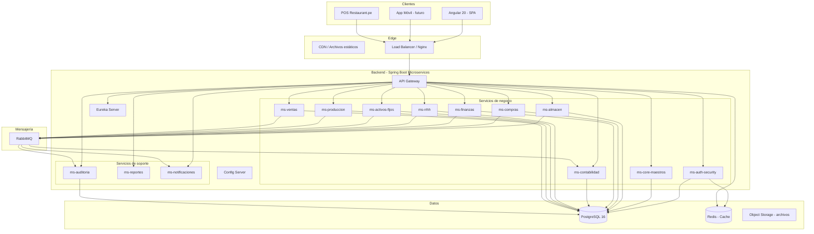

### 1.1 Módulos funcionales

| # | Módulo | Descripción | HUs |
|---|--------|-------------|:---:|
| 1 | **Configuraciones** | Empresa, sucursales, países, monedas, impuestos, parámetros, roles, permisos | 21 |
| 2 | **Almacén** | Inventario, stock, kardex, movimientos, valorización, devoluciones, traslados | 28 |
| 3 | **Compras** | OC, OS, aprobaciones, recepción, planificación de abastecimiento | 17 |
| 4 | **Ventas** | Integración con POS, documentos de venta, notas de crédito/débito | 19 |
| 5 | **Finanzas** | CxP, CxC, tesorería, conciliaciones, adelantos, caja, flujo de caja | 45 |
| 6 | **Contabilidad** | Plan contable, asientos, pre-asientos, cierres, EEFF, libros electrónicos | 37 |
| 7 | **Activos Fijos** | Registro, depreciación, seguros, traslados, bajas, revaluación | 28 |
| 8 | **RRHH** | Trabajadores, contratos, asistencia, planilla, liquidaciones, regulatorios | 42 |
| 9 | **Producción** | Recetas, órdenes de producción, costeo, consumo de almacén | 42 |
| | **Total** | | **279** |

### 1.2 Características transversales

| Característica | Descripción |
|----------------|-------------|
| **Multipaís** | Soporte para diferentes normativas fiscales, tributarias y laborales (Perú, Colombia, Chile, Rep. Dominicana) |
| **Multiempresa** | Múltiples razones sociales en la misma instancia |
| **Multisucursal** | Gestión por local/sucursal con consolidación corporativa |
| **Multimoneda** | Operaciones en diferentes monedas con tipo de cambio diario |
| **Auditoría completa** | Log de auditoría en todas las operaciones (quién, cuándo, qué, desde dónde) |
| **Integración contable nativa** | Todos los módulos operativos generan pre-asientos hacia Contabilidad |
| **Control de acceso granular** | Roles dinámicos, permisos por opción de menú y acción, asignación individual |
| **Exportación universal** | Exportación a Excel/PDF en todos los reportes y listados |
| **Carga masiva** | Importación de datos vía Excel con validaciones |
| **Configuración jerárquica** | 4 niveles: empresa → país → sucursal → usuario |

---

## 2. Principios de arquitectura

| Principio | Aplicación |
|-----------|------------|
| **Separación de responsabilidades** | Un microservicio por dominio funcional. Cada servicio gestiona su propia lógica y datos |
| **Base de datos por servicio** | Esquemas PostgreSQL aislados por microservicio. Sin acceso directo a tablas de otro servicio |
| **API First** | Contratos OpenAPI/Swagger definidos antes de implementar. Versionado de API obligatorio |
| **Event-Driven** | Operaciones que cruzan dominios se comunican por eventos (RabbitMQ). Pre-asientos contables son eventos |
| **Stateless** | Los microservicios no almacenan estado de sesión. JWT viaja en cada request |
| **Fail-fast / Circuit Breaker** | Resilience4j para tolerancia a fallos entre servicios |
| **Configuración externalizada** | Spring Cloud Config centraliza configuración por entorno y por país |
| **Inmutabilidad de datos** | Soft delete en vez de eliminación física. Auditoría de cambios vía eventos |
| **Clean Architecture** | Capas: Controller → Service → Repository. Lógica de negocio en Service, nunca en Controller |
| **DRY / SOLID** | Código limpio, reutilizable, con inyección de dependencias y responsabilidad única |

---

## 3. Stack tecnológico detallado

### 3.1 Backend

| Tecnología | Versión | Uso |
|------------|:-------:|-----|
| **Java** | 21 (LTS) | Lenguaje principal del backend |
| **Spring Boot** | 3.x | Framework base de cada microservicio |
| **Spring Cloud Gateway** | latest | API Gateway: ruteo, rate limiting, CORS, balanceo |
| **Spring Cloud Netflix Eureka** | latest | Service discovery: registro y localización de servicios |
| **Spring Cloud Config** | latest | Configuración centralizada (perfiles dev/qa/prod, por país) |
| **Spring Security** | 6.x | Autenticación y autorización con JWT |
| **Spring Data JPA / Hibernate** | latest | ORM para acceso a datos |
| **Flyway** | latest | Versionado y migración de esquemas de BD |
| **OpenFeign** | latest | Cliente HTTP declarativo para comunicación entre servicios |
| **Resilience4j** | latest | Circuit breaker, retry, rate limiter |
| **RabbitMQ** | 3.13+ | Mensajería asincrónica (eventos, pre-asientos, auditoría, notificaciones) |
| **MapStruct** | latest | Mapeo de DTOs a entidades y viceversa |
| **Lombok** | latest | Reducción de boilerplate (getters, setters, builders) |
| **JasperReports** | latest | Generación de reportes PDF/Excel |
| **SpringDoc OpenAPI** | latest | Documentación automática de APIs (Swagger UI) |
| **JUnit 5 + Mockito** | latest | Testing unitario y de integración |
| **Testcontainers** | latest | Tests de integración con PostgreSQL y RabbitMQ reales |

### 3.2 Frontend

| Tecnología | Versión | Uso |
|------------|:-------:|-----|
| **Angular** | 20 | Framework SPA principal |
| **TypeScript** | 5.x | Lenguaje de desarrollo frontend |
| **Angular Material** | 20 | Componentes UI (tablas, formularios, diálogos, menú) |
| **NgRx** | latest | State management (estado global de la aplicación) |
| **RxJS** | latest | Programación reactiva |
| **Angular Router** | 20 | Ruteo con lazy loading por módulo |
| **HttpInterceptor** | nativo | Inyección automática de JWT y manejo de errores HTTP |
| **Chart.js / ngx-charts** | latest | Gráficos y dashboards |
| **ngx-translate** | latest | Internacionalización (i18n) |
| **Jasmine + Karma** | latest | Testing unitario de componentes |
| **Cypress** | latest | Testing e2e |

### 3.3 Base de datos e infraestructura

| Tecnología | Versión | Uso |
|------------|:-------:|-----|
| **PostgreSQL** | 16 | Base de datos relacional principal |
| **Redis** | 7.x | Caché de sesiones, tokens, tipo de cambio, configuraciones |
| **Docker** | latest | Containerización de todos los servicios |
| **Docker Compose** | latest | Orquestación local de servicios |
| **Nginx** | latest | Reverse proxy / load balancer / serving del SPA |
| **Git** | latest | Control de versiones |
| **GitHub Actions** | latest | CI/CD pipelines |
| **SonarQube** | latest | Análisis estático de código |
| **Prometheus + Grafana** | latest | Monitoreo y observabilidad |
| **ELK Stack** | latest | Centralización de logs (Elasticsearch + Logstash + Kibana) |

---

## 4. Arquitectura de microservicios

### 4.1 Diagrama de servicios y comunicación

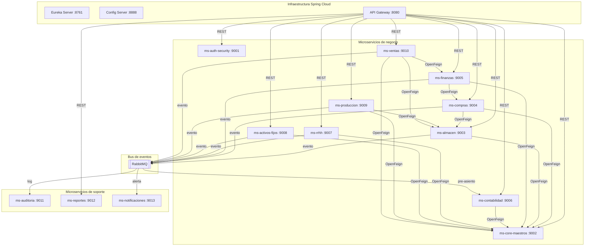

### 4.2 Flujo de una petición típica

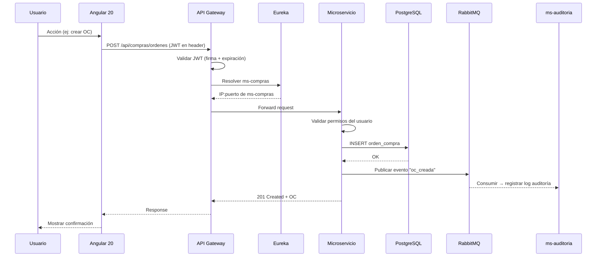

---

## 5. Catálogo de microservicios

### 5.1 Servicios de infraestructura (3)

| # | Servicio | Puerto | Responsabilidad |
|---|----------|:------:|-----------------|
| 1 | **eureka-server** | 8761 | Service discovery. Todos los servicios se registran aquí al iniciar. Permite descubrimiento dinámico sin hardcodear IPs |
| 2 | **config-server** | 8888 | Configuración centralizada. Almacena properties por servicio, por entorno (dev/qa/prod) y por país. Fuente: repositorio Git |
| 3 | **api-gateway** | 8080 | Punto de entrada único. Ruteo dinámico basado en Eureka. Rate limiting, CORS, balanceo de carga, validación de JWT |

### 5.2 Servicios de negocio (10)

| # | Servicio | Puerto | Esquema BD | Responsabilidad |
|---|----------|:------:|:----------:|-----------------|
| 4 | **ms-auth-security** | 9001 | `auth` | Autenticación (login/logout), generación y validación de JWT, gestión de usuarios, roles, opciones de menú, permisos granulares, asignación individual, sesiones |
| 5 | **ms-core-maestros** | 9002 | `core` | Maestros compartidos por todo el ERP: empresa, sucursal, país, moneda, tipo de cambio, relaciones comerciales (proveedor/cliente unificado), artículos, categorías, unidades de medida, impuestos, retenciones, detracciones, numeradores, condiciones de pago, formas de pago, configuración jerárquica (4 niveles) |
| 6 | **ms-almacen** | 9003 | `almacen` | Almacenes, tipos de movimiento, movimientos de inventario (ingreso/salida/traslado), kardex valorizado (promedio ponderado), stock en tiempo real, devoluciones a proveedor, inventario físico, ajustes, solicitudes de reposición, stock mínimo/máximo |
| 7 | **ms-compras** | 9004 | `compras` | Órdenes de compra, órdenes de servicio, workflow de aprobación multinivel (configurable por monto/tipo), recepción de mercadería con vinculación a OC, generación automática de movimiento de almacén, devoluciones, planificación de abastecimiento |
| 8 | **ms-finanzas** | 9005 | `finanzas` | Cuentas por pagar (desde OC y directas), cuentas por cobrar, tesorería, movimientos bancarios, conciliación bancaria, conciliación con pasarelas digitales (Niubiz, Yape, Plin), adelantos/órdenes de giro, fondo fijo, caja chica, flujo de caja, programación de pagos |
| 9 | **ms-contabilidad** | 9006 | `contabilidad` | Plan de cuentas contable jerárquico, centros de costo, asientos manuales y automáticos, motor de pre-asientos (recibe de todos los módulos), matrices contables, cierres mensuales y anuales, Estados Financieros (Balance, Resultados, Flujo de Efectivo, Patrimonio), libros electrónicos (PLE/SIRE) |
| 10 | **ms-rrhh** | 9007 | `rrhh` | Ficha del trabajador, contratos laborales, áreas y cargos, asistencia (POS/App/biométrico/GPS), conceptos de planilla, cálculo de planilla (sueldo, horas extra, CTS, gratificaciones, AFP, EsSalud), liquidaciones, beneficios sociales, propinas, recargo al consumo, archivos regulatorios (PLAME), boletas de pago |
| 11 | **ms-activos-fijos** | 9008 | `activos` | Registro de activos fijos vinculados a compra/factura, clasificación por clase/subclase, ubicación física jerárquica, depreciación mensual automática (lineal/decreciente/unidades), revaluación, seguros y pólizas, traslados con workflow, bajas |
| 12 | **ms-produccion** | 9009 | `produccion` | Recetas (BOM gastronómico) con merma, versiones de receta, órdenes de producción, consumo automático de almacén, costeo por receta (materia prima + mano de obra + indirectos) |
| 13 | **ms-ventas** | 9010 | `ventas` | Integración con POS (Restaurant.pe), documentos de venta (boletas, facturas electrónicas), notas de crédito/débito, cierre de caja, propinas, recargo al consumo, descuentos y promociones, mesas/órdenes/comandas, facturación electrónica (SUNAT/OSE), generación de CxC, pre-asientos contables de ventas |

### 5.3 Servicios de soporte (3)

| # | Servicio | Puerto | Esquema BD | Responsabilidad |
|---|----------|:------:|:----------:|-----------------|
| 14 | **ms-auditoria** | 9011 | `auditoria` | Registro centralizado de auditoría. Consume eventos de todos los servicios. Log: quién, cuándo, qué entidad, qué acción, datos anteriores/nuevos (JSON), IP, user-agent |
| 15 | **ms-reportes** | 9012 | — | Motor de reportes (JasperReports). Exportación PDF/Excel. Consulta datos de otros servicios vía OpenFeign. Reportes compartidos entre módulos |
| 16 | **ms-notificaciones** | 9013 | — | Envío de correos electrónicos, alertas del sistema, recordatorios, notificaciones push. Consume eventos de RabbitMQ |

---

## 6. Arquitectura del backend (por microservicio)

Cada microservicio sigue la misma estructura interna basada en **Clean Architecture** con 4 capas:

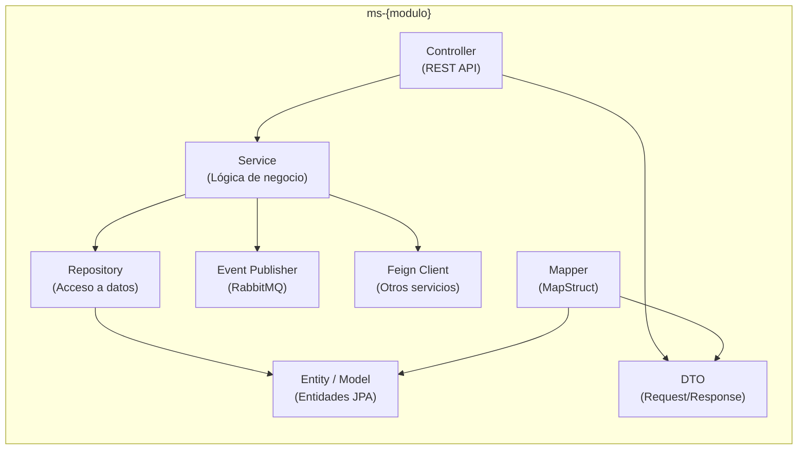

### 6.1 Estructura de paquetes (convención)

```
com.restaurantpe.{modulo}
├── config/                  # Configuración del microservicio
│   ├── SecurityConfig.java
│   ├── RabbitConfig.java
│   ├── SwaggerConfig.java
│   └── FeignConfig.java
├── controller/              # REST Controllers
│   ├── OrdenCompraController.java
│   └── RecepcionController.java
├── dto/                     # Data Transfer Objects
│   ├── request/
│   │   └── OrdenCompraRequest.java
│   └── response/
│       └── OrdenCompraResponse.java
├── entity/                  # Entidades JPA
│   ├── OrdenCompra.java
│   └── OrdenCompraDetalle.java
├── enums/                   # Enumeraciones
│   └── EstadoOrdenCompra.java
├── exception/               # Excepciones personalizadas
│   ├── BusinessException.java
│   └── GlobalExceptionHandler.java
├── feign/                   # Clientes Feign para otros servicios
│   └── CoreMaestrosClient.java
├── mapper/                  # MapStruct mappers
│   └── OrdenCompraMapper.java
├── event/                   # Eventos RabbitMQ
│   ├── publisher/
│   │   └── ComprasEventPublisher.java
│   └── listener/
│       └── ComprasEventListener.java
├── repository/              # Spring Data JPA Repositories
│   └── OrdenCompraRepository.java
├── service/                 # Lógica de negocio
│   ├── OrdenCompraService.java
│   └── impl/
│       └── OrdenCompraServiceImpl.java
├── specification/           # Filtros dinámicos (JPA Specifications)
│   └── OrdenCompraSpecification.java
└── util/                    # Utilidades
    └── NumeradorUtil.java
```

### 6.2 Convenciones de código

| Aspecto | Convención |
|---------|------------|
| **Naming clases** | PascalCase: `OrdenCompraService`, `KardexRepository` |
| **Naming métodos** | camelCase: `crearOrdenCompra()`, `calcularStockDisponible()` |
| **Naming paquetes** | lowercase: `com.restaurantpe.compras.service` |
| **DTOs** | Sufijo `Request` / `Response`: `OrdenCompraRequest`, `OrdenCompraResponse` |
| **Entidades** | Sin sufijo, nombre de tabla: `OrdenCompra`, `MovimientoAlmacen` |
| **Repositories** | Sufijo `Repository`: `OrdenCompraRepository` |
| **Services** | Interfaz + implementación: `OrdenCompraService` / `OrdenCompraServiceImpl` |
| **Controllers** | Sufijo `Controller`: `OrdenCompraController` |
| **Constantes** | UPPER_SNAKE_CASE: `ESTADO_APROBADA`, `MAX_INTENTOS` |
| **Endpoints** | kebab-case plural: `/api/compras/ordenes-compra`, `/api/almacen/movimientos` |

### 6.3 Entidad base (herencia)

Todas las entidades heredan de `BaseEntity` para garantizar auditoría y multiempresa:

```java
@MappedSuperclass
@EntityListeners(AuditingEntityListener.class)
public abstract class BaseEntity {
    
    @Id
    @GeneratedValue(strategy = GenerationType.IDENTITY)
    private Long id;
    
    @Column(name = "empresa_id", nullable = false)
    private Long empresaId;
    
    @Column(name = "activo", nullable = false)
    private Boolean activo = true;
    
    @CreatedBy
    @Column(name = "creado_por", updatable = false)
    private String creadoPor;
    
    @CreatedDate
    @Column(name = "creado_en", updatable = false)
    private LocalDateTime creadoEn;
    
    @LastModifiedBy
    @Column(name = "modificado_por")
    private String modificadoPor;
    
    @LastModifiedDate
    @Column(name = "modificado_en")
    private LocalDateTime modificadoEn;
}
```

---

## 7. Arquitectura del frontend (Angular 20)

### 7.1 Estructura del proyecto

```
restaurant-pe-frontend/
├── src/
│   ├── app/
│   │   ├── core/                        # Singleton: auth, interceptors, guards
│   │   │   ├── auth/
│   │   │   │   ├── auth.service.ts
│   │   │   │   ├── auth.guard.ts
│   │   │   │   └── jwt.interceptor.ts
│   │   │   ├── services/
│   │   │   │   ├── config.service.ts     # Configuración jerárquica
│   │   │   │   ├── empresa.service.ts    # Contexto empresa/sucursal
│   │   │   │   └── menu.service.ts       # Menú dinámico
│   │   │   └── models/
│   │   │       ├── usuario.model.ts
│   │   │       └── api-response.model.ts
│   │   ├── shared/                      # Componentes reutilizables
│   │   │   ├── components/
│   │   │   │   ├── data-table/           # Tabla con paginación, filtros, export
│   │   │   │   ├── form-field/           # Campos de formulario estandarizados
│   │   │   │   ├── search-dialog/        # Diálogos de búsqueda (proveedor, artículo)
│   │   │   │   ├── approval-badge/       # Badge de estado de aprobación
│   │   │   │   ├── file-upload/          # Carga de archivos/imágenes
│   │   │   │   └── confirm-dialog/       # Diálogos de confirmación
│   │   │   ├── directives/
│   │   │   │   ├── has-permission.directive.ts
│   │   │   │   └── currency-format.directive.ts
│   │   │   └── pipes/
│   │   │       ├── currency.pipe.ts
│   │   │       └── date-locale.pipe.ts
│   │   ├── layout/                      # Shell de la aplicación
│   │   │   ├── sidebar/                  # Menú lateral dinámico por módulo
│   │   │   ├── header/                   # Barra superior con empresa/sucursal
│   │   │   ├── footer/
│   │   │   └── breadcrumb/
│   │   ├── modules/                     # Módulos funcionales (lazy loaded)
│   │   │   ├── almacen/
│   │   │   │   ├── maestros/             # Almacenes, tipos movimiento
│   │   │   │   ├── operaciones/          # Movimientos, recepciones, traslados
│   │   │   │   ├── consultas/            # Kardex, stock, devoluciones
│   │   │   │   ├── reportes/             # Reportes del módulo
│   │   │   │   ├── almacen-routing.module.ts
│   │   │   │   └── almacen.module.ts
│   │   │   ├── compras/
│   │   │   ├── finanzas/
│   │   │   ├── contabilidad/
│   │   │   ├── rrhh/
│   │   │   ├── activos-fijos/
│   │   │   ├── produccion/
│   │   │   └── configuraciones/
│   │   ├── store/                       # NgRx State Management
│   │   │   ├── auth/
│   │   │   ├── empresa/
│   │   │   └── menu/
│   │   ├── app.component.ts
│   │   ├── app.routes.ts
│   │   └── app.config.ts
│   ├── assets/
│   │   ├── i18n/                        # Archivos de traducción
│   │   │   ├── es.json
│   │   │   ├── en.json
│   │   │   └── pt.json
│   │   └── images/
│   ├── environments/
│   │   ├── environment.ts
│   │   ├── environment.qa.ts
│   │   └── environment.prod.ts
│   └── styles/
│       ├── _variables.scss
│       ├── _theme.scss
│       └── styles.scss
├── angular.json
├── package.json
└── tsconfig.json
```

### 7.2 Flujo de carga del menú dinámico

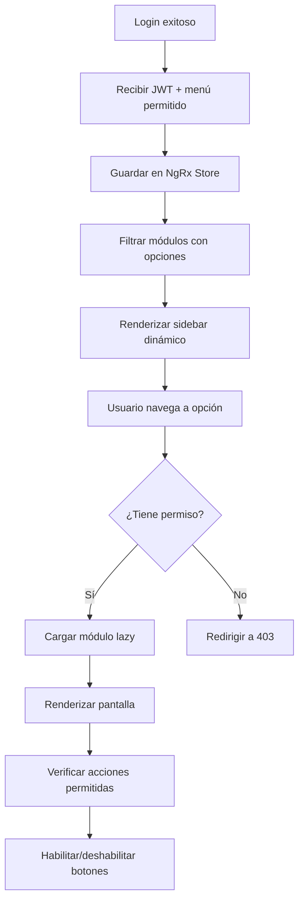

### 7.3 Interceptor JWT

Todas las peticiones HTTP pasan por un interceptor que:

1. Agrega el token JWT al header `Authorization: Bearer {token}`.
2. Si recibe **401**, intenta renovar el token (refresh token).
3. Si falla la renovación, redirige al login.
4. Agrega `X-Empresa-Id` y `X-Sucursal-Id` como headers de contexto.

### 7.4 Guard de permisos

Cada ruta del frontend está protegida por un `AuthGuard` que verifica:

1. Que el usuario esté autenticado (JWT válido).
2. Que la opción de menú correspondiente a la ruta esté en su rol o asignada individualmente.
3. Que tenga la acción requerida (ver, crear, editar, etc.).

---

## 8. Base de datos — PostgreSQL

### 8.1 Estrategia de esquemas

Se usa **una sola instancia de PostgreSQL** con **esquemas separados por microservicio**:

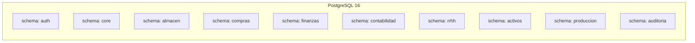

| Ventaja | Descripción |
|---------|-------------|
| Aislamiento lógico | Cada servicio solo accede a su esquema |
| Backup unificado | Un solo punto de backup y administración |
| Consultas cruzadas | Posibles cuando sea estrictamente necesario (DBA) |
| Migraciones independientes | Cada servicio versiona su esquema con Flyway |

### 8.2 Convenciones de la base de datos

| Aspecto | Convención |
|---------|------------|
| **Tablas y columnas** | `snake_case`: `orden_compra`, `fecha_emision` |
| **Claves primarias** | `id BIGSERIAL PRIMARY KEY` (autoincremental) |
| **Claves foráneas** | `{tabla}_id`: `proveedor_id`, `almacen_id` |
| **Multiempresa** | `empresa_id NOT NULL` en todas las tablas de negocio |
| **Multisucursal** | `sucursal_id` donde aplique (tablas operativas) |
| **Auditoría por registro** | `creado_por`, `creado_en`, `modificado_por`, `modificado_en` |
| **Soft delete** | `activo BOOLEAN DEFAULT true` (nunca DELETE físico) |
| **Índices** | Obligatorios en: `empresa_id`, FKs, campos de búsqueda frecuente |
| **Timestamps** | `TIMESTAMP WITH TIME ZONE` para todos los campos de fecha-hora |
| **Migraciones** | Flyway: `V{version}__{descripcion}.sql` |
| **Enums** | Almacenados como `VARCHAR`, no como tipo ENUM de PostgreSQL (portabilidad) |

### 8.3 Estrategia de índices

```sql
-- Índice compuesto para multiempresa (TODAS las tablas)
CREATE INDEX idx_{tabla}_empresa ON {tabla} (empresa_id);

-- Índice para búsquedas frecuentes
CREATE INDEX idx_articulo_codigo ON articulo (empresa_id, codigo);
CREATE INDEX idx_articulo_categoria ON articulo (empresa_id, categoria_id);
CREATE INDEX idx_relacion_comercial_doc ON relacion_comercial (empresa_id, numero_documento);

-- Índice para reportes por período
CREATE INDEX idx_movimiento_fecha ON movimiento_almacen (empresa_id, fecha);
CREATE INDEX idx_asiento_periodo ON asiento (empresa_id, periodo_anio, periodo_mes);
```

### 8.4 Migraciones Flyway

Cada microservicio tiene su carpeta de migraciones:

```
ms-compras/
└── src/main/resources/
    └── db/migration/
        ├── V1__create_schema_compras.sql
        ├── V2__create_table_orden_compra.sql
        ├── V3__create_table_orden_servicio.sql
        ├── V4__create_table_aprobacion.sql
        ├── V5__create_table_recepcion.sql
        └── V6__add_index_orden_compra.sql
```

---

## 9. Seguridad y control de acceso

### 9.1 Modelo de seguridad

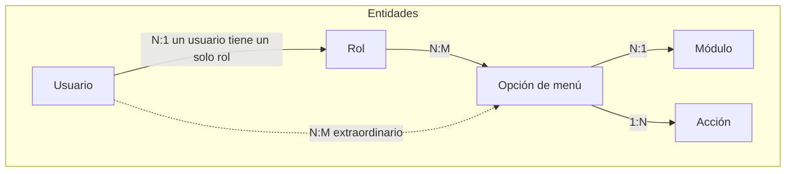

**Cardinalidades:**

- Un usuario tiene **un solo** rol (FK directo `rol_id` en tabla `usuario`).
- Un rol tiene **muchas** opciones de menú; una opción puede estar en **muchos** roles (N:M vía `rol_opcion_menu`).
- Una opción de menú pertenece a **un solo** módulo.
- Un usuario puede tener opciones de menú asignadas de forma **individual/extraordinaria** (N:M vía `usuario_opcion_menu`).

### 9.2 Flujo de autenticación

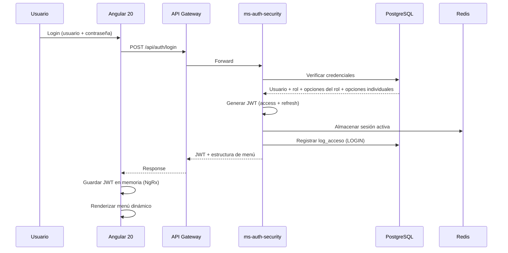

### 9.3 Estructura del JWT

```json
{
  "sub": "jramirez",
  "userId": 42,
  "empresaId": 1,
  "sucursalId": 3,
  "rolId": 7,
  "rolCodigo": "JEFE_ALMACEN",
  "permisos": ["ALM_MOV_VER", "ALM_MOV_CREAR", "COM_OC_VER"],
  "iat": 1738886400,
  "exp": 1738972800
}
```

| Campo | Descripción |
|-------|-------------|
| `sub` | Username del usuario |
| `userId` | ID del usuario |
| `empresaId` | Empresa seleccionada en el login |
| `sucursalId` | Sucursal seleccionada |
| `rolId` | ID del rol asignado |
| `rolCodigo` | Código del rol (para validaciones rápidas) |
| `permisos` | Array de códigos de permiso (opción_menú + acción) |
| `exp` | Expiración (configurable, default: 24 horas) |

### 9.4 Validación de permisos en el backend

Cada endpoint del backend valida permisos usando una anotación personalizada:

```java
@RestController
@RequestMapping("/api/compras/ordenes-compra")
public class OrdenCompraController {

    @PostMapping
    @RequirePermission(modulo = "COM", opcion = "OC", accion = "CREAR")
    public ResponseEntity<OrdenCompraResponse> crear(
            @RequestBody @Valid OrdenCompraRequest request) {
        // ...
    }

    @GetMapping
    @RequirePermission(modulo = "COM", opcion = "OC", accion = "VER")
    public ResponseEntity<Page<OrdenCompraResponse>> listar(
            @RequestParam Map<String, String> filtros, Pageable pageable) {
        // ...
    }
}
```

### 9.5 Tablas de seguridad (esquema `auth`)

| Tabla | Descripción |
|-------|-------------|
| `usuario` | id, username, password_hash, email, nombre, **rol_id** (FK), empresa_default_id, activo |
| `rol` | id, codigo, nombre, descripcion, empresa_id, activo |
| `modulo` | id, codigo, nombre, icono, orden |
| `opcion_menu` | id, modulo_id, padre_id, codigo, nombre, ruta_frontend, icono, orden, activo |
| `accion` | id, codigo, nombre (VER, CREAR, EDITAR, ELIMINAR, APROBAR, IMPRIMIR, EXPORTAR) |
| `permiso` | id, opcion_menu_id, accion_id |
| `rol_opcion_menu` | rol_id, opcion_menu_id (N:M) |
| `rol_permiso` | rol_id, permiso_id |
| `usuario_opcion_menu` | usuario_id, opcion_menu_id (individual/extraordinario) |
| `usuario_permiso` | usuario_id, permiso_id |
| `usuario_sucursal` | usuario_id, sucursal_id (sucursales asignadas al usuario) |
| `sesion` | id, usuario_id, token, ip, fecha_inicio, fecha_fin, activa |

---

## 10. Configuración jerárquica (4 niveles)

El sistema maneja configuraciones con **herencia y sobreescritura**. El valor más específico siempre prevalece.

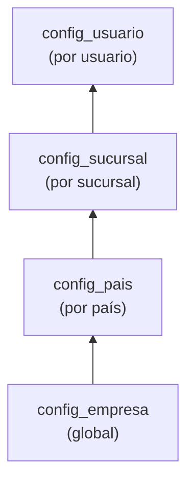

**Resolución:** `config_usuario` → `config_sucursal` → `config_pais` → `config_empresa` → `config_clave.valor_default`

| Nivel | Tabla | Ejemplo |
|-------|-------|---------|
| **Empresa (global)** | `config_empresa` | Moneda base, logo, política de aprobaciones |
| **País** | `config_pais` | IGV vs IVA vs ITBIS, formato RUC/NIT, regulaciones laborales |
| **Sucursal** | `config_sucursal` | Almacén por defecto, impresora, turno, caja |
| **Usuario** | `config_usuario` | Idioma, tema visual, formato fecha, sucursal preferida |

### Implementación en backend

```java
@Service
public class ConfigService {
    
    public String getConfig(String clave, Long empresaId, 
                           Long paisId, Long sucursalId, Long usuarioId) {
        // 1. Buscar en config_usuario
        Optional<String> valor = configUsuarioRepo.findByClave(usuarioId, clave);
        if (valor.isPresent()) return valor.get();
        
        // 2. Buscar en config_sucursal
        valor = configSucursalRepo.findByClave(sucursalId, clave);
        if (valor.isPresent()) return valor.get();
        
        // 3. Buscar en config_pais
        valor = configPaisRepo.findByClave(empresaId, paisId, clave);
        if (valor.isPresent()) return valor.get();
        
        // 4. Buscar en config_empresa
        valor = configEmpresaRepo.findByClave(empresaId, clave);
        if (valor.isPresent()) return valor.get();
        
        // 5. Valor por defecto del catálogo
        return configClaveRepo.findDefaultByClave(clave);
    }
}
```

---

## 11. Comunicación entre microservicios

### 11.1 Comunicación sincrónica (REST + OpenFeign)

Para consultas directas entre servicios que requieren respuesta inmediata.

```java
// En ms-compras: cliente Feign para consultar maestros
@FeignClient(name = "ms-core-maestros")
public interface CoreMaestrosClient {
    
    @GetMapping("/api/core/relaciones-comerciales/{id}")
    RelacionComercialResponse obtenerProveedor(@PathVariable Long id);
    
    @GetMapping("/api/core/articulos/{id}")
    ArticuloResponse obtenerArticulo(@PathVariable Long id);
    
    @PostMapping("/api/core/numeradores/siguiente")
    String obtenerSiguienteNumero(@RequestBody NumeradorRequest request);
}
```

| Origen | Destino | Uso |
|--------|---------|-----|
| ms-compras | ms-core-maestros | Validar proveedor, artículo, obtener numeración |
| ms-compras | ms-almacen | Verificar stock, crear movimiento por recepción |
| ms-almacen | ms-core-maestros | Obtener datos de artículo, unidades de medida |
| ms-finanzas | ms-core-maestros | Validar relación comercial, moneda, tipo de cambio |
| ms-finanzas | ms-compras | Vincular factura con OC |
| ms-rrhh | ms-core-maestros | Obtener datos de empresa, sucursal, moneda |
| ms-activos-fijos | ms-core-maestros | Obtener datos de proveedor, artículo |
| ms-produccion | ms-almacen | Consumir stock de insumos |
| ms-produccion | ms-core-maestros | Obtener artículos, recetas |
| ms-reportes | todos | Consultar datos para generar reportes |

### 11.2 Comunicación asincrónica (RabbitMQ)

Para operaciones que no requieren respuesta inmediata y cruzan dominios.

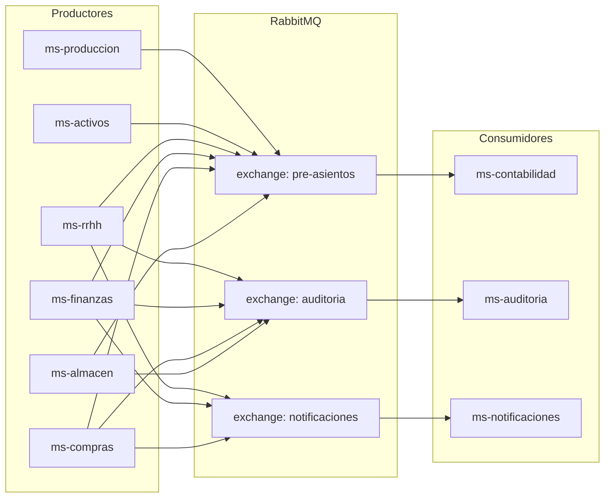

#### Exchanges y colas

| Exchange | Tipo | Cola | Consumidor | Evento |
|----------|------|------|------------|--------|
| `pre-asientos` | topic | `q.contabilidad.pre-asientos` | ms-contabilidad | Todos los módulos envían pre-asientos |
| `auditoria` | fanout | `q.auditoria.logs` | ms-auditoria | CRUD de cualquier entidad |
| `notificaciones` | topic | `q.notificaciones.email` | ms-notificaciones | Aprobaciones pendientes, alertas de stock, vencimientos |
| `notificaciones` | topic | `q.notificaciones.push` | ms-notificaciones | Alertas en tiempo real |

#### Estructura de un evento

```json
{
  "eventId": "uuid-v4",
  "eventType": "MOVIMIENTO_ALMACEN_CONFIRMADO",
  "timestamp": "2026-03-15T10:30:00Z",
  "empresaId": 1,
  "sucursalId": 3,
  "usuarioId": 42,
  "moduloOrigen": "ALMACEN",
  "payload": {
    "movimientoId": 1234,
    "tipoMovimiento": "INGRESO",
    "almacenId": 5,
    "totalValorizado": 15000.00,
    "monedaId": 1,
    "detalles": [
      { "articuloId": 100, "cantidad": 50, "costoUnitario": 300.00 }
    ]
  }
}
```

---

## 12. Motor de pre-asientos contables

Todos los módulos operativos generan **pre-asientos** que Contabilidad procesa para convertir en asientos contables.

### 12.1 Flujo

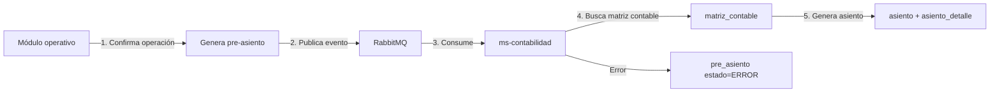

### 12.2 Matriz contable (reglas de contabilización)

| Módulo | Operación | Cuenta Debe | Cuenta Haber |
|--------|-----------|-------------|--------------|
| Almacén | Ingreso por compra | 20 - Mercaderías | 61 - Variación existencias |
| Almacén | Salida por consumo | 61 - Variación existencias | 20 - Mercaderías |
| Compras | Factura proveedor | 60 - Compras | 42 - CxP comerciales |
| Finanzas | Pago a proveedor | 42 - CxP comerciales | 10 - Efectivo |
| Finanzas | Cobro a cliente | 10 - Efectivo | 12 - CxC comerciales |
| RRHH | Planilla mensual | 62 - Gastos personal | 41 - Remuneraciones por pagar |
| Activos | Depreciación mensual | 68 - Depreciación | 39 - Depreciación acumulada |
| Producción | Consumo de insumos | 92 - Costo producción | 20 - Mercaderías |

### 12.3 Tabla pre_asiento

```sql
CREATE TABLE contabilidad.pre_asiento (
    id              BIGSERIAL PRIMARY KEY,
    empresa_id      BIGINT NOT NULL,
    modulo_origen   VARCHAR(20) NOT NULL,    -- ALMACEN, COMPRAS, FINANZAS...
    tipo_operacion  VARCHAR(50) NOT NULL,    -- INGRESO_ALMACEN, FACTURA_PROVEEDOR...
    documento_tipo  VARCHAR(20),             -- OC, FACTURA, PLANILLA...
    documento_id    BIGINT,
    fecha           DATE NOT NULL,
    estado          VARCHAR(20) DEFAULT 'PENDIENTE', -- PENDIENTE/PROCESADO/ERROR
    datos_json      JSONB NOT NULL,          -- Payload completo del evento
    asiento_id      BIGINT,                  -- FK al asiento generado (si procesado)
    error_mensaje   TEXT,                    -- Detalle del error si falla
    creado_en       TIMESTAMP DEFAULT NOW()
);
```

---

## 13. Auditoría y trazabilidad

### 13.1 Dos niveles de auditoría

| Nivel | Mecanismo | Datos |
|-------|-----------|-------|
| **Por registro** | Columnas en cada tabla | `creado_por`, `creado_en`, `modificado_por`, `modificado_en` |
| **Por operación** | Servicio centralizado (ms-auditoria) | Quién, cuándo, qué entidad, qué acción, datos antes/después, IP, user-agent |

### 13.2 Flujo de auditoría

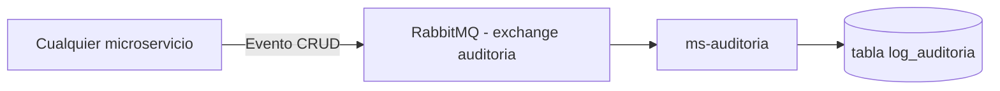

### 13.3 Estructura del log

```json
{
  "empresaId": 1,
  "usuarioId": 42,
  "username": "jramirez",
  "modulo": "COMPRAS",
  "entidad": "orden_compra",
  "entidadId": 1234,
  "accion": "CREAR",
  "datosAnteriores": null,
  "datosNuevos": { "numero": "OC-2026-001", "total": 15000.00, "estado": "BORRADOR" },
  "ip": "192.168.1.100",
  "userAgent": "Mozilla/5.0...",
  "fecha": "2026-03-15T10:30:00Z"
}
```

---

## 14. Reportes y exportación

### 14.1 Arquitectura del motor de reportes

| Componente | Tecnología | Uso |
|------------|------------|-----|
| **Motor** | JasperReports | Generación de reportes PDF |
| **Excel** | Apache POI | Exportación a Excel (.xlsx) |
| **Plantillas** | .jrxml | Diseño de reportes (se almacenan en ms-reportes) |
| **Datos** | OpenFeign | ms-reportes consulta datos de otros microservicios |

### 14.2 Reportes por módulo

| Módulo | Reportes |
|--------|----------|
| **Almacén** | Stock actual, kardex, movimientos por período, valorización, inventario físico, artículos bajo stock mínimo |
| **Compras** | OC pendientes, compras por proveedor, compras por período, recepciones |
| **Finanzas** | Estado de cuenta proveedor/cliente, flujo de caja, antigüedad de saldos, conciliación bancaria |
| **Contabilidad** | Balance General, Estado de Resultados, Flujo de Efectivo, Estado de Patrimonio, libros electrónicos |
| **RRHH** | Planilla, asistencia, headcount, rotación, boletas de pago, PLAME |
| **Activos** | Depreciación acumulada, activos por ubicación, seguros vigentes |
| **Producción** | Costos por receta, consumos, rendimiento |

---

## 15. Notificaciones

### 15.1 Tipos de notificación

| Tipo | Canal | Ejemplo |
|------|-------|---------|
| **Email** | SMTP / SendGrid | Notificación de OC pendiente de aprobación |
| **Push** | WebSocket (STOMP) | Alerta de stock bajo mínimo en tiempo real |
| **In-app** | Base de datos + polling | Recordatorios de tareas pendientes |
| **Archivos** | Generación automática | Boletas de pago (PDF), PLAME (TXT) |

### 15.2 Eventos que disparan notificaciones

| Evento | Notificación | Destinatario |
|--------|-------------|--------------|
| OC creada pendiente aprobación | Email + push | Aprobador(es) del nivel |
| OC aprobada/rechazada | Email | Creador de la OC |
| Stock bajo punto de reorden | Push in-app | Responsable de almacén |
| Vencimiento de contrato laboral | Email | Jefe RRHH + trabajador |
| Póliza de seguro próxima a vencer | Email | Responsable de activos |
| Planilla calculada lista para aprobación | Email + push | Gerente RRHH |
| Cierre contable completado | Email | Contador principal |

---

## 16. Infraestructura y DevOps

### 16.1 Contenedores Docker

Cada microservicio tiene su propio `Dockerfile`:

```dockerfile
FROM eclipse-temurin:21-jre-alpine
WORKDIR /app
COPY target/ms-compras-*.jar app.jar
EXPOSE 9004
ENTRYPOINT ["java", "-jar", "app.jar"]
```

### 16.2 Docker Compose (desarrollo local)

```yaml
services:
  # Infraestructura
  postgres:
    image: postgres:16-alpine
    ports: ["5432:5432"]
    volumes: [pgdata:/var/lib/postgresql/data]
    
  rabbitmq:
    image: rabbitmq:3-management-alpine
    ports: ["5672:5672", "15672:15672"]
    
  redis:
    image: redis:7-alpine
    ports: ["6379:6379"]

  # Spring Cloud
  eureka-server:
    build: ./eureka-server
    ports: ["8761:8761"]
    
  config-server:
    build: ./config-server
    ports: ["8888:8888"]
    depends_on: [eureka-server]
    
  api-gateway:
    build: ./api-gateway
    ports: ["8080:8080"]
    depends_on: [eureka-server, config-server]

  # Microservicios de negocio
  ms-auth-security:
    build: ./ms-auth-security
    ports: ["9001:9001"]
    depends_on: [postgres, eureka-server, config-server, redis]
    
  ms-core-maestros:
    build: ./ms-core-maestros
    ports: ["9002:9002"]
    depends_on: [postgres, eureka-server, config-server]

  # ... (demás microservicios)
```

### 16.3 CI/CD Pipeline (GitHub Actions)

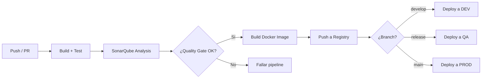

### 16.4 Monitoreo

| Herramienta | Uso |
|-------------|-----|
| **Spring Boot Actuator** | Health checks, métricas por servicio |
| **Prometheus** | Recolección de métricas |
| **Grafana** | Dashboards de monitoreo (CPU, memoria, latencia, errores) |
| **ELK Stack** | Centralización de logs (Elasticsearch + Logstash + Kibana) |
| **Spring Sleuth + Zipkin** | Tracing distribuido entre microservicios |

---

## 17. Entornos

| Entorno | Propósito | Infraestructura | Base de datos |
|---------|-----------|-----------------|---------------|
| **DEV** | Desarrollo y pruebas de integración | Docker Compose local | PostgreSQL local (datos de prueba) |
| **QA** | Pruebas funcionales, UAT, regresión | Docker en servidor de staging | PostgreSQL con datos de prueba realistas |
| **PROD** | Producción | Docker / Kubernetes en cloud | PostgreSQL dedicado con backup automático |

Cada entorno tiene su perfil de Spring Cloud Config:

```
application-dev.yml     # Configuración desarrollo
application-qa.yml      # Configuración QA
application-prod.yml    # Configuración producción
application-PE.yml      # Configuración Perú
application-CO.yml      # Configuración Colombia
```

---

## 18. Estándares de API REST

### 18.1 Estructura de URLs

```
/api/{modulo}/{recurso}                    # Colección
/api/{modulo}/{recurso}/{id}               # Recurso específico
/api/{modulo}/{recurso}/{id}/{sub-recurso} # Sub-recurso

Ejemplos:
GET    /api/compras/ordenes-compra              # Listar OC
POST   /api/compras/ordenes-compra              # Crear OC
GET    /api/compras/ordenes-compra/123           # Obtener OC 123
PUT    /api/compras/ordenes-compra/123           # Actualizar OC 123
DELETE /api/compras/ordenes-compra/123           # Desactivar OC 123 (soft delete)
GET    /api/compras/ordenes-compra/123/detalle   # Detalle de OC 123
POST   /api/compras/ordenes-compra/123/aprobar   # Acción: aprobar OC 123
```

### 18.2 Paginación

```json
GET /api/almacen/movimientos?page=0&size=20&sort=fecha,desc

{
  "content": [...],
  "page": {
    "number": 0,
    "size": 20,
    "totalElements": 156,
    "totalPages": 8
  }
}
```

### 18.3 Filtrado

```
GET /api/compras/ordenes-compra?proveedorId=15&estado=APROBADA&fechaDesde=2026-03-01&fechaHasta=2026-03-31
```

### 18.4 Response estándar

```json
{
  "success": true,
  "data": { ... },
  "message": "Orden de compra creada exitosamente",
  "timestamp": "2026-03-15T10:30:00Z"
}
```

### 18.5 Versionado de API

```
/api/v1/compras/ordenes-compra    # Versión 1 (default)
/api/v2/compras/ordenes-compra    # Versión 2 (cuando sea necesario)
```

---

## 19. Manejo de errores

### 19.1 Códigos HTTP

| Código | Uso |
|:------:|-----|
| `200` | OK — consulta exitosa |
| `201` | Created — recurso creado |
| `204` | No Content — eliminación exitosa |
| `400` | Bad Request — validación fallida |
| `401` | Unauthorized — sin autenticación |
| `403` | Forbidden — sin permisos |
| `404` | Not Found — recurso no encontrado |
| `409` | Conflict — conflicto de negocio (ej: stock insuficiente) |
| `422` | Unprocessable Entity — error de regla de negocio |
| `500` | Internal Server Error — error no controlado |
| `503` | Service Unavailable — servicio caído (circuit breaker abierto) |

### 19.2 Estructura de error

```json
{
  "success": false,
  "error": {
    "code": "COM-001",
    "message": "No se puede aprobar una OC con monto cero",
    "details": [
      { "field": "total", "message": "El total debe ser mayor a 0" }
    ],
    "timestamp": "2026-03-15T10:30:00Z",
    "path": "/api/compras/ordenes-compra/123/aprobar"
  }
}
```

### 19.3 Códigos de error por módulo

| Prefijo | Módulo |
|---------|--------|
| `AUTH-xxx` | Autenticación y seguridad |
| `CORE-xxx` | Maestros compartidos |
| `ALM-xxx` | Almacén |
| `COM-xxx` | Compras |
| `FIN-xxx` | Finanzas |
| `CNT-xxx` | Contabilidad |
| `RRHH-xxx` | Recursos Humanos |
| `AF-xxx` | Activos Fijos |
| `PROD-xxx` | Producción |

### 19.4 Exception Handler global

```java
@RestControllerAdvice
public class GlobalExceptionHandler {

    @ExceptionHandler(BusinessException.class)
    public ResponseEntity<ApiError> handleBusinessException(BusinessException ex) {
        return ResponseEntity.status(HttpStatus.UNPROCESSABLE_ENTITY)
            .body(ApiError.of(ex.getCode(), ex.getMessage()));
    }

    @ExceptionHandler(ResourceNotFoundException.class)
    public ResponseEntity<ApiError> handleNotFound(ResourceNotFoundException ex) {
        return ResponseEntity.status(HttpStatus.NOT_FOUND)
            .body(ApiError.of("NOT_FOUND", ex.getMessage()));
    }

    @ExceptionHandler(AccessDeniedException.class)
    public ResponseEntity<ApiError> handleAccessDenied(AccessDeniedException ex) {
        return ResponseEntity.status(HttpStatus.FORBIDDEN)
            .body(ApiError.of("AUTH-003", "No tiene permisos para esta operación"));
    }

    @ExceptionHandler(MethodArgumentNotValidException.class)
    public ResponseEntity<ApiError> handleValidation(MethodArgumentNotValidException ex) {
        List<FieldError> errors = ex.getBindingResult().getFieldErrors().stream()
            .map(f -> new FieldError(f.getField(), f.getDefaultMessage()))
            .toList();
        return ResponseEntity.badRequest()
            .body(ApiError.of("VALIDATION", "Error de validación", errors));
    }
}
```

---

## 20. Modelo de datos completo

### 20.1 Diagrama ER resumen

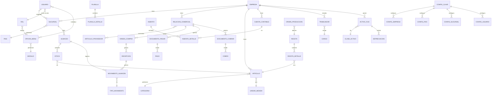

### 20.2 Conteo de tablas por esquema

| Esquema | Tablas | Descripción |
|---------|:------:|-------------|
| `auth` | 11 | Usuarios, roles, permisos, menú, sesiones |
| `core` | 25+ | Empresa, sucursal, país, moneda, artículos, categorías, impuestos, configuración |
| `almacen` | 7 | Movimientos, kardex, stock, inventario físico |
| `compras` | 7 | OC, OS, aprobaciones, recepción |
| `finanzas` | 12 | CxP, CxC, tesorería, conciliación, adelantos |
| `contabilidad` | 7 | Asientos, pre-asientos, matrices, cierres |
| `rrhh` | 11 | Trabajadores, planilla, asistencia, liquidaciones |
| `activos` | 7 | Activos, depreciación, seguros, traslados |
| `produccion` | 5 | Recetas, órdenes, costeo |
| `auditoria` | 2 | Log de auditoría, log de acceso |
| **Total** | **94+** | |

> **Nota:** El detalle completo de cada tabla (campos, tipos, descripciones) se encuentra en el documento `ROADMAP_RESTAURANT_PE.md`, secciones 11.1 a 11.9.

---

## 21. Patrones de diseño aplicados

| Patrón | Dónde se aplica | Justificación |
|--------|----------------|---------------|
| **API Gateway** | Spring Cloud Gateway | Punto de entrada único, desacopla frontend de microservicios |
| **Service Discovery** | Eureka Server | Los servicios se descubren dinámicamente sin hardcodear IPs |
| **Circuit Breaker** | Resilience4j | Tolerancia a fallos cuando un servicio no responde |
| **Event-Driven** | RabbitMQ | Pre-asientos contables, auditoría, notificaciones |
| **CQRS (parcial)** | Separación lectura/escritura en reportes | ms-reportes solo lee, no escribe |
| **Repository Pattern** | Spring Data JPA | Abstracción de acceso a datos |
| **DTO Pattern** | Request/Response DTOs | Nunca se exponen entidades JPA directamente |
| **Strategy Pattern** | Métodos de costeo (promedio, PEPS, UEPS) | Algoritmo intercambiable por configuración |
| **Observer Pattern** | Eventos RabbitMQ | Publicar/suscribir entre módulos desacoplados |
| **Template Method** | BaseEntity | Auditoría y multiempresa heredada por todas las entidades |
| **Builder Pattern** | Lombok @Builder | Construcción fluida de objetos complejos |
| **Specification Pattern** | JPA Specifications | Filtros dinámicos en consultas (reportes, listados) |
| **Decorator** | JWT Interceptor (Angular) | Agrega headers de autenticación a todas las peticiones |
| **Lazy Loading** | Angular Modules | Carga de módulos bajo demanda para performance |

---

## 22. Requisitos no funcionales

| Requisito | Especificación |
|-----------|---------------|
| **Disponibilidad** | 99.5% uptime en horario operativo (6am–12am) |
| **Tiempo de respuesta** | < 2 segundos para operaciones CRUD, < 5 segundos para reportes |
| **Concurrencia** | Soporte para 200+ usuarios simultáneos |
| **Escalabilidad** | Horizontal: cada microservicio puede escalar independientemente |
| **Seguridad** | JWT con expiración, HTTPS obligatorio, passwords hasheados (BCrypt), rate limiting |
| **Backup** | PostgreSQL: backup diario automático, retención 30 días |
| **Recuperación** | RPO: 1 hora, RTO: 4 horas |
| **Idiomas** | Español (default), inglés, portugués (i18n en frontend) |
| **Navegadores** | Chrome 90+, Firefox 90+, Edge 90+, Safari 15+ |
| **Resolución** | Responsive: 1024px mínimo, optimizado para 1366px y 1920px |
| **Accesibilidad** | WCAG 2.1 nivel AA |
| **Datos** | Retención mínima: 5 años de datos transaccionales |
| **Logs** | Retención: 90 días en Elasticsearch, 1 año en almacenamiento frío |

---

## 23. Endpoints por microservicio

A continuación se detallan **todos los endpoints REST** de cada microservicio. Convención: `{id}` = path variable, query params para filtros y paginación.

> **Headers obligatorios en todas las peticiones (excepto login):**  
> `Authorization: Bearer {jwt_token}`  
> `X-Empresa-Id: {empresaId}`  
> `X-Sucursal-Id: {sucursalId}`

---

### 23.1 ms-auth-security (:9001)

#### Autenticación

| Método | Endpoint | Descripción |
|:------:|----------|-------------|
| POST | `/api/auth/login` | Iniciar sesión (devuelve JWT + menú) |
| POST | `/api/auth/refresh` | Renovar token con refresh token |
| POST | `/api/auth/logout` | Cerrar sesión (invalidar token) |
| GET | `/api/auth/me` | Obtener datos del usuario autenticado |
| PUT | `/api/auth/cambiar-password` | Cambiar contraseña del usuario autenticado |

#### Usuarios

| Método | Endpoint | Descripción |
|:------:|----------|-------------|
| GET | `/api/auth/usuarios` | Listar usuarios (paginado, filtros) |
| GET | `/api/auth/usuarios/{id}` | Obtener usuario por ID |
| POST | `/api/auth/usuarios` | Crear usuario |
| PUT | `/api/auth/usuarios/{id}` | Actualizar usuario |
| DELETE | `/api/auth/usuarios/{id}` | Desactivar usuario (soft delete) |
| PUT | `/api/auth/usuarios/{id}/reset-password` | Resetear contraseña |
| GET | `/api/auth/usuarios/{id}/sucursales` | Sucursales asignadas al usuario |
| PUT | `/api/auth/usuarios/{id}/sucursales` | Asignar sucursales al usuario |
| GET | `/api/auth/usuarios/{id}/opciones-menu` | Opciones de menú individuales del usuario |
| PUT | `/api/auth/usuarios/{id}/opciones-menu` | Asignar opciones de menú individuales |

#### Roles

| Método | Endpoint | Descripción |
|:------:|----------|-------------|
| GET | `/api/auth/roles` | Listar roles |
| GET | `/api/auth/roles/{id}` | Obtener rol por ID |
| POST | `/api/auth/roles` | Crear rol |
| PUT | `/api/auth/roles/{id}` | Actualizar rol |
| DELETE | `/api/auth/roles/{id}` | Desactivar rol |
| GET | `/api/auth/roles/{id}/opciones-menu` | Opciones de menú del rol |
| PUT | `/api/auth/roles/{id}/opciones-menu` | Asignar opciones de menú al rol |
| GET | `/api/auth/roles/{id}/permisos` | Permisos granulares del rol |
| PUT | `/api/auth/roles/{id}/permisos` | Asignar permisos al rol |

#### Módulos y menú

| Método | Endpoint | Descripción |
|:------:|----------|-------------|
| GET | `/api/auth/modulos` | Listar módulos del ERP |
| GET | `/api/auth/opciones-menu` | Listar todas las opciones de menú |
| GET | `/api/auth/opciones-menu/arbol` | Árbol jerárquico de opciones por módulo |
| GET | `/api/auth/acciones` | Listar acciones posibles (VER, CREAR, EDITAR...) |

#### Sesiones

| Método | Endpoint | Descripción |
|:------:|----------|-------------|
| GET | `/api/auth/sesiones` | Listar sesiones activas |
| DELETE | `/api/auth/sesiones/{id}` | Cerrar sesión específica |

---

### 23.2 ms-core-maestros (:9002)

#### Empresa y estructura organizacional

| Método | Endpoint | Descripción |
|:------:|----------|-------------|
| GET | `/api/core/empresas` | Listar empresas |
| GET | `/api/core/empresas/{id}` | Obtener empresa |
| POST | `/api/core/empresas` | Crear empresa |
| PUT | `/api/core/empresas/{id}` | Actualizar empresa |
| GET | `/api/core/sucursales` | Listar sucursales (filtro por empresa) |
| GET | `/api/core/sucursales/{id}` | Obtener sucursal |
| POST | `/api/core/sucursales` | Crear sucursal |
| PUT | `/api/core/sucursales/{id}` | Actualizar sucursal |

#### Geografía

| Método | Endpoint | Descripción |
|:------:|----------|-------------|
| GET | `/api/core/paises` | Listar países |
| GET | `/api/core/paises/{id}/departamentos` | Departamentos de un país |
| GET | `/api/core/departamentos/{id}/provincias` | Provincias de un departamento |
| GET | `/api/core/provincias/{id}/distritos` | Distritos de una provincia |

#### Monedas y tipo de cambio

| Método | Endpoint | Descripción |
|:------:|----------|-------------|
| GET | `/api/core/monedas` | Listar monedas |
| POST | `/api/core/monedas` | Crear moneda |
| PUT | `/api/core/monedas/{id}` | Actualizar moneda |
| GET | `/api/core/tipos-cambio` | Listar tipos de cambio (filtro por fecha, moneda) |
| GET | `/api/core/tipos-cambio/fecha/{fecha}` | Tipo de cambio de una fecha |
| POST | `/api/core/tipos-cambio` | Registrar tipo de cambio |

#### Relaciones comerciales (proveedor/cliente unificado)

| Método | Endpoint | Descripción |
|:------:|----------|-------------|
| GET | `/api/core/relaciones-comerciales` | Listar (filtro: esProveedor, esCliente, documento) |
| GET | `/api/core/relaciones-comerciales/{id}` | Obtener relación comercial |
| POST | `/api/core/relaciones-comerciales` | Crear relación comercial |
| PUT | `/api/core/relaciones-comerciales/{id}` | Actualizar relación comercial |
| DELETE | `/api/core/relaciones-comerciales/{id}` | Desactivar |
| GET | `/api/core/relaciones-comerciales/{id}/contactos` | Contactos de la relación |
| POST | `/api/core/relaciones-comerciales/{id}/contactos` | Agregar contacto |
| GET | `/api/core/relaciones-comerciales/{id}/cuentas-bancarias` | Cuentas bancarias |
| POST | `/api/core/relaciones-comerciales/{id}/cuentas-bancarias` | Agregar cuenta bancaria |
| GET | `/api/core/tipos-documento-identidad` | Listar tipos (RUC, DNI, NIT...) |

#### Artículos y clasificación

| Método | Endpoint | Descripción |
|:------:|----------|-------------|
| GET | `/api/core/articulos` | Listar artículos (paginado, filtros) |
| GET | `/api/core/articulos/{id}` | Obtener artículo completo |
| POST | `/api/core/articulos` | Crear artículo |
| PUT | `/api/core/articulos/{id}` | Actualizar artículo |
| DELETE | `/api/core/articulos/{id}` | Desactivar artículo |
| GET | `/api/core/articulos/{id}/proveedores` | Proveedores del artículo |
| POST | `/api/core/articulos/{id}/proveedores` | Asociar proveedor a artículo |
| GET | `/api/core/articulos/{id}/almacenes` | Config de stock por almacén |
| POST | `/api/core/articulos/{id}/almacenes` | Configurar artículo en almacén |
| GET | `/api/core/categorias` | Listar categorías (jerárquico) |
| GET | `/api/core/categorias/arbol` | Árbol completo de categorías |
| POST | `/api/core/categorias` | Crear categoría |
| PUT | `/api/core/categorias/{id}` | Actualizar categoría |
| GET | `/api/core/unidades-medida` | Listar unidades de medida |
| POST | `/api/core/unidades-medida` | Crear unidad |
| GET | `/api/core/conversiones-unidad` | Listar conversiones |
| POST | `/api/core/conversiones-unidad` | Crear conversión |
| GET | `/api/core/naturalezas-contables` | Listar naturalezas contables |
| POST | `/api/core/naturalezas-contables` | Crear naturaleza contable |

#### Impuestos y retenciones

| Método | Endpoint | Descripción |
|:------:|----------|-------------|
| GET | `/api/core/impuestos` | Listar impuestos (filtro por país) |
| POST | `/api/core/impuestos` | Crear impuesto |
| PUT | `/api/core/impuestos/{id}` | Actualizar impuesto |
| GET | `/api/core/retenciones` | Listar retenciones |
| POST | `/api/core/retenciones` | Crear retención |
| GET | `/api/core/detracciones` | Listar detracciones |
| POST | `/api/core/detracciones` | Crear detracción |

#### Numeradores, condiciones y formas de pago

| Método | Endpoint | Descripción |
|:------:|----------|-------------|
| GET | `/api/core/numeradores` | Listar numeradores |
| POST | `/api/core/numeradores` | Crear numerador |
| POST | `/api/core/numeradores/siguiente` | Obtener siguiente número |
| GET | `/api/core/condiciones-pago` | Listar condiciones de pago |
| POST | `/api/core/condiciones-pago` | Crear condición de pago |
| GET | `/api/core/formas-pago` | Listar formas de pago |
| POST | `/api/core/formas-pago` | Crear forma de pago |

#### Configuración jerárquica

| Método | Endpoint | Descripción |
|:------:|----------|-------------|
| GET | `/api/core/config/claves` | Catálogo de claves de configuración |
| GET | `/api/core/config/resolver?clave={clave}` | Resolver valor (busca en los 4 niveles) |
| GET | `/api/core/config/empresa` | Configuraciones a nivel empresa |
| PUT | `/api/core/config/empresa` | Guardar configuración empresa |
| GET | `/api/core/config/pais/{paisId}` | Configuraciones a nivel país |
| PUT | `/api/core/config/pais/{paisId}` | Guardar configuración país |
| GET | `/api/core/config/sucursal/{sucursalId}` | Configuraciones a nivel sucursal |
| PUT | `/api/core/config/sucursal/{sucursalId}` | Guardar configuración sucursal |
| GET | `/api/core/config/usuario/{usuarioId}` | Configuraciones a nivel usuario |
| PUT | `/api/core/config/usuario/{usuarioId}` | Guardar configuración usuario |

#### Tablas auxiliares

| Método | Endpoint | Descripción |
|:------:|----------|-------------|
| GET | `/api/core/ejercicios-periodos` | Listar ejercicios y períodos |
| POST | `/api/core/ejercicios-periodos` | Crear ejercicio/período |
| PUT | `/api/core/ejercicios-periodos/{id}` | Actualizar estado (ABIERTO/CERRADO) |
| GET | `/api/core/parametros-sistema` | Listar parámetros del sistema |
| PUT | `/api/core/parametros-sistema` | Actualizar parámetros |

---

### 23.3 ms-almacen (:9003)

#### Almacenes

| Método | Endpoint | Descripción |
|:------:|----------|-------------|
| GET | `/api/almacen/almacenes` | Listar almacenes (filtro por sucursal, tipo) |
| GET | `/api/almacen/almacenes/{id}` | Obtener almacén con ubicaciones |
| POST | `/api/almacen/almacenes` | Crear almacén |
| PUT | `/api/almacen/almacenes/{id}` | Actualizar almacén |
| DELETE | `/api/almacen/almacenes/{id}` | Desactivar almacén |

#### Ubicaciones dentro de almacén

| Método | Endpoint | Descripción |
|:------:|----------|-------------|
| GET | `/api/almacen/almacenes/{id}/ubicaciones` | Listar ubicaciones (pasillos, estantes, niveles) |
| POST | `/api/almacen/almacenes/{id}/ubicaciones` | Crear ubicación |
| PUT | `/api/almacen/ubicaciones/{id}` | Actualizar ubicación |
| DELETE | `/api/almacen/ubicaciones/{id}` | Eliminar ubicación (si no tiene stock) |

#### Tipos de movimiento

| Método | Endpoint | Descripción |
|:------:|----------|-------------|
| GET | `/api/almacen/tipos-movimiento` | Listar tipos de movimiento |
| GET | `/api/almacen/tipos-movimiento/{id}` | Obtener tipo de movimiento |
| POST | `/api/almacen/tipos-movimiento` | Crear tipo de movimiento |
| PUT | `/api/almacen/tipos-movimiento/{id}` | Actualizar tipo |
| DELETE | `/api/almacen/tipos-movimiento/{id}` | Desactivar tipo |

#### Movimientos de almacén

| Método | Endpoint | Descripción |
|:------:|----------|-------------|
| GET | `/api/almacen/movimientos` | Listar movimientos (paginado, filtros: almacén, fecha, tipo, estado) |
| GET | `/api/almacen/movimientos/{id}` | Obtener movimiento con detalle completo |
| POST | `/api/almacen/movimientos` | Crear movimiento (borrador) |
| PUT | `/api/almacen/movimientos/{id}` | Actualizar movimiento (solo borrador) |
| POST | `/api/almacen/movimientos/{id}/confirmar` | Confirmar movimiento (actualiza stock y kardex) |
| POST | `/api/almacen/movimientos/{id}/anular` | Anular movimiento (genera contra-movimiento) |
| POST | `/api/almacen/movimientos/importar` | Importar movimientos desde Excel |
| GET | `/api/almacen/movimientos/exportar` | Exportar movimientos a Excel |
| GET | `/api/almacen/movimientos/{id}/pdf` | Descargar movimiento en PDF |

#### Stock y kardex

| Método | Endpoint | Descripción |
|:------:|----------|-------------|
| GET | `/api/almacen/stock` | Consultar stock consolidado (filtros: almacén, artículo, categoría) |
| GET | `/api/almacen/stock/{articuloId}/almacen/{almacenId}` | Stock de un artículo en un almacén |
| GET | `/api/almacen/stock/{articuloId}/todos-almacenes` | Stock del artículo en todos los almacenes |
| GET | `/api/almacen/stock/bajo-minimo` | Artículos con stock bajo mínimo |
| GET | `/api/almacen/stock/sobre-maximo` | Artículos con stock sobre máximo |
| GET | `/api/almacen/stock/sin-movimiento` | Artículos sin movimiento (N días) |
| POST | `/api/almacen/stock/reprocesar` | Reprocesar saldos de inventario |
| GET | `/api/almacen/kardex` | Consultar kardex (filtros: artículo, almacén, fechaDesde, fechaHasta) |
| GET | `/api/almacen/kardex/valorizado` | Kardex valorizado (promedio ponderado) |
| GET | `/api/almacen/kardex/exportar` | Exportar kardex a Excel |

#### Lotes y series

| Método | Endpoint | Descripción |
|:------:|----------|-------------|
| GET | `/api/almacen/lotes` | Listar lotes (filtro: artículo, almacén) |
| GET | `/api/almacen/lotes/{id}` | Detalle de lote |
| GET | `/api/almacen/lotes/por-vencer` | Lotes próximos a vencer |
| GET | `/api/almacen/lotes/vencidos` | Lotes vencidos |

#### Reservas de stock

| Método | Endpoint | Descripción |
|:------:|----------|-------------|
| GET | `/api/almacen/reservas` | Listar reservas activas |
| POST | `/api/almacen/reservas` | Crear reserva de stock |
| DELETE | `/api/almacen/reservas/{id}` | Liberar reserva |
| GET | `/api/almacen/stock/{articuloId}/disponible` | Stock disponible (total - reservado) |

#### Inventario físico

| Método | Endpoint | Descripción |
|:------:|----------|-------------|
| GET | `/api/almacen/inventarios-fisicos` | Listar tomas de inventario |
| GET | `/api/almacen/inventarios-fisicos/{id}` | Obtener inventario con detalle |
| POST | `/api/almacen/inventarios-fisicos` | Iniciar toma de inventario (bloquea almacén) |
| PUT | `/api/almacen/inventarios-fisicos/{id}/detalle` | Registrar conteo físico |
| POST | `/api/almacen/inventarios-fisicos/{id}/segundo-conteo` | Registrar segundo conteo (verificación) |
| POST | `/api/almacen/inventarios-fisicos/{id}/comparar` | Comparar físico vs sistema |
| POST | `/api/almacen/inventarios-fisicos/{id}/ajustar` | Aplicar ajustes de inventario |
| POST | `/api/almacen/inventarios-fisicos/{id}/cerrar` | Cerrar toma y desbloquear almacén |
| GET | `/api/almacen/inventarios-fisicos/{id}/diferencias` | Informe de diferencias |

#### Traslados entre almacenes

| Método | Endpoint | Descripción |
|:------:|----------|-------------|
| GET | `/api/almacen/traslados` | Listar traslados |
| GET | `/api/almacen/traslados/{id}` | Detalle de traslado |
| POST | `/api/almacen/traslados` | Crear traslado entre almacenes |
| POST | `/api/almacen/traslados/{id}/despachar` | Despachar traslado (salida origen) |
| POST | `/api/almacen/traslados/{id}/confirmar-recepcion` | Confirmar recepción (ingreso destino) |
| POST | `/api/almacen/traslados/{id}/anular` | Anular traslado |
| GET | `/api/almacen/traslados/{id}/guia-remision` | Generar guía de remisión |

#### Devoluciones a proveedor

| Método | Endpoint | Descripción |
|:------:|----------|-------------|
| GET | `/api/almacen/devoluciones` | Consultar devoluciones |
| GET | `/api/almacen/devoluciones/{id}` | Detalle de devolución |
| POST | `/api/almacen/devoluciones` | Registrar devolución a proveedor |
| POST | `/api/almacen/devoluciones/{id}/confirmar` | Confirmar devolución (salida de almacén) |
| POST | `/api/almacen/devoluciones/{id}/anular` | Anular devolución |

#### Solicitudes de reposición

| Método | Endpoint | Descripción |
|:------:|----------|-------------|
| GET | `/api/almacen/solicitudes-reposicion` | Listar solicitudes |
| POST | `/api/almacen/solicitudes-reposicion/generar-automatica` | Generar solicitudes automáticas por stock mínimo |
| POST | `/api/almacen/solicitudes-reposicion/{id}/aprobar` | Aprobar solicitud |
| POST | `/api/almacen/solicitudes-reposicion/{id}/convertir-oc` | Convertir a OC en ms-compras |

#### Reportes

| Método | Endpoint | Descripción |
|:------:|----------|-------------|
| GET | `/api/almacen/reportes/stock-actual` | Reporte de stock actual por almacén |
| GET | `/api/almacen/reportes/stock-consolidado` | Stock consolidado todos los almacenes |
| GET | `/api/almacen/reportes/kardex` | Reporte de kardex valorizado |
| GET | `/api/almacen/reportes/movimientos` | Reporte de movimientos por período |
| GET | `/api/almacen/reportes/valorizacion` | Valorización económica del stock |
| GET | `/api/almacen/reportes/rotacion` | Rotación de inventario (ABC) |
| GET | `/api/almacen/reportes/stock-bajo-minimo` | Artículos bajo mínimo |
| GET | `/api/almacen/reportes/lotes-por-vencer` | Lotes próximos a vencer |
| GET | `/api/almacen/reportes/guias-remision` | Guías de remisión emitidas |

---

### 23.4 ms-compras (:9004)

#### Solicitudes de compra

| Método | Endpoint | Descripción |
|:------:|----------|-------------|
| GET | `/api/compras/solicitudes` | Listar solicitudes de compra |
| GET | `/api/compras/solicitudes/{id}` | Obtener solicitud con detalle |
| POST | `/api/compras/solicitudes` | Crear solicitud de compra |
| PUT | `/api/compras/solicitudes/{id}` | Actualizar solicitud |
| POST | `/api/compras/solicitudes/{id}/enviar` | Enviar solicitud para cotización |
| POST | `/api/compras/solicitudes/{id}/aprobar` | Aprobar solicitud |
| POST | `/api/compras/solicitudes/{id}/rechazar` | Rechazar solicitud |
| DELETE | `/api/compras/solicitudes/{id}` | Anular solicitud |

#### Cotizaciones a proveedores

| Método | Endpoint | Descripción |
|:------:|----------|-------------|
| GET | `/api/compras/cotizaciones` | Listar cotizaciones |
| GET | `/api/compras/cotizaciones/{id}` | Obtener cotización con detalle |
| POST | `/api/compras/cotizaciones` | Registrar cotización recibida |
| PUT | `/api/compras/cotizaciones/{id}` | Actualizar cotización |
| POST | `/api/compras/cotizaciones/{id}/seleccionar` | Seleccionar cotización ganadora |
| GET | `/api/compras/cotizaciones/comparativo` | Cuadro comparativo de cotizaciones (por solicitud) |
| POST | `/api/compras/cotizaciones/{id}/convertir-oc` | Convertir cotización en OC |

#### Órdenes de compra

| Método | Endpoint | Descripción |
|:------:|----------|-------------|
| GET | `/api/compras/ordenes-compra` | Listar OC (paginado, filtros: estado, proveedor, fecha) |
| GET | `/api/compras/ordenes-compra/{id}` | Obtener OC con detalle completo |
| POST | `/api/compras/ordenes-compra` | Crear OC |
| PUT | `/api/compras/ordenes-compra/{id}` | Actualizar OC (solo borrador) |
| POST | `/api/compras/ordenes-compra/{id}/enviar-aprobacion` | Enviar a aprobación |
| POST | `/api/compras/ordenes-compra/{id}/aprobar` | Aprobar OC |
| POST | `/api/compras/ordenes-compra/{id}/rechazar` | Rechazar OC (con motivo) |
| POST | `/api/compras/ordenes-compra/{id}/devolver` | Devolver OC para corrección |
| POST | `/api/compras/ordenes-compra/{id}/anular` | Anular OC |
| GET | `/api/compras/ordenes-compra/{id}/historial-aprobaciones` | Historial de aprobaciones |
| GET | `/api/compras/ordenes-compra/{id}/recepciones` | Recepciones vinculadas |
| GET | `/api/compras/ordenes-compra/{id}/saldo-pendiente` | Saldo pendiente de recepción |
| GET | `/api/compras/ordenes-compra/{id}/pdf` | Descargar OC en PDF |
| POST | `/api/compras/ordenes-compra/{id}/enviar-proveedor` | Enviar OC al proveedor por email |
| GET | `/api/compras/ordenes-compra/pendientes-aprobacion` | Bandeja de aprobación |
| GET | `/api/compras/ordenes-compra/exportar` | Exportar OC a Excel |

#### Órdenes de servicio

| Método | Endpoint | Descripción |
|:------:|----------|-------------|
| GET | `/api/compras/ordenes-servicio` | Listar OS |
| GET | `/api/compras/ordenes-servicio/{id}` | Obtener OS con detalle |
| POST | `/api/compras/ordenes-servicio` | Crear OS |
| PUT | `/api/compras/ordenes-servicio/{id}` | Actualizar OS |
| POST | `/api/compras/ordenes-servicio/{id}/enviar-aprobacion` | Enviar a aprobación |
| POST | `/api/compras/ordenes-servicio/{id}/aprobar` | Aprobar OS |
| POST | `/api/compras/ordenes-servicio/{id}/rechazar` | Rechazar OS |
| POST | `/api/compras/ordenes-servicio/{id}/completar` | Marcar servicio como completado |
| POST | `/api/compras/ordenes-servicio/{id}/anular` | Anular OS |
| GET | `/api/compras/ordenes-servicio/{id}/pdf` | Descargar OS en PDF |

#### Contratos marco

| Método | Endpoint | Descripción |
|:------:|----------|-------------|
| GET | `/api/compras/contratos-marco` | Listar contratos marco |
| GET | `/api/compras/contratos-marco/{id}` | Obtener contrato con detalle |
| POST | `/api/compras/contratos-marco` | Crear contrato marco |
| PUT | `/api/compras/contratos-marco/{id}` | Actualizar contrato |
| GET | `/api/compras/contratos-marco/{id}/oc-generadas` | OC generadas bajo el contrato |
| GET | `/api/compras/contratos-marco/por-vencer` | Contratos próximos a vencer |

#### Recepción de mercadería

| Método | Endpoint | Descripción |
|:------:|----------|-------------|
| GET | `/api/compras/recepciones` | Listar recepciones |
| GET | `/api/compras/recepciones/{id}` | Obtener recepción con detalle |
| POST | `/api/compras/recepciones` | Crear recepción (vinculada a OC) |
| PUT | `/api/compras/recepciones/{id}` | Actualizar recepción (borrador) |
| POST | `/api/compras/recepciones/{id}/confirmar` | Confirmar recepción (genera mov. almacén + CxP) |
| POST | `/api/compras/recepciones/{id}/anular` | Anular recepción |
| GET | `/api/compras/recepciones/{id}/pdf` | Descargar recepción en PDF |

#### Evaluación de proveedores

| Método | Endpoint | Descripción |
|:------:|----------|-------------|
| GET | `/api/compras/evaluacion-proveedores` | Listar evaluaciones |
| GET | `/api/compras/evaluacion-proveedores/{proveedorId}` | Evaluación de un proveedor |
| POST | `/api/compras/evaluacion-proveedores` | Registrar evaluación del período |
| GET | `/api/compras/evaluacion-proveedores/ranking` | Ranking de proveedores (A, B, C, D) |

#### Planificación de abastecimiento

| Método | Endpoint | Descripción |
|:------:|----------|-------------|
| GET | `/api/compras/abastecimiento/sugerencias` | Sugerencias de compra (basado en stock mínimo y consumo) |
| POST | `/api/compras/abastecimiento/generar-solicitudes` | Generar solicitudes de compra automáticas |
| GET | `/api/compras/abastecimiento/proyeccion` | Proyección de abastecimiento (N semanas) |

#### Reportes

| Método | Endpoint | Descripción |
|:------:|----------|-------------|
| GET | `/api/compras/reportes/oc-pendientes` | OC pendientes de recepción |
| GET | `/api/compras/reportes/compras-por-proveedor` | Compras agrupadas por proveedor |
| GET | `/api/compras/reportes/compras-por-periodo` | Compras por período |
| GET | `/api/compras/reportes/compras-por-articulo` | Compras por artículo |
| GET | `/api/compras/reportes/cumplimiento-proveedores` | Cumplimiento de entregas |
| GET | `/api/compras/reportes/comparativo-precios` | Comparativo de precios (histórico) |
| GET | `/api/compras/reportes/contratos-vigentes` | Contratos marco vigentes |
| GET | `/api/compras/reportes/aprobaciones-pendientes` | Resumen de aprobaciones pendientes |

---

### 23.5 ms-finanzas (:9005)

#### Cuentas por pagar (CxP)

| Método | Endpoint | Descripción |
|:------:|----------|-------------|
| GET | `/api/finanzas/cuentas-pagar` | Listar documentos por pagar |
| GET | `/api/finanzas/cuentas-pagar/{id}` | Obtener documento |
| POST | `/api/finanzas/cuentas-pagar` | Registrar factura/documento |
| PUT | `/api/finanzas/cuentas-pagar/{id}` | Actualizar documento |
| POST | `/api/finanzas/cuentas-pagar/{id}/anular` | Anular documento |
| GET | `/api/finanzas/cuentas-pagar/{id}/pagos` | Pagos aplicados al documento |

#### Cuentas por cobrar (CxC)

| Método | Endpoint | Descripción |
|:------:|----------|-------------|
| GET | `/api/finanzas/cuentas-cobrar` | Listar documentos por cobrar |
| GET | `/api/finanzas/cuentas-cobrar/{id}` | Obtener documento |
| POST | `/api/finanzas/cuentas-cobrar` | Registrar documento |
| PUT | `/api/finanzas/cuentas-cobrar/{id}` | Actualizar documento |
| GET | `/api/finanzas/cuentas-cobrar/{id}/cobros` | Cobros aplicados |

#### Pagos

| Método | Endpoint | Descripción |
|:------:|----------|-------------|
| GET | `/api/finanzas/pagos` | Listar pagos realizados |
| GET | `/api/finanzas/pagos/{id}` | Detalle de pago |
| POST | `/api/finanzas/pagos` | Registrar pago a proveedor |
| POST | `/api/finanzas/pagos/masivo` | Pago masivo (múltiples documentos) |
| POST | `/api/finanzas/pagos/{id}/anular` | Anular pago |
| GET | `/api/finanzas/pagos/{id}/voucher` | Generar voucher de pago PDF |

#### Cobros

| Método | Endpoint | Descripción |
|:------:|----------|-------------|
| GET | `/api/finanzas/cobros` | Listar cobros realizados |
| GET | `/api/finanzas/cobros/{id}` | Detalle de cobro |
| POST | `/api/finanzas/cobros` | Registrar cobro a cliente |
| POST | `/api/finanzas/cobros/{id}/anular` | Anular cobro |
| GET | `/api/finanzas/cobros/{id}/recibo` | Generar recibo de cobro PDF |

#### Letras (CxC)

| Método | Endpoint | Descripción |
|:------:|----------|-------------|
| GET | `/api/finanzas/letras` | Listar letras por cobrar |
| POST | `/api/finanzas/letras/canje` | Canjear documentos por letras |
| POST | `/api/finanzas/letras/{id}/renovar` | Renovar letra |
| POST | `/api/finanzas/letras/{id}/protestar` | Protestar letra |
| POST | `/api/finanzas/letras/{id}/cobrar` | Registrar cobro de letra |

#### Tesorería

| Método | Endpoint | Descripción |
|:------:|----------|-------------|
| GET | `/api/finanzas/cuentas-bancarias` | Listar cuentas bancarias |
| GET | `/api/finanzas/cuentas-bancarias/{id}` | Detalle de cuenta bancaria |
| POST | `/api/finanzas/cuentas-bancarias` | Crear cuenta bancaria |
| PUT | `/api/finanzas/cuentas-bancarias/{id}` | Actualizar cuenta |
| GET | `/api/finanzas/cuentas-bancarias/{id}/saldo` | Saldo actual de cuenta |
| GET | `/api/finanzas/movimientos-bancarios` | Listar movimientos bancarios |
| GET | `/api/finanzas/movimientos-bancarios/{id}` | Detalle de movimiento |
| POST | `/api/finanzas/movimientos-bancarios` | Registrar movimiento manual |
| POST | `/api/finanzas/movimientos-bancarios/importar-extracto` | Importar extracto bancario (Excel/CSV) |
| GET | `/api/finanzas/movimientos-bancarios/exportar` | Exportar movimientos a Excel |

#### Cajas y fondo fijo

| Método | Endpoint | Descripción |
|:------:|----------|-------------|
| GET | `/api/finanzas/cajas` | Listar cajas |
| POST | `/api/finanzas/cajas` | Crear caja |
| PUT | `/api/finanzas/cajas/{id}` | Actualizar caja |
| GET | `/api/finanzas/fondos-fijos` | Listar fondos fijos |
| POST | `/api/finanzas/fondos-fijos` | Crear fondo fijo |
| PUT | `/api/finanzas/fondos-fijos/{id}` | Actualizar fondo fijo |
| GET | `/api/finanzas/fondos-fijos/{id}/rendiciones` | Listar rendiciones del fondo |
| POST | `/api/finanzas/fondos-fijos/{id}/rendiciones` | Registrar rendición de gasto |
| POST | `/api/finanzas/fondos-fijos/{id}/rendiciones/{rendId}/aprobar` | Aprobar rendición |
| POST | `/api/finanzas/fondos-fijos/{id}/reponer` | Solicitar reposición de fondo |

#### Conciliación bancaria

| Método | Endpoint | Descripción |
|:------:|----------|-------------|
| GET | `/api/finanzas/conciliaciones` | Listar conciliaciones |
| GET | `/api/finanzas/conciliaciones/{id}` | Detalle de conciliación |
| POST | `/api/finanzas/conciliaciones` | Iniciar conciliación (cuenta + período) |
| POST | `/api/finanzas/conciliaciones/{id}/comparar-automatico` | Comparación automática |
| PUT | `/api/finanzas/conciliaciones/{id}/partidas` | Marcar/desmarcar partidas manualmente |
| POST | `/api/finanzas/conciliaciones/{id}/finalizar` | Finalizar conciliación |
| GET | `/api/finanzas/conciliaciones/{id}/diferencias` | Detalle de diferencias |

#### Conciliación con pasarelas digitales

| Método | Endpoint | Descripción |
|:------:|----------|-------------|
| POST | `/api/finanzas/conciliacion-pasarelas/importar` | Importar movimientos de pasarela (Niubiz/Yape/Plin) |
| POST | `/api/finanzas/conciliacion-pasarelas/conciliar` | Conciliar pagos de pasarela vs ventas |
| GET | `/api/finanzas/conciliacion-pasarelas/diferencias` | Diferencias encontradas |

#### Adelantos y órdenes de giro

| Método | Endpoint | Descripción |
|:------:|----------|-------------|
| GET | `/api/finanzas/adelantos` | Listar adelantos |
| GET | `/api/finanzas/adelantos/{id}` | Detalle de adelanto |
| POST | `/api/finanzas/adelantos` | Crear solicitud de adelanto |
| POST | `/api/finanzas/adelantos/{id}/aprobar` | Aprobar adelanto |
| POST | `/api/finanzas/adelantos/{id}/desembolsar` | Registrar desembolso |
| POST | `/api/finanzas/adelantos/{id}/liquidar` | Liquidar adelanto |

#### Programación de pagos

| Método | Endpoint | Descripción |
|:------:|----------|-------------|
| GET | `/api/finanzas/programacion-pagos` | Listar programaciones |
| POST | `/api/finanzas/programacion-pagos` | Crear programación de pagos |
| PUT | `/api/finanzas/programacion-pagos/{id}` | Editar programación |
| POST | `/api/finanzas/programacion-pagos/{id}/ejecutar` | Ejecutar programación |
| GET | `/api/finanzas/programacion-pagos/sugerencia` | Sugerencia automática (documentos por vencer) |

#### Reportes

| Método | Endpoint | Descripción |
|:------:|----------|-------------|
| GET | `/api/finanzas/reportes/estado-cuenta-proveedor` | Estado de cuenta por proveedor |
| GET | `/api/finanzas/reportes/estado-cuenta-cliente` | Estado de cuenta por cliente |
| GET | `/api/finanzas/reportes/flujo-caja` | Flujo de caja real |
| GET | `/api/finanzas/reportes/flujo-caja-proyectado` | Flujo de caja proyectado |
| GET | `/api/finanzas/reportes/antiguedad-saldos-pagar` | Antigüedad saldos CxP |
| GET | `/api/finanzas/reportes/antiguedad-saldos-cobrar` | Antigüedad saldos CxC |
| GET | `/api/finanzas/reportes/programacion-pagos` | Programación de pagos pendientes |
| GET | `/api/finanzas/reportes/movimientos-bancarios` | Resumen movimientos bancarios |
| GET | `/api/finanzas/reportes/cxp-por-vencer` | CxP por vencer (próximos N días) |
| GET | `/api/finanzas/reportes/cxc-vencidas` | CxC vencidas |
| GET | `/api/finanzas/reportes/letras-cartera` | Cartera de letras |
| GET | `/api/finanzas/reportes/fondos-fijos-pendientes` | Fondos fijos con rendiciones pendientes |

---

### 23.6 ms-contabilidad (:9006)

#### Plan contable

| Método | Endpoint | Descripción |
|:------:|----------|-------------|
| GET | `/api/contabilidad/cuentas-contables` | Listar cuentas (jerárquico) |
| GET | `/api/contabilidad/cuentas-contables/arbol` | Árbol completo del plan |
| POST | `/api/contabilidad/cuentas-contables` | Crear cuenta |
| PUT | `/api/contabilidad/cuentas-contables/{id}` | Actualizar cuenta |
| GET | `/api/contabilidad/centros-costo` | Listar centros de costo |
| POST | `/api/contabilidad/centros-costo` | Crear centro de costo |
| GET | `/api/contabilidad/libros-contables` | Listar libros contables |

#### Asientos contables

| Método | Endpoint | Descripción |
|:------:|----------|-------------|
| GET | `/api/contabilidad/asientos` | Listar asientos (filtros: período, libro, tipo) |
| GET | `/api/contabilidad/asientos/{id}` | Obtener asiento con detalle |
| POST | `/api/contabilidad/asientos` | Crear asiento manual |
| PUT | `/api/contabilidad/asientos/{id}` | Actualizar asiento (solo borrador) |
| POST | `/api/contabilidad/asientos/{id}/confirmar` | Confirmar asiento |
| POST | `/api/contabilidad/asientos/{id}/anular` | Anular asiento |

#### Pre-asientos

| Método | Endpoint | Descripción |
|:------:|----------|-------------|
| GET | `/api/contabilidad/pre-asientos` | Listar pre-asientos (filtros: estado, módulo) |
| POST | `/api/contabilidad/pre-asientos/procesar` | Procesar pre-asientos pendientes |
| POST | `/api/contabilidad/pre-asientos/{id}/reprocesar` | Reprocesar un pre-asiento con error |

#### Matrices contables

| Método | Endpoint | Descripción |
|:------:|----------|-------------|
| GET | `/api/contabilidad/matrices` | Listar matrices contables |
| POST | `/api/contabilidad/matrices` | Crear regla de contabilización |
| PUT | `/api/contabilidad/matrices/{id}` | Actualizar regla |

#### Cierres

| Método | Endpoint | Descripción |
|:------:|----------|-------------|
| POST | `/api/contabilidad/cierres/mensual` | Ejecutar cierre mensual |
| POST | `/api/contabilidad/cierres/anual` | Ejecutar cierre anual |
| POST | `/api/contabilidad/cierres/{periodoId}/reabrir` | Reabrir período cerrado (requiere auditoría) |
| GET | `/api/contabilidad/cierres/estado` | Estado de cierre por período |
| GET | `/api/contabilidad/cierres/validar-pre-cierre` | Validar pre-requisitos de cierre |
| POST | `/api/contabilidad/cierres/asiento-apertura` | Generar asiento de apertura |

#### Balance de comprobación

| Método | Endpoint | Descripción |
|:------:|----------|-------------|
| GET | `/api/contabilidad/balance-comprobacion` | Balance de comprobación (filtros: período, nivel) |
| GET | `/api/contabilidad/balance-comprobacion/exportar` | Exportar a Excel |
| GET | `/api/contabilidad/analisis-cuenta/{cuentaId}` | Análisis de cuenta (movimientos) |
| GET | `/api/contabilidad/mayor-analitico` | Mayor analítico |
| GET | `/api/contabilidad/hoja-trabajo` | Hoja de trabajo |

#### Reportes / EEFF

| Método | Endpoint | Descripción |
|:------:|----------|-------------|
| GET | `/api/contabilidad/reportes/balance-general` | Balance General |
| GET | `/api/contabilidad/reportes/estado-resultados` | Estado de Resultados |
| GET | `/api/contabilidad/reportes/flujo-efectivo` | Flujo de Efectivo |
| GET | `/api/contabilidad/reportes/patrimonio` | Estado de Cambios en el Patrimonio |
| GET | `/api/contabilidad/reportes/notas-eeff` | Notas a los Estados Financieros |
| GET | `/api/contabilidad/reportes/libro-diario` | Libro diario |
| GET | `/api/contabilidad/reportes/libro-mayor` | Libro mayor |
| GET | `/api/contabilidad/reportes/libro-caja-bancos` | Libro caja y bancos |
| GET | `/api/contabilidad/reportes/registro-compras` | Registro de compras |
| GET | `/api/contabilidad/reportes/registro-ventas` | Registro de ventas |
| GET | `/api/contabilidad/reportes/balance-comprobacion` | Balance de comprobación PDF |
| GET | `/api/contabilidad/reportes/comparativo-periodos` | Comparativo entre períodos |
| GET | `/api/contabilidad/reportes/presupuesto-vs-real` | Presupuesto vs ejecución real |
| POST | `/api/contabilidad/reportes/libros-electronicos/ple` | Generar PLE (Programa de Libros Electrónicos) |
| POST | `/api/contabilidad/reportes/libros-electronicos/sire` | Generar SIRE (Sistema Integrado de Registros Electrónicos) |
| GET | `/api/contabilidad/reportes/libros-electronicos/estado` | Estado de generación de libros |

---

### 23.7 ms-rrhh (:9007)

#### Trabajadores

| Método | Endpoint | Descripción |
|:------:|----------|-------------|
| GET | `/api/rrhh/trabajadores` | Listar trabajadores (paginado, filtros) |
| GET | `/api/rrhh/trabajadores/{id}` | Obtener ficha completa |
| POST | `/api/rrhh/trabajadores` | Crear trabajador |
| PUT | `/api/rrhh/trabajadores/{id}` | Actualizar trabajador |
| POST | `/api/rrhh/trabajadores/{id}/cesar` | Registrar cese |
| GET | `/api/rrhh/trabajadores/{id}/contratos` | Contratos del trabajador |
| POST | `/api/rrhh/trabajadores/{id}/contratos` | Crear contrato |
| PUT | `/api/rrhh/trabajadores/{id}/contratos/{contratoId}/renovar` | Renovar contrato |

#### Estructura organizacional

| Método | Endpoint | Descripción |
|:------:|----------|-------------|
| GET | `/api/rrhh/areas` | Listar áreas (jerárquico) |
| POST | `/api/rrhh/areas` | Crear área |
| GET | `/api/rrhh/cargos` | Listar cargos |
| POST | `/api/rrhh/cargos` | Crear cargo |
| GET | `/api/rrhh/afps` | Listar AFPs |

#### Asistencia

| Método | Endpoint | Descripción |
|:------:|----------|-------------|
| GET | `/api/rrhh/asistencias` | Consultar asistencias (filtros: trabajador, fecha) |
| POST | `/api/rrhh/asistencias/marcar` | Registrar marcación (entrada/salida) |
| POST | `/api/rrhh/asistencias/carga-masiva` | Carga masiva desde Excel |
| GET | `/api/rrhh/asistencias/resumen-mensual` | Resumen mensual por trabajador |

#### Planilla

| Método | Endpoint | Descripción |
|:------:|----------|-------------|
| GET | `/api/rrhh/conceptos-planilla` | Listar conceptos de planilla |
| POST | `/api/rrhh/conceptos-planilla` | Crear concepto |
| GET | `/api/rrhh/planillas` | Listar planillas |
| POST | `/api/rrhh/planillas` | Crear planilla (período + tipo) |
| POST | `/api/rrhh/planillas/{id}/calcular` | Calcular planilla |
| POST | `/api/rrhh/planillas/{id}/aprobar` | Aprobar planilla |
| POST | `/api/rrhh/planillas/{id}/pagar` | Registrar pago de planilla |
| POST | `/api/rrhh/planillas/{id}/cerrar` | Cerrar planilla |
| GET | `/api/rrhh/planillas/{id}/detalle` | Detalle por trabajador y concepto |

#### Horarios y turnos

| Método | Endpoint | Descripción |
|:------:|----------|-------------|
| GET | `/api/rrhh/horarios` | Listar horarios |
| POST | `/api/rrhh/horarios` | Crear horario |
| PUT | `/api/rrhh/horarios/{id}` | Actualizar horario |
| POST | `/api/rrhh/trabajadores/{id}/asignar-horario` | Asignar horario a trabajador |

#### Permisos y licencias

| Método | Endpoint | Descripción |
|:------:|----------|-------------|
| GET | `/api/rrhh/permisos-licencias` | Listar permisos y licencias |
| GET | `/api/rrhh/permisos-licencias/{id}` | Detalle de permiso/licencia |
| POST | `/api/rrhh/permisos-licencias` | Solicitar permiso/licencia |
| POST | `/api/rrhh/permisos-licencias/{id}/aprobar` | Aprobar permiso |
| POST | `/api/rrhh/permisos-licencias/{id}/rechazar` | Rechazar permiso |

#### Horas extra y subsidios

| Método | Endpoint | Descripción |
|:------:|----------|-------------|
| GET | `/api/rrhh/horas-extra` | Listar horas extra registradas |
| POST | `/api/rrhh/horas-extra` | Registrar horas extra |
| POST | `/api/rrhh/horas-extra/{id}/aprobar` | Aprobar horas extra |
| GET | `/api/rrhh/subsidios` | Listar subsidios |
| POST | `/api/rrhh/subsidios` | Registrar subsidio |

#### Préstamos

| Método | Endpoint | Descripción |
|:------:|----------|-------------|
| GET | `/api/rrhh/prestamos` | Listar préstamos |
| GET | `/api/rrhh/prestamos/{id}` | Detalle de préstamo con cuotas |
| POST | `/api/rrhh/prestamos` | Crear préstamo a trabajador |
| POST | `/api/rrhh/prestamos/{id}/aprobar` | Aprobar préstamo |
| GET | `/api/rrhh/prestamos/{id}/cuotas` | Listar cuotas del préstamo |

#### Liquidaciones y beneficios

| Método | Endpoint | Descripción |
|:------:|----------|-------------|
| POST | `/api/rrhh/liquidaciones` | Calcular liquidación de beneficios |
| GET | `/api/rrhh/liquidaciones/{id}` | Obtener liquidación detallada |
| POST | `/api/rrhh/liquidaciones/{id}/aprobar` | Aprobar liquidación |
| POST | `/api/rrhh/liquidaciones/{id}/pagar` | Registrar pago de liquidación |
| GET | `/api/rrhh/liquidaciones/{id}/pdf` | Descargar liquidación en PDF |
| GET | `/api/rrhh/vacaciones` | Consultar saldos de vacaciones |
| POST | `/api/rrhh/vacaciones` | Programar goce vacacional |
| POST | `/api/rrhh/vacaciones/{id}/aprobar` | Aprobar vacaciones |
| GET | `/api/rrhh/cts` | Consultar CTS acumulada por trabajador |
| POST | `/api/rrhh/cts/calcular` | Calcular CTS del semestre |
| GET | `/api/rrhh/gratificaciones` | Consultar gratificaciones |
| POST | `/api/rrhh/gratificaciones/calcular` | Calcular gratificaciones del período |

#### Propinas y recargo al consumo

| Método | Endpoint | Descripción |
|:------:|----------|-------------|
| GET | `/api/rrhh/propinas` | Listar distribución de propinas |
| POST | `/api/rrhh/propinas/distribuir` | Distribuir propinas del período |
| GET | `/api/rrhh/recargo-consumo` | Listar distribución de recargo al consumo |
| POST | `/api/rrhh/recargo-consumo/distribuir` | Distribuir recargo del período |

#### Reportes y regulatorios

| Método | Endpoint | Descripción |
|:------:|----------|-------------|
| GET | `/api/rrhh/reportes/planilla` | Reporte de planilla |
| GET | `/api/rrhh/reportes/planilla-resumen` | Resumen de planilla por concepto |
| GET | `/api/rrhh/reportes/asistencia` | Reporte de asistencia |
| GET | `/api/rrhh/reportes/asistencia-consolidado` | Asistencia consolidada mensual |
| GET | `/api/rrhh/reportes/headcount` | Reporte de headcount |
| GET | `/api/rrhh/reportes/rotacion` | Índice de rotación de personal |
| GET | `/api/rrhh/reportes/costos-laborales` | Costos laborales por área/sucursal |
| GET | `/api/rrhh/reportes/horas-extra` | Reporte de horas extra |
| GET | `/api/rrhh/reportes/vacaciones-pendientes` | Vacaciones pendientes |
| GET | `/api/rrhh/reportes/cts-depositos` | CTS pendientes de depósito |
| GET | `/api/rrhh/reportes/prestamos-activos` | Préstamos activos |
| POST | `/api/rrhh/reportes/plame` | Generar archivo PLAME |
| POST | `/api/rrhh/reportes/t-registro` | Generar T-Registro |
| POST | `/api/rrhh/reportes/boletas-pago` | Generar boletas de pago (PDF masivo) |
| POST | `/api/rrhh/reportes/boletas-pago/{trabajadorId}` | Generar boleta individual |
| POST | `/api/rrhh/reportes/certificado-trabajo/{trabajadorId}` | Generar certificado de trabajo |
| POST | `/api/rrhh/reportes/constancia-ingresos/{trabajadorId}` | Constancia de ingresos 5ta categoría |

---

### 23.8 ms-activos-fijos (:9008)

#### Clases y clasificación

| Método | Endpoint | Descripción |
|:------:|----------|-------------|
| GET | `/api/activos/clases-activo` | Listar clases de activo |
| GET | `/api/activos/clases-activo/{id}` | Obtener clase |
| POST | `/api/activos/clases-activo` | Crear clase (con cuentas contables y tasa depreciación) |
| PUT | `/api/activos/clases-activo/{id}` | Actualizar clase |

#### Ubicaciones físicas

| Método | Endpoint | Descripción |
|:------:|----------|-------------|
| GET | `/api/activos/ubicaciones` | Listar ubicaciones físicas (jerárquico) |
| GET | `/api/activos/ubicaciones/arbol` | Árbol completo de ubicaciones |
| POST | `/api/activos/ubicaciones` | Crear ubicación |
| PUT | `/api/activos/ubicaciones/{id}` | Actualizar ubicación |

#### Activos fijos

| Método | Endpoint | Descripción |
|:------:|----------|-------------|
| GET | `/api/activos/activos-fijos` | Listar activos fijos (paginado, filtros: clase, ubicación, estado) |
| GET | `/api/activos/activos-fijos/{id}` | Obtener ficha completa del activo |
| POST | `/api/activos/activos-fijos` | Registrar activo (vinculado a compra/factura) |
| PUT | `/api/activos/activos-fijos/{id}` | Actualizar activo |
| POST | `/api/activos/activos-fijos/{id}/baja` | Dar de baja activo (venta/donación/siniestro) |
| POST | `/api/activos/activos-fijos/{id}/revaluar` | Revaluar activo |
| GET | `/api/activos/activos-fijos/{id}/historial` | Historial completo (depreciación, traslados, mejoras) |
| GET | `/api/activos/activos-fijos/{id}/componentes` | Listar componentes del activo |
| POST | `/api/activos/activos-fijos/{id}/componentes` | Agregar componente |
| GET | `/api/activos/activos-fijos/{id}/qr` | Generar código QR del activo |
| GET | `/api/activos/activos-fijos/buscar-qr/{codigo}` | Buscar activo por código QR |
| POST | `/api/activos/activos-fijos/importar` | Importar activos desde Excel |
| GET | `/api/activos/activos-fijos/exportar` | Exportar activos a Excel |

#### Mejoras de activos

| Método | Endpoint | Descripción |
|:------:|----------|-------------|
| GET | `/api/activos/mejoras` | Listar mejoras registradas |
| POST | `/api/activos/activos-fijos/{id}/mejoras` | Registrar mejora (incrementa valor del activo) |
| PUT | `/api/activos/mejoras/{id}` | Actualizar mejora |

#### Depreciación

| Método | Endpoint | Descripción |
|:------:|----------|-------------|
| POST | `/api/activos/depreciacion/ejecutar` | Ejecutar depreciación mensual masiva |
| POST | `/api/activos/depreciacion/simular` | Simular depreciación (sin aplicar) |
| GET | `/api/activos/depreciacion/{activoId}` | Historial de depreciación de un activo |
| GET | `/api/activos/depreciacion/resumen-mensual` | Resumen de depreciación del mes |
| GET | `/api/activos/depreciacion/proyeccion/{activoId}` | Proyección de depreciación futura |

#### Seguros y pólizas

| Método | Endpoint | Descripción |
|:------:|----------|-------------|
| GET | `/api/activos/aseguradoras` | Listar aseguradoras |
| POST | `/api/activos/aseguradoras` | Crear aseguradora |
| PUT | `/api/activos/aseguradoras/{id}` | Actualizar aseguradora |
| GET | `/api/activos/polizas` | Listar pólizas |
| GET | `/api/activos/polizas/{id}` | Detalle de póliza con activos cubiertos |
| POST | `/api/activos/polizas` | Crear póliza |
| PUT | `/api/activos/polizas/{id}` | Actualizar póliza |
| POST | `/api/activos/polizas/{id}/activos` | Agregar activos a la póliza |
| DELETE | `/api/activos/polizas/{id}/activos/{activoId}` | Remover activo de la póliza |
| GET | `/api/activos/polizas/por-vencer` | Pólizas próximas a vencer |

#### Traslados

| Método | Endpoint | Descripción |
|:------:|----------|-------------|
| GET | `/api/activos/traslados` | Listar traslados |
| GET | `/api/activos/traslados/{id}` | Detalle de traslado |
| POST | `/api/activos/traslados` | Solicitar traslado de activo |
| POST | `/api/activos/traslados/{id}/aprobar` | Aprobar traslado |
| POST | `/api/activos/traslados/{id}/rechazar` | Rechazar traslado |
| POST | `/api/activos/traslados/{id}/ejecutar` | Ejecutar traslado (cambiar ubicación) |

#### Mantenimientos

| Método | Endpoint | Descripción |
|:------:|----------|-------------|
| GET | `/api/activos/mantenimientos` | Listar mantenimientos |
| POST | `/api/activos/mantenimientos` | Programar mantenimiento |
| PUT | `/api/activos/mantenimientos/{id}` | Actualizar mantenimiento |
| POST | `/api/activos/mantenimientos/{id}/completar` | Marcar como completado |
| GET | `/api/activos/mantenimientos/proximos` | Mantenimientos próximos (próximos N días) |

#### Inventario de activos

| Método | Endpoint | Descripción |
|:------:|----------|-------------|
| POST | `/api/activos/inventario/iniciar` | Iniciar toma de inventario de activos |
| PUT | `/api/activos/inventario/{id}/registrar` | Registrar activo encontrado (por QR) |
| POST | `/api/activos/inventario/{id}/comparar` | Comparar inventario vs sistema |
| POST | `/api/activos/inventario/{id}/cerrar` | Cerrar toma de inventario |

#### Reportes

| Método | Endpoint | Descripción |
|:------:|----------|-------------|
| GET | `/api/activos/reportes/depreciacion-acumulada` | Reporte depreciación acumulada |
| GET | `/api/activos/reportes/depreciacion-mensual` | Depreciación del mes |
| GET | `/api/activos/reportes/activos-por-ubicacion` | Activos por ubicación |
| GET | `/api/activos/reportes/activos-por-clase` | Activos por clase |
| GET | `/api/activos/reportes/seguros-vigentes` | Seguros vigentes |
| GET | `/api/activos/reportes/bajas-periodo` | Bajas del período |
| GET | `/api/activos/reportes/valor-patrimonial` | Valor patrimonial total |
| GET | `/api/activos/reportes/mantenimientos-pendientes` | Mantenimientos pendientes |
| GET | `/api/activos/reportes/activos-totalmente-depreciados` | Activos totalmente depreciados |

---

### 23.9 ms-produccion (:9009)

#### Recetas (BOM gastronómico)

| Método | Endpoint | Descripción |
|:------:|----------|-------------|
| GET | `/api/produccion/recetas` | Listar recetas (filtros: tipo, estado, artículo) |
| GET | `/api/produccion/recetas/{id}` | Obtener receta con detalle de insumos |
| POST | `/api/produccion/recetas` | Crear receta |
| PUT | `/api/produccion/recetas/{id}` | Actualizar receta |
| DELETE | `/api/produccion/recetas/{id}` | Desactivar receta |
| POST | `/api/produccion/recetas/{id}/nueva-version` | Crear nueva versión de receta |
| GET | `/api/produccion/recetas/{id}/versiones` | Listar versiones de una receta |
| GET | `/api/produccion/recetas/{id}/costo-estimado` | Calcular costo estimado actual |
| POST | `/api/produccion/recetas/{id}/duplicar` | Duplicar receta (para variantes) |
| GET | `/api/produccion/recetas/{id}/subrecetas` | Listar sub-recetas incluidas |
| POST | `/api/produccion/recetas/{id}/subrecetas` | Agregar sub-receta |
| GET | `/api/produccion/recetas/{id}/insumos-alternativos` | Listar insumos alternativos |
| POST | `/api/produccion/recetas/{id}/insumos-alternativos` | Registrar insumo alternativo |
| POST | `/api/produccion/recetas/importar` | Importar recetas desde Excel |
| GET | `/api/produccion/recetas/exportar` | Exportar recetas a Excel |

#### Órdenes de producción

| Método | Endpoint | Descripción |
|:------:|----------|-------------|
| GET | `/api/produccion/ordenes-produccion` | Listar órdenes (filtros: estado, fecha, receta) |
| GET | `/api/produccion/ordenes-produccion/{id}` | Obtener orden con detalle completo |
| POST | `/api/produccion/ordenes-produccion` | Crear orden de producción |
| PUT | `/api/produccion/ordenes-produccion/{id}` | Actualizar orden (solo PLANIFICADA) |
| POST | `/api/produccion/ordenes-produccion/{id}/iniciar` | Iniciar producción |
| POST | `/api/produccion/ordenes-produccion/{id}/completar` | Completar producción (consume almacén, ingresa PT) |
| POST | `/api/produccion/ordenes-produccion/{id}/cancelar` | Cancelar orden |
| GET | `/api/produccion/ordenes-produccion/{id}/costeo` | Costeo detallado (MP + MO + CI) |
| GET | `/api/produccion/ordenes-produccion/{id}/insumos-consumidos` | Insumos realmente consumidos |
| GET | `/api/produccion/ordenes-produccion/{id}/merma` | Detalle de merma |
| POST | `/api/produccion/ordenes-produccion/{id}/registrar-merma` | Registrar merma real |

#### Control de calidad

| Método | Endpoint | Descripción |
|:------:|----------|-------------|
| GET | `/api/produccion/control-calidad` | Listar inspecciones |
| POST | `/api/produccion/control-calidad` | Registrar inspección de calidad |
| GET | `/api/produccion/control-calidad/{ordenId}` | Inspecciones de una orden |
| PUT | `/api/produccion/control-calidad/{id}` | Actualizar resultado de inspección |

#### Programación de producción

| Método | Endpoint | Descripción |
|:------:|----------|-------------|
| GET | `/api/produccion/programacion` | Listar programación (filtros: fecha, sucursal, turno) |
| POST | `/api/produccion/programacion` | Crear programación |
| PUT | `/api/produccion/programacion/{id}` | Actualizar programación |
| DELETE | `/api/produccion/programacion/{id}` | Cancelar programación |
| POST | `/api/produccion/programacion/{id}/ejecutar` | Ejecutar (generar orden de producción) |
| GET | `/api/produccion/programacion/semanal` | Vista semanal de programación |
| POST | `/api/produccion/programacion/generar-automatica` | Generar programación automática (basada en ventas históricas) |

#### Costeo

| Método | Endpoint | Descripción |
|:------:|----------|-------------|
| GET | `/api/produccion/costeo/resumen` | Resumen de costeo por receta (período) |
| GET | `/api/produccion/costeo/comparativo` | Costo estimado vs real |
| GET | `/api/produccion/costeo/tendencia/{recetaId}` | Tendencia de costo (últimos N meses) |
| POST | `/api/produccion/costeo/recalcular` | Recalcular costos estimados (con precios actuales) |

#### Reportes

| Método | Endpoint | Descripción |
|:------:|----------|-------------|
| GET | `/api/produccion/reportes/costos-por-receta` | Reporte de costos por receta |
| GET | `/api/produccion/reportes/consumos` | Reporte de consumos de insumos |
| GET | `/api/produccion/reportes/rendimiento` | Reporte de rendimiento vs esperado |
| GET | `/api/produccion/reportes/merma` | Reporte de merma por receta/período |
| GET | `/api/produccion/reportes/produccion-diaria` | Producción diaria por sucursal |
| GET | `/api/produccion/reportes/eficiencia` | Eficiencia de producción (tiempo, merma, rendimiento) |
| GET | `/api/produccion/reportes/insumos-mas-consumidos` | Top insumos más consumidos |
| GET | `/api/produccion/reportes/costo-por-plato` | Food cost por plato |
| GET | `/api/produccion/reportes/recetas-sin-uso` | Recetas sin producción (N días) |

---

### 23.10 ms-ventas (:9010)

| Método | Endpoint | Descripción |
|:------:|----------|-------------|
| GET | `/api/ventas/documentos` | Listar documentos de venta (filtros: fecha, sucursal, tipo, estado) |
| GET | `/api/ventas/documentos/{id}` | Obtener documento de venta con detalle |
| POST | `/api/ventas/documentos` | Crear documento de venta (boleta/factura) |
| POST | `/api/ventas/documentos/{id}/anular` | Anular documento de venta |
| POST | `/api/ventas/notas-credito` | Emitir nota de crédito |
| POST | `/api/ventas/notas-debito` | Emitir nota de débito |
| GET | `/api/ventas/mesas` | Listar mesas con estado (libre/ocupada/reservada) |
| POST | `/api/ventas/mesas` | Crear/configurar mesa |
| PUT | `/api/ventas/mesas/{id}` | Actualizar mesa |
| PUT | `/api/ventas/mesas/{id}/estado` | Cambiar estado de mesa |
| GET | `/api/ventas/ordenes` | Listar órdenes activas |
| GET | `/api/ventas/ordenes/{id}` | Obtener orden con comandas |
| POST | `/api/ventas/ordenes` | Crear orden (apertura de mesa) |
| POST | `/api/ventas/ordenes/{id}/cerrar` | Cerrar orden (generar documento de venta) |
| POST | `/api/ventas/ordenes/{id}/comandas` | Agregar comanda a orden |
| PUT | `/api/ventas/ordenes/{id}/comandas/{comandaId}` | Modificar comanda |
| DELETE | `/api/ventas/ordenes/{id}/comandas/{comandaId}` | Eliminar comanda |
| POST | `/api/ventas/ordenes/{id}/dividir-cuenta` | Dividir cuenta entre comensales |
| POST | `/api/ventas/ordenes/{id}/unir-mesas` | Unir mesas en una sola cuenta |
| GET | `/api/ventas/cierres-caja` | Listar cierres de caja |
| GET | `/api/ventas/cierres-caja/{id}` | Detalle de cierre de caja |
| POST | `/api/ventas/cierres-caja/abrir` | Abrir caja (inicio de turno) |
| POST | `/api/ventas/cierres-caja/{id}/cerrar` | Cerrar caja (arqueo final) |
| GET | `/api/ventas/cierres-caja/{id}/arqueo` | Obtener arqueo detallado de caja |
| GET | `/api/ventas/descuentos` | Listar descuentos y promociones |
| POST | `/api/ventas/descuentos` | Crear descuento/promoción |
| PUT | `/api/ventas/descuentos/{id}` | Actualizar descuento/promoción |
| POST | `/api/ventas/descuentos/{id}/activar` | Activar descuento |
| POST | `/api/ventas/descuentos/{id}/desactivar` | Desactivar descuento |
| POST | `/api/ventas/facturacion-electronica/enviar/{documentoId}` | Enviar documento a OSE/SUNAT |
| GET | `/api/ventas/facturacion-electronica/estado/{documentoId}` | Consultar estado de facturación electrónica |
| GET | `/api/ventas/facturacion-electronica/cdr/{documentoId}` | Descargar CDR (Constancia de Recepción) |
| GET | `/api/ventas/propinas` | Listar propinas (filtros: fecha, trabajador) |
| POST | `/api/ventas/propinas` | Registrar propina |
| GET | `/api/ventas/recargos-consumo` | Listar recargos al consumo |
| GET | `/api/ventas/reportes/ventas-diarias` | Reporte de ventas del día por sucursal |
| GET | `/api/ventas/reportes/ventas-por-articulo` | Ventas agrupadas por artículo |
| GET | `/api/ventas/reportes/ventas-por-mesero` | Ventas por mesero/vendedor |
| GET | `/api/ventas/reportes/cierre-caja-resumen` | Resumen de cierre de caja |
| GET | `/api/ventas/reportes/propinas-periodo` | Propinas por período |

---

### 23.11 Servicios de soporte

#### ms-auditoria (:9011)

| Método | Endpoint | Descripción |
|:------:|----------|-------------|
| GET | `/api/auditoria/logs` | Consultar logs de auditoría (filtros: usuario, módulo, entidad, fecha, acción) |
| GET | `/api/auditoria/logs/{id}` | Detalle de un log (datos antes/después en JSON) |
| GET | `/api/auditoria/logs/entidad/{entidad}/{entidadId}` | Historial de cambios de una entidad específica |
| GET | `/api/auditoria/accesos` | Consultar logs de acceso (login/logout/fallos) |
| GET | `/api/auditoria/accesos/sesiones-activas` | Sesiones activas en el sistema |
| GET | `/api/auditoria/reportes/actividad-usuario` | Actividad por usuario (período) |
| GET | `/api/auditoria/reportes/actividad-modulo` | Actividad por módulo |
| GET | `/api/auditoria/reportes/accesos-fallidos` | Intentos de acceso fallidos |
| GET | `/api/auditoria/reportes/cambios-criticos` | Cambios en entidades críticas (usuarios, roles, config) |
| GET | `/api/auditoria/reportes/operaciones-por-periodo` | Resumen de operaciones por período |
| GET | `/api/auditoria/exportar` | Exportar logs a Excel/CSV |

#### ms-reportes (:9012)

| Método | Endpoint | Descripción |
|:------:|----------|-------------|
| POST | `/api/reportes/generar` | Generar reporte (params: módulo, tipo, filtros, formato PDF/Excel) |
| GET | `/api/reportes/plantillas` | Listar plantillas de reportes disponibles |
| GET | `/api/reportes/plantillas/{modulo}` | Plantillas por módulo |
| GET | `/api/reportes/descargar/{id}` | Descargar reporte generado |
| GET | `/api/reportes/historial` | Historial de reportes generados |
| DELETE | `/api/reportes/{id}` | Eliminar reporte generado |
| POST | `/api/reportes/programar` | Programar generación automática de reporte |
| GET | `/api/reportes/programados` | Listar reportes programados |
| DELETE | `/api/reportes/programados/{id}` | Cancelar programación |
| POST | `/api/reportes/favoritos/{plantillaId}` | Marcar plantilla como favorita |

#### ms-notificaciones (:9013)

| Método | Endpoint | Descripción |
|:------:|----------|-------------|
| GET | `/api/notificaciones` | Listar notificaciones del usuario (paginado) |
| GET | `/api/notificaciones/{id}` | Detalle de notificación |
| PUT | `/api/notificaciones/{id}/leer` | Marcar como leída |
| PUT | `/api/notificaciones/leer-todas` | Marcar todas como leídas |
| DELETE | `/api/notificaciones/{id}` | Eliminar notificación |
| GET | `/api/notificaciones/no-leidas/count` | Contador de no leídas |
| GET | `/api/notificaciones/preferencias` | Obtener preferencias de notificación del usuario |
| PUT | `/api/notificaciones/preferencias` | Actualizar preferencias (qué recibir, cómo) |
| POST | `/api/notificaciones/enviar-correo` | Enviar correo manual (admin) |
| POST | `/api/notificaciones/enviar-masivo` | Envío masivo (admin) |
| GET | `/api/notificaciones/correos-enviados` | Historial de correos enviados |

---

## 24. Docker — Compose completo

Archivo `docker-compose.yml` para levantar **todo el ecosistema** en entorno local de desarrollo:

```yaml
version: '3.9'

services:
  # ============================================================
  # INFRAESTRUCTURA
  # ============================================================
  
  postgres:
    image: postgres:16-alpine
    container_name: rpe-postgres
    environment:
      POSTGRES_DB: restaurant_pe
      POSTGRES_USER: rpe_admin
      POSTGRES_PASSWORD: rpe_secret_2026
    ports:
      - "5432:5432"
    volumes:
      - pgdata:/var/lib/postgresql/data
      - ./docker/postgres/init-schemas.sql:/docker-entrypoint-initdb.d/01-init-schemas.sql
    healthcheck:
      test: ["CMD-SHELL", "pg_isready -U rpe_admin -d restaurant_pe"]
      interval: 10s
      timeout: 5s
      retries: 5
    networks:
      - rpe-network

  rabbitmq:
    image: rabbitmq:3-management-alpine
    container_name: rpe-rabbitmq
    environment:
      RABBITMQ_DEFAULT_USER: rpe_mq
      RABBITMQ_DEFAULT_PASS: rpe_mq_2026
    ports:
      - "5672:5672"     # AMQP
      - "15672:15672"   # Management UI
    volumes:
      - rabbitmqdata:/var/lib/rabbitmq
    healthcheck:
      test: ["CMD", "rabbitmq-diagnostics", "check_running"]
      interval: 15s
      timeout: 10s
      retries: 5
    networks:
      - rpe-network

  redis:
    image: redis:7-alpine
    container_name: rpe-redis
    ports:
      - "6379:6379"
    command: redis-server --requirepass rpe_redis_2026
    volumes:
      - redisdata:/data
    healthcheck:
      test: ["CMD", "redis-cli", "-a", "rpe_redis_2026", "ping"]
      interval: 10s
      timeout: 5s
      retries: 5
    networks:
      - rpe-network

  # ============================================================
  # SPRING CLOUD INFRASTRUCTURE
  # ============================================================

  eureka-server:
    build:
      context: ./eureka-server
      dockerfile: Dockerfile
    container_name: rpe-eureka
    ports:
      - "8761:8761"
    environment:
      SPRING_PROFILES_ACTIVE: docker
    healthcheck:
      test: ["CMD", "curl", "-f", "http://localhost:8761/actuator/health"]
      interval: 15s
      timeout: 10s
      retries: 5
    networks:
      - rpe-network

  config-server:
    build:
      context: ./config-server
      dockerfile: Dockerfile
    container_name: rpe-config
    ports:
      - "8888:8888"
    environment:
      SPRING_PROFILES_ACTIVE: docker
      EUREKA_CLIENT_SERVICEURL_DEFAULTZONE: http://rpe-eureka:8761/eureka
    depends_on:
      eureka-server:
        condition: service_healthy
    networks:
      - rpe-network

  api-gateway:
    build:
      context: ./api-gateway
      dockerfile: Dockerfile
    container_name: rpe-gateway
    ports:
      - "8080:8080"
    environment:
      SPRING_PROFILES_ACTIVE: docker
      EUREKA_CLIENT_SERVICEURL_DEFAULTZONE: http://rpe-eureka:8761/eureka
      SPRING_CLOUD_CONFIG_URI: http://rpe-config:8888
      SPRING_DATA_REDIS_HOST: rpe-redis
      SPRING_DATA_REDIS_PASSWORD: rpe_redis_2026
    depends_on:
      eureka-server:
        condition: service_healthy
      config-server:
        condition: service_started
      redis:
        condition: service_healthy
    networks:
      - rpe-network

  # ============================================================
  # MICROSERVICIOS DE NEGOCIO
  # ============================================================

  ms-auth-security:
    build:
      context: ./ms-auth-security
      dockerfile: Dockerfile
    container_name: rpe-auth
    ports:
      - "9001:9001"
    environment:
      SPRING_PROFILES_ACTIVE: docker
      EUREKA_CLIENT_SERVICEURL_DEFAULTZONE: http://rpe-eureka:8761/eureka
      SPRING_CLOUD_CONFIG_URI: http://rpe-config:8888
      SPRING_DATASOURCE_URL: jdbc:postgresql://rpe-postgres:5432/restaurant_pe?currentSchema=auth
      SPRING_DATASOURCE_USERNAME: rpe_admin
      SPRING_DATASOURCE_PASSWORD: rpe_secret_2026
      SPRING_DATA_REDIS_HOST: rpe-redis
      SPRING_DATA_REDIS_PASSWORD: rpe_redis_2026
      SPRING_RABBITMQ_HOST: rpe-rabbitmq
      SPRING_RABBITMQ_USERNAME: rpe_mq
      SPRING_RABBITMQ_PASSWORD: rpe_mq_2026
    depends_on:
      postgres:
        condition: service_healthy
      eureka-server:
        condition: service_healthy
      rabbitmq:
        condition: service_healthy
      redis:
        condition: service_healthy
    networks:
      - rpe-network

  ms-core-maestros:
    build:
      context: ./ms-core-maestros
      dockerfile: Dockerfile
    container_name: rpe-core
    ports:
      - "9002:9002"
    environment:
      SPRING_PROFILES_ACTIVE: docker
      EUREKA_CLIENT_SERVICEURL_DEFAULTZONE: http://rpe-eureka:8761/eureka
      SPRING_CLOUD_CONFIG_URI: http://rpe-config:8888
      SPRING_DATASOURCE_URL: jdbc:postgresql://rpe-postgres:5432/restaurant_pe?currentSchema=core
      SPRING_DATASOURCE_USERNAME: rpe_admin
      SPRING_DATASOURCE_PASSWORD: rpe_secret_2026
      SPRING_RABBITMQ_HOST: rpe-rabbitmq
      SPRING_RABBITMQ_USERNAME: rpe_mq
      SPRING_RABBITMQ_PASSWORD: rpe_mq_2026
    depends_on:
      postgres:
        condition: service_healthy
      eureka-server:
        condition: service_healthy
    networks:
      - rpe-network

  ms-almacen:
    build:
      context: ./ms-almacen
      dockerfile: Dockerfile
    container_name: rpe-almacen
    ports:
      - "9003:9003"
    environment:
      SPRING_PROFILES_ACTIVE: docker
      EUREKA_CLIENT_SERVICEURL_DEFAULTZONE: http://rpe-eureka:8761/eureka
      SPRING_CLOUD_CONFIG_URI: http://rpe-config:8888
      SPRING_DATASOURCE_URL: jdbc:postgresql://rpe-postgres:5432/restaurant_pe?currentSchema=almacen
      SPRING_DATASOURCE_USERNAME: rpe_admin
      SPRING_DATASOURCE_PASSWORD: rpe_secret_2026
      SPRING_RABBITMQ_HOST: rpe-rabbitmq
      SPRING_RABBITMQ_USERNAME: rpe_mq
      SPRING_RABBITMQ_PASSWORD: rpe_mq_2026
    depends_on:
      postgres:
        condition: service_healthy
      eureka-server:
        condition: service_healthy
      rabbitmq:
        condition: service_healthy
    networks:
      - rpe-network

  ms-compras:
    build:
      context: ./ms-compras
      dockerfile: Dockerfile
    container_name: rpe-compras
    ports:
      - "9004:9004"
    environment:
      SPRING_PROFILES_ACTIVE: docker
      EUREKA_CLIENT_SERVICEURL_DEFAULTZONE: http://rpe-eureka:8761/eureka
      SPRING_CLOUD_CONFIG_URI: http://rpe-config:8888
      SPRING_DATASOURCE_URL: jdbc:postgresql://rpe-postgres:5432/restaurant_pe?currentSchema=compras
      SPRING_DATASOURCE_USERNAME: rpe_admin
      SPRING_DATASOURCE_PASSWORD: rpe_secret_2026
      SPRING_RABBITMQ_HOST: rpe-rabbitmq
      SPRING_RABBITMQ_USERNAME: rpe_mq
      SPRING_RABBITMQ_PASSWORD: rpe_mq_2026
    depends_on:
      postgres:
        condition: service_healthy
      eureka-server:
        condition: service_healthy
      rabbitmq:
        condition: service_healthy
    networks:
      - rpe-network

  ms-finanzas:
    build:
      context: ./ms-finanzas
      dockerfile: Dockerfile
    container_name: rpe-finanzas
    ports:
      - "9005:9005"
    environment:
      SPRING_PROFILES_ACTIVE: docker
      EUREKA_CLIENT_SERVICEURL_DEFAULTZONE: http://rpe-eureka:8761/eureka
      SPRING_CLOUD_CONFIG_URI: http://rpe-config:8888
      SPRING_DATASOURCE_URL: jdbc:postgresql://rpe-postgres:5432/restaurant_pe?currentSchema=finanzas
      SPRING_DATASOURCE_USERNAME: rpe_admin
      SPRING_DATASOURCE_PASSWORD: rpe_secret_2026
      SPRING_RABBITMQ_HOST: rpe-rabbitmq
      SPRING_RABBITMQ_USERNAME: rpe_mq
      SPRING_RABBITMQ_PASSWORD: rpe_mq_2026
    depends_on:
      postgres:
        condition: service_healthy
      eureka-server:
        condition: service_healthy
      rabbitmq:
        condition: service_healthy
    networks:
      - rpe-network

  ms-contabilidad:
    build:
      context: ./ms-contabilidad
      dockerfile: Dockerfile
    container_name: rpe-contabilidad
    ports:
      - "9006:9006"
    environment:
      SPRING_PROFILES_ACTIVE: docker
      EUREKA_CLIENT_SERVICEURL_DEFAULTZONE: http://rpe-eureka:8761/eureka
      SPRING_CLOUD_CONFIG_URI: http://rpe-config:8888
      SPRING_DATASOURCE_URL: jdbc:postgresql://rpe-postgres:5432/restaurant_pe?currentSchema=contabilidad
      SPRING_DATASOURCE_USERNAME: rpe_admin
      SPRING_DATASOURCE_PASSWORD: rpe_secret_2026
      SPRING_RABBITMQ_HOST: rpe-rabbitmq
      SPRING_RABBITMQ_USERNAME: rpe_mq
      SPRING_RABBITMQ_PASSWORD: rpe_mq_2026
    depends_on:
      postgres:
        condition: service_healthy
      eureka-server:
        condition: service_healthy
      rabbitmq:
        condition: service_healthy
    networks:
      - rpe-network

  ms-rrhh:
    build:
      context: ./ms-rrhh
      dockerfile: Dockerfile
    container_name: rpe-rrhh
    ports:
      - "9007:9007"
    environment:
      SPRING_PROFILES_ACTIVE: docker
      EUREKA_CLIENT_SERVICEURL_DEFAULTZONE: http://rpe-eureka:8761/eureka
      SPRING_CLOUD_CONFIG_URI: http://rpe-config:8888
      SPRING_DATASOURCE_URL: jdbc:postgresql://rpe-postgres:5432/restaurant_pe?currentSchema=rrhh
      SPRING_DATASOURCE_USERNAME: rpe_admin
      SPRING_DATASOURCE_PASSWORD: rpe_secret_2026
      SPRING_RABBITMQ_HOST: rpe-rabbitmq
      SPRING_RABBITMQ_USERNAME: rpe_mq
      SPRING_RABBITMQ_PASSWORD: rpe_mq_2026
    depends_on:
      postgres:
        condition: service_healthy
      eureka-server:
        condition: service_healthy
      rabbitmq:
        condition: service_healthy
    networks:
      - rpe-network

  ms-activos-fijos:
    build:
      context: ./ms-activos-fijos
      dockerfile: Dockerfile
    container_name: rpe-activos
    ports:
      - "9008:9008"
    environment:
      SPRING_PROFILES_ACTIVE: docker
      EUREKA_CLIENT_SERVICEURL_DEFAULTZONE: http://rpe-eureka:8761/eureka
      SPRING_CLOUD_CONFIG_URI: http://rpe-config:8888
      SPRING_DATASOURCE_URL: jdbc:postgresql://rpe-postgres:5432/restaurant_pe?currentSchema=activos
      SPRING_DATASOURCE_USERNAME: rpe_admin
      SPRING_DATASOURCE_PASSWORD: rpe_secret_2026
      SPRING_RABBITMQ_HOST: rpe-rabbitmq
      SPRING_RABBITMQ_USERNAME: rpe_mq
      SPRING_RABBITMQ_PASSWORD: rpe_mq_2026
    depends_on:
      postgres:
        condition: service_healthy
      eureka-server:
        condition: service_healthy
      rabbitmq:
        condition: service_healthy
    networks:
      - rpe-network

  ms-produccion:
    build:
      context: ./ms-produccion
      dockerfile: Dockerfile
    container_name: rpe-produccion
    ports:
      - "9009:9009"
    environment:
      SPRING_PROFILES_ACTIVE: docker
      EUREKA_CLIENT_SERVICEURL_DEFAULTZONE: http://rpe-eureka:8761/eureka
      SPRING_CLOUD_CONFIG_URI: http://rpe-config:8888
      SPRING_DATASOURCE_URL: jdbc:postgresql://rpe-postgres:5432/restaurant_pe?currentSchema=produccion
      SPRING_DATASOURCE_USERNAME: rpe_admin
      SPRING_DATASOURCE_PASSWORD: rpe_secret_2026
      SPRING_RABBITMQ_HOST: rpe-rabbitmq
      SPRING_RABBITMQ_USERNAME: rpe_mq
      SPRING_RABBITMQ_PASSWORD: rpe_mq_2026
    depends_on:
      postgres:
        condition: service_healthy
      eureka-server:
        condition: service_healthy
      rabbitmq:
        condition: service_healthy
    networks:
      - rpe-network

  ms-ventas:
    build:
      context: ./ms-ventas
      dockerfile: Dockerfile
    container_name: rpe-ventas
    ports:
      - "9010:9010"
    environment:
      SPRING_PROFILES_ACTIVE: docker
      EUREKA_CLIENT_SERVICEURL_DEFAULTZONE: http://rpe-eureka:8761/eureka
      SPRING_CLOUD_CONFIG_URI: http://rpe-config:8888
      SPRING_DATASOURCE_URL: jdbc:postgresql://rpe-postgres:5432/restaurant_pe?currentSchema=ventas
      SPRING_DATASOURCE_USERNAME: rpe_admin
      SPRING_DATASOURCE_PASSWORD: rpe_secret_2026
      SPRING_DATA_REDIS_HOST: rpe-redis
      SPRING_DATA_REDIS_PASSWORD: rpe_redis_2026
      SPRING_RABBITMQ_HOST: rpe-rabbitmq
      SPRING_RABBITMQ_USERNAME: rpe_mq
      SPRING_RABBITMQ_PASSWORD: rpe_mq_2026
    depends_on:
      postgres:
        condition: service_healthy
      eureka-server:
        condition: service_healthy
      rabbitmq:
        condition: service_healthy
      redis:
        condition: service_healthy
    networks:
      - rpe-network

  # ============================================================
  # MICROSERVICIOS DE SOPORTE
  # ============================================================

  ms-auditoria:
    build:
      context: ./ms-auditoria
      dockerfile: Dockerfile
    container_name: rpe-auditoria
    ports:
      - "9011:9011"
    environment:
      SPRING_PROFILES_ACTIVE: docker
      EUREKA_CLIENT_SERVICEURL_DEFAULTZONE: http://rpe-eureka:8761/eureka
      SPRING_CLOUD_CONFIG_URI: http://rpe-config:8888
      SPRING_DATASOURCE_URL: jdbc:postgresql://rpe-postgres:5432/restaurant_pe?currentSchema=auditoria
      SPRING_DATASOURCE_USERNAME: rpe_admin
      SPRING_DATASOURCE_PASSWORD: rpe_secret_2026
      SPRING_RABBITMQ_HOST: rpe-rabbitmq
      SPRING_RABBITMQ_USERNAME: rpe_mq
      SPRING_RABBITMQ_PASSWORD: rpe_mq_2026
    depends_on:
      postgres:
        condition: service_healthy
      eureka-server:
        condition: service_healthy
      rabbitmq:
        condition: service_healthy
    networks:
      - rpe-network

  ms-reportes:
    build:
      context: ./ms-reportes
      dockerfile: Dockerfile
    container_name: rpe-reportes
    ports:
      - "9012:9012"
    environment:
      SPRING_PROFILES_ACTIVE: docker
      EUREKA_CLIENT_SERVICEURL_DEFAULTZONE: http://rpe-eureka:8761/eureka
      SPRING_CLOUD_CONFIG_URI: http://rpe-config:8888
    depends_on:
      eureka-server:
        condition: service_healthy
    networks:
      - rpe-network

  ms-notificaciones:
    build:
      context: ./ms-notificaciones
      dockerfile: Dockerfile
    container_name: rpe-notificaciones
    ports:
      - "9013:9013"
    environment:
      SPRING_PROFILES_ACTIVE: docker
      EUREKA_CLIENT_SERVICEURL_DEFAULTZONE: http://rpe-eureka:8761/eureka
      SPRING_CLOUD_CONFIG_URI: http://rpe-config:8888
      SPRING_RABBITMQ_HOST: rpe-rabbitmq
      SPRING_RABBITMQ_USERNAME: rpe_mq
      SPRING_RABBITMQ_PASSWORD: rpe_mq_2026
      SPRING_MAIL_HOST: smtp.gmail.com
      SPRING_MAIL_PORT: 587
      SPRING_MAIL_USERNAME: ${MAIL_USERNAME}
      SPRING_MAIL_PASSWORD: ${MAIL_PASSWORD}
    depends_on:
      eureka-server:
        condition: service_healthy
      rabbitmq:
        condition: service_healthy
    networks:
      - rpe-network

  # ============================================================
  # FRONTEND
  # ============================================================

  frontend:
    build:
      context: ./restaurant-pe-frontend
      dockerfile: Dockerfile
    container_name: rpe-frontend
    ports:
      - "4200:80"
    depends_on:
      api-gateway:
        condition: service_started
    networks:
      - rpe-network

# ============================================================
# VOLÚMENES Y REDES
# ============================================================

volumes:
  pgdata:
    driver: local
  rabbitmqdata:
    driver: local
  redisdata:
    driver: local

networks:
  rpe-network:
    driver: bridge
    name: rpe-network
```

### Script de inicialización de esquemas PostgreSQL

Archivo `docker/postgres/init-schemas.sql`:

```sql
-- ============================================================
-- Restaurant.pe ERP — Inicialización de esquemas
-- ============================================================

CREATE SCHEMA IF NOT EXISTS auth;
CREATE SCHEMA IF NOT EXISTS core;
CREATE SCHEMA IF NOT EXISTS almacen;
CREATE SCHEMA IF NOT EXISTS compras;
CREATE SCHEMA IF NOT EXISTS finanzas;
CREATE SCHEMA IF NOT EXISTS contabilidad;
CREATE SCHEMA IF NOT EXISTS rrhh;
CREATE SCHEMA IF NOT EXISTS activos;
CREATE SCHEMA IF NOT EXISTS produccion;
CREATE SCHEMA IF NOT EXISTS ventas;
CREATE SCHEMA IF NOT EXISTS auditoria;

-- Permisos para el usuario de la aplicación
GRANT ALL PRIVILEGES ON SCHEMA auth TO rpe_admin;
GRANT ALL PRIVILEGES ON SCHEMA core TO rpe_admin;
GRANT ALL PRIVILEGES ON SCHEMA almacen TO rpe_admin;
GRANT ALL PRIVILEGES ON SCHEMA compras TO rpe_admin;
GRANT ALL PRIVILEGES ON SCHEMA finanzas TO rpe_admin;
GRANT ALL PRIVILEGES ON SCHEMA contabilidad TO rpe_admin;
GRANT ALL PRIVILEGES ON SCHEMA rrhh TO rpe_admin;
GRANT ALL PRIVILEGES ON SCHEMA activos TO rpe_admin;
GRANT ALL PRIVILEGES ON SCHEMA produccion TO rpe_admin;
GRANT ALL PRIVILEGES ON SCHEMA ventas TO rpe_admin;
GRANT ALL PRIVILEGES ON SCHEMA auditoria TO rpe_admin;
```

### Resumen de puertos

| Puerto | Servicio | Tipo |
|:------:|----------|------|
| 5432 | PostgreSQL | Base de datos |
| 5672 | RabbitMQ (AMQP) | Mensajería |
| 15672 | RabbitMQ (Management) | UI admin |
| 6379 | Redis | Caché |
| 8761 | Eureka Server | Service Discovery |
| 8888 | Config Server | Configuración |
| 8080 | API Gateway | Entry point backend |
| 9001 | ms-auth-security | Auth y seguridad |
| 9002 | ms-core-maestros | Maestros |
| 9003 | ms-almacen | Almacén |
| 9004 | ms-compras | Compras |
| 9005 | ms-finanzas | Finanzas |
| 9006 | ms-contabilidad | Contabilidad |
| 9007 | ms-rrhh | RRHH |
| 9008 | ms-activos-fijos | Activos Fijos |
| 9009 | ms-produccion | Producción |
| 9010 | ms-ventas | Ventas |
| 9011 | ms-auditoria | Auditoría |
| 9012 | ms-reportes | Reportes |
| 9013 | ms-notificaciones | Notificaciones |
| 4200 | Frontend Angular | SPA |

### Comandos útiles

```bash
# Levantar todo el ecosistema
docker compose up -d

# Ver logs de un servicio específico
docker compose logs -f ms-compras

# Reconstruir un servicio después de cambios
docker compose up -d --build ms-compras

# Ver estado de todos los servicios
docker compose ps

# Detener todo
docker compose down

# Detener todo y eliminar volúmenes (CUIDADO: borra datos)
docker compose down -v
```

---

## 25. Decisiones de arquitectura (ADR)

### ADR-001: Microservicios vs Monolito

**Decisión:** Microservicios  
**Justificación:** 9 módulos funcionales con equipos paralelos. Cada módulo tiene ciclo de vida independiente. Escalabilidad horizontal requerida. Múltiples equipos de desarrollo simultáneos.  
**Consecuencia:** Mayor complejidad operativa, requiere DevOps dedicado y service discovery.

### ADR-002: Una base de datos con esquemas vs múltiples bases de datos

**Decisión:** Una instancia PostgreSQL con esquemas separados  
**Justificación:** Simplifica operaciones (un solo backup, un solo servidor), permite consultas cruzadas cuando sea necesario, menor costo de infraestructura. Los esquemas proveen aislamiento lógico suficiente.  
**Consecuencia:** Acoplamiento a nivel de infraestructura de datos; si un esquema tiene problemas de performance, afecta a todos.

### ADR-003: RabbitMQ vs Kafka

**Decisión:** RabbitMQ  
**Justificación:** Volumen de eventos moderado (ERP, no streaming). RabbitMQ es más simple de operar, tiene mejor soporte para routing por topic, y es suficiente para pre-asientos contables y auditoría. Kafka sería sobredimensionado.  
**Consecuencia:** Si en el futuro el volumen crece significativamente, podría requerirse migración a Kafka.

### ADR-004: JWT vs Session-based

**Decisión:** JWT (stateless)  
**Justificación:** Microservicios stateless, no se necesita almacenar sesión en cada servicio. JWT permite validación local en el Gateway. Redis se usa solo para blacklist de tokens invalidados y caché de sesiones activas.  
**Consecuencia:** Tokens no se pueden invalidar inmediatamente (hasta que expiren). Se mitiga con refresh token corto y blacklist en Redis.

### ADR-005: Maestro unificado proveedor/cliente

**Decisión:** Tabla única `relacion_comercial` con flags `es_proveedor`, `es_cliente`, `es_empleado`  
**Justificación:** En el SIGRE, proveedores y clientes compartían la misma entidad ("Código de Relación"). Esto evita duplicación de datos cuando una empresa es proveedor y cliente simultáneamente.  
**Consecuencia:** La tabla es más grande pero simplifica las consultas y evita inconsistencias.

### ADR-006: Soft delete universal

**Decisión:** `activo BOOLEAN DEFAULT true` en lugar de DELETE físico  
**Justificación:** Auditoría y trazabilidad son requisitos del negocio. Los datos eliminados pueden necesitarse para reportes históricos, auditorías fiscales o cierres contables.  
**Consecuencia:** Las tablas crecen indefinidamente. Se mitiga con índices parciales (`WHERE activo = true`) y archivado periódico.

### ADR-007: Angular 20 con lazy loading por módulo

**Decisión:** Cada módulo ERP es un módulo Angular con lazy loading  
**Justificación:** El ERP tiene 9 módulos; cargar todos al inicio sería lento. Lazy loading carga solo el módulo que el usuario necesita, mejorando el tiempo de carga inicial.  
**Consecuencia:** La navegación entre módulos tiene un pequeño delay la primera vez. Se mitiga con prefetching de módulos frecuentes.

---

---

## 26. Diagramas de arquitectura (C4 Model)

### 26.1 Nivel 1 — Diagrama de contexto

Muestra el sistema Restaurant.pe ERP, los actores y los sistemas externos con los que interactúa.

```mermaid
flowchart TB
    subgraph Actores
        ADM["👤 Administrador ERP\n(Configuración, maestros,\npermisos, cierres)"]
        OPE["👤 Operador\n(Compras, almacén,\nventas, producción)"]
        CONT["👤 Contador\n(Contabilidad, EEFF,\nlibros electrónicos)"]
        RRHH_U["👤 Analista RRHH\n(Planilla, asistencia,\nbeneficios)"]
        GER["👤 Gerente\n(Reportes, dashboards,\naprobaciones)"]
    end
    subgraph Sistema["Restaurant.pe ERP"]
        ERP["🏢 Restaurant.pe ERP\n\nPlataforma integral de gestión\nempresarial para la industria\ngastronómica\n\n10 microservicios de negocio\n3 microservicios de soporte"]
    end
    subgraph Externos["Sistemas externos"]
        SUNAT["🏛️ SUNAT / OSE\nFacturación electrónica\n(envío CPE, CDR)"]
        BANCOS["🏦 Bancos\nExtractos bancarios\n(importación)"]
        PASARELAS["💳 Pasarelas de pago\nNiubiz, Yape, Plin\n(conciliación)"]
        POS_EXT["🖥️ POS Restaurant.pe\nPunto de venta existente\n(integración ventas)"]
        SMTP["📧 Servidor SMTP\nEnvío de correos\n(notificaciones, boletas)"]
        BIOMETRICO["🔒 Dispositivo biométrico\nMarcación de asistencia\n(importación)"]
    end
    ADM --> ERP
    OPE --> ERP
    CONT --> ERP
    RRHH_U --> ERP
    GER --> ERP
    ERP --> SUNAT
    ERP <--> BANCOS
    ERP <--> PASARELAS
    ERP <--> POS_EXT
    ERP --> SMTP
    ERP <-- BIOMETRICO
```

### 26.2 Nivel 2 — Diagrama de contenedores

Detalla los contenedores (aplicaciones, servicios, almacenes de datos) que componen el sistema.

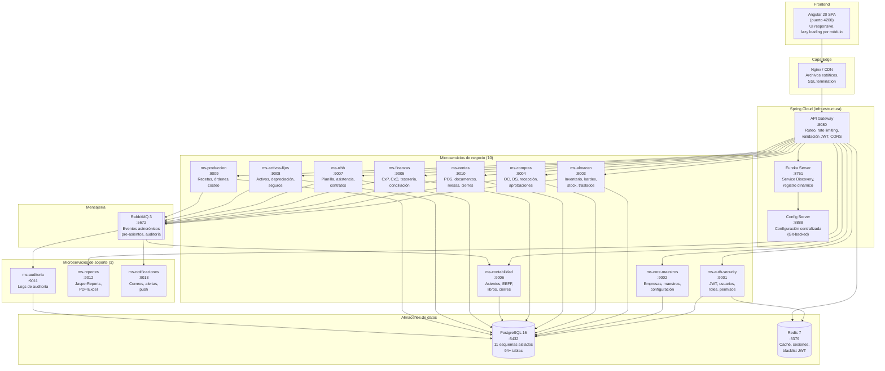

### 26.3 Nivel 3 — Componentes internos de un microservicio típico

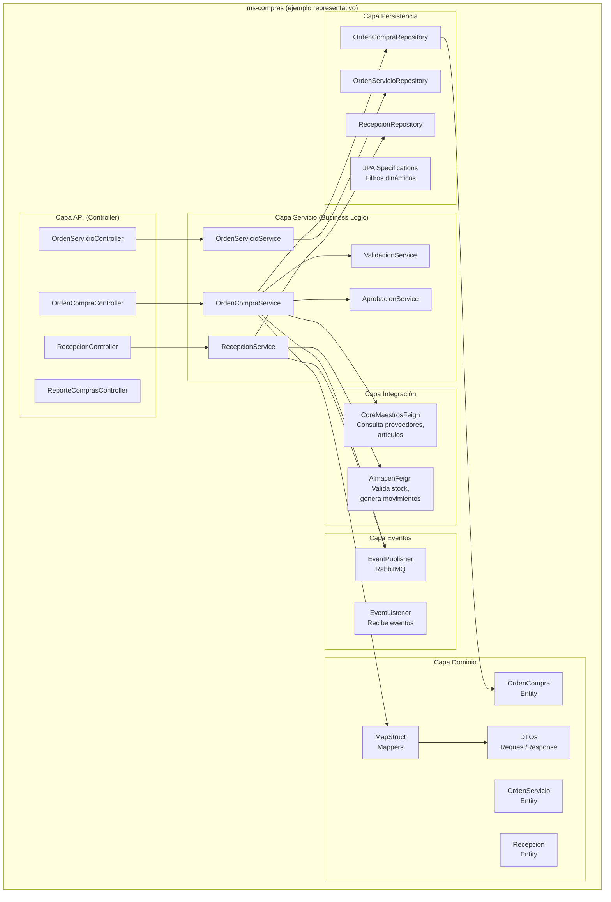

---

## 27. Diagramas de entidades (ER) por microservicio

### 27.1 ms-auth-security — Esquema `auth`

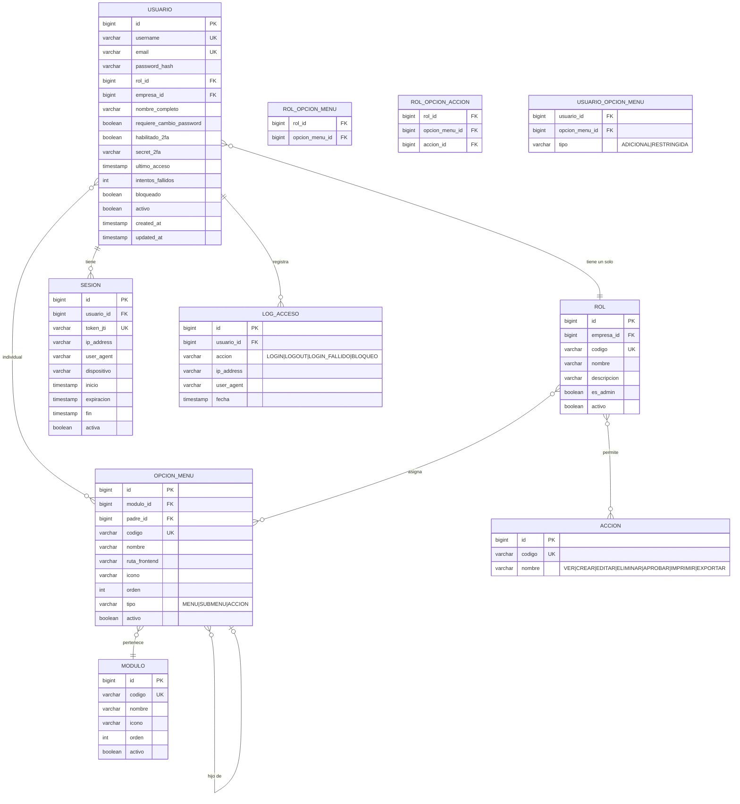

### 27.2 ms-core-maestros — Esquema `core`

```mermaid
erDiagram
    EMPRESA {
        bigint id PK
        varchar ruc UK
        varchar razon_social
        varchar nombre_comercial
        varchar direccion_fiscal
        bigint pais_id FK
        varchar logo_url
        boolean activo
    }
    PAIS {
        bigint id PK
        varchar codigo UK
        varchar nombre
        varchar moneda_id FK
        varchar formato_fecha
        varchar zona_horaria
        boolean activo
    }
    SUCURSAL {
        bigint id PK
        bigint empresa_id FK
        bigint pais_id FK
        varchar codigo UK
        varchar nombre
        varchar direccion
        varchar telefono
        varchar ubigeo
        boolean activo
    }
    MONEDA {
        bigint id PK
        varchar codigo UK
        varchar nombre
        varchar simbolo
        int decimales
        boolean activo
    }
    TIPO_CAMBIO {
        bigint id PK
        bigint moneda_origen_id FK
        bigint moneda_destino_id FK
        date fecha
        decimal tc_compra
        decimal tc_venta
    }
    RELACION_COMERCIAL {
        bigint id PK
        bigint empresa_id FK
        varchar tipo_documento
        varchar numero_documento UK
        varchar razon_social
        varchar nombre_comercial
        varchar direccion
        varchar telefono
        varchar email
        boolean es_proveedor
        boolean es_cliente
        boolean es_empleado
        bigint condicion_pago_id FK
        boolean activo
    }
    CONTACTO {
        bigint id PK
        bigint relacion_comercial_id FK
        varchar nombre
        varchar cargo
        varchar telefono
        varchar email
        boolean principal
    }
    CUENTA_BANCARIA_RC {
        bigint id PK
        bigint relacion_comercial_id FK
        varchar banco
        varchar numero_cuenta
        varchar cci
        varchar tipo_cuenta
        bigint moneda_id FK
    }
    ARTICULO {
        bigint id PK
        bigint empresa_id FK
        varchar codigo UK
        varchar nombre
        varchar descripcion
        bigint categoria_id FK
        bigint unidad_medida_id FK
        bigint impuesto_id FK
        varchar tipo "PRODUCTO|SERVICIO|INSUMO|ACTIVO"
        decimal precio_venta
        decimal costo_promedio
        decimal stock_minimo
        decimal stock_maximo
        varchar codigo_barras
        varchar imagen_url
        boolean es_inventariable
        boolean activo
    }
    CATEGORIA {
        bigint id PK
        bigint empresa_id FK
        varchar codigo
        varchar nombre
        bigint padre_id FK
        int nivel
        boolean activo
    }
    UNIDAD_MEDIDA {
        bigint id PK
        varchar codigo UK
        varchar nombre
        varchar abreviatura
    }
    CONVERSION_UNIDAD {
        bigint id PK
        bigint unidad_origen_id FK
        bigint unidad_destino_id FK
        decimal factor_conversion
    }
    IMPUESTO {
        bigint id PK
        bigint pais_id FK
        varchar codigo
        varchar nombre
        decimal porcentaje
        varchar tipo "IGV|ISC|PERCEPCION"
        boolean activo
    }
    NUMERADOR {
        bigint id PK
        bigint empresa_id FK
        bigint sucursal_id FK
        varchar tipo_documento
        varchar serie
        int ultimo_numero
        varchar formato
    }
    CONDICION_PAGO {
        bigint id PK
        varchar codigo
        varchar nombre
        int dias
        boolean activo
    }
    FORMA_PAGO {
        bigint id PK
        varchar codigo
        varchar nombre
        varchar tipo "EFECTIVO|TARJETA|TRANSFERENCIA|DIGITAL"
        boolean activo
    }
    CONFIG_CLAVE {
        bigint id PK
        varchar clave UK
        varchar descripcion
        varchar tipo_dato
        varchar valor_default
        varchar modulo
    }
    CONFIG_EMPRESA {
        bigint id PK
        bigint config_clave_id FK
        bigint empresa_id FK
        varchar valor
    }
    CONFIG_PAIS {
        bigint id PK
        bigint config_clave_id FK
        bigint pais_id FK
        varchar valor
    }
    CONFIG_SUCURSAL {
        bigint id PK
        bigint config_clave_id FK
        bigint sucursal_id FK
        varchar valor
    }
    CONFIG_USUARIO {
        bigint id PK
        bigint config_clave_id FK
        bigint usuario_id FK
        varchar valor
    }
    EMPRESA ||--o{ SUCURSAL : tiene
    SUCURSAL }o--|| PAIS : pertenece
    EMPRESA ||--o{ RELACION_COMERCIAL : tiene
    EMPRESA ||--o{ ARTICULO : tiene
    ARTICULO }o--|| CATEGORIA : pertenece
    ARTICULO }o--|| UNIDAD_MEDIDA : usa
    ARTICULO }o--|| IMPUESTO : aplica
    RELACION_COMERCIAL ||--o{ CONTACTO : tiene
    RELACION_COMERCIAL ||--o{ CUENTA_BANCARIA_RC : tiene
    RELACION_COMERCIAL }o--|| CONDICION_PAGO : "condición default"
    MONEDA ||--o{ TIPO_CAMBIO : origen
    CONFIG_CLAVE ||--o{ CONFIG_EMPRESA : configura
    CONFIG_CLAVE ||--o{ CONFIG_PAIS : configura
    CONFIG_CLAVE ||--o{ CONFIG_SUCURSAL : configura
    CONFIG_CLAVE ||--o{ CONFIG_USUARIO : configura
    CATEGORIA }o--o| CATEGORIA : "padre"
```

### 27.3 ms-almacen — Esquema `almacen`

```mermaid
erDiagram
    ALMACEN {
        bigint id PK
        bigint empresa_id FK
        bigint sucursal_id FK
        varchar codigo UK
        varchar nombre
        varchar direccion
        varchar tipo "PRINCIPAL|TRANSITO|DEVOLUCION|PRODUCCION"
        boolean activo
    }
    UBICACION_ALMACEN {
        bigint id PK
        bigint almacen_id FK
        varchar codigo
        varchar nombre
        varchar pasillo
        varchar estante
        varchar nivel
    }
    TIPO_MOVIMIENTO {
        bigint id PK
        varchar codigo UK
        varchar nombre
        varchar naturaleza "INGRESO|SALIDA"
        varchar tipo_sunat
        boolean afecta_costo
        boolean genera_pre_asiento
        boolean activo
    }
    MOVIMIENTO_ALMACEN {
        bigint id PK
        bigint empresa_id FK
        bigint almacen_id FK
        bigint tipo_movimiento_id FK
        varchar numero UK
        date fecha
        varchar referencia_tipo
        bigint referencia_id
        varchar observacion
        varchar estado "BORRADOR|CONFIRMADO|ANULADO"
        bigint usuario_id FK
        timestamp created_at
    }
    MOVIMIENTO_DETALLE {
        bigint id PK
        bigint movimiento_id FK
        bigint articulo_id FK
        decimal cantidad
        decimal costo_unitario
        decimal costo_total
        bigint ubicacion_id FK
        varchar lote
        date fecha_vencimiento
    }
    STOCK {
        bigint id PK
        bigint almacen_id FK
        bigint articulo_id FK
        decimal cantidad_disponible
        decimal cantidad_reservada
        decimal costo_promedio
        timestamp ultima_actualizacion
    }
    KARDEX {
        bigint id PK
        bigint almacen_id FK
        bigint articulo_id FK
        bigint movimiento_detalle_id FK
        date fecha
        varchar tipo "INGRESO|SALIDA"
        decimal cantidad
        decimal costo_unitario
        decimal costo_total
        decimal saldo_cantidad
        decimal saldo_costo_unitario
        decimal saldo_costo_total
    }
    INVENTARIO_FISICO {
        bigint id PK
        bigint almacen_id FK
        date fecha
        varchar estado "EN_PROCESO|COMPARADO|AJUSTADO|CERRADO"
        bigint usuario_id FK
    }
    INVENTARIO_FISICO_DETALLE {
        bigint id PK
        bigint inventario_fisico_id FK
        bigint articulo_id FK
        decimal cantidad_sistema
        decimal cantidad_fisica
        decimal diferencia
        varchar observacion
    }
    RESERVA_STOCK {
        bigint id PK
        bigint almacen_id FK
        bigint articulo_id FK
        decimal cantidad
        varchar origen_tipo
        bigint origen_id
        timestamp fecha_reserva
        timestamp fecha_expiracion
        varchar estado "ACTIVA|CONSUMIDA|EXPIRADA"
    }
    ALMACEN ||--o{ UBICACION_ALMACEN : contiene
    ALMACEN ||--o{ STOCK : registra
    ALMACEN ||--o{ MOVIMIENTO_ALMACEN : tiene
    MOVIMIENTO_ALMACEN }o--|| TIPO_MOVIMIENTO : es
    MOVIMIENTO_ALMACEN ||--o{ MOVIMIENTO_DETALLE : contiene
    MOVIMIENTO_DETALLE --> KARDEX : genera
    STOCK }o--|| ARTICULO : de
    ALMACEN ||--o{ INVENTARIO_FISICO : ejecuta
    INVENTARIO_FISICO ||--o{ INVENTARIO_FISICO_DETALLE : contiene
    ALMACEN ||--o{ RESERVA_STOCK : tiene
```

### 27.4 ms-compras — Esquema `compras`

```mermaid
erDiagram
    SOLICITUD_COMPRA {
        bigint id PK
        bigint empresa_id FK
        bigint sucursal_id FK
        varchar numero UK
        date fecha
        bigint solicitante_id FK
        varchar prioridad "BAJA|MEDIA|ALTA|URGENTE"
        varchar estado "BORRADOR|ENVIADA|APROBADA|RECHAZADA|EN_OC"
        varchar justificacion
    }
    SOLICITUD_COMPRA_DETALLE {
        bigint id PK
        bigint solicitud_id FK
        bigint articulo_id FK
        decimal cantidad
        varchar especificaciones
    }
    COTIZACION {
        bigint id PK
        bigint solicitud_id FK
        bigint proveedor_id FK
        varchar numero UK
        date fecha
        date fecha_validez
        decimal subtotal
        decimal igv
        decimal total
        bigint moneda_id FK
        varchar estado "PENDIENTE|RECIBIDA|SELECCIONADA|DESCARTADA"
    }
    COTIZACION_DETALLE {
        bigint id PK
        bigint cotizacion_id FK
        bigint articulo_id FK
        decimal cantidad
        decimal precio_unitario
        decimal descuento
        int plazo_entrega_dias
    }
    ORDEN_COMPRA {
        bigint id PK
        bigint empresa_id FK
        bigint sucursal_id FK
        bigint proveedor_id FK
        varchar numero UK
        date fecha
        date fecha_entrega
        bigint moneda_id FK
        bigint condicion_pago_id FK
        decimal subtotal
        decimal igv
        decimal total
        decimal tc
        varchar estado "BORRADOR|PENDIENTE_APROBACION|APROBADA|RECHAZADA|PARCIAL|COMPLETADA|ANULADA"
        varchar observaciones
        bigint cotizacion_id FK
    }
    ORDEN_COMPRA_DETALLE {
        bigint id PK
        bigint orden_compra_id FK
        bigint articulo_id FK
        varchar descripcion
        decimal cantidad
        decimal precio_unitario
        decimal descuento_porcentaje
        decimal subtotal
        decimal cantidad_recibida
        decimal cantidad_pendiente
    }
    ORDEN_SERVICIO {
        bigint id PK
        bigint empresa_id FK
        bigint proveedor_id FK
        varchar numero UK
        date fecha
        varchar descripcion_servicio
        decimal total
        bigint moneda_id FK
        varchar estado "BORRADOR|APROBADA|EN_EJECUCION|COMPLETADA|ANULADA"
    }
    APROBACION {
        bigint id PK
        varchar tipo_documento
        bigint documento_id
        int nivel
        bigint aprobador_id FK
        varchar accion "APROBADO|RECHAZADO"
        varchar comentario
        timestamp fecha
    }
    RECEPCION {
        bigint id PK
        bigint orden_compra_id FK
        bigint almacen_id FK
        varchar numero UK
        date fecha
        varchar guia_remision
        varchar estado "BORRADOR|CONFIRMADA|ANULADA"
        varchar observaciones
    }
    RECEPCION_DETALLE {
        bigint id PK
        bigint recepcion_id FK
        bigint oc_detalle_id FK
        bigint articulo_id FK
        decimal cantidad_recibida
        decimal cantidad_rechazada
        varchar motivo_rechazo
    }
    CONTRATO_MARCO {
        bigint id PK
        bigint empresa_id FK
        bigint proveedor_id FK
        varchar numero UK
        date fecha_inicio
        date fecha_fin
        varchar condiciones
        varchar estado "VIGENTE|VENCIDO|CANCELADO"
    }
    EVALUACION_PROVEEDOR {
        bigint id PK
        bigint proveedor_id FK
        bigint periodo_id FK
        int calidad_puntaje
        int entrega_puntaje
        int precio_puntaje
        int servicio_puntaje
        decimal puntaje_total
        varchar clasificacion "A|B|C|D"
    }
    SOLICITUD_COMPRA ||--o{ SOLICITUD_COMPRA_DETALLE : contiene
    SOLICITUD_COMPRA ||--o{ COTIZACION : genera
    COTIZACION ||--o{ COTIZACION_DETALLE : contiene
    COTIZACION }o--o| ORDEN_COMPRA : "se convierte en"
    ORDEN_COMPRA ||--o{ ORDEN_COMPRA_DETALLE : contiene
    ORDEN_COMPRA ||--o{ RECEPCION : genera
    ORDEN_COMPRA ||--o{ APROBACION : requiere
    RECEPCION ||--o{ RECEPCION_DETALLE : contiene
```

### 27.5 ms-ventas — Esquema `ventas`

```mermaid
erDiagram
    ZONA {
        bigint id PK
        bigint sucursal_id FK
        varchar nombre
        int capacidad
        boolean activo
    }
    MESA {
        bigint id PK
        bigint zona_id FK
        varchar numero UK
        int capacidad
        varchar estado "LIBRE|OCUPADA|RESERVADA|MANTENIMIENTO"
        boolean activo
    }
    TURNO {
        bigint id PK
        bigint sucursal_id FK
        bigint cajero_id FK
        decimal fondo_inicial
        timestamp apertura
        timestamp cierre
        varchar estado "ABIERTO|CERRADO"
    }
    ORDEN_VENTA {
        bigint id PK
        bigint sucursal_id FK
        bigint mesa_id FK
        bigint mesero_id FK
        bigint turno_id FK
        varchar numero UK
        int comensales
        timestamp apertura
        timestamp cierre
        varchar estado "ABIERTA|CERRADA|ANULADA"
        varchar observaciones
    }
    COMANDA {
        bigint id PK
        bigint orden_id FK
        bigint articulo_id FK
        decimal cantidad
        decimal precio_unitario
        decimal descuento
        decimal subtotal
        varchar estado "PENDIENTE|EN_PREPARACION|SERVIDA|ANULADA"
        varchar observaciones
        timestamp hora_pedido
        timestamp hora_entrega
    }
    DOCUMENTO_VENTA {
        bigint id PK
        bigint empresa_id FK
        bigint sucursal_id FK
        bigint orden_id FK
        bigint cliente_id FK
        bigint turno_id FK
        varchar tipo "BOLETA|FACTURA|NOTA_VENTA"
        varchar serie
        varchar numero UK
        date fecha
        bigint moneda_id FK
        decimal tc
        decimal subtotal
        decimal igv
        decimal isc
        decimal descuento_total
        decimal propina
        decimal recargo_consumo
        decimal total
        varchar estado "EMITIDA|ANULADA|BAJA"
        bigint forma_pago_id FK
    }
    DOCUMENTO_VENTA_DETALLE {
        bigint id PK
        bigint documento_id FK
        bigint articulo_id FK
        varchar descripcion
        decimal cantidad
        decimal precio_unitario
        decimal descuento
        decimal igv
        decimal subtotal
        decimal total
    }
    NOTA_CREDITO_VENTA {
        bigint id PK
        bigint documento_original_id FK
        varchar serie
        varchar numero UK
        date fecha
        varchar motivo
        decimal total
        varchar estado "EMITIDA|ANULADA"
    }
    NOTA_DEBITO_VENTA {
        bigint id PK
        bigint documento_original_id FK
        varchar serie
        varchar numero UK
        date fecha
        varchar motivo
        decimal total
        varchar estado "EMITIDA|ANULADA"
    }
    PAGO_VENTA {
        bigint id PK
        bigint documento_id FK
        bigint forma_pago_id FK
        decimal monto
        varchar referencia
        varchar estado "COMPLETADO|ANULADO"
    }
    DESCUENTO_PROMOCION {
        bigint id PK
        bigint empresa_id FK
        varchar nombre
        varchar tipo "PORCENTAJE|MONTO_FIJO|2X1|COMBO"
        decimal valor
        date fecha_inicio
        date fecha_fin
        varchar dias_aplicacion
        time hora_inicio
        time hora_fin
        decimal monto_minimo
        boolean activo
    }
    FACTURACION_ELECTRONICA {
        bigint id PK
        bigint documento_venta_id FK
        varchar xml_enviado
        varchar xml_cdr
        varchar hash_cpe
        varchar ticket_ose
        varchar estado_sunat "PENDIENTE|ACEPTADO|RECHAZADO|OBSERVADO"
        timestamp fecha_envio
        timestamp fecha_respuesta
        varchar mensaje_respuesta
    }
    CIERRE_CAJA {
        bigint id PK
        bigint turno_id FK
        decimal ventas_efectivo
        decimal ventas_tarjeta
        decimal ventas_digital
        decimal ventas_total
        decimal propinas_total
        decimal fondo_inicial
        decimal fondo_final
        decimal diferencia
        varchar observaciones
        timestamp fecha_cierre
    }
    PROPINA {
        bigint id PK
        bigint documento_venta_id FK
        bigint trabajador_id FK
        decimal monto
        date fecha
    }
    ZONA ||--o{ MESA : contiene
    MESA ||--o{ ORDEN_VENTA : atiende
    ORDEN_VENTA ||--o{ COMANDA : contiene
    ORDEN_VENTA ||--o| DOCUMENTO_VENTA : genera
    DOCUMENTO_VENTA ||--o{ DOCUMENTO_VENTA_DETALLE : contiene
    DOCUMENTO_VENTA ||--o{ PAGO_VENTA : recibe
    DOCUMENTO_VENTA ||--o| NOTA_CREDITO_VENTA : "puede tener"
    DOCUMENTO_VENTA ||--o| NOTA_DEBITO_VENTA : "puede tener"
    DOCUMENTO_VENTA ||--o| FACTURACION_ELECTRONICA : "se envía"
    DOCUMENTO_VENTA ||--o{ PROPINA : registra
    TURNO ||--o{ ORDEN_VENTA : contiene
    TURNO ||--o| CIERRE_CAJA : genera
```

### 27.6 ms-finanzas — Esquema `finanzas`

```mermaid
erDiagram
    CUENTA_BANCARIA {
        bigint id PK
        bigint empresa_id FK
        varchar banco
        varchar numero_cuenta UK
        varchar cci
        varchar tipo "AHORRO|CORRIENTE"
        bigint moneda_id FK
        decimal saldo_contable
        boolean activo
    }
    DOCUMENTO_PAGAR {
        bigint id PK
        bigint empresa_id FK
        bigint proveedor_id FK
        varchar tipo "FACTURA|RECIBO|NC|ND"
        varchar serie_numero UK
        date fecha_emision
        date fecha_vencimiento
        bigint moneda_id FK
        decimal tc
        decimal subtotal
        decimal igv
        decimal retencion
        decimal detraccion
        decimal total
        decimal saldo
        varchar estado "PENDIENTE|PARCIAL|PAGADO|ANULADO"
        bigint oc_id FK
    }
    DOCUMENTO_COBRAR {
        bigint id PK
        bigint empresa_id FK
        bigint cliente_id FK
        varchar tipo "FACTURA|BOLETA|LETRA|NC|ND"
        varchar serie_numero UK
        date fecha_emision
        date fecha_vencimiento
        bigint moneda_id FK
        decimal total
        decimal saldo
        varchar estado "PENDIENTE|PARCIAL|COBRADO|ANULADO|PROTESTADA"
    }
    PAGO {
        bigint id PK
        bigint documento_pagar_id FK
        bigint cuenta_bancaria_id FK
        bigint forma_pago_id FK
        date fecha
        decimal monto
        varchar referencia
        varchar numero_operacion
        varchar estado "APLICADO|ANULADO"
    }
    COBRO {
        bigint id PK
        bigint documento_cobrar_id FK
        bigint cuenta_bancaria_id FK
        bigint forma_pago_id FK
        date fecha
        decimal monto
        varchar referencia
        varchar estado "APLICADO|ANULADO"
    }
    MOVIMIENTO_BANCARIO {
        bigint id PK
        bigint cuenta_bancaria_id FK
        date fecha
        varchar tipo "DEPOSITO|RETIRO|TRANSFERENCIA|COMISION|ITF"
        varchar referencia
        decimal monto
        decimal saldo_despues
        boolean conciliado
    }
    CONCILIACION_BANCARIA {
        bigint id PK
        bigint cuenta_bancaria_id FK
        int periodo_anio
        int periodo_mes
        decimal saldo_banco
        decimal saldo_libros
        decimal diferencia
        varchar estado "EN_PROCESO|CONCILIADO|CERRADO"
    }
    CONCILIACION_DETALLE {
        bigint id PK
        bigint conciliacion_id FK
        bigint movimiento_bancario_id FK
        boolean conciliado
        varchar observacion
    }
    ADELANTO {
        bigint id PK
        bigint empresa_id FK
        bigint solicitante_id FK
        bigint proveedor_id FK
        varchar numero UK
        date fecha
        decimal monto
        varchar motivo
        varchar estado "SOLICITADO|APROBADO|DESEMBOLSADO|LIQUIDADO|RECHAZADO"
    }
    PROGRAMACION_PAGO {
        bigint id PK
        bigint empresa_id FK
        date fecha_programada
        varchar estado "PROGRAMADO|EJECUTADO|CANCELADO"
    }
    PROGRAMACION_PAGO_DETALLE {
        bigint id PK
        bigint programacion_id FK
        bigint documento_pagar_id FK
        decimal monto_programado
    }
    FONDO_FIJO {
        bigint id PK
        bigint sucursal_id FK
        bigint responsable_id FK
        decimal monto_autorizado
        decimal monto_disponible
        varchar estado "ACTIVO|RENDICION|REPOSICION"
    }
    RENDICION_GASTO {
        bigint id PK
        bigint fondo_fijo_id FK
        date fecha
        decimal monto
        varchar concepto
        varchar comprobante
        varchar estado "PENDIENTE|APROBADO|RECHAZADO"
    }
    CUENTA_BANCARIA ||--o{ MOVIMIENTO_BANCARIO : tiene
    CUENTA_BANCARIA ||--o{ CONCILIACION_BANCARIA : genera
    CONCILIACION_BANCARIA ||--o{ CONCILIACION_DETALLE : contiene
    DOCUMENTO_PAGAR ||--o{ PAGO : recibe
    DOCUMENTO_COBRAR ||--o{ COBRO : recibe
    PROGRAMACION_PAGO ||--o{ PROGRAMACION_PAGO_DETALLE : contiene
    FONDO_FIJO ||--o{ RENDICION_GASTO : registra
```

### 27.7 ms-contabilidad — Esquema `contabilidad`

```mermaid
erDiagram
    CUENTA_CONTABLE {
        bigint id PK
        bigint empresa_id FK
        varchar codigo UK
        varchar nombre
        int nivel
        bigint padre_id FK
        varchar naturaleza "DEUDORA|ACREEDORA"
        varchar tipo "TITULO|MOVIMIENTO"
        boolean requiere_cc
        boolean requiere_documento
        boolean activo
    }
    CENTRO_COSTO {
        bigint id PK
        bigint empresa_id FK
        varchar codigo UK
        varchar nombre
        int nivel
        bigint padre_id FK
        varchar tipo "ADMINISTRATIVO|OPERATIVO|VENTAS|PRODUCCION"
        boolean activo
    }
    LIBRO_CONTABLE {
        bigint id PK
        varchar codigo UK
        varchar nombre
        varchar tipo "DIARIO|MAYOR|CAJA|COMPRAS|VENTAS|BANCOS"
    }
    ASIENTO {
        bigint id PK
        bigint empresa_id FK
        bigint libro_id FK
        varchar numero UK
        date fecha
        varchar glosa
        varchar tipo "MANUAL|AUTOMATICO|APERTURA|CIERRE|AJUSTE"
        varchar modulo_origen
        bigint documento_origen_id
        varchar estado "BORRADOR|CONFIRMADO|ANULADO"
        bigint moneda_id FK
        decimal tc
    }
    ASIENTO_DETALLE {
        bigint id PK
        bigint asiento_id FK
        bigint cuenta_contable_id FK
        bigint centro_costo_id FK
        varchar glosa_detalle
        decimal debe
        decimal haber
        decimal debe_me
        decimal haber_me
        varchar referencia
    }
    PRE_ASIENTO {
        bigint id PK
        varchar modulo_origen
        varchar tipo_operacion
        bigint documento_id
        varchar referencia
        date fecha
        jsonb data_contable
        varchar estado "PENDIENTE|PROCESADO|ERROR|IGNORADO"
        varchar error_mensaje
        bigint asiento_generado_id FK
        timestamp fecha_recepcion
        timestamp fecha_procesamiento
    }
    MATRIZ_CONTABLE {
        bigint id PK
        bigint empresa_id FK
        varchar modulo
        varchar tipo_operacion
        bigint cuenta_debe_id FK
        bigint cuenta_haber_id FK
        bigint centro_costo_id FK
        varchar descripcion
        boolean activo
    }
    CIERRE_CONTABLE {
        bigint id PK
        bigint empresa_id FK
        int anio
        int mes
        varchar tipo "MENSUAL|ANUAL"
        varchar estado "ABIERTO|CERRADO|REABIERTO"
        bigint usuario_id FK
        timestamp fecha_cierre
    }
    CUENTA_CONTABLE }o--o| CUENTA_CONTABLE : "padre"
    CENTRO_COSTO }o--o| CENTRO_COSTO : "padre"
    ASIENTO }o--|| LIBRO_CONTABLE : "registrado en"
    ASIENTO ||--o{ ASIENTO_DETALLE : contiene
    ASIENTO_DETALLE }o--|| CUENTA_CONTABLE : "debita/acredita"
    ASIENTO_DETALLE }o--o| CENTRO_COSTO : asigna
    PRE_ASIENTO }o--o| ASIENTO : "genera"
    MATRIZ_CONTABLE }o--|| CUENTA_CONTABLE : "cuenta debe"
```

### 27.8 ms-rrhh — Esquema `rrhh`

```mermaid
erDiagram
    TRABAJADOR {
        bigint id PK
        bigint empresa_id FK
        bigint relacion_comercial_id FK
        varchar codigo_trabajador UK
        varchar nombres
        varchar apellido_paterno
        varchar apellido_materno
        varchar tipo_documento
        varchar numero_documento UK
        date fecha_nacimiento
        varchar sexo
        varchar estado_civil
        varchar direccion
        varchar telefono
        varchar email
        varchar cuenta_bancaria_sueldo
        varchar cuenta_cts
        bigint afp_id FK
        varchar cuspp
        varchar regimen_laboral
        bigint area_id FK
        bigint cargo_id FK
        bigint sucursal_id FK
        date fecha_ingreso
        date fecha_cese
        varchar motivo_cese
        varchar estado "ACTIVO|VACACIONES|LICENCIA|CESADO"
        boolean activo
    }
    CONTRATO {
        bigint id PK
        bigint trabajador_id FK
        varchar tipo "INDEFINIDO|PLAZO_FIJO|PARCIAL|FORMATIVO"
        date fecha_inicio
        date fecha_fin
        decimal remuneracion
        boolean asignacion_familiar
        varchar estado "VIGENTE|VENCIDO|RENOVADO|RESUELTO"
    }
    AREA {
        bigint id PK
        bigint empresa_id FK
        varchar nombre
        bigint padre_id FK
        bigint responsable_id FK
    }
    CARGO {
        bigint id PK
        varchar nombre
        varchar nivel
        decimal sueldo_minimo
        decimal sueldo_maximo
    }
    AFP {
        bigint id PK
        varchar nombre
        decimal comision_porcentaje
        decimal prima_seguro
        decimal aporte_obligatorio
    }
    HORARIO {
        bigint id PK
        varchar nombre
        time hora_entrada
        time hora_salida
        int minutos_tolerancia
        boolean aplica_lunes
        boolean aplica_martes
        boolean aplica_miercoles
        boolean aplica_jueves
        boolean aplica_viernes
        boolean aplica_sabado
        boolean aplica_domingo
    }
    ASISTENCIA {
        bigint id PK
        bigint trabajador_id FK
        date fecha
        time hora_entrada
        time hora_salida
        varchar tipo_marca "BIOMETRICO|MANUAL|APP|GPS"
        decimal horas_trabajadas
        decimal horas_extra
        varchar estado "ASISTIO|FALTA|TARDANZA|PERMISO|VACACIONES|LICENCIA"
    }
    PERMISO_LICENCIA {
        bigint id PK
        bigint trabajador_id FK
        varchar tipo "PERMISO|LICENCIA_MEDICA|LICENCIA_PATERNIDAD|LICENCIA_SIN_GOCE"
        date fecha_inicio
        date fecha_fin
        int dias
        varchar estado "SOLICITADO|APROBADO|RECHAZADO"
        varchar sustento
    }
    CONCEPTO_PLANILLA {
        bigint id PK
        varchar codigo UK
        varchar nombre
        varchar tipo "INGRESO|DESCUENTO|APORTE_EMPLEADOR"
        varchar formula
        decimal valor_fijo
        boolean afecto_quinta
        boolean afecto_essalud
        boolean aplica_todos
    }
    PLANILLA {
        bigint id PK
        bigint empresa_id FK
        int anio
        int mes
        varchar tipo "MENSUAL|QUINCENAL|SEMANAL|GRATIFICACION|CTS|LIQUIDACION"
        varchar estado "BORRADOR|CALCULADA|APROBADA|PAGADA|CERRADA"
        decimal total_ingresos
        decimal total_descuentos
        decimal total_neto
        decimal total_aportes
    }
    PLANILLA_DETALLE {
        bigint id PK
        bigint planilla_id FK
        bigint trabajador_id FK
        bigint concepto_id FK
        decimal monto
        decimal dias_trabajados
        decimal horas_extra
    }
    VACACION {
        bigint id PK
        bigint trabajador_id FK
        int periodo_anio
        int dias_derecho
        int dias_gozados
        int dias_pendientes
        date fecha_inicio
        date fecha_fin
        varchar estado "PROGRAMADA|EN_GOCE|COMPLETADA"
    }
    LIQUIDACION {
        bigint id PK
        bigint trabajador_id FK
        date fecha_cese
        decimal cts_pendiente
        decimal vacaciones_truncas
        decimal gratificacion_trunca
        decimal indemnizacion
        decimal total_beneficios
        decimal total_descuentos
        decimal neto_pagar
        varchar estado "CALCULADA|APROBADA|PAGADA"
    }
    PRESTAMO {
        bigint id PK
        bigint trabajador_id FK
        decimal monto_total
        int cuotas
        decimal cuota_mensual
        decimal saldo
        varchar estado "ACTIVO|PAGADO"
    }
    TRABAJADOR ||--o{ CONTRATO : tiene
    TRABAJADOR }o--|| AREA : pertenece
    TRABAJADOR }o--|| CARGO : ocupa
    TRABAJADOR }o--o| AFP : "aporta a"
    TRABAJADOR ||--o{ ASISTENCIA : registra
    TRABAJADOR ||--o{ PERMISO_LICENCIA : solicita
    TRABAJADOR ||--o{ VACACION : tiene
    TRABAJADOR ||--o| LIQUIDACION : "puede tener"
    TRABAJADOR ||--o{ PRESTAMO : tiene
    PLANILLA ||--o{ PLANILLA_DETALLE : contiene
    PLANILLA_DETALLE }o--|| TRABAJADOR : de
    PLANILLA_DETALLE }o--|| CONCEPTO_PLANILLA : aplica
    AREA }o--o| AREA : "padre"
```

### 27.9 ms-activos-fijos — Esquema `activos`

```mermaid
erDiagram
    CLASE_ACTIVO {
        bigint id PK
        varchar codigo UK
        varchar nombre
        decimal vida_util_anios
        decimal tasa_depreciacion
        varchar metodo_depreciacion "LINEAL|DECRECIENTE|UNIDADES"
        bigint cuenta_activo_id FK
        bigint cuenta_depreciacion_id FK
        bigint cuenta_gasto_id FK
    }
    UBICACION_FISICA {
        bigint id PK
        bigint sucursal_id FK
        varchar codigo
        varchar nombre
        bigint padre_id FK
        int nivel
    }
    ACTIVO_FIJO {
        bigint id PK
        bigint empresa_id FK
        varchar codigo_activo UK
        varchar descripcion
        bigint clase_id FK
        bigint ubicacion_id FK
        bigint responsable_id FK
        date fecha_adquisicion
        date fecha_inicio_depreciacion
        bigint proveedor_id FK
        varchar factura_referencia
        bigint moneda_id FK
        decimal costo_adquisicion
        decimal valor_residual
        decimal depreciacion_acumulada
        decimal valor_neto
        varchar codigo_qr
        varchar estado "ACTIVO|BAJA|TRANSFERIDO|EN_MANTENIMIENTO"
        boolean activo
    }
    COMPONENTE_ACTIVO {
        bigint id PK
        bigint activo_fijo_id FK
        varchar descripcion
        decimal costo
        date fecha_instalacion
    }
    DEPRECIACION {
        bigint id PK
        bigint activo_fijo_id FK
        int anio
        int mes
        decimal monto_depreciacion
        decimal depreciacion_acumulada
        decimal valor_neto
        boolean procesado
    }
    MEJORA_ACTIVO {
        bigint id PK
        bigint activo_fijo_id FK
        date fecha
        varchar descripcion
        decimal costo
        decimal nueva_vida_util
    }
    REVALUACION {
        bigint id PK
        bigint activo_fijo_id FK
        date fecha
        decimal valor_anterior
        decimal valor_nuevo
        varchar sustento
        bigint perito_id FK
    }
    ASEGURADORA {
        bigint id PK
        varchar nombre
        varchar ruc
        varchar contacto
        boolean activo
    }
    POLIZA_SEGURO {
        bigint id PK
        bigint aseguradora_id FK
        varchar numero_poliza UK
        date fecha_inicio
        date fecha_fin
        decimal prima
        decimal cobertura
        varchar estado "VIGENTE|VENCIDA|CANCELADA"
    }
    POLIZA_ACTIVO {
        bigint id PK
        bigint poliza_id FK
        bigint activo_fijo_id FK
        decimal valor_asegurado
    }
    TRASLADO_ACTIVO {
        bigint id PK
        bigint activo_fijo_id FK
        bigint ubicacion_origen_id FK
        bigint ubicacion_destino_id FK
        bigint solicitante_id FK
        bigint aprobador_id FK
        date fecha_solicitud
        date fecha_ejecucion
        varchar motivo
        varchar estado "SOLICITADO|APROBADO|EJECUTADO|RECHAZADO"
    }
    MANTENIMIENTO_ACTIVO {
        bigint id PK
        bigint activo_fijo_id FK
        varchar tipo "PREVENTIVO|CORRECTIVO"
        date fecha_programada
        date fecha_ejecucion
        decimal costo
        varchar proveedor_servicio
        varchar estado "PROGRAMADO|EN_EJECUCION|COMPLETADO"
    }
    ACTIVO_FIJO }o--|| CLASE_ACTIVO : es
    ACTIVO_FIJO }o--|| UBICACION_FISICA : "ubicado en"
    ACTIVO_FIJO ||--o{ COMPONENTE_ACTIVO : tiene
    ACTIVO_FIJO ||--o{ DEPRECIACION : calcula
    ACTIVO_FIJO ||--o{ MEJORA_ACTIVO : recibe
    ACTIVO_FIJO ||--o{ REVALUACION : "se revalúa"
    ACTIVO_FIJO ||--o{ TRASLADO_ACTIVO : "se traslada"
    ACTIVO_FIJO ||--o{ MANTENIMIENTO_ACTIVO : requiere
    POLIZA_SEGURO }o--|| ASEGURADORA : emite
    POLIZA_SEGURO ||--o{ POLIZA_ACTIVO : cubre
    POLIZA_ACTIVO }o--|| ACTIVO_FIJO : asegura
    UBICACION_FISICA }o--o| UBICACION_FISICA : "padre"
```

### 27.10 ms-produccion — Esquema `produccion`

```mermaid
erDiagram
    RECETA {
        bigint id PK
        bigint empresa_id FK
        bigint articulo_producido_id FK
        varchar codigo UK
        varchar nombre
        int version
        decimal rendimiento_esperado
        decimal porcentaje_merma
        varchar tipo "PLATO|BEBIDA|POSTRE|PREPARACION_BASE"
        varchar estado "ACTIVA|INACTIVA|EN_REVISION"
        decimal costo_mano_obra
        decimal costo_indirecto
        decimal costo_total_estimado
    }
    RECETA_DETALLE {
        bigint id PK
        bigint receta_id FK
        bigint articulo_insumo_id FK
        decimal cantidad_bruta
        decimal cantidad_neta
        decimal porcentaje_merma
        bigint unidad_medida_id FK
        boolean es_opcional
        bigint alternativa_id FK
    }
    RECETA_SUBRECETA {
        bigint id PK
        bigint receta_padre_id FK
        bigint receta_hija_id FK
        decimal cantidad
    }
    ORDEN_PRODUCCION {
        bigint id PK
        bigint empresa_id FK
        bigint sucursal_id FK
        bigint receta_id FK
        varchar numero UK
        date fecha
        decimal cantidad_planificada
        decimal cantidad_producida
        decimal cantidad_merma
        varchar estado "PLANIFICADA|EN_PROCESO|COMPLETADA|CANCELADA"
        bigint responsable_id FK
        timestamp inicio_real
        timestamp fin_real
    }
    ORDEN_PRODUCCION_INSUMO {
        bigint id PK
        bigint orden_id FK
        bigint articulo_id FK
        decimal cantidad_requerida
        decimal cantidad_consumida
        decimal costo_unitario
        decimal costo_total
    }
    COSTEO_PRODUCCION {
        bigint id PK
        bigint orden_id FK
        decimal costo_materia_prima
        decimal costo_mano_obra
        decimal costo_indirecto
        decimal costo_total
        decimal costo_unitario
        decimal rendimiento_real
        decimal porcentaje_merma_real
    }
    CONTROL_CALIDAD {
        bigint id PK
        bigint orden_id FK
        bigint inspector_id FK
        date fecha
        varchar resultado "APROBADO|RECHAZADO|OBSERVADO"
        varchar observaciones
    }
    PROGRAMACION_PRODUCCION {
        bigint id PK
        bigint sucursal_id FK
        date fecha
        bigint receta_id FK
        decimal cantidad
        varchar turno "MANANA|TARDE|NOCHE"
        varchar estado "PROGRAMADO|EJECUTADO|CANCELADO"
    }
    RECETA ||--o{ RECETA_DETALLE : contiene
    RECETA ||--o{ RECETA_SUBRECETA : "incluye sub-recetas"
    RECETA ||--o{ ORDEN_PRODUCCION : ejecuta
    ORDEN_PRODUCCION ||--o{ ORDEN_PRODUCCION_INSUMO : consume
    ORDEN_PRODUCCION ||--o| COSTEO_PRODUCCION : genera
    ORDEN_PRODUCCION ||--o{ CONTROL_CALIDAD : verifica
    RECETA ||--o{ PROGRAMACION_PRODUCCION : programa
```

---

## 28. Diagrama de comunicación entre microservicios

### 28.1 Matriz de comunicación sincrónica (REST / OpenFeign)

```mermaid
flowchart LR
    subgraph Consumidor["Consumidor (quien llama)"]
        COM_C[ms-compras]
        ALM_C[ms-almacen]
        VEN_C[ms-ventas]
        FIN_C[ms-finanzas]
        CNT_C[ms-contabilidad]
        RRHH_C[ms-rrhh]
        AF_C[ms-activos-fijos]
        PROD_C[ms-produccion]
        RPT_C[ms-reportes]
    end
    subgraph Proveedor["Proveedor (quien responde)"]
        CORE_P[ms-core-maestros]
        ALM_P[ms-almacen]
        AUTH_P[ms-auth-security]
        FIN_P[ms-finanzas]
    end
    COM_C -->|"proveedor, artículo,\nimpuesto, moneda"| CORE_P
    COM_C -->|"validar stock,\ngenerar ingreso"| ALM_P
    ALM_C -->|"artículo, unidad,\ncategoría"| CORE_P
    VEN_C -->|"cliente, artículo,\nimpuesto, moneda"| CORE_P
    VEN_C -->|"validar stock\ndisponible"| ALM_P
    VEN_C -->|"generar CxC"| FIN_P
    FIN_C -->|"proveedor, cliente,\nmoneda, TC"| CORE_P
    FIN_C -->|"datos OC"| COM_C
    CNT_C -->|"empresa, moneda"| CORE_P
    RRHH_C -->|"trabajador como RC,\nsucursal"| CORE_P
    AF_C -->|"proveedor, moneda,\nsucursal"| CORE_P
    PROD_C -->|"artículo, unidad"| CORE_P
    PROD_C -->|"stock, consumir\ninsumos"| ALM_P
    RPT_C -->|"datos de cualquier\nmicroservicio"| CORE_P
    RPT_C -->|"datos"| ALM_P
    RPT_C -->|"datos"| FIN_P
```

### 28.2 Flujo de eventos asincrónicos (RabbitMQ)

```mermaid
flowchart TB
    subgraph Productores["Productores de eventos"]
        ALM_E["ms-almacen\n• movimiento.confirmado\n• stock.bajo_minimo\n• traslado.completado"]
        COM_E["ms-compras\n• oc.aprobada\n• recepcion.confirmada\n• oc.completada"]
        VEN_E["ms-ventas\n• venta.emitida\n• venta.anulada\n• cierre_caja.completado\n• nc.emitida"]
        FIN_E["ms-finanzas\n• pago.registrado\n• cobro.registrado\n• adelanto.liquidado\n• conciliacion.cerrada"]
        RRHH_E["ms-rrhh\n• planilla.cerrada\n• liquidacion.pagada\n• asistencia.procesada"]
        AF_E["ms-activos\n• depreciacion.ejecutada\n• activo.baja\n• activo.revaluado"]
        PROD_E["ms-produccion\n• produccion.completada\n• produccion.cancelada"]
    end
    subgraph RMQ["RabbitMQ (Exchange: rpe.events)"]
        EX{{"Topic Exchange\nrpe.events"}}
    end
    subgraph Consumidores["Consumidores"]
        CNT_CON["ms-contabilidad\n(routing: *.pre_asiento)\nGenera asientos automáticos"]
        AUD_CON["ms-auditoria\n(routing: #)\nRegistra TODO en log"]
        NOTIF_CON["ms-notificaciones\n(routing: *.alerta.*)\nEnvía correos y alertas"]
        ALM_CON["ms-almacen\n(routing: produccion.*)\nConsume insumos"]
        FIN_CON["ms-finanzas\n(routing: venta.emitida)\nGenera CxC automático"]
    end
    ALM_E --> EX
    COM_E --> EX
    VEN_E --> EX
    FIN_E --> EX
    RRHH_E --> EX
    AF_E --> EX
    PROD_E --> EX
    EX --> CNT_CON
    EX --> AUD_CON
    EX --> NOTIF_CON
    EX --> ALM_CON
    EX --> FIN_CON
```

### 28.3 Catálogo de eventos

| Evento | Productor | Consumidores | Datos principales |
|--------|-----------|-------------|-------------------|
| `movimiento.confirmado` | ms-almacen | ms-contabilidad, ms-auditoria | almacen_id, tipo, artículos, costos |
| `stock.bajo_minimo` | ms-almacen | ms-notificaciones | artículo, almacén, stock_actual, stock_minimo |
| `oc.aprobada` | ms-compras | ms-auditoria, ms-notificaciones | oc_id, proveedor, monto |
| `recepcion.confirmada` | ms-compras | ms-contabilidad, ms-almacen, ms-auditoria | recepcion_id, oc_id, artículos |
| `venta.emitida` | ms-ventas | ms-contabilidad, ms-finanzas, ms-auditoria | documento_id, tipo, monto, cliente |
| `venta.anulada` | ms-ventas | ms-contabilidad, ms-finanzas, ms-auditoria | documento_id, motivo |
| `nc.emitida` | ms-ventas | ms-contabilidad, ms-finanzas | nc_id, documento_original, monto |
| `cierre_caja.completado` | ms-ventas | ms-contabilidad, ms-auditoria | turno_id, totales por forma de pago |
| `pago.registrado` | ms-finanzas | ms-contabilidad, ms-auditoria | pago_id, proveedor, monto, cuenta |
| `cobro.registrado` | ms-finanzas | ms-contabilidad, ms-auditoria | cobro_id, cliente, monto |
| `conciliacion.cerrada` | ms-finanzas | ms-auditoria | cuenta, periodo, diferencias |
| `planilla.cerrada` | ms-rrhh | ms-contabilidad, ms-auditoria | planilla_id, periodo, totales |
| `liquidacion.pagada` | ms-rrhh | ms-contabilidad, ms-auditoria | trabajador, montos |
| `depreciacion.ejecutada` | ms-activos | ms-contabilidad, ms-auditoria | periodo, total_depreciacion |
| `activo.baja` | ms-activos | ms-contabilidad, ms-auditoria | activo_id, valor_neto |
| `produccion.completada` | ms-produccion | ms-contabilidad, ms-almacen, ms-auditoria | orden_id, receta, costos |

---

## 29. Diagramas de interacción (secuencia)

### 29.1 Flujo completo de compra

```mermaid
sequenceDiagram
    participant U as Usuario
    participant FE as Angular
    participant GW as Gateway
    participant COM as ms-compras
    participant CORE as ms-core
    participant ALM as ms-almacen
    participant FIN as ms-finanzas
    participant MQ as RabbitMQ
    participant CNT as ms-contabilidad
    participant AUD as ms-auditoria

    U->>FE: Crear Orden de Compra
    FE->>GW: POST /api/compras/ordenes-compra
    GW->>COM: Forward
    COM->>CORE: GET proveedor + artículos + impuestos
    CORE-->>COM: Datos validados
    COM->>COM: Crear OC (estado: BORRADOR)
    COM-->>FE: 201 Created

    U->>FE: Enviar a aprobación
    FE->>GW: POST /api/compras/ordenes-compra/{id}/enviar-aprobacion
    GW->>COM: Forward
    COM->>COM: Cambiar estado → PENDIENTE_APROBACION
    COM->>MQ: Publicar "oc.pendiente_aprobacion"
    MQ-->>AUD: Log auditoría

    Note over COM: Aprobador recibe notificación

    U->>FE: Aprobar OC
    FE->>GW: POST /api/compras/ordenes-compra/{id}/aprobar
    GW->>COM: Forward
    COM->>COM: Validar nivel de aprobación
    COM->>COM: Estado → APROBADA
    COM->>MQ: Publicar "oc.aprobada"
    MQ-->>AUD: Log auditoría

    Note over COM: Llega la mercadería

    U->>FE: Registrar recepción
    FE->>GW: POST /api/compras/recepciones
    GW->>COM: Forward
    COM->>ALM: POST generar movimiento de ingreso
    ALM->>ALM: Actualizar stock + kardex
    ALM->>MQ: Publicar "movimiento.confirmado"
    MQ-->>CNT: Generar pre-asiento (ingreso almacén)
    COM-->>FE: 201 Recepción creada

    Note over FIN: Proveedor envía factura

    U->>FE: Registrar factura CxP
    FE->>GW: POST /api/finanzas/cuentas-pagar
    GW->>FIN: Forward (vinculada a OC)
    FIN->>FIN: Crear documento por pagar
    FIN->>MQ: Publicar "cxp.registrada"
    MQ-->>CNT: Pre-asiento (CxP)

    U->>FE: Registrar pago
    FE->>GW: POST /api/finanzas/pagos
    GW->>FIN: Forward
    FIN->>FIN: Aplicar pago al documento
    FIN->>MQ: Publicar "pago.registrado"
    MQ-->>CNT: Pre-asiento (pago)
    MQ-->>AUD: Log auditoría
```

### 29.2 Flujo completo de venta (restaurante)

```mermaid
sequenceDiagram
    participant M as Mesero
    participant POS as POS/Angular
    participant GW as Gateway
    participant VEN as ms-ventas
    participant ALM as ms-almacen
    participant CORE as ms-core
    participant MQ as RabbitMQ
    participant FIN as ms-finanzas
    participant CNT as ms-contabilidad
    participant SUNAT as SUNAT/OSE

    M->>POS: Abrir mesa (4 comensales)
    POS->>GW: POST /api/ventas/ordenes
    GW->>VEN: Forward
    VEN->>VEN: Crear orden + cambiar mesa → OCUPADA
    VEN-->>POS: Orden #123 creada

    M->>POS: Tomar pedido
    POS->>GW: POST /api/ventas/ordenes/123/comandas
    GW->>VEN: Forward
    VEN->>ALM: Validar stock de artículos
    ALM-->>VEN: Stock OK
    VEN->>VEN: Agregar comanda (estado: PENDIENTE)
    VEN-->>POS: Comanda registrada

    Note over VEN: Cocina prepara, mesero sirve

    M->>POS: Pedir la cuenta
    POS->>GW: POST /api/ventas/ordenes/123/cerrar
    GW->>VEN: Forward
    VEN->>CORE: GET datos cliente + impuestos
    VEN->>VEN: Generar documento de venta (factura/boleta)
    VEN->>VEN: Calcular subtotal + IGV + propina + recargo

    M->>POS: Registrar pago (efectivo + Yape)
    POS->>GW: POST /api/ventas/documentos/{id}/pagar
    GW->>VEN: Forward
    VEN->>VEN: Registrar pagos (split payment)
    VEN->>VEN: Estado → EMITIDA, mesa → LIBRE

    VEN->>MQ: Publicar "venta.emitida"
    MQ-->>ALM: Descontar stock (salida automática)
    MQ-->>FIN: Generar CxC (si es crédito)
    MQ-->>CNT: Pre-asiento contable de venta
    MQ-->>SUNAT: Enviar CPE a OSE/SUNAT

    SUNAT-->>VEN: CDR (aceptado/rechazado)
    VEN->>VEN: Actualizar estado facturación electrónica
```

### 29.3 Flujo de producción

```mermaid
sequenceDiagram
    participant U as Jefe Producción
    participant FE as Angular
    participant GW as Gateway
    participant PROD as ms-produccion
    participant CORE as ms-core
    participant ALM as ms-almacen
    participant RRHH as ms-rrhh
    participant MQ as RabbitMQ
    participant CNT as ms-contabilidad

    U->>FE: Crear orden de producción
    FE->>GW: POST /api/produccion/ordenes-produccion
    GW->>PROD: Forward
    PROD->>CORE: GET receta + insumos
    PROD->>ALM: Validar stock de insumos
    ALM-->>PROD: Stock disponible
    PROD->>ALM: Reservar insumos
    PROD->>PROD: Crear orden (PLANIFICADA)
    PROD-->>FE: Orden creada

    U->>FE: Iniciar producción
    FE->>GW: POST /api/produccion/ordenes-produccion/{id}/iniciar
    GW->>PROD: Forward
    PROD->>PROD: Estado → EN_PROCESO
    PROD->>PROD: Registrar hora inicio

    Note over PROD: Proceso de producción...

    U->>FE: Completar producción
    FE->>GW: POST /api/produccion/ordenes-produccion/{id}/completar
    GW->>PROD: Forward
    PROD->>ALM: Consumir insumos (salida)
    ALM->>ALM: Actualizar stock + kardex
    PROD->>ALM: Registrar ingreso producto terminado
    PROD->>RRHH: Consultar costo mano de obra
    PROD->>PROD: Calcular costeo (MP + MO + CI)
    PROD->>PROD: Estado → COMPLETADA
    PROD->>MQ: Publicar "produccion.completada"
    MQ-->>CNT: Pre-asiento (producción)
    PROD-->>FE: Producción completada + costeo
```

### 29.4 Flujo contable (pre-asientos → cierre)

```mermaid
sequenceDiagram
    participant MOD as Módulo operativo
    participant MQ as RabbitMQ
    participant CNT as ms-contabilidad
    participant DB as PostgreSQL
    participant CONT as Contador

    MOD->>MQ: Publicar evento con data contable
    MQ->>CNT: Consumir evento
    CNT->>CNT: Crear pre-asiento (PENDIENTE)
    CNT->>DB: INSERT pre_asiento

    Note over CNT: Procesamiento batch (configurable)

    CNT->>CNT: Buscar matriz contable
    alt Matriz encontrada
        CNT->>CNT: Aplicar regla de contabilización
        CNT->>CNT: Generar asiento (CONFIRMADO)
        CNT->>DB: INSERT asiento + detalles
        CNT->>CNT: Pre-asiento → PROCESADO
    else Sin matriz
        CNT->>CNT: Pre-asiento → ERROR
        CNT->>MQ: Publicar "pre_asiento.error"
    end

    Note over CONT: Fin de mes

    CONT->>CNT: POST /cierres/mensual
    CNT->>CNT: Verificar pre-asientos pendientes
    CNT->>CNT: Validar cuadre debe = haber
    CNT->>CNT: Generar asiento de cierre
    CNT->>DB: Marcar período como CERRADO
    CNT-->>CONT: Cierre exitoso

    CONT->>CNT: GET /reportes/balance-general
    CNT->>DB: Consultar saldos por cuenta
    CNT-->>CONT: Balance General PDF/Excel
```

### 29.5 Flujo de planilla RRHH

```mermaid
sequenceDiagram
    participant RH as Analista RRHH
    participant FE as Angular
    participant GW as Gateway
    participant RRHH as ms-rrhh
    participant CORE as ms-core
    participant MQ as RabbitMQ
    participant CNT as ms-contabilidad
    participant FIN as ms-finanzas

    RH->>FE: Crear planilla del mes
    FE->>GW: POST /api/rrhh/planillas
    GW->>RRHH: Forward
    RRHH->>RRHH: Crear planilla (BORRADOR)

    RH->>FE: Calcular planilla
    FE->>GW: POST /api/rrhh/planillas/{id}/calcular
    GW->>RRHH: Forward
    RRHH->>RRHH: Obtener trabajadores activos
    RRHH->>RRHH: Procesar asistencias del mes
    RRHH->>RRHH: Calcular horas extra
    RRHH->>RRHH: Aplicar conceptos de ingreso
    RRHH->>RRHH: Calcular descuentos (AFP, quinta, préstamos)
    RRHH->>RRHH: Calcular aportes empleador (EsSalud)
    RRHH->>RRHH: Estado → CALCULADA
    RRHH-->>FE: Planilla calculada + resumen

    RH->>FE: Aprobar planilla
    FE->>GW: POST /api/rrhh/planillas/{id}/aprobar
    GW->>RRHH: Forward
    RRHH->>RRHH: Estado → APROBADA

    RH->>FE: Registrar pago
    FE->>GW: POST /api/rrhh/planillas/{id}/pagar
    GW->>RRHH: Forward
    RRHH->>RRHH: Estado → PAGADA

    RH->>FE: Cerrar planilla
    FE->>GW: POST /api/rrhh/planillas/{id}/cerrar
    GW->>RRHH: Forward
    RRHH->>RRHH: Estado → CERRADA
    RRHH->>MQ: Publicar "planilla.cerrada"
    MQ-->>CNT: Pre-asiento contable de planilla
    MQ-->>FIN: Generar CxP de nómina
    RRHH-->>FE: Planilla cerrada
```

---

## 30. Diagramas de flujo de negocio

### 30.1 Proceso de aprobación multinivel

```mermaid
flowchart TD
    A[Documento creado\nBORRADOR] --> B{¿Enviar a\naprobación?}
    B -->|No| A
    B -->|Sí| C[PENDIENTE_APROBACIÓN]
    C --> D{¿Determinar nivel\nde aprobación?}
    D -->|"Monto ≤ 5,000"| E[Nivel 1:\nJefe de área]
    D -->|"5,000 < Monto ≤ 20,000"| F[Nivel 2:\nGerente de área]
    D -->|"Monto > 20,000"| G[Nivel 3:\nGerente general]
    E --> H{¿Decisión?}
    F --> H
    G --> H
    H -->|Aprobar| I{¿Requiere\nnivel superior?}
    H -->|Rechazar| J[RECHAZADO]
    I -->|Sí| D
    I -->|No| K[APROBADO]
    J --> L{¿Reenviar?}
    L -->|Sí| M[Corregir\ndocumento] --> B
    L -->|No| N[Fin]
    K --> O[Procesar\ndocumento]
```

### 30.2 Proceso de conciliación bancaria

```mermaid
flowchart TD
    A[Inicio: Seleccionar\ncuenta + período] --> B[Importar extracto\nbancario]
    B --> C[Cargar movimientos\ndel sistema]
    C --> D[Comparación\nautomática]
    D --> E{¿Coincidencia\nexacta?}
    E -->|Sí| F[Marcar como\nconciliado ✓]
    E -->|No| G{¿Coincidencia\nparcial?}
    G -->|Sí| H[Mostrar\nsugerencia]
    H --> I{¿Usuario\nconfirma?}
    I -->|Sí| F
    I -->|No| J[Marcar como\npendiente ⚠]
    G -->|No| J
    J --> K{¿Todas las\npartidas revisadas?}
    F --> K
    K -->|No| D
    K -->|Sí| L[Calcular\ndiferencias]
    L --> M{¿Diferencia\n= 0?}
    M -->|Sí| N[Estado:\nCONCILIADO ✓]
    M -->|No| O[Registrar partidas\npendientes]
    O --> P{¿Generar ajuste\ncontable?}
    P -->|Sí| Q[Crear asiento\nde ajuste]
    P -->|No| R[Dejar pendiente\npara siguiente mes]
    N --> S[Cerrar\nconciliación]
    Q --> S
```

### 30.3 Proceso de facturación electrónica

```mermaid
flowchart TD
    A[Documento de venta\nemitido] --> B[Generar XML\nUBL 2.1]
    B --> C[Firmar XML\ncon certificado digital]
    C --> D[Enviar a\nOSE/SUNAT]
    D --> E{¿Respuesta?}
    E -->|Timeout| F[Reintentar\nmáx 3 veces]
    F --> D
    E -->|CDR recibido| G{¿Estado CDR?}
    G -->|Aceptado| H[Estado:\nACEPTADO ✓]
    G -->|Observado| I[Estado:\nOBSERVADO ⚠\nGuardar observaciones]
    G -->|Rechazado| J[Estado:\nRECHAZADO ✗]
    J --> K{¿Error\ncorregible?}
    K -->|Sí| L[Corregir datos\ny reenviar]
    L --> B
    K -->|No| M[Emitir nota\nde crédito]
    H --> N[Guardar CDR\nen repositorio]
    I --> N
    N --> O[Enviar CPE\nal cliente por email]
    O --> P[Fin]
```

### 30.4 Proceso de cierre contable mensual

```mermaid
flowchart TD
    A[Inicio: Seleccionar\nperíodo a cerrar] --> B{¿Existen pre-asientos\nPENDIENTES?}
    B -->|Sí| C[Procesar pre-asientos\npendientes]
    C --> D{¿Alguno con\nERROR?}
    D -->|Sí| E[Corregir matrices\no reprocesar]
    E --> C
    D -->|No| F[Todos procesados ✓]
    B -->|No| F
    F --> G[Verificar cuadre:\nDebe = Haber\npor libro]
    G --> H{¿Cuadrado?}
    H -->|No| I[Identificar\ndescuadres]
    I --> J[Generar asiento\nde ajuste]
    J --> G
    H -->|Sí| K[Calcular saldos\nacumulados por cuenta]
    K --> L[Generar asiento\nde cierre mensual]
    L --> M[Generar Balance\nde Comprobación]
    M --> N[Marcar período\ncomo CERRADO]
    N --> O[Bloquear registro\nen período cerrado]
    O --> P{¿Es diciembre?}
    P -->|Sí| Q[Proceso de\ncierre anual]
    Q --> R[Asiento de cierre\nde resultados]
    R --> S[Generar EEFF\nanuales]
    S --> T[Asiento de\napertura nuevo año]
    P -->|No| U[Fin cierre mensual]
    T --> U
```

### 30.5 Proceso de inventario físico

```mermaid
flowchart TD
    A[Iniciar toma\nde inventario] --> B[Seleccionar almacén\ny fecha de corte]
    B --> C[Bloquear movimientos\nen el almacén]
    C --> D[Generar listado\nde artículos a contar]
    D --> E[Asignar equipos\nde conteo]
    E --> F[Primer conteo\n"Conteo ciego"]
    F --> G[Registrar cantidades\nfísicas]
    G --> H[Segundo conteo\n"Verificación"]
    H --> I{¿Coincide con\nprimer conteo?}
    I -->|No| J[Tercer conteo\n"Desempate"]
    J --> G
    I -->|Sí| K[Comparar: Sistema\nvs Físico]
    K --> L{¿Hay\ndiferencias?}
    L -->|No| M[Inventario OK ✓]
    L -->|Sí| N[Generar informe\nde diferencias]
    N --> O{¿Aprobar\najustes?}
    O -->|Sí| P[Generar movimientos\nde ajuste]
    P --> Q[Actualizar stock\nen sistema]
    Q --> R[Generar pre-asiento\nde ajuste inventario]
    O -->|No| S[Investigar\ncausas]
    S --> O
    M --> T[Desbloquear\nalmacén]
    R --> T
    T --> U[Cerrar toma\nde inventario]
```

---

## 31. Diagramas de estado

### 31.1 Estados de una Orden de Compra

```mermaid
stateDiagram-v2
    [*] --> BORRADOR: Crear OC
    BORRADOR --> BORRADOR: Editar
    BORRADOR --> PENDIENTE_APROBACION: Enviar a aprobación
    BORRADOR --> ANULADA: Anular
    PENDIENTE_APROBACION --> APROBADA: Aprobar (último nivel)
    PENDIENTE_APROBACION --> RECHAZADA: Rechazar
    PENDIENTE_APROBACION --> BORRADOR: Devolver para corrección
    RECHAZADA --> BORRADOR: Corregir y reenviar
    RECHAZADA --> ANULADA: Descartar
    APROBADA --> RECEPCION_PARCIAL: Recepción parcial
    APROBADA --> COMPLETADA: Recepción total
    APROBADA --> ANULADA: Anular OC aprobada
    RECEPCION_PARCIAL --> RECEPCION_PARCIAL: Otra recepción parcial
    RECEPCION_PARCIAL --> COMPLETADA: Última recepción
    COMPLETADA --> [*]
    ANULADA --> [*]
```

### 31.2 Estados de un Documento de Venta

```mermaid
stateDiagram-v2
    [*] --> EMITIDA: Generar boleta/factura
    EMITIDA --> ENVIADA_SUNAT: Enviar a OSE/SUNAT
    ENVIADA_SUNAT --> ACEPTADA: CDR aceptado
    ENVIADA_SUNAT --> OBSERVADA: CDR con observaciones
    ENVIADA_SUNAT --> RECHAZADA: CDR rechazado
    OBSERVADA --> ACEPTADA: Subsanada
    RECHAZADA --> CORREGIDA: Corregir y reenviar
    CORREGIDA --> ENVIADA_SUNAT: Reenviar
    ACEPTADA --> ANULADA: Emitir NC completa
    ACEPTADA --> CON_NC_PARCIAL: Emitir NC parcial
    CON_NC_PARCIAL --> ANULADA: NC por saldo restante
    EMITIDA --> ANULADA: Anular (mismo día)
    ANULADA --> [*]
    ACEPTADA --> [*]
```

### 31.3 Estados de una Orden de Producción

```mermaid
stateDiagram-v2
    [*] --> PLANIFICADA: Crear orden
    PLANIFICADA --> PLANIFICADA: Editar
    PLANIFICADA --> EN_PROCESO: Iniciar producción
    PLANIFICADA --> CANCELADA: Cancelar
    EN_PROCESO --> EN_CONTROL_CALIDAD: Producción terminada
    EN_CONTROL_CALIDAD --> COMPLETADA: QC aprobado
    EN_CONTROL_CALIDAD --> EN_PROCESO: QC rechazado (reproceso)
    EN_PROCESO --> CANCELADA: Cancelar en proceso
    COMPLETADA --> [*]
    CANCELADA --> [*]

    note right of EN_PROCESO
        Al iniciar:
        - Reservar insumos
        - Registrar hora inicio
    end note

    note right of COMPLETADA
        Al completar:
        - Consumir insumos (almacén)
        - Ingresar producto terminado
        - Calcular costeo real
        - Emitir pre-asiento
    end note
```

### 31.4 Estados de un Asiento Contable

```mermaid
stateDiagram-v2
    [*] --> BORRADOR: Crear asiento manual
    [*] --> CONFIRMADO: Asiento automático\n(desde pre-asiento)
    BORRADOR --> BORRADOR: Editar
    BORRADOR --> CONFIRMADO: Confirmar\n(validar Debe=Haber)
    BORRADOR --> ELIMINADO: Eliminar borrador
    CONFIRMADO --> ANULADO: Anular\n(genera contra-asiento)
    CONFIRMADO --> [*]: Cierre de período
    ANULADO --> [*]
    ELIMINADO --> [*]

    note right of CONFIRMADO
        Validaciones:
        - Debe = Haber
        - Cuentas de movimiento
        - Período abierto
        - Centro de costo si requerido
    end note
```

### 31.5 Estados de un Activo Fijo

```mermaid
stateDiagram-v2
    [*] --> ACTIVO: Registrar activo
    ACTIVO --> ACTIVO: Depreciación mensual
    ACTIVO --> EN_MANTENIMIENTO: Enviar a mantenimiento
    ACTIVO --> EN_TRASLADO: Solicitar traslado
    ACTIVO --> REVALUADO: Revaluar
    ACTIVO --> BAJA: Dar de baja
    EN_MANTENIMIENTO --> ACTIVO: Mantenimiento completado
    EN_TRASLADO --> ACTIVO: Traslado ejecutado\n(nueva ubicación)
    REVALUADO --> ACTIVO: Continuar depreciación\ncon nuevo valor
    BAJA --> [*]

    note right of BAJA
        Tipos de baja:
        - Venta
        - Donación
        - Siniestro
        - Obsolescencia
        Genera pre-asiento
    end note
```

### 31.6 Estados de una Planilla

```mermaid
stateDiagram-v2
    [*] --> BORRADOR: Crear planilla
    BORRADOR --> CALCULADA: Calcular\n(procesar conceptos)
    CALCULADA --> BORRADOR: Recalcular\n(ajustes manuales)
    CALCULADA --> APROBADA: Aprobar
    APROBADA --> PAGADA: Registrar pago
    PAGADA --> CERRADA: Cerrar planilla
    CERRADA --> [*]

    note right of CALCULADA
        Procesa:
        - Días trabajados (asistencia)
        - Horas extra
        - Ingresos fijos y variables
        - Descuentos legales
        - Aportes empleador
    end note

    note right of CERRADA
        Al cerrar:
        - Emite pre-asiento contable
        - Genera boletas de pago
        - Bloquea edición
    end note
```

### 31.7 Estados de un Documento CxP / CxC

```mermaid
stateDiagram-v2
    [*] --> PENDIENTE: Registrar documento
    PENDIENTE --> PARCIAL: Pago/cobro parcial
    PARCIAL --> PARCIAL: Otro pago/cobro parcial
    PARCIAL --> PAGADO_COBRADO: Pago/cobro total
    PENDIENTE --> PAGADO_COBRADO: Pago/cobro total
    PENDIENTE --> EN_LETRAS: Canje por letras\n(solo CxC)
    EN_LETRAS --> PAGADO_COBRADO: Letra pagada
    EN_LETRAS --> PROTESTADA: Letra protestada
    PROTESTADA --> PAGADO_COBRADO: Regularización
    PENDIENTE --> ANULADO: Anular documento
    PAGADO_COBRADO --> [*]
    ANULADO --> [*]
```

---

*Documento de arquitectura técnica del proyecto Restaurant.pe. Cubre microservicios, base de datos, seguridad, comunicación, DevOps, estándares de desarrollo, diagramas de arquitectura, entidades, comunicación, interacción, flujos y estados. Basado en el análisis de las HUs y la experiencia del ERP SIGRE.*
