# Arquitectura del Sistema — Restaurant.pe ERP

**Documento:** Arquitectura técnica completa del ERP Restaurant.pe  
**Versión:** 1.0  
**Fecha:** Febrero 2026  
**Stack tecnológico:** Java 21 / Spring Boot 3.x · Angular 20 · PostgreSQL 16 · Docker · RabbitMQ  

---

## Tabla de contenido

1. [Visión general del sistema](#1-visión-general-del-sistema)
2. [Principios de arquitectura](#2-principios-de-arquitectura)
3. [Stack tecnológico detallado](#3-stack-tecnológico-detallado)
4. [Arquitectura de microservicios](#4-arquitectura-de-microservicios)
5. [Catálogo de microservicios](#5-catálogo-de-microservicios)
6. [Arquitectura del backend (por microservicio)](#6-arquitectura-del-backend-por-microservicio)
7. [Arquitectura del frontend (Angular 20)](#7-arquitectura-del-frontend-angular-20)
8. [Base de datos — PostgreSQL](#8-base-de-datos--postgresql)
9. [Seguridad y control de acceso](#9-seguridad-y-control-de-acceso)
10. [Configuración jerárquica (4 niveles)](#10-configuración-jerárquica-4-niveles)
11. [Comunicación entre microservicios](#11-comunicación-entre-microservicios)
12. [Motor de pre-asientos contables](#12-motor-de-pre-asientos-contables)
13. [Auditoría y trazabilidad](#13-auditoría-y-trazabilidad)
14. [Reportes y exportación](#14-reportes-y-exportación)
15. [Notificaciones](#15-notificaciones)
16. [Infraestructura y DevOps](#16-infraestructura-y-devops)
17. [Entornos](#17-entornos)
18. [Estándares de API REST](#18-estándares-de-api-rest)
19. [Manejo de errores](#19-manejo-de-errores)
20. [Modelo de datos completo](#20-modelo-de-datos-completo)
21. [Patrones de diseño aplicados](#21-patrones-de-diseño-aplicados)
22. [Requisitos no funcionales](#22-requisitos-no-funcionales)
23. [Decisiones de arquitectura (ADR)](#23-decisiones-de-arquitectura-adr)

---

## 1. Visión general del sistema

Restaurant.pe es un **ERP integral** para la industria gastronómica con capacidad **multipaís, multiempresa, multisucursal y multimoneda**. El sistema cubre 9 módulos funcionales que se integran nativamente con contabilidad.

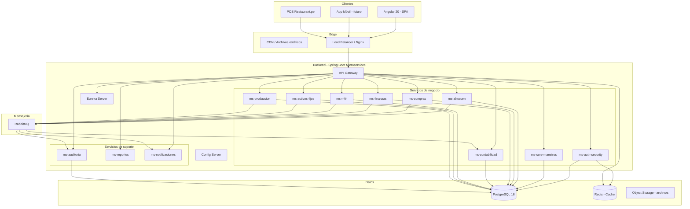

### 1.1 Módulos funcionales

| # | Módulo | Descripción | HUs |
|---|--------|-------------|:---:|
| 1 | **Configuraciones** | Empresa, sucursales, países, monedas, impuestos, parámetros, roles, permisos | 21 |
| 2 | **Almacén** | Inventario, stock, kardex, movimientos, valorización, devoluciones, traslados | 28 |
| 3 | **Compras** | OC, OS, aprobaciones, recepción, planificación de abastecimiento | 17 |
| 4 | **Ventas** | Integración con POS, documentos de venta, notas de crédito/débito | 19 |
| 5 | **Finanzas** | CxP, CxC, tesorería, conciliaciones, adelantos, caja, flujo de caja | 45 |
| 6 | **Contabilidad** | Plan contable, asientos, pre-asientos, cierres, EEFF, libros electrónicos | 37 |
| 7 | **Activos Fijos** | Registro, depreciación, seguros, traslados, bajas, revaluación | 28 |
| 8 | **RRHH** | Trabajadores, contratos, asistencia, planilla, liquidaciones, regulatorios | 42 |
| 9 | **Producción** | Recetas, órdenes de producción, costeo, consumo de almacén | 42 |
| | **Total** | | **279** |

### 1.2 Características transversales

| Característica | Descripción |
|----------------|-------------|
| **Multipaís** | Soporte para diferentes normativas fiscales, tributarias y laborales (Perú, Colombia, Chile, Rep. Dominicana) |
| **Multiempresa** | Múltiples razones sociales en la misma instancia |
| **Multisucursal** | Gestión por local/sucursal con consolidación corporativa |
| **Multimoneda** | Operaciones en diferentes monedas con tipo de cambio diario |
| **Auditoría completa** | Log de auditoría en todas las operaciones (quién, cuándo, qué, desde dónde) |
| **Integración contable nativa** | Todos los módulos operativos generan pre-asientos hacia Contabilidad |
| **Control de acceso granular** | Roles dinámicos, permisos por opción de menú y acción, asignación individual |
| **Exportación universal** | Exportación a Excel/PDF en todos los reportes y listados |
| **Carga masiva** | Importación de datos vía Excel con validaciones |
| **Configuración jerárquica** | 4 niveles: empresa → país → sucursal → usuario |

---

## 2. Principios de arquitectura

| Principio | Aplicación |
|-----------|------------|
| **Separación de responsabilidades** | Un microservicio por dominio funcional. Cada servicio gestiona su propia lógica y datos |
| **Base de datos por servicio** | Esquemas PostgreSQL aislados por microservicio. Sin acceso directo a tablas de otro servicio |
| **API First** | Contratos OpenAPI/Swagger definidos antes de implementar. Versionado de API obligatorio |
| **Event-Driven** | Operaciones que cruzan dominios se comunican por eventos (RabbitMQ). Pre-asientos contables son eventos |
| **Stateless** | Los microservicios no almacenan estado de sesión. JWT viaja en cada request |
| **Fail-fast / Circuit Breaker** | Resilience4j para tolerancia a fallos entre servicios |
| **Configuración externalizada** | Spring Cloud Config centraliza configuración por entorno y por país |
| **Inmutabilidad de datos** | Soft delete en vez de eliminación física. Auditoría de cambios vía eventos |
| **Clean Architecture** | Capas: Controller → Service → Repository. Lógica de negocio en Service, nunca en Controller |
| **DRY / SOLID** | Código limpio, reutilizable, con inyección de dependencias y responsabilidad única |

---

## 3. Stack tecnológico detallado

### 3.1 Backend

| Tecnología | Versión | Uso |
|------------|:-------:|-----|
| **Java** | 21 (LTS) | Lenguaje principal del backend |
| **Spring Boot** | 3.x | Framework base de cada microservicio |
| **Spring Cloud Gateway** | latest | API Gateway: ruteo, rate limiting, CORS, balanceo |
| **Spring Cloud Netflix Eureka** | latest | Service discovery: registro y localización de servicios |
| **Spring Cloud Config** | latest | Configuración centralizada (perfiles dev/qa/prod, por país) |
| **Spring Security** | 6.x | Autenticación y autorización con JWT |
| **Spring Data JPA / Hibernate** | latest | ORM para acceso a datos |
| **Flyway** | latest | Versionado y migración de esquemas de BD |
| **OpenFeign** | latest | Cliente HTTP declarativo para comunicación entre servicios |
| **Resilience4j** | latest | Circuit breaker, retry, rate limiter |
| **RabbitMQ** | 3.13+ | Mensajería asincrónica (eventos, pre-asientos, auditoría, notificaciones) |
| **MapStruct** | latest | Mapeo de DTOs a entidades y viceversa |
| **Lombok** | latest | Reducción de boilerplate (getters, setters, builders) |
| **JasperReports** | latest | Generación de reportes PDF/Excel |
| **SpringDoc OpenAPI** | latest | Documentación automática de APIs (Swagger UI) |
| **JUnit 5 + Mockito** | latest | Testing unitario y de integración |
| **Testcontainers** | latest | Tests de integración con PostgreSQL y RabbitMQ reales |

### 3.2 Frontend

| Tecnología | Versión | Uso |
|------------|:-------:|-----|
| **Angular** | 20 | Framework SPA principal |
| **TypeScript** | 5.x | Lenguaje de desarrollo frontend |
| **Angular Material** | 20 | Componentes UI (tablas, formularios, diálogos, menú) |
| **NgRx** | latest | State management (estado global de la aplicación) |
| **RxJS** | latest | Programación reactiva |
| **Angular Router** | 20 | Ruteo con lazy loading por módulo |
| **HttpInterceptor** | nativo | Inyección automática de JWT y manejo de errores HTTP |
| **Chart.js / ngx-charts** | latest | Gráficos y dashboards |
| **ngx-translate** | latest | Internacionalización (i18n) |
| **Jasmine + Karma** | latest | Testing unitario de componentes |
| **Cypress** | latest | Testing e2e |

### 3.3 Base de datos e infraestructura

| Tecnología | Versión | Uso |
|------------|:-------:|-----|
| **PostgreSQL** | 16 | Base de datos relacional principal |
| **Redis** | 7.x | Caché de sesiones, tokens, tipo de cambio, configuraciones |
| **Docker** | latest | Containerización de todos los servicios |
| **Docker Compose** | latest | Orquestación local de servicios |
| **Nginx** | latest | Reverse proxy / load balancer / serving del SPA |
| **Git** | latest | Control de versiones |
| **GitHub Actions** | latest | CI/CD pipelines |
| **SonarQube** | latest | Análisis estático de código |
| **Prometheus + Grafana** | latest | Monitoreo y observabilidad |
| **ELK Stack** | latest | Centralización de logs (Elasticsearch + Logstash + Kibana) |

---

## 4. Arquitectura de microservicios

### 4.1 Diagrama de servicios y comunicación

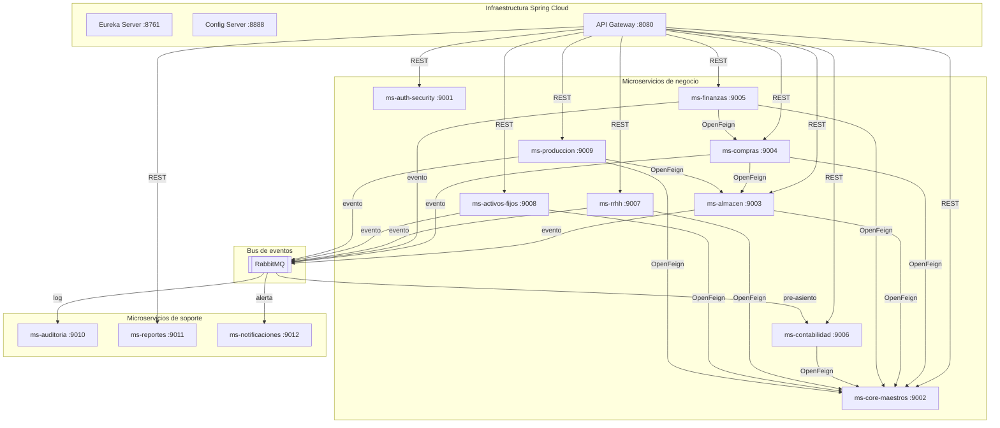

### 4.2 Flujo de una petición típica

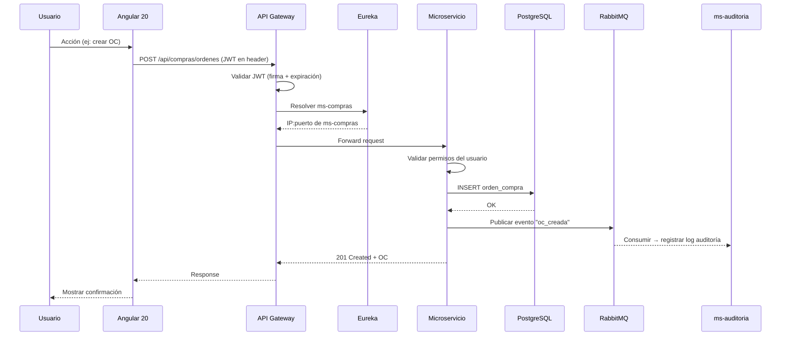

---

## 5. Catálogo de microservicios

### 5.1 Servicios de infraestructura (3)

| # | Servicio | Puerto | Responsabilidad |
|---|----------|:------:|-----------------|
| 1 | **eureka-server** | 8761 | Service discovery. Todos los servicios se registran aquí al iniciar. Permite descubrimiento dinámico sin hardcodear IPs |
| 2 | **config-server** | 8888 | Configuración centralizada. Almacena properties por servicio, por entorno (dev/qa/prod) y por país. Fuente: repositorio Git |
| 3 | **api-gateway** | 8080 | Punto de entrada único. Ruteo dinámico basado en Eureka. Rate limiting, CORS, balanceo de carga, validación de JWT |

### 5.2 Servicios de negocio (9)

| # | Servicio | Puerto | Esquema BD | Responsabilidad |
|---|----------|:------:|:----------:|-----------------|
| 4 | **ms-auth-security** | 9001 | `auth` | Autenticación (login/logout), generación y validación de JWT, gestión de usuarios, roles, opciones de menú, permisos granulares, asignación individual, sesiones |
| 5 | **ms-core-maestros** | 9002 | `core` | Maestros compartidos por todo el ERP: empresa, sucursal, país, moneda, tipo de cambio, relaciones comerciales (proveedor/cliente unificado), artículos, categorías, unidades de medida, impuestos, retenciones, detracciones, numeradores, condiciones de pago, formas de pago, configuración jerárquica (4 niveles) |
| 6 | **ms-almacen** | 9003 | `almacen` | Almacenes, tipos de movimiento, movimientos de inventario (ingreso/salida/traslado), kardex valorizado (promedio ponderado), stock en tiempo real, devoluciones a proveedor, inventario físico, ajustes, solicitudes de reposición, stock mínimo/máximo |
| 7 | **ms-compras** | 9004 | `compras` | Órdenes de compra, órdenes de servicio, workflow de aprobación multinivel (configurable por monto/tipo), recepción de mercadería con vinculación a OC, generación automática de movimiento de almacén, devoluciones, planificación de abastecimiento |
| 8 | **ms-finanzas** | 9005 | `finanzas` | Cuentas por pagar (desde OC y directas), cuentas por cobrar, tesorería, movimientos bancarios, conciliación bancaria, conciliación con pasarelas digitales (Niubiz, Yape, Plin), adelantos/órdenes de giro, fondo fijo, caja chica, flujo de caja, programación de pagos |
| 9 | **ms-contabilidad** | 9006 | `contabilidad` | Plan de cuentas contable jerárquico, centros de costo, asientos manuales y automáticos, motor de pre-asientos (recibe de todos los módulos), matrices contables, cierres mensuales y anuales, Estados Financieros (Balance, Resultados, Flujo de Efectivo, Patrimonio), libros electrónicos (PLE/SIRE) |
| 10 | **ms-rrhh** | 9007 | `rrhh` | Ficha del trabajador, contratos laborales, áreas y cargos, asistencia (POS/App/biométrico/GPS), conceptos de planilla, cálculo de planilla (sueldo, horas extra, CTS, gratificaciones, AFP, EsSalud), liquidaciones, beneficios sociales, propinas, recargo al consumo, archivos regulatorios (PLAME), boletas de pago |
| 11 | **ms-activos-fijos** | 9008 | `activos` | Registro de activos fijos vinculados a compra/factura, clasificación por clase/subclase, ubicación física jerárquica, depreciación mensual automática (lineal/decreciente/unidades), revaluación, seguros y pólizas, traslados con workflow, bajas |
| 12 | **ms-produccion** | 9009 | `produccion` | Recetas (BOM gastronómico) con merma, versiones de receta, órdenes de producción, consumo automático de almacén, costeo por receta (materia prima + mano de obra + indirectos) |

### 5.3 Servicios de soporte (3)

| # | Servicio | Puerto | Esquema BD | Responsabilidad |
|---|----------|:------:|:----------:|-----------------|
| 13 | **ms-auditoria** | 9010 | `auditoria` | Registro centralizado de auditoría. Consume eventos de todos los servicios. Log: quién, cuándo, qué entidad, qué acción, datos anteriores/nuevos (JSON), IP, user-agent |
| 14 | **ms-reportes** | 9011 | — | Motor de reportes (JasperReports). Exportación PDF/Excel. Consulta datos de otros servicios vía OpenFeign. Reportes compartidos entre módulos |
| 15 | **ms-notificaciones** | 9012 | — | Envío de correos electrónicos, alertas del sistema, recordatorios, notificaciones push. Consume eventos de RabbitMQ |

---

## 6. Arquitectura del backend (por microservicio)

Cada microservicio sigue la misma estructura interna basada en **Clean Architecture** con 4 capas:

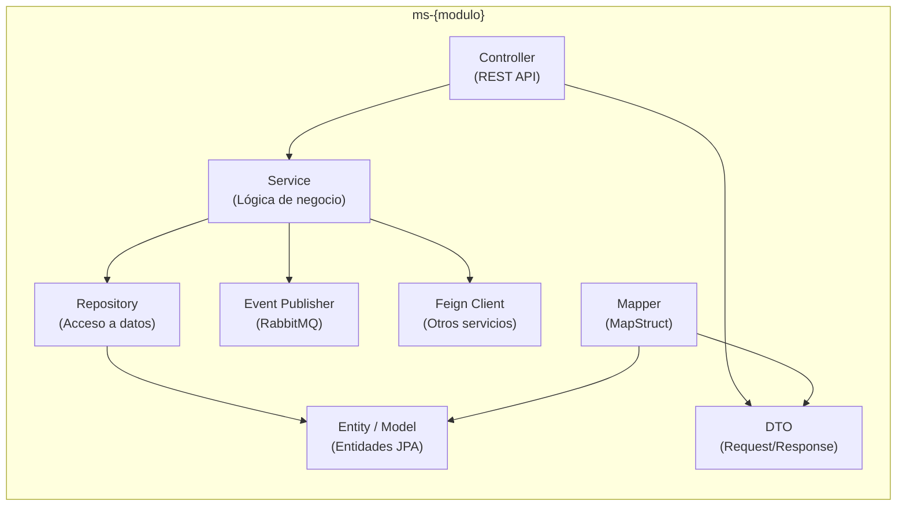

### 6.1 Estructura de paquetes (convención)

```
com.restaurantpe.{modulo}
├── config/                  # Configuración del microservicio
│   ├── SecurityConfig.java
│   ├── RabbitConfig.java
│   ├── SwaggerConfig.java
│   └── FeignConfig.java
├── controller/              # REST Controllers
│   ├── OrdenCompraController.java
│   └── RecepcionController.java
├── dto/                     # Data Transfer Objects
│   ├── request/
│   │   └── OrdenCompraRequest.java
│   └── response/
│       └── OrdenCompraResponse.java
├── entity/                  # Entidades JPA
│   ├── OrdenCompra.java
│   └── OrdenCompraDetalle.java
├── enums/                   # Enumeraciones
│   └── EstadoOrdenCompra.java
├── exception/               # Excepciones personalizadas
│   ├── BusinessException.java
│   └── GlobalExceptionHandler.java
├── feign/                   # Clientes Feign para otros servicios
│   └── CoreMaestrosClient.java
├── mapper/                  # MapStruct mappers
│   └── OrdenCompraMapper.java
├── event/                   # Eventos RabbitMQ
│   ├── publisher/
│   │   └── ComprasEventPublisher.java
│   └── listener/
│       └── ComprasEventListener.java
├── repository/              # Spring Data JPA Repositories
│   └── OrdenCompraRepository.java
├── service/                 # Lógica de negocio
│   ├── OrdenCompraService.java
│   └── impl/
│       └── OrdenCompraServiceImpl.java
├── specification/           # Filtros dinámicos (JPA Specifications)
│   └── OrdenCompraSpecification.java
└── util/                    # Utilidades
    └── NumeradorUtil.java
```

### 6.2 Convenciones de código

| Aspecto | Convención |
|---------|------------|
| **Naming clases** | PascalCase: `OrdenCompraService`, `KardexRepository` |
| **Naming métodos** | camelCase: `crearOrdenCompra()`, `calcularStockDisponible()` |
| **Naming paquetes** | lowercase: `com.restaurantpe.compras.service` |
| **DTOs** | Sufijo `Request` / `Response`: `OrdenCompraRequest`, `OrdenCompraResponse` |
| **Entidades** | Sin sufijo, nombre de tabla: `OrdenCompra`, `MovimientoAlmacen` |
| **Repositories** | Sufijo `Repository`: `OrdenCompraRepository` |
| **Services** | Interfaz + implementación: `OrdenCompraService` / `OrdenCompraServiceImpl` |
| **Controllers** | Sufijo `Controller`: `OrdenCompraController` |
| **Constantes** | UPPER_SNAKE_CASE: `ESTADO_APROBADA`, `MAX_INTENTOS` |
| **Endpoints** | kebab-case plural: `/api/compras/ordenes-compra`, `/api/almacen/movimientos` |

### 6.3 Entidad base (herencia)

Todas las entidades heredan de `BaseEntity` para garantizar auditoría y multiempresa:

```java
@MappedSuperclass
@EntityListeners(AuditingEntityListener.class)
public abstract class BaseEntity {
    
    @Id
    @GeneratedValue(strategy = GenerationType.IDENTITY)
    private Long id;
    
    @Column(name = "empresa_id", nullable = false)
    private Long empresaId;
    
    @Column(name = "activo", nullable = false)
    private Boolean activo = true;
    
    @CreatedBy
    @Column(name = "creado_por", updatable = false)
    private String creadoPor;
    
    @CreatedDate
    @Column(name = "creado_en", updatable = false)
    private LocalDateTime creadoEn;
    
    @LastModifiedBy
    @Column(name = "modificado_por")
    private String modificadoPor;
    
    @LastModifiedDate
    @Column(name = "modificado_en")
    private LocalDateTime modificadoEn;
}
```

---

## 7. Arquitectura del frontend (Angular 20)

### 7.1 Estructura del proyecto

```
restaurant-pe-frontend/
├── src/
│   ├── app/
│   │   ├── core/                        # Singleton: auth, interceptors, guards
│   │   │   ├── auth/
│   │   │   │   ├── auth.service.ts
│   │   │   │   ├── auth.guard.ts
│   │   │   │   └── jwt.interceptor.ts
│   │   │   ├── services/
│   │   │   │   ├── config.service.ts     # Configuración jerárquica
│   │   │   │   ├── empresa.service.ts    # Contexto empresa/sucursal
│   │   │   │   └── menu.service.ts       # Menú dinámico
│   │   │   └── models/
│   │   │       ├── usuario.model.ts
│   │   │       └── api-response.model.ts
│   │   ├── shared/                      # Componentes reutilizables
│   │   │   ├── components/
│   │   │   │   ├── data-table/           # Tabla con paginación, filtros, export
│   │   │   │   ├── form-field/           # Campos de formulario estandarizados
│   │   │   │   ├── search-dialog/        # Diálogos de búsqueda (proveedor, artículo)
│   │   │   │   ├── approval-badge/       # Badge de estado de aprobación
│   │   │   │   ├── file-upload/          # Carga de archivos/imágenes
│   │   │   │   └── confirm-dialog/       # Diálogos de confirmación
│   │   │   ├── directives/
│   │   │   │   ├── has-permission.directive.ts
│   │   │   │   └── currency-format.directive.ts
│   │   │   └── pipes/
│   │   │       ├── currency.pipe.ts
│   │   │       └── date-locale.pipe.ts
│   │   ├── layout/                      # Shell de la aplicación
│   │   │   ├── sidebar/                  # Menú lateral dinámico por módulo
│   │   │   ├── header/                   # Barra superior con empresa/sucursal
│   │   │   ├── footer/
│   │   │   └── breadcrumb/
│   │   ├── modules/                     # Módulos funcionales (lazy loaded)
│   │   │   ├── almacen/
│   │   │   │   ├── maestros/             # Almacenes, tipos movimiento
│   │   │   │   ├── operaciones/          # Movimientos, recepciones, traslados
│   │   │   │   ├── consultas/            # Kardex, stock, devoluciones
│   │   │   │   ├── reportes/             # Reportes del módulo
│   │   │   │   ├── almacen-routing.module.ts
│   │   │   │   └── almacen.module.ts
│   │   │   ├── compras/
│   │   │   ├── finanzas/
│   │   │   ├── contabilidad/
│   │   │   ├── rrhh/
│   │   │   ├── activos-fijos/
│   │   │   ├── produccion/
│   │   │   └── configuraciones/
│   │   ├── store/                       # NgRx State Management
│   │   │   ├── auth/
│   │   │   ├── empresa/
│   │   │   └── menu/
│   │   ├── app.component.ts
│   │   ├── app.routes.ts
│   │   └── app.config.ts
│   ├── assets/
│   │   ├── i18n/                        # Archivos de traducción
│   │   │   ├── es.json
│   │   │   ├── en.json
│   │   │   └── pt.json
│   │   └── images/
│   ├── environments/
│   │   ├── environment.ts
│   │   ├── environment.qa.ts
│   │   └── environment.prod.ts
│   └── styles/
│       ├── _variables.scss
│       ├── _theme.scss
│       └── styles.scss
├── angular.json
├── package.json
└── tsconfig.json
```

### 7.2 Flujo de carga del menú dinámico

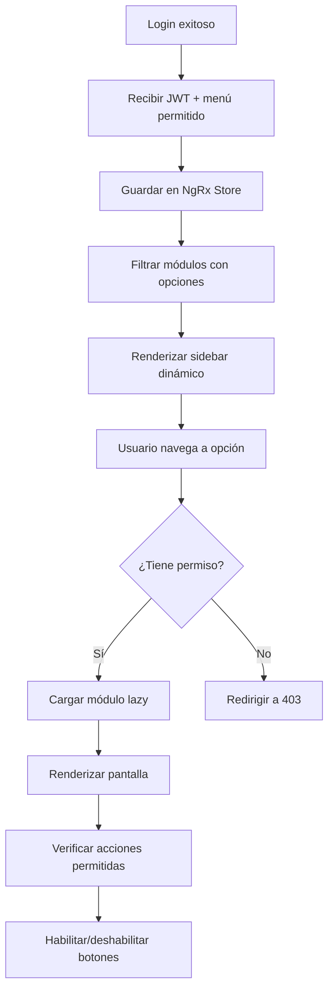

### 7.3 Interceptor JWT

Todas las peticiones HTTP pasan por un interceptor que:

1. Agrega el token JWT al header `Authorization: Bearer {token}`.
2. Si recibe **401**, intenta renovar el token (refresh token).
3. Si falla la renovación, redirige al login.
4. Agrega `X-Empresa-Id` y `X-Sucursal-Id` como headers de contexto.

### 7.4 Guard de permisos

Cada ruta del frontend está protegida por un `AuthGuard` que verifica:

1. Que el usuario esté autenticado (JWT válido).
2. Que la opción de menú correspondiente a la ruta esté en su rol o asignada individualmente.
3. Que tenga la acción requerida (ver, crear, editar, etc.).

---

## 8. Base de datos — PostgreSQL

### 8.1 Estrategia de esquemas

Se usa **una sola instancia de PostgreSQL** con **esquemas separados por microservicio**:

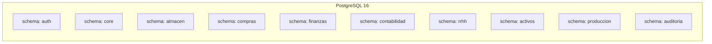

| Ventaja | Descripción |
|---------|-------------|
| Aislamiento lógico | Cada servicio solo accede a su esquema |
| Backup unificado | Un solo punto de backup y administración |
| Consultas cruzadas | Posibles cuando sea estrictamente necesario (DBA) |
| Migraciones independientes | Cada servicio versiona su esquema con Flyway |

### 8.2 Convenciones de la base de datos

| Aspecto | Convención |
|---------|------------|
| **Tablas y columnas** | `snake_case`: `orden_compra`, `fecha_emision` |
| **Claves primarias** | `id BIGSERIAL PRIMARY KEY` (autoincremental) |
| **Claves foráneas** | `{tabla}_id`: `proveedor_id`, `almacen_id` |
| **Multiempresa** | `empresa_id NOT NULL` en todas las tablas de negocio |
| **Multisucursal** | `sucursal_id` donde aplique (tablas operativas) |
| **Auditoría por registro** | `creado_por`, `creado_en`, `modificado_por`, `modificado_en` |
| **Soft delete** | `activo BOOLEAN DEFAULT true` (nunca DELETE físico) |
| **Índices** | Obligatorios en: `empresa_id`, FKs, campos de búsqueda frecuente |
| **Timestamps** | `TIMESTAMP WITH TIME ZONE` para todos los campos de fecha-hora |
| **Migraciones** | Flyway: `V{version}__{descripcion}.sql` |
| **Enums** | Almacenados como `VARCHAR`, no como tipo ENUM de PostgreSQL (portabilidad) |

### 8.3 Estrategia de índices

```sql
-- Índice compuesto para multiempresa (TODAS las tablas)
CREATE INDEX idx_{tabla}_empresa ON {tabla} (empresa_id);

-- Índice para búsquedas frecuentes
CREATE INDEX idx_articulo_codigo ON articulo (empresa_id, codigo);
CREATE INDEX idx_articulo_categoria ON articulo (empresa_id, categoria_id);
CREATE INDEX idx_relacion_comercial_doc ON relacion_comercial (empresa_id, numero_documento);

-- Índice para reportes por período
CREATE INDEX idx_movimiento_fecha ON movimiento_almacen (empresa_id, fecha);
CREATE INDEX idx_asiento_periodo ON asiento (empresa_id, periodo_anio, periodo_mes);
```

### 8.4 Migraciones Flyway

Cada microservicio tiene su carpeta de migraciones:

```
ms-compras/
└── src/main/resources/
    └── db/migration/
        ├── V1__create_schema_compras.sql
        ├── V2__create_table_orden_compra.sql
        ├── V3__create_table_orden_servicio.sql
        ├── V4__create_table_aprobacion.sql
        ├── V5__create_table_recepcion.sql
        └── V6__add_index_orden_compra.sql
```

---

## 9. Seguridad y control de acceso

### 9.1 Modelo de seguridad

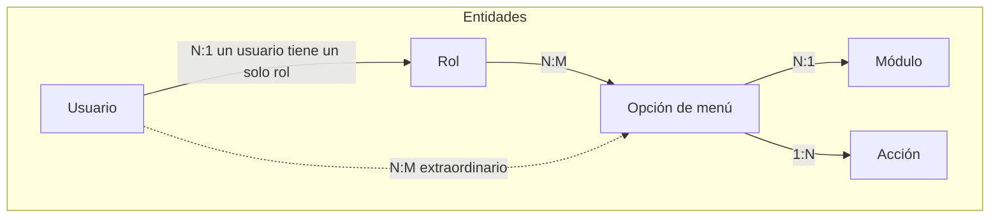

**Cardinalidades:**

- Un usuario tiene **un solo** rol (FK directo `rol_id` en tabla `usuario`).
- Un rol tiene **muchas** opciones de menú; una opción puede estar en **muchos** roles (N:M vía `rol_opcion_menu`).
- Una opción de menú pertenece a **un solo** módulo.
- Un usuario puede tener opciones de menú asignadas de forma **individual/extraordinaria** (N:M vía `usuario_opcion_menu`).

### 9.2 Flujo de autenticación

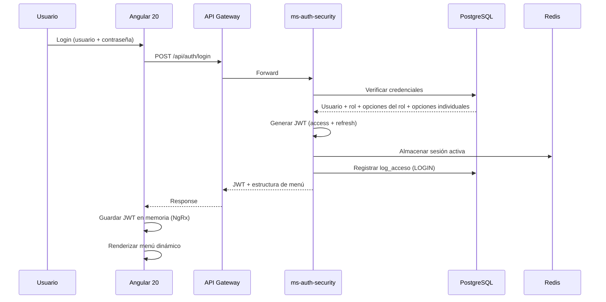

### 9.3 Estructura del JWT

```json
{
  "sub": "jramirez",
  "userId": 42,
  "empresaId": 1,
  "sucursalId": 3,
  "rolId": 7,
  "rolCodigo": "JEFE_ALMACEN",
  "permisos": ["ALM_MOV_VER", "ALM_MOV_CREAR", "COM_OC_VER"],
  "iat": 1738886400,
  "exp": 1738972800
}
```

| Campo | Descripción |
|-------|-------------|
| `sub` | Username del usuario |
| `userId` | ID del usuario |
| `empresaId` | Empresa seleccionada en el login |
| `sucursalId` | Sucursal seleccionada |
| `rolId` | ID del rol asignado |
| `rolCodigo` | Código del rol (para validaciones rápidas) |
| `permisos` | Array de códigos de permiso (opción_menú + acción) |
| `exp` | Expiración (configurable, default: 24 horas) |

### 9.4 Validación de permisos en el backend

Cada endpoint del backend valida permisos usando una anotación personalizada:

```java
@RestController
@RequestMapping("/api/compras/ordenes-compra")
public class OrdenCompraController {

    @PostMapping
    @RequirePermission(modulo = "COM", opcion = "OC", accion = "CREAR")
    public ResponseEntity<OrdenCompraResponse> crear(
            @RequestBody @Valid OrdenCompraRequest request) {
        // ...
    }

    @GetMapping
    @RequirePermission(modulo = "COM", opcion = "OC", accion = "VER")
    public ResponseEntity<Page<OrdenCompraResponse>> listar(
            @RequestParam Map<String, String> filtros, Pageable pageable) {
        // ...
    }
}
```

### 9.5 Tablas de seguridad (esquema `auth`)

| Tabla | Descripción |
|-------|-------------|
| `usuario` | id, username, password_hash, email, nombre, **rol_id** (FK), empresa_default_id, activo |
| `rol` | id, codigo, nombre, descripcion, empresa_id, activo |
| `modulo` | id, codigo, nombre, icono, orden |
| `opcion_menu` | id, modulo_id, padre_id, codigo, nombre, ruta_frontend, icono, orden, activo |
| `accion` | id, codigo, nombre (VER, CREAR, EDITAR, ELIMINAR, APROBAR, IMPRIMIR, EXPORTAR) |
| `permiso` | id, opcion_menu_id, accion_id |
| `rol_opcion_menu` | rol_id, opcion_menu_id (N:M) |
| `rol_permiso` | rol_id, permiso_id |
| `usuario_opcion_menu` | usuario_id, opcion_menu_id (individual/extraordinario) |
| `usuario_permiso` | usuario_id, permiso_id |
| `usuario_sucursal` | usuario_id, sucursal_id (sucursales asignadas al usuario) |
| `sesion` | id, usuario_id, token, ip, fecha_inicio, fecha_fin, activa |

---

## 10. Configuración jerárquica (4 niveles)

El sistema maneja configuraciones con **herencia y sobreescritura**. El valor más específico siempre prevalece.

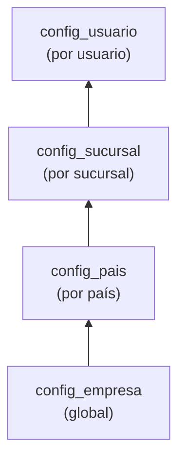

**Resolución:** `config_usuario` → `config_sucursal` → `config_pais` → `config_empresa` → `config_clave.valor_default`

| Nivel | Tabla | Ejemplo |
|-------|-------|---------|
| **Empresa (global)** | `config_empresa` | Moneda base, logo, política de aprobaciones |
| **País** | `config_pais` | IGV vs IVA vs ITBIS, formato RUC/NIT, regulaciones laborales |
| **Sucursal** | `config_sucursal` | Almacén por defecto, impresora, turno, caja |
| **Usuario** | `config_usuario` | Idioma, tema visual, formato fecha, sucursal preferida |

### Implementación en backend

```java
@Service
public class ConfigService {
    
    public String getConfig(String clave, Long empresaId, 
                           Long paisId, Long sucursalId, Long usuarioId) {
        // 1. Buscar en config_usuario
        Optional<String> valor = configUsuarioRepo.findByClave(usuarioId, clave);
        if (valor.isPresent()) return valor.get();
        
        // 2. Buscar en config_sucursal
        valor = configSucursalRepo.findByClave(sucursalId, clave);
        if (valor.isPresent()) return valor.get();
        
        // 3. Buscar en config_pais
        valor = configPaisRepo.findByClave(empresaId, paisId, clave);
        if (valor.isPresent()) return valor.get();
        
        // 4. Buscar en config_empresa
        valor = configEmpresaRepo.findByClave(empresaId, clave);
        if (valor.isPresent()) return valor.get();
        
        // 5. Valor por defecto del catálogo
        return configClaveRepo.findDefaultByClave(clave);
    }
}
```

---

## 11. Comunicación entre microservicios

### 11.1 Comunicación sincrónica (REST + OpenFeign)

Para consultas directas entre servicios que requieren respuesta inmediata.

```java
// En ms-compras: cliente Feign para consultar maestros
@FeignClient(name = "ms-core-maestros")
public interface CoreMaestrosClient {
    
    @GetMapping("/api/core/relaciones-comerciales/{id}")
    RelacionComercialResponse obtenerProveedor(@PathVariable Long id);
    
    @GetMapping("/api/core/articulos/{id}")
    ArticuloResponse obtenerArticulo(@PathVariable Long id);
    
    @PostMapping("/api/core/numeradores/siguiente")
    String obtenerSiguienteNumero(@RequestBody NumeradorRequest request);
}
```

| Origen | Destino | Uso |
|--------|---------|-----|
| ms-compras | ms-core-maestros | Validar proveedor, artículo, obtener numeración |
| ms-compras | ms-almacen | Verificar stock, crear movimiento por recepción |
| ms-almacen | ms-core-maestros | Obtener datos de artículo, unidades de medida |
| ms-finanzas | ms-core-maestros | Validar relación comercial, moneda, tipo de cambio |
| ms-finanzas | ms-compras | Vincular factura con OC |
| ms-rrhh | ms-core-maestros | Obtener datos de empresa, sucursal, moneda |
| ms-activos-fijos | ms-core-maestros | Obtener datos de proveedor, artículo |
| ms-produccion | ms-almacen | Consumir stock de insumos |
| ms-produccion | ms-core-maestros | Obtener artículos, recetas |
| ms-reportes | todos | Consultar datos para generar reportes |

### 11.2 Comunicación asincrónica (RabbitMQ)

Para operaciones que no requieren respuesta inmediata y cruzan dominios.

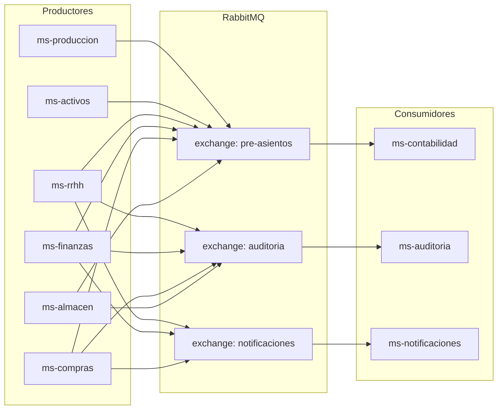

#### Exchanges y colas

| Exchange | Tipo | Cola | Consumidor | Evento |
|----------|------|------|------------|--------|
| `pre-asientos` | topic | `q.contabilidad.pre-asientos` | ms-contabilidad | Todos los módulos envían pre-asientos |
| `auditoria` | fanout | `q.auditoria.logs` | ms-auditoria | CRUD de cualquier entidad |
| `notificaciones` | topic | `q.notificaciones.email` | ms-notificaciones | Aprobaciones pendientes, alertas de stock, vencimientos |
| `notificaciones` | topic | `q.notificaciones.push` | ms-notificaciones | Alertas en tiempo real |

#### Estructura de un evento

```json
{
  "eventId": "uuid-v4",
  "eventType": "MOVIMIENTO_ALMACEN_CONFIRMADO",
  "timestamp": "2026-03-15T10:30:00Z",
  "empresaId": 1,
  "sucursalId": 3,
  "usuarioId": 42,
  "moduloOrigen": "ALMACEN",
  "payload": {
    "movimientoId": 1234,
    "tipoMovimiento": "INGRESO",
    "almacenId": 5,
    "totalValorizado": 15000.00,
    "monedaId": 1,
    "detalles": [
      { "articuloId": 100, "cantidad": 50, "costoUnitario": 300.00 }
    ]
  }
}
```

---

## 12. Motor de pre-asientos contables

Todos los módulos operativos generan **pre-asientos** que Contabilidad procesa para convertir en asientos contables.

### 12.1 Flujo

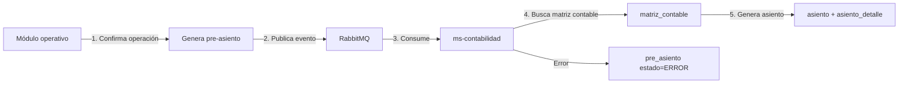

### 12.2 Matriz contable (reglas de contabilización)

| Módulo | Operación | Cuenta Debe | Cuenta Haber |
|--------|-----------|-------------|--------------|
| Almacén | Ingreso por compra | 20 - Mercaderías | 61 - Variación existencias |
| Almacén | Salida por consumo | 61 - Variación existencias | 20 - Mercaderías |
| Compras | Factura proveedor | 60 - Compras | 42 - CxP comerciales |
| Finanzas | Pago a proveedor | 42 - CxP comerciales | 10 - Efectivo |
| Finanzas | Cobro a cliente | 10 - Efectivo | 12 - CxC comerciales |
| RRHH | Planilla mensual | 62 - Gastos personal | 41 - Remuneraciones por pagar |
| Activos | Depreciación mensual | 68 - Depreciación | 39 - Depreciación acumulada |
| Producción | Consumo de insumos | 92 - Costo producción | 20 - Mercaderías |

### 12.3 Tabla pre_asiento

```sql
CREATE TABLE contabilidad.pre_asiento (
    id              BIGSERIAL PRIMARY KEY,
    empresa_id      BIGINT NOT NULL,
    modulo_origen   VARCHAR(20) NOT NULL,    -- ALMACEN, COMPRAS, FINANZAS...
    tipo_operacion  VARCHAR(50) NOT NULL,    -- INGRESO_ALMACEN, FACTURA_PROVEEDOR...
    documento_tipo  VARCHAR(20),             -- OC, FACTURA, PLANILLA...
    documento_id    BIGINT,
    fecha           DATE NOT NULL,
    estado          VARCHAR(20) DEFAULT 'PENDIENTE', -- PENDIENTE/PROCESADO/ERROR
    datos_json      JSONB NOT NULL,          -- Payload completo del evento
    asiento_id      BIGINT,                  -- FK al asiento generado (si procesado)
    error_mensaje   TEXT,                    -- Detalle del error si falla
    creado_en       TIMESTAMP DEFAULT NOW()
);
```

---

## 13. Auditoría y trazabilidad

### 13.1 Dos niveles de auditoría

| Nivel | Mecanismo | Datos |
|-------|-----------|-------|
| **Por registro** | Columnas en cada tabla | `creado_por`, `creado_en`, `modificado_por`, `modificado_en` |
| **Por operación** | Servicio centralizado (ms-auditoria) | Quién, cuándo, qué entidad, qué acción, datos antes/después, IP, user-agent |

### 13.2 Flujo de auditoría

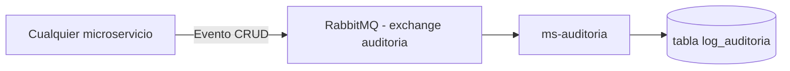

### 13.3 Estructura del log

```json
{
  "empresaId": 1,
  "usuarioId": 42,
  "username": "jramirez",
  "modulo": "COMPRAS",
  "entidad": "orden_compra",
  "entidadId": 1234,
  "accion": "CREAR",
  "datosAnteriores": null,
  "datosNuevos": { "numero": "OC-2026-001", "total": 15000.00, "estado": "BORRADOR" },
  "ip": "192.168.1.100",
  "userAgent": "Mozilla/5.0...",
  "fecha": "2026-03-15T10:30:00Z"
}
```

---

## 14. Reportes y exportación

### 14.1 Arquitectura del motor de reportes

| Componente | Tecnología | Uso |
|------------|------------|-----|
| **Motor** | JasperReports | Generación de reportes PDF |
| **Excel** | Apache POI | Exportación a Excel (.xlsx) |
| **Plantillas** | .jrxml | Diseño de reportes (se almacenan en ms-reportes) |
| **Datos** | OpenFeign | ms-reportes consulta datos de otros microservicios |

### 14.2 Reportes por módulo

| Módulo | Reportes |
|--------|----------|
| **Almacén** | Stock actual, kardex, movimientos por período, valorización, inventario físico, artículos bajo stock mínimo |
| **Compras** | OC pendientes, compras por proveedor, compras por período, recepciones |
| **Finanzas** | Estado de cuenta proveedor/cliente, flujo de caja, antigüedad de saldos, conciliación bancaria |
| **Contabilidad** | Balance General, Estado de Resultados, Flujo de Efectivo, Estado de Patrimonio, libros electrónicos |
| **RRHH** | Planilla, asistencia, headcount, rotación, boletas de pago, PLAME |
| **Activos** | Depreciación acumulada, activos por ubicación, seguros vigentes |
| **Producción** | Costos por receta, consumos, rendimiento |

---

## 15. Notificaciones

### 15.1 Tipos de notificación

| Tipo | Canal | Ejemplo |
|------|-------|---------|
| **Email** | SMTP / SendGrid | Notificación de OC pendiente de aprobación |
| **Push** | WebSocket (STOMP) | Alerta de stock bajo mínimo en tiempo real |
| **In-app** | Base de datos + polling | Recordatorios de tareas pendientes |
| **Archivos** | Generación automática | Boletas de pago (PDF), PLAME (TXT) |

### 15.2 Eventos que disparan notificaciones

| Evento | Notificación | Destinatario |
|--------|-------------|--------------|
| OC creada pendiente aprobación | Email + push | Aprobador(es) del nivel |
| OC aprobada/rechazada | Email | Creador de la OC |
| Stock bajo punto de reorden | Push in-app | Responsable de almacén |
| Vencimiento de contrato laboral | Email | Jefe RRHH + trabajador |
| Póliza de seguro próxima a vencer | Email | Responsable de activos |
| Planilla calculada lista para aprobación | Email + push | Gerente RRHH |
| Cierre contable completado | Email | Contador principal |

---

## 16. Infraestructura y DevOps

### 16.1 Contenedores Docker

Cada microservicio tiene su propio `Dockerfile`:

```dockerfile
FROM eclipse-temurin:21-jre-alpine
WORKDIR /app
COPY target/ms-compras-*.jar app.jar
EXPOSE 9004
ENTRYPOINT ["java", "-jar", "app.jar"]
```

### 16.2 Docker Compose (desarrollo local)

```yaml
services:
  # Infraestructura
  postgres:
    image: postgres:16-alpine
    ports: ["5432:5432"]
    volumes: [pgdata:/var/lib/postgresql/data]
    
  rabbitmq:
    image: rabbitmq:3-management-alpine
    ports: ["5672:5672", "15672:15672"]
    
  redis:
    image: redis:7-alpine
    ports: ["6379:6379"]

  # Spring Cloud
  eureka-server:
    build: ./eureka-server
    ports: ["8761:8761"]
    
  config-server:
    build: ./config-server
    ports: ["8888:8888"]
    depends_on: [eureka-server]
    
  api-gateway:
    build: ./api-gateway
    ports: ["8080:8080"]
    depends_on: [eureka-server, config-server]

  # Microservicios de negocio
  ms-auth-security:
    build: ./ms-auth-security
    ports: ["9001:9001"]
    depends_on: [postgres, eureka-server, config-server, redis]
    
  ms-core-maestros:
    build: ./ms-core-maestros
    ports: ["9002:9002"]
    depends_on: [postgres, eureka-server, config-server]

  # ... (demás microservicios)
```

### 16.3 CI/CD Pipeline (GitHub Actions)

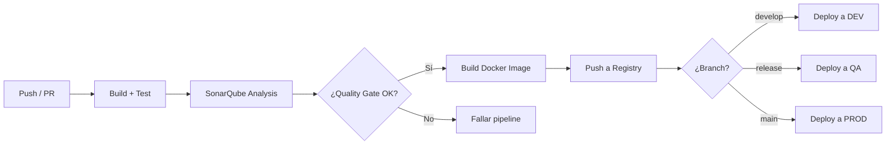

### 16.4 Monitoreo

| Herramienta | Uso |
|-------------|-----|
| **Spring Boot Actuator** | Health checks, métricas por servicio |
| **Prometheus** | Recolección de métricas |
| **Grafana** | Dashboards de monitoreo (CPU, memoria, latencia, errores) |
| **ELK Stack** | Centralización de logs (Elasticsearch + Logstash + Kibana) |
| **Spring Sleuth + Zipkin** | Tracing distribuido entre microservicios |

---

## 17. Entornos

| Entorno | Propósito | Infraestructura | Base de datos |
|---------|-----------|-----------------|---------------|
| **DEV** | Desarrollo y pruebas de integración | Docker Compose local | PostgreSQL local (datos de prueba) |
| **QA** | Pruebas funcionales, UAT, regresión | Docker en servidor de staging | PostgreSQL con datos de prueba realistas |
| **PROD** | Producción | Docker / Kubernetes en cloud | PostgreSQL dedicado con backup automático |

Cada entorno tiene su perfil de Spring Cloud Config:

```
application-dev.yml     # Configuración desarrollo
application-qa.yml      # Configuración QA
application-prod.yml    # Configuración producción
application-PE.yml      # Configuración Perú
application-CO.yml      # Configuración Colombia
```

---

## 18. Estándares de API REST

### 18.1 Estructura de URLs

```
/api/{modulo}/{recurso}                    # Colección
/api/{modulo}/{recurso}/{id}               # Recurso específico
/api/{modulo}/{recurso}/{id}/{sub-recurso} # Sub-recurso

Ejemplos:
GET    /api/compras/ordenes-compra              # Listar OC
POST   /api/compras/ordenes-compra              # Crear OC
GET    /api/compras/ordenes-compra/123           # Obtener OC 123
PUT    /api/compras/ordenes-compra/123           # Actualizar OC 123
DELETE /api/compras/ordenes-compra/123           # Desactivar OC 123 (soft delete)
GET    /api/compras/ordenes-compra/123/detalle   # Detalle de OC 123
POST   /api/compras/ordenes-compra/123/aprobar   # Acción: aprobar OC 123
```

### 18.2 Paginación

```json
GET /api/almacen/movimientos?page=0&size=20&sort=fecha,desc

{
  "content": [...],
  "page": {
    "number": 0,
    "size": 20,
    "totalElements": 156,
    "totalPages": 8
  }
}
```

### 18.3 Filtrado

```
GET /api/compras/ordenes-compra?proveedorId=15&estado=APROBADA&fechaDesde=2026-03-01&fechaHasta=2026-03-31
```

### 18.4 Response estándar

```json
{
  "success": true,
  "data": { ... },
  "message": "Orden de compra creada exitosamente",
  "timestamp": "2026-03-15T10:30:00Z"
}
```

### 18.5 Versionado de API

```
/api/v1/compras/ordenes-compra    # Versión 1 (default)
/api/v2/compras/ordenes-compra    # Versión 2 (cuando sea necesario)
```

---

## 19. Manejo de errores

### 19.1 Códigos HTTP

| Código | Uso |
|:------:|-----|
| `200` | OK — consulta exitosa |
| `201` | Created — recurso creado |
| `204` | No Content — eliminación exitosa |
| `400` | Bad Request — validación fallida |
| `401` | Unauthorized — sin autenticación |
| `403` | Forbidden — sin permisos |
| `404` | Not Found — recurso no encontrado |
| `409` | Conflict — conflicto de negocio (ej: stock insuficiente) |
| `422` | Unprocessable Entity — error de regla de negocio |
| `500` | Internal Server Error — error no controlado |
| `503` | Service Unavailable — servicio caído (circuit breaker abierto) |

### 19.2 Estructura de error

```json
{
  "success": false,
  "error": {
    "code": "COM-001",
    "message": "No se puede aprobar una OC con monto cero",
    "details": [
      { "field": "total", "message": "El total debe ser mayor a 0" }
    ],
    "timestamp": "2026-03-15T10:30:00Z",
    "path": "/api/compras/ordenes-compra/123/aprobar"
  }
}
```

### 19.3 Códigos de error por módulo

| Prefijo | Módulo |
|---------|--------|
| `AUTH-xxx` | Autenticación y seguridad |
| `CORE-xxx` | Maestros compartidos |
| `ALM-xxx` | Almacén |
| `COM-xxx` | Compras |
| `FIN-xxx` | Finanzas |
| `CNT-xxx` | Contabilidad |
| `RRHH-xxx` | Recursos Humanos |
| `AF-xxx` | Activos Fijos |
| `PROD-xxx` | Producción |

### 19.4 Exception Handler global

```java
@RestControllerAdvice
public class GlobalExceptionHandler {

    @ExceptionHandler(BusinessException.class)
    public ResponseEntity<ApiError> handleBusinessException(BusinessException ex) {
        return ResponseEntity.status(HttpStatus.UNPROCESSABLE_ENTITY)
            .body(ApiError.of(ex.getCode(), ex.getMessage()));
    }

    @ExceptionHandler(ResourceNotFoundException.class)
    public ResponseEntity<ApiError> handleNotFound(ResourceNotFoundException ex) {
        return ResponseEntity.status(HttpStatus.NOT_FOUND)
            .body(ApiError.of("NOT_FOUND", ex.getMessage()));
    }

    @ExceptionHandler(AccessDeniedException.class)
    public ResponseEntity<ApiError> handleAccessDenied(AccessDeniedException ex) {
        return ResponseEntity.status(HttpStatus.FORBIDDEN)
            .body(ApiError.of("AUTH-003", "No tiene permisos para esta operación"));
    }

    @ExceptionHandler(MethodArgumentNotValidException.class)
    public ResponseEntity<ApiError> handleValidation(MethodArgumentNotValidException ex) {
        List<FieldError> errors = ex.getBindingResult().getFieldErrors().stream()
            .map(f -> new FieldError(f.getField(), f.getDefaultMessage()))
            .toList();
        return ResponseEntity.badRequest()
            .body(ApiError.of("VALIDATION", "Error de validación", errors));
    }
}
```

---

## 20. Modelo de datos completo

### 20.1 Diagrama ER resumen

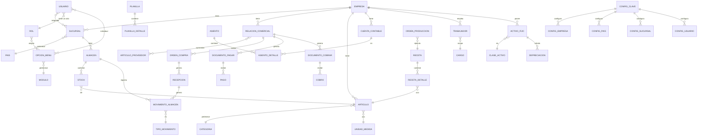

### 20.2 Conteo de tablas por esquema

| Esquema | Tablas | Descripción |
|---------|:------:|-------------|
| `auth` | 11 | Usuarios, roles, permisos, menú, sesiones |
| `core` | 25+ | Empresa, sucursal, país, moneda, artículos, categorías, impuestos, configuración |
| `almacen` | 7 | Movimientos, kardex, stock, inventario físico |
| `compras` | 7 | OC, OS, aprobaciones, recepción |
| `finanzas` | 12 | CxP, CxC, tesorería, conciliación, adelantos |
| `contabilidad` | 7 | Asientos, pre-asientos, matrices, cierres |
| `rrhh` | 11 | Trabajadores, planilla, asistencia, liquidaciones |
| `activos` | 7 | Activos, depreciación, seguros, traslados |
| `produccion` | 5 | Recetas, órdenes, costeo |
| `auditoria` | 2 | Log de auditoría, log de acceso |
| **Total** | **94+** | |

> **Nota:** El detalle completo de cada tabla (campos, tipos, descripciones) se encuentra en el documento `ROADMAP_RESTAURANT_PE.md`, secciones 11.1 a 11.9.

---

## 21. Patrones de diseño aplicados

| Patrón | Dónde se aplica | Justificación |
|--------|----------------|---------------|
| **API Gateway** | Spring Cloud Gateway | Punto de entrada único, desacopla frontend de microservicios |
| **Service Discovery** | Eureka Server | Los servicios se descubren dinámicamente sin hardcodear IPs |
| **Circuit Breaker** | Resilience4j | Tolerancia a fallos cuando un servicio no responde |
| **Event-Driven** | RabbitMQ | Pre-asientos contables, auditoría, notificaciones |
| **CQRS (parcial)** | Separación lectura/escritura en reportes | ms-reportes solo lee, no escribe |
| **Repository Pattern** | Spring Data JPA | Abstracción de acceso a datos |
| **DTO Pattern** | Request/Response DTOs | Nunca se exponen entidades JPA directamente |
| **Strategy Pattern** | Métodos de costeo (promedio, PEPS, UEPS) | Algoritmo intercambiable por configuración |
| **Observer Pattern** | Eventos RabbitMQ | Publicar/suscribir entre módulos desacoplados |
| **Template Method** | BaseEntity | Auditoría y multiempresa heredada por todas las entidades |
| **Builder Pattern** | Lombok @Builder | Construcción fluida de objetos complejos |
| **Specification Pattern** | JPA Specifications | Filtros dinámicos en consultas (reportes, listados) |
| **Decorator** | JWT Interceptor (Angular) | Agrega headers de autenticación a todas las peticiones |
| **Lazy Loading** | Angular Modules | Carga de módulos bajo demanda para performance |

---

## 22. Requisitos no funcionales

| Requisito | Especificación |
|-----------|---------------|
| **Disponibilidad** | 99.5% uptime en horario operativo (6am–12am) |
| **Tiempo de respuesta** | < 2 segundos para operaciones CRUD, < 5 segundos para reportes |
| **Concurrencia** | Soporte para 200+ usuarios simultáneos |
| **Escalabilidad** | Horizontal: cada microservicio puede escalar independientemente |
| **Seguridad** | JWT con expiración, HTTPS obligatorio, passwords hasheados (BCrypt), rate limiting |
| **Backup** | PostgreSQL: backup diario automático, retención 30 días |
| **Recuperación** | RPO: 1 hora, RTO: 4 horas |
| **Idiomas** | Español (default), inglés, portugués (i18n en frontend) |
| **Navegadores** | Chrome 90+, Firefox 90+, Edge 90+, Safari 15+ |
| **Resolución** | Responsive: 1024px mínimo, optimizado para 1366px y 1920px |
| **Accesibilidad** | WCAG 2.1 nivel AA |
| **Datos** | Retención mínima: 5 años de datos transaccionales |
| **Logs** | Retención: 90 días en Elasticsearch, 1 año en almacenamiento frío |

---

## 23. Endpoints por microservicio

A continuación se detallan **todos los endpoints REST** de cada microservicio. Convención: `{id}` = path variable, query params para filtros y paginación.

> **Headers obligatorios en todas las peticiones (excepto login):**  
> `Authorization: Bearer {jwt_token}`  
> `X-Empresa-Id: {empresaId}`  
> `X-Sucursal-Id: {sucursalId}`

---

### 23.1 ms-auth-security (:9001)

#### Autenticación

| Método | Endpoint | Descripción |
|:------:|----------|-------------|
| POST | `/api/auth/login` | Iniciar sesión (devuelve JWT + menú) |
| POST | `/api/auth/refresh` | Renovar token con refresh token |
| POST | `/api/auth/logout` | Cerrar sesión (invalidar token) |
| GET | `/api/auth/me` | Obtener datos del usuario autenticado |
| PUT | `/api/auth/cambiar-password` | Cambiar contraseña del usuario autenticado |

#### Usuarios

| Método | Endpoint | Descripción |
|:------:|----------|-------------|
| GET | `/api/auth/usuarios` | Listar usuarios (paginado, filtros) |
| GET | `/api/auth/usuarios/{id}` | Obtener usuario por ID |
| POST | `/api/auth/usuarios` | Crear usuario |
| PUT | `/api/auth/usuarios/{id}` | Actualizar usuario |
| DELETE | `/api/auth/usuarios/{id}` | Desactivar usuario (soft delete) |
| PUT | `/api/auth/usuarios/{id}/reset-password` | Resetear contraseña |
| GET | `/api/auth/usuarios/{id}/sucursales` | Sucursales asignadas al usuario |
| PUT | `/api/auth/usuarios/{id}/sucursales` | Asignar sucursales al usuario |
| GET | `/api/auth/usuarios/{id}/opciones-menu` | Opciones de menú individuales del usuario |
| PUT | `/api/auth/usuarios/{id}/opciones-menu` | Asignar opciones de menú individuales |

#### Roles

| Método | Endpoint | Descripción |
|:------:|----------|-------------|
| GET | `/api/auth/roles` | Listar roles |
| GET | `/api/auth/roles/{id}` | Obtener rol por ID |
| POST | `/api/auth/roles` | Crear rol |
| PUT | `/api/auth/roles/{id}` | Actualizar rol |
| DELETE | `/api/auth/roles/{id}` | Desactivar rol |
| GET | `/api/auth/roles/{id}/opciones-menu` | Opciones de menú del rol |
| PUT | `/api/auth/roles/{id}/opciones-menu` | Asignar opciones de menú al rol |
| GET | `/api/auth/roles/{id}/permisos` | Permisos granulares del rol |
| PUT | `/api/auth/roles/{id}/permisos` | Asignar permisos al rol |

#### Módulos y menú

| Método | Endpoint | Descripción |
|:------:|----------|-------------|
| GET | `/api/auth/modulos` | Listar módulos del ERP |
| GET | `/api/auth/opciones-menu` | Listar todas las opciones de menú |
| GET | `/api/auth/opciones-menu/arbol` | Árbol jerárquico de opciones por módulo |
| GET | `/api/auth/acciones` | Listar acciones posibles (VER, CREAR, EDITAR...) |

#### Sesiones

| Método | Endpoint | Descripción |
|:------:|----------|-------------|
| GET | `/api/auth/sesiones` | Listar sesiones activas |
| DELETE | `/api/auth/sesiones/{id}` | Cerrar sesión específica |

---

### 23.2 ms-core-maestros (:9002)

#### Empresa y estructura organizacional

| Método | Endpoint | Descripción |
|:------:|----------|-------------|
| GET | `/api/core/empresas` | Listar empresas |
| GET | `/api/core/empresas/{id}` | Obtener empresa |
| POST | `/api/core/empresas` | Crear empresa |
| PUT | `/api/core/empresas/{id}` | Actualizar empresa |
| GET | `/api/core/sucursales` | Listar sucursales (filtro por empresa) |
| GET | `/api/core/sucursales/{id}` | Obtener sucursal |
| POST | `/api/core/sucursales` | Crear sucursal |
| PUT | `/api/core/sucursales/{id}` | Actualizar sucursal |

#### Geografía

| Método | Endpoint | Descripción |
|:------:|----------|-------------|
| GET | `/api/core/paises` | Listar países |
| GET | `/api/core/paises/{id}/departamentos` | Departamentos de un país |
| GET | `/api/core/departamentos/{id}/provincias` | Provincias de un departamento |
| GET | `/api/core/provincias/{id}/distritos` | Distritos de una provincia |

#### Monedas y tipo de cambio

| Método | Endpoint | Descripción |
|:------:|----------|-------------|
| GET | `/api/core/monedas` | Listar monedas |
| POST | `/api/core/monedas` | Crear moneda |
| PUT | `/api/core/monedas/{id}` | Actualizar moneda |
| GET | `/api/core/tipos-cambio` | Listar tipos de cambio (filtro por fecha, moneda) |
| GET | `/api/core/tipos-cambio/fecha/{fecha}` | Tipo de cambio de una fecha |
| POST | `/api/core/tipos-cambio` | Registrar tipo de cambio |

#### Relaciones comerciales (proveedor/cliente unificado)

| Método | Endpoint | Descripción |
|:------:|----------|-------------|
| GET | `/api/core/relaciones-comerciales` | Listar (filtro: esProveedor, esCliente, documento) |
| GET | `/api/core/relaciones-comerciales/{id}` | Obtener relación comercial |
| POST | `/api/core/relaciones-comerciales` | Crear relación comercial |
| PUT | `/api/core/relaciones-comerciales/{id}` | Actualizar relación comercial |
| DELETE | `/api/core/relaciones-comerciales/{id}` | Desactivar |
| GET | `/api/core/relaciones-comerciales/{id}/contactos` | Contactos de la relación |
| POST | `/api/core/relaciones-comerciales/{id}/contactos` | Agregar contacto |
| GET | `/api/core/relaciones-comerciales/{id}/cuentas-bancarias` | Cuentas bancarias |
| POST | `/api/core/relaciones-comerciales/{id}/cuentas-bancarias` | Agregar cuenta bancaria |
| GET | `/api/core/tipos-documento-identidad` | Listar tipos (RUC, DNI, NIT...) |

#### Artículos y clasificación

| Método | Endpoint | Descripción |
|:------:|----------|-------------|
| GET | `/api/core/articulos` | Listar artículos (paginado, filtros) |
| GET | `/api/core/articulos/{id}` | Obtener artículo completo |
| POST | `/api/core/articulos` | Crear artículo |
| PUT | `/api/core/articulos/{id}` | Actualizar artículo |
| DELETE | `/api/core/articulos/{id}` | Desactivar artículo |
| GET | `/api/core/articulos/{id}/proveedores` | Proveedores del artículo |
| POST | `/api/core/articulos/{id}/proveedores` | Asociar proveedor a artículo |
| GET | `/api/core/articulos/{id}/almacenes` | Config de stock por almacén |
| POST | `/api/core/articulos/{id}/almacenes` | Configurar artículo en almacén |
| GET | `/api/core/categorias` | Listar categorías (jerárquico) |
| GET | `/api/core/categorias/arbol` | Árbol completo de categorías |
| POST | `/api/core/categorias` | Crear categoría |
| PUT | `/api/core/categorias/{id}` | Actualizar categoría |
| GET | `/api/core/unidades-medida` | Listar unidades de medida |
| POST | `/api/core/unidades-medida` | Crear unidad |
| GET | `/api/core/conversiones-unidad` | Listar conversiones |
| POST | `/api/core/conversiones-unidad` | Crear conversión |
| GET | `/api/core/naturalezas-contables` | Listar naturalezas contables |
| POST | `/api/core/naturalezas-contables` | Crear naturaleza contable |

#### Impuestos y retenciones

| Método | Endpoint | Descripción |
|:------:|----------|-------------|
| GET | `/api/core/impuestos` | Listar impuestos (filtro por país) |
| POST | `/api/core/impuestos` | Crear impuesto |
| PUT | `/api/core/impuestos/{id}` | Actualizar impuesto |
| GET | `/api/core/retenciones` | Listar retenciones |
| POST | `/api/core/retenciones` | Crear retención |
| GET | `/api/core/detracciones` | Listar detracciones |
| POST | `/api/core/detracciones` | Crear detracción |

#### Numeradores, condiciones y formas de pago

| Método | Endpoint | Descripción |
|:------:|----------|-------------|
| GET | `/api/core/numeradores` | Listar numeradores |
| POST | `/api/core/numeradores` | Crear numerador |
| POST | `/api/core/numeradores/siguiente` | Obtener siguiente número |
| GET | `/api/core/condiciones-pago` | Listar condiciones de pago |
| POST | `/api/core/condiciones-pago` | Crear condición de pago |
| GET | `/api/core/formas-pago` | Listar formas de pago |
| POST | `/api/core/formas-pago` | Crear forma de pago |

#### Configuración jerárquica

| Método | Endpoint | Descripción |
|:------:|----------|-------------|
| GET | `/api/core/config/claves` | Catálogo de claves de configuración |
| GET | `/api/core/config/resolver?clave={clave}` | Resolver valor (busca en los 4 niveles) |
| GET | `/api/core/config/empresa` | Configuraciones a nivel empresa |
| PUT | `/api/core/config/empresa` | Guardar configuración empresa |
| GET | `/api/core/config/pais/{paisId}` | Configuraciones a nivel país |
| PUT | `/api/core/config/pais/{paisId}` | Guardar configuración país |
| GET | `/api/core/config/sucursal/{sucursalId}` | Configuraciones a nivel sucursal |
| PUT | `/api/core/config/sucursal/{sucursalId}` | Guardar configuración sucursal |
| GET | `/api/core/config/usuario/{usuarioId}` | Configuraciones a nivel usuario |
| PUT | `/api/core/config/usuario/{usuarioId}` | Guardar configuración usuario |

#### Tablas auxiliares

| Método | Endpoint | Descripción |
|:------:|----------|-------------|
| GET | `/api/core/ejercicios-periodos` | Listar ejercicios y períodos |
| POST | `/api/core/ejercicios-periodos` | Crear ejercicio/período |
| PUT | `/api/core/ejercicios-periodos/{id}` | Actualizar estado (ABIERTO/CERRADO) |
| GET | `/api/core/parametros-sistema` | Listar parámetros del sistema |
| PUT | `/api/core/parametros-sistema` | Actualizar parámetros |

---

### 23.3 ms-almacen (:9003)

#### Almacenes

| Método | Endpoint | Descripción |
|:------:|----------|-------------|
| GET | `/api/almacen/almacenes` | Listar almacenes (filtro por sucursal) |
| GET | `/api/almacen/almacenes/{id}` | Obtener almacén |
| POST | `/api/almacen/almacenes` | Crear almacén |
| PUT | `/api/almacen/almacenes/{id}` | Actualizar almacén |

#### Tipos de movimiento

| Método | Endpoint | Descripción |
|:------:|----------|-------------|
| GET | `/api/almacen/tipos-movimiento` | Listar tipos de movimiento |
| POST | `/api/almacen/tipos-movimiento` | Crear tipo de movimiento |
| PUT | `/api/almacen/tipos-movimiento/{id}` | Actualizar tipo |

#### Movimientos de almacén

| Método | Endpoint | Descripción |
|:------:|----------|-------------|
| GET | `/api/almacen/movimientos` | Listar movimientos (paginado, filtros: almacén, fecha, tipo) |
| GET | `/api/almacen/movimientos/{id}` | Obtener movimiento con detalle |
| POST | `/api/almacen/movimientos` | Crear movimiento (borrador) |
| PUT | `/api/almacen/movimientos/{id}` | Actualizar movimiento (solo borrador) |
| POST | `/api/almacen/movimientos/{id}/confirmar` | Confirmar movimiento (actualiza stock y kardex) |
| POST | `/api/almacen/movimientos/{id}/anular` | Anular movimiento |

#### Stock y kardex

| Método | Endpoint | Descripción |
|:------:|----------|-------------|
| GET | `/api/almacen/stock` | Consultar stock (filtros: almacén, artículo, categoría) |
| GET | `/api/almacen/stock/{articuloId}/almacen/{almacenId}` | Stock de un artículo en un almacén |
| GET | `/api/almacen/kardex` | Consultar kardex (filtros: artículo, almacén, fechaDesde, fechaHasta) |
| GET | `/api/almacen/stock/bajo-minimo` | Artículos con stock bajo mínimo |
| POST | `/api/almacen/stock/reprocesar` | Reprocesar saldos de inventario |

#### Inventario físico

| Método | Endpoint | Descripción |
|:------:|----------|-------------|
| GET | `/api/almacen/inventarios-fisicos` | Listar tomas de inventario |
| GET | `/api/almacen/inventarios-fisicos/{id}` | Obtener inventario con detalle |
| POST | `/api/almacen/inventarios-fisicos` | Iniciar toma de inventario |
| PUT | `/api/almacen/inventarios-fisicos/{id}/detalle` | Registrar conteo físico |
| POST | `/api/almacen/inventarios-fisicos/{id}/comparar` | Comparar físico vs sistema |
| POST | `/api/almacen/inventarios-fisicos/{id}/ajustar` | Aplicar ajustes de inventario |

#### Traslados y devoluciones

| Método | Endpoint | Descripción |
|:------:|----------|-------------|
| POST | `/api/almacen/traslados` | Crear traslado entre almacenes |
| POST | `/api/almacen/traslados/{id}/confirmar-recepcion` | Confirmar recepción de traslado |
| POST | `/api/almacen/devoluciones` | Registrar devolución a proveedor |
| GET | `/api/almacen/devoluciones` | Consultar devoluciones |

#### Reportes

| Método | Endpoint | Descripción |
|:------:|----------|-------------|
| GET | `/api/almacen/reportes/stock-actual` | Reporte de stock actual |
| GET | `/api/almacen/reportes/kardex` | Reporte de kardex valorizado |
| GET | `/api/almacen/reportes/movimientos` | Reporte de movimientos por período |
| GET | `/api/almacen/reportes/valorizacion` | Valorización económica del stock |

---

### 23.4 ms-compras (:9004)

#### Órdenes de compra

| Método | Endpoint | Descripción |
|:------:|----------|-------------|
| GET | `/api/compras/ordenes-compra` | Listar OC (paginado, filtros) |
| GET | `/api/compras/ordenes-compra/{id}` | Obtener OC con detalle |
| POST | `/api/compras/ordenes-compra` | Crear OC |
| PUT | `/api/compras/ordenes-compra/{id}` | Actualizar OC (solo borrador) |
| DELETE | `/api/compras/ordenes-compra/{id}` | Anular OC |
| POST | `/api/compras/ordenes-compra/{id}/enviar-aprobacion` | Enviar a aprobación |
| POST | `/api/compras/ordenes-compra/{id}/aprobar` | Aprobar OC |
| POST | `/api/compras/ordenes-compra/{id}/rechazar` | Rechazar OC |
| GET | `/api/compras/ordenes-compra/pendientes-aprobacion` | Bandeja de aprobación |

#### Órdenes de servicio

| Método | Endpoint | Descripción |
|:------:|----------|-------------|
| GET | `/api/compras/ordenes-servicio` | Listar OS |
| GET | `/api/compras/ordenes-servicio/{id}` | Obtener OS con detalle |
| POST | `/api/compras/ordenes-servicio` | Crear OS |
| PUT | `/api/compras/ordenes-servicio/{id}` | Actualizar OS |
| POST | `/api/compras/ordenes-servicio/{id}/aprobar` | Aprobar OS |

#### Recepción de mercadería

| Método | Endpoint | Descripción |
|:------:|----------|-------------|
| GET | `/api/compras/recepciones` | Listar recepciones |
| GET | `/api/compras/recepciones/{id}` | Obtener recepción con detalle |
| POST | `/api/compras/recepciones` | Crear recepción (vinculada a OC) |
| POST | `/api/compras/recepciones/{id}/confirmar` | Confirmar recepción (genera mov. almacén) |

#### Reportes

| Método | Endpoint | Descripción |
|:------:|----------|-------------|
| GET | `/api/compras/reportes/oc-pendientes` | OC pendientes de recepción |
| GET | `/api/compras/reportes/compras-por-proveedor` | Compras agrupadas por proveedor |
| GET | `/api/compras/reportes/compras-por-periodo` | Compras por período |

---

### 23.5 ms-finanzas (:9005)

#### Cuentas por pagar (CxP)

| Método | Endpoint | Descripción |
|:------:|----------|-------------|
| GET | `/api/finanzas/cuentas-pagar` | Listar documentos por pagar |
| GET | `/api/finanzas/cuentas-pagar/{id}` | Obtener documento |
| POST | `/api/finanzas/cuentas-pagar` | Registrar factura/documento |
| PUT | `/api/finanzas/cuentas-pagar/{id}` | Actualizar documento |
| POST | `/api/finanzas/cuentas-pagar/{id}/anular` | Anular documento |
| GET | `/api/finanzas/cuentas-pagar/{id}/pagos` | Pagos aplicados al documento |

#### Cuentas por cobrar (CxC)

| Método | Endpoint | Descripción |
|:------:|----------|-------------|
| GET | `/api/finanzas/cuentas-cobrar` | Listar documentos por cobrar |
| GET | `/api/finanzas/cuentas-cobrar/{id}` | Obtener documento |
| POST | `/api/finanzas/cuentas-cobrar` | Registrar documento |
| PUT | `/api/finanzas/cuentas-cobrar/{id}` | Actualizar documento |
| GET | `/api/finanzas/cuentas-cobrar/{id}/cobros` | Cobros aplicados |

#### Pagos y cobros

| Método | Endpoint | Descripción |
|:------:|----------|-------------|
| POST | `/api/finanzas/pagos` | Registrar pago a proveedor |
| POST | `/api/finanzas/pagos/{id}/anular` | Anular pago |
| POST | `/api/finanzas/cobros` | Registrar cobro a cliente |
| POST | `/api/finanzas/cobros/{id}/anular` | Anular cobro |

#### Tesorería

| Método | Endpoint | Descripción |
|:------:|----------|-------------|
| GET | `/api/finanzas/cuentas-bancarias` | Listar cuentas bancarias |
| POST | `/api/finanzas/cuentas-bancarias` | Crear cuenta bancaria |
| PUT | `/api/finanzas/cuentas-bancarias/{id}` | Actualizar cuenta |
| GET | `/api/finanzas/movimientos-bancarios` | Listar movimientos bancarios |
| POST | `/api/finanzas/movimientos-bancarios` | Registrar movimiento |
| GET | `/api/finanzas/cajas` | Listar cajas |
| POST | `/api/finanzas/cajas` | Crear caja |
| PUT | `/api/finanzas/cajas/{id}` | Actualizar caja |

#### Conciliación bancaria

| Método | Endpoint | Descripción |
|:------:|----------|-------------|
| GET | `/api/finanzas/conciliaciones` | Listar conciliaciones |
| POST | `/api/finanzas/conciliaciones` | Iniciar conciliación |
| PUT | `/api/finanzas/conciliaciones/{id}` | Actualizar conciliación (marcar partidas) |
| POST | `/api/finanzas/conciliaciones/{id}/finalizar` | Finalizar conciliación |

#### Adelantos

| Método | Endpoint | Descripción |
|:------:|----------|-------------|
| GET | `/api/finanzas/adelantos` | Listar adelantos |
| POST | `/api/finanzas/adelantos` | Crear solicitud de adelanto |
| POST | `/api/finanzas/adelantos/{id}/aprobar` | Aprobar adelanto |
| POST | `/api/finanzas/adelantos/{id}/liquidar` | Liquidar adelanto |

#### Reportes

| Método | Endpoint | Descripción |
|:------:|----------|-------------|
| GET | `/api/finanzas/reportes/estado-cuenta-proveedor` | Estado de cuenta por proveedor |
| GET | `/api/finanzas/reportes/estado-cuenta-cliente` | Estado de cuenta por cliente |
| GET | `/api/finanzas/reportes/flujo-caja` | Flujo de caja |
| GET | `/api/finanzas/reportes/antiguedad-saldos` | Antigüedad de saldos |
| GET | `/api/finanzas/reportes/programacion-pagos` | Programación de pagos |

---

### 23.6 ms-contabilidad (:9006)

#### Plan contable

| Método | Endpoint | Descripción |
|:------:|----------|-------------|
| GET | `/api/contabilidad/cuentas-contables` | Listar cuentas (jerárquico) |
| GET | `/api/contabilidad/cuentas-contables/arbol` | Árbol completo del plan |
| POST | `/api/contabilidad/cuentas-contables` | Crear cuenta |
| PUT | `/api/contabilidad/cuentas-contables/{id}` | Actualizar cuenta |
| GET | `/api/contabilidad/centros-costo` | Listar centros de costo |
| POST | `/api/contabilidad/centros-costo` | Crear centro de costo |
| GET | `/api/contabilidad/libros-contables` | Listar libros contables |

#### Asientos contables

| Método | Endpoint | Descripción |
|:------:|----------|-------------|
| GET | `/api/contabilidad/asientos` | Listar asientos (filtros: período, libro, tipo) |
| GET | `/api/contabilidad/asientos/{id}` | Obtener asiento con detalle |
| POST | `/api/contabilidad/asientos` | Crear asiento manual |
| PUT | `/api/contabilidad/asientos/{id}` | Actualizar asiento (solo borrador) |
| POST | `/api/contabilidad/asientos/{id}/confirmar` | Confirmar asiento |
| POST | `/api/contabilidad/asientos/{id}/anular` | Anular asiento |

#### Pre-asientos

| Método | Endpoint | Descripción |
|:------:|----------|-------------|
| GET | `/api/contabilidad/pre-asientos` | Listar pre-asientos (filtros: estado, módulo) |
| POST | `/api/contabilidad/pre-asientos/procesar` | Procesar pre-asientos pendientes |
| POST | `/api/contabilidad/pre-asientos/{id}/reprocesar` | Reprocesar un pre-asiento con error |

#### Matrices contables

| Método | Endpoint | Descripción |
|:------:|----------|-------------|
| GET | `/api/contabilidad/matrices` | Listar matrices contables |
| POST | `/api/contabilidad/matrices` | Crear regla de contabilización |
| PUT | `/api/contabilidad/matrices/{id}` | Actualizar regla |

#### Cierres

| Método | Endpoint | Descripción |
|:------:|----------|-------------|
| POST | `/api/contabilidad/cierres/mensual` | Ejecutar cierre mensual |
| POST | `/api/contabilidad/cierres/anual` | Ejecutar cierre anual |
| GET | `/api/contabilidad/cierres/estado` | Estado de cierre por período |

#### Reportes / EEFF

| Método | Endpoint | Descripción |
|:------:|----------|-------------|
| GET | `/api/contabilidad/reportes/balance-general` | Balance General |
| GET | `/api/contabilidad/reportes/estado-resultados` | Estado de Resultados |
| GET | `/api/contabilidad/reportes/flujo-efectivo` | Flujo de Efectivo |
| GET | `/api/contabilidad/reportes/patrimonio` | Estado de Patrimonio |
| GET | `/api/contabilidad/reportes/libro-diario` | Libro diario |
| GET | `/api/contabilidad/reportes/libro-mayor` | Libro mayor |
| POST | `/api/contabilidad/reportes/libros-electronicos` | Generar libros electrónicos (PLE/SIRE) |

---

### 23.7 ms-rrhh (:9007)

#### Trabajadores

| Método | Endpoint | Descripción |
|:------:|----------|-------------|
| GET | `/api/rrhh/trabajadores` | Listar trabajadores (paginado, filtros) |
| GET | `/api/rrhh/trabajadores/{id}` | Obtener ficha completa |
| POST | `/api/rrhh/trabajadores` | Crear trabajador |
| PUT | `/api/rrhh/trabajadores/{id}` | Actualizar trabajador |
| POST | `/api/rrhh/trabajadores/{id}/cesar` | Registrar cese |
| GET | `/api/rrhh/trabajadores/{id}/contratos` | Contratos del trabajador |
| POST | `/api/rrhh/trabajadores/{id}/contratos` | Crear contrato |
| PUT | `/api/rrhh/trabajadores/{id}/contratos/{contratoId}/renovar` | Renovar contrato |

#### Estructura organizacional

| Método | Endpoint | Descripción |
|:------:|----------|-------------|
| GET | `/api/rrhh/areas` | Listar áreas (jerárquico) |
| POST | `/api/rrhh/areas` | Crear área |
| GET | `/api/rrhh/cargos` | Listar cargos |
| POST | `/api/rrhh/cargos` | Crear cargo |
| GET | `/api/rrhh/afps` | Listar AFPs |

#### Asistencia

| Método | Endpoint | Descripción |
|:------:|----------|-------------|
| GET | `/api/rrhh/asistencias` | Consultar asistencias (filtros: trabajador, fecha) |
| POST | `/api/rrhh/asistencias/marcar` | Registrar marcación (entrada/salida) |
| POST | `/api/rrhh/asistencias/carga-masiva` | Carga masiva desde Excel |
| GET | `/api/rrhh/asistencias/resumen-mensual` | Resumen mensual por trabajador |

#### Planilla

| Método | Endpoint | Descripción |
|:------:|----------|-------------|
| GET | `/api/rrhh/conceptos-planilla` | Listar conceptos de planilla |
| POST | `/api/rrhh/conceptos-planilla` | Crear concepto |
| GET | `/api/rrhh/planillas` | Listar planillas |
| POST | `/api/rrhh/planillas` | Crear planilla (período + tipo) |
| POST | `/api/rrhh/planillas/{id}/calcular` | Calcular planilla |
| POST | `/api/rrhh/planillas/{id}/aprobar` | Aprobar planilla |
| POST | `/api/rrhh/planillas/{id}/pagar` | Registrar pago de planilla |
| POST | `/api/rrhh/planillas/{id}/cerrar` | Cerrar planilla |
| GET | `/api/rrhh/planillas/{id}/detalle` | Detalle por trabajador y concepto |

#### Liquidaciones y beneficios

| Método | Endpoint | Descripción |
|:------:|----------|-------------|
| POST | `/api/rrhh/liquidaciones` | Calcular liquidación de beneficios |
| GET | `/api/rrhh/liquidaciones/{id}` | Obtener liquidación |
| GET | `/api/rrhh/vacaciones` | Consultar saldos de vacaciones |
| POST | `/api/rrhh/vacaciones` | Registrar goce vacacional |

#### Reportes y regulatorios

| Método | Endpoint | Descripción |
|:------:|----------|-------------|
| GET | `/api/rrhh/reportes/planilla` | Reporte de planilla |
| GET | `/api/rrhh/reportes/asistencia` | Reporte de asistencia |
| GET | `/api/rrhh/reportes/headcount` | Reporte de headcount |
| POST | `/api/rrhh/reportes/plame` | Generar archivo PLAME |
| POST | `/api/rrhh/reportes/boletas-pago` | Generar boletas de pago (PDF) |

---

### 23.8 ms-activos-fijos (:9008)

| Método | Endpoint | Descripción |
|:------:|----------|-------------|
| GET | `/api/activos/clases-activo` | Listar clases de activo |
| POST | `/api/activos/clases-activo` | Crear clase |
| GET | `/api/activos/ubicaciones` | Listar ubicaciones físicas (jerárquico) |
| POST | `/api/activos/ubicaciones` | Crear ubicación |
| GET | `/api/activos/activos-fijos` | Listar activos fijos (paginado, filtros) |
| GET | `/api/activos/activos-fijos/{id}` | Obtener ficha del activo |
| POST | `/api/activos/activos-fijos` | Registrar activo |
| PUT | `/api/activos/activos-fijos/{id}` | Actualizar activo |
| POST | `/api/activos/activos-fijos/{id}/baja` | Dar de baja activo |
| POST | `/api/activos/activos-fijos/{id}/revaluar` | Revaluar activo |
| POST | `/api/activos/depreciacion/ejecutar` | Ejecutar depreciación mensual masiva |
| GET | `/api/activos/depreciacion/{activoId}` | Historial de depreciación de un activo |
| GET | `/api/activos/aseguradoras` | Listar aseguradoras |
| POST | `/api/activos/aseguradoras` | Crear aseguradora |
| GET | `/api/activos/polizas` | Listar pólizas |
| POST | `/api/activos/polizas` | Crear póliza |
| POST | `/api/activos/traslados` | Solicitar traslado de activo |
| POST | `/api/activos/traslados/{id}/aprobar` | Aprobar traslado |
| POST | `/api/activos/traslados/{id}/ejecutar` | Ejecutar traslado |
| GET | `/api/activos/reportes/depreciacion-acumulada` | Reporte depreciación acumulada |
| GET | `/api/activos/reportes/activos-por-ubicacion` | Activos por ubicación |
| GET | `/api/activos/reportes/seguros-vigentes` | Seguros vigentes |

---

### 23.9 ms-produccion (:9009)

| Método | Endpoint | Descripción |
|:------:|----------|-------------|
| GET | `/api/produccion/recetas` | Listar recetas |
| GET | `/api/produccion/recetas/{id}` | Obtener receta con detalle de insumos |
| POST | `/api/produccion/recetas` | Crear receta |
| PUT | `/api/produccion/recetas/{id}` | Actualizar receta |
| POST | `/api/produccion/recetas/{id}/nueva-version` | Crear nueva versión de receta |
| GET | `/api/produccion/recetas/{id}/costo-estimado` | Calcular costo estimado de la receta |
| GET | `/api/produccion/ordenes-produccion` | Listar órdenes de producción |
| GET | `/api/produccion/ordenes-produccion/{id}` | Obtener orden con detalle |
| POST | `/api/produccion/ordenes-produccion` | Crear orden de producción |
| POST | `/api/produccion/ordenes-produccion/{id}/iniciar` | Iniciar producción |
| POST | `/api/produccion/ordenes-produccion/{id}/completar` | Completar producción (consume almacén) |
| POST | `/api/produccion/ordenes-produccion/{id}/cancelar` | Cancelar orden |
| GET | `/api/produccion/ordenes-produccion/{id}/costeo` | Costeo de la orden |
| GET | `/api/produccion/reportes/costos-por-receta` | Reporte de costos por receta |
| GET | `/api/produccion/reportes/consumos` | Reporte de consumos |
| GET | `/api/produccion/reportes/rendimiento` | Reporte de rendimiento |

---

### 23.10 Servicios de soporte

#### ms-auditoria (:9010)

| Método | Endpoint | Descripción |
|:------:|----------|-------------|
| GET | `/api/auditoria/logs` | Consultar logs de auditoría (filtros: usuario, módulo, entidad, fecha) |
| GET | `/api/auditoria/logs/{id}` | Detalle de un log (datos antes/después) |
| GET | `/api/auditoria/accesos` | Consultar logs de acceso (login/logout) |
| GET | `/api/auditoria/reportes/actividad-usuario` | Actividad por usuario |

#### ms-reportes (:9011)

| Método | Endpoint | Descripción |
|:------:|----------|-------------|
| POST | `/api/reportes/generar` | Generar reporte (params: módulo, tipo, filtros, formato PDF/Excel) |
| GET | `/api/reportes/plantillas` | Listar plantillas de reportes disponibles |
| GET | `/api/reportes/descargar/{id}` | Descargar reporte generado |

#### ms-notificaciones (:9012)

| Método | Endpoint | Descripción |
|:------:|----------|-------------|
| GET | `/api/notificaciones` | Listar notificaciones del usuario |
| PUT | `/api/notificaciones/{id}/leer` | Marcar como leída |
| PUT | `/api/notificaciones/leer-todas` | Marcar todas como leídas |
| GET | `/api/notificaciones/no-leidas/count` | Contador de no leídas |

---

## 24. Docker — Compose completo

Archivo `docker-compose.yml` para levantar **todo el ecosistema** en entorno local de desarrollo:

```yaml
version: '3.9'

services:
  # ============================================================
  # INFRAESTRUCTURA
  # ============================================================
  
  postgres:
    image: postgres:16-alpine
    container_name: rpe-postgres
    environment:
      POSTGRES_DB: restaurant_pe
      POSTGRES_USER: rpe_admin
      POSTGRES_PASSWORD: rpe_secret_2026
    ports:
      - "5432:5432"
    volumes:
      - pgdata:/var/lib/postgresql/data
      - ./docker/postgres/init-schemas.sql:/docker-entrypoint-initdb.d/01-init-schemas.sql
    healthcheck:
      test: ["CMD-SHELL", "pg_isready -U rpe_admin -d restaurant_pe"]
      interval: 10s
      timeout: 5s
      retries: 5
    networks:
      - rpe-network

  rabbitmq:
    image: rabbitmq:3-management-alpine
    container_name: rpe-rabbitmq
    environment:
      RABBITMQ_DEFAULT_USER: rpe_mq
      RABBITMQ_DEFAULT_PASS: rpe_mq_2026
    ports:
      - "5672:5672"     # AMQP
      - "15672:15672"   # Management UI
    volumes:
      - rabbitmqdata:/var/lib/rabbitmq
    healthcheck:
      test: ["CMD", "rabbitmq-diagnostics", "check_running"]
      interval: 15s
      timeout: 10s
      retries: 5
    networks:
      - rpe-network

  redis:
    image: redis:7-alpine
    container_name: rpe-redis
    ports:
      - "6379:6379"
    command: redis-server --requirepass rpe_redis_2026
    volumes:
      - redisdata:/data
    healthcheck:
      test: ["CMD", "redis-cli", "-a", "rpe_redis_2026", "ping"]
      interval: 10s
      timeout: 5s
      retries: 5
    networks:
      - rpe-network

  # ============================================================
  # SPRING CLOUD INFRASTRUCTURE
  # ============================================================

  eureka-server:
    build:
      context: ./eureka-server
      dockerfile: Dockerfile
    container_name: rpe-eureka
    ports:
      - "8761:8761"
    environment:
      SPRING_PROFILES_ACTIVE: docker
    healthcheck:
      test: ["CMD", "curl", "-f", "http://localhost:8761/actuator/health"]
      interval: 15s
      timeout: 10s
      retries: 5
    networks:
      - rpe-network

  config-server:
    build:
      context: ./config-server
      dockerfile: Dockerfile
    container_name: rpe-config
    ports:
      - "8888:8888"
    environment:
      SPRING_PROFILES_ACTIVE: docker
      EUREKA_CLIENT_SERVICEURL_DEFAULTZONE: http://rpe-eureka:8761/eureka
    depends_on:
      eureka-server:
        condition: service_healthy
    networks:
      - rpe-network

  api-gateway:
    build:
      context: ./api-gateway
      dockerfile: Dockerfile
    container_name: rpe-gateway
    ports:
      - "8080:8080"
    environment:
      SPRING_PROFILES_ACTIVE: docker
      EUREKA_CLIENT_SERVICEURL_DEFAULTZONE: http://rpe-eureka:8761/eureka
      SPRING_CLOUD_CONFIG_URI: http://rpe-config:8888
      SPRING_DATA_REDIS_HOST: rpe-redis
      SPRING_DATA_REDIS_PASSWORD: rpe_redis_2026
    depends_on:
      eureka-server:
        condition: service_healthy
      config-server:
        condition: service_started
      redis:
        condition: service_healthy
    networks:
      - rpe-network

  # ============================================================
  # MICROSERVICIOS DE NEGOCIO
  # ============================================================

  ms-auth-security:
    build:
      context: ./ms-auth-security
      dockerfile: Dockerfile
    container_name: rpe-auth
    ports:
      - "9001:9001"
    environment:
      SPRING_PROFILES_ACTIVE: docker
      EUREKA_CLIENT_SERVICEURL_DEFAULTZONE: http://rpe-eureka:8761/eureka
      SPRING_CLOUD_CONFIG_URI: http://rpe-config:8888
      SPRING_DATASOURCE_URL: jdbc:postgresql://rpe-postgres:5432/restaurant_pe?currentSchema=auth
      SPRING_DATASOURCE_USERNAME: rpe_admin
      SPRING_DATASOURCE_PASSWORD: rpe_secret_2026
      SPRING_DATA_REDIS_HOST: rpe-redis
      SPRING_DATA_REDIS_PASSWORD: rpe_redis_2026
      SPRING_RABBITMQ_HOST: rpe-rabbitmq
      SPRING_RABBITMQ_USERNAME: rpe_mq
      SPRING_RABBITMQ_PASSWORD: rpe_mq_2026
    depends_on:
      postgres:
        condition: service_healthy
      eureka-server:
        condition: service_healthy
      rabbitmq:
        condition: service_healthy
      redis:
        condition: service_healthy
    networks:
      - rpe-network

  ms-core-maestros:
    build:
      context: ./ms-core-maestros
      dockerfile: Dockerfile
    container_name: rpe-core
    ports:
      - "9002:9002"
    environment:
      SPRING_PROFILES_ACTIVE: docker
      EUREKA_CLIENT_SERVICEURL_DEFAULTZONE: http://rpe-eureka:8761/eureka
      SPRING_CLOUD_CONFIG_URI: http://rpe-config:8888
      SPRING_DATASOURCE_URL: jdbc:postgresql://rpe-postgres:5432/restaurant_pe?currentSchema=core
      SPRING_DATASOURCE_USERNAME: rpe_admin
      SPRING_DATASOURCE_PASSWORD: rpe_secret_2026
      SPRING_RABBITMQ_HOST: rpe-rabbitmq
      SPRING_RABBITMQ_USERNAME: rpe_mq
      SPRING_RABBITMQ_PASSWORD: rpe_mq_2026
    depends_on:
      postgres:
        condition: service_healthy
      eureka-server:
        condition: service_healthy
    networks:
      - rpe-network

  ms-almacen:
    build:
      context: ./ms-almacen
      dockerfile: Dockerfile
    container_name: rpe-almacen
    ports:
      - "9003:9003"
    environment:
      SPRING_PROFILES_ACTIVE: docker
      EUREKA_CLIENT_SERVICEURL_DEFAULTZONE: http://rpe-eureka:8761/eureka
      SPRING_CLOUD_CONFIG_URI: http://rpe-config:8888
      SPRING_DATASOURCE_URL: jdbc:postgresql://rpe-postgres:5432/restaurant_pe?currentSchema=almacen
      SPRING_DATASOURCE_USERNAME: rpe_admin
      SPRING_DATASOURCE_PASSWORD: rpe_secret_2026
      SPRING_RABBITMQ_HOST: rpe-rabbitmq
      SPRING_RABBITMQ_USERNAME: rpe_mq
      SPRING_RABBITMQ_PASSWORD: rpe_mq_2026
    depends_on:
      postgres:
        condition: service_healthy
      eureka-server:
        condition: service_healthy
      rabbitmq:
        condition: service_healthy
    networks:
      - rpe-network

  ms-compras:
    build:
      context: ./ms-compras
      dockerfile: Dockerfile
    container_name: rpe-compras
    ports:
      - "9004:9004"
    environment:
      SPRING_PROFILES_ACTIVE: docker
      EUREKA_CLIENT_SERVICEURL_DEFAULTZONE: http://rpe-eureka:8761/eureka
      SPRING_CLOUD_CONFIG_URI: http://rpe-config:8888
      SPRING_DATASOURCE_URL: jdbc:postgresql://rpe-postgres:5432/restaurant_pe?currentSchema=compras
      SPRING_DATASOURCE_USERNAME: rpe_admin
      SPRING_DATASOURCE_PASSWORD: rpe_secret_2026
      SPRING_RABBITMQ_HOST: rpe-rabbitmq
      SPRING_RABBITMQ_USERNAME: rpe_mq
      SPRING_RABBITMQ_PASSWORD: rpe_mq_2026
    depends_on:
      postgres:
        condition: service_healthy
      eureka-server:
        condition: service_healthy
      rabbitmq:
        condition: service_healthy
    networks:
      - rpe-network

  ms-finanzas:
    build:
      context: ./ms-finanzas
      dockerfile: Dockerfile
    container_name: rpe-finanzas
    ports:
      - "9005:9005"
    environment:
      SPRING_PROFILES_ACTIVE: docker
      EUREKA_CLIENT_SERVICEURL_DEFAULTZONE: http://rpe-eureka:8761/eureka
      SPRING_CLOUD_CONFIG_URI: http://rpe-config:8888
      SPRING_DATASOURCE_URL: jdbc:postgresql://rpe-postgres:5432/restaurant_pe?currentSchema=finanzas
      SPRING_DATASOURCE_USERNAME: rpe_admin
      SPRING_DATASOURCE_PASSWORD: rpe_secret_2026
      SPRING_RABBITMQ_HOST: rpe-rabbitmq
      SPRING_RABBITMQ_USERNAME: rpe_mq
      SPRING_RABBITMQ_PASSWORD: rpe_mq_2026
    depends_on:
      postgres:
        condition: service_healthy
      eureka-server:
        condition: service_healthy
      rabbitmq:
        condition: service_healthy
    networks:
      - rpe-network

  ms-contabilidad:
    build:
      context: ./ms-contabilidad
      dockerfile: Dockerfile
    container_name: rpe-contabilidad
    ports:
      - "9006:9006"
    environment:
      SPRING_PROFILES_ACTIVE: docker
      EUREKA_CLIENT_SERVICEURL_DEFAULTZONE: http://rpe-eureka:8761/eureka
      SPRING_CLOUD_CONFIG_URI: http://rpe-config:8888
      SPRING_DATASOURCE_URL: jdbc:postgresql://rpe-postgres:5432/restaurant_pe?currentSchema=contabilidad
      SPRING_DATASOURCE_USERNAME: rpe_admin
      SPRING_DATASOURCE_PASSWORD: rpe_secret_2026
      SPRING_RABBITMQ_HOST: rpe-rabbitmq
      SPRING_RABBITMQ_USERNAME: rpe_mq
      SPRING_RABBITMQ_PASSWORD: rpe_mq_2026
    depends_on:
      postgres:
        condition: service_healthy
      eureka-server:
        condition: service_healthy
      rabbitmq:
        condition: service_healthy
    networks:
      - rpe-network

  ms-rrhh:
    build:
      context: ./ms-rrhh
      dockerfile: Dockerfile
    container_name: rpe-rrhh
    ports:
      - "9007:9007"
    environment:
      SPRING_PROFILES_ACTIVE: docker
      EUREKA_CLIENT_SERVICEURL_DEFAULTZONE: http://rpe-eureka:8761/eureka
      SPRING_CLOUD_CONFIG_URI: http://rpe-config:8888
      SPRING_DATASOURCE_URL: jdbc:postgresql://rpe-postgres:5432/restaurant_pe?currentSchema=rrhh
      SPRING_DATASOURCE_USERNAME: rpe_admin
      SPRING_DATASOURCE_PASSWORD: rpe_secret_2026
      SPRING_RABBITMQ_HOST: rpe-rabbitmq
      SPRING_RABBITMQ_USERNAME: rpe_mq
      SPRING_RABBITMQ_PASSWORD: rpe_mq_2026
    depends_on:
      postgres:
        condition: service_healthy
      eureka-server:
        condition: service_healthy
      rabbitmq:
        condition: service_healthy
    networks:
      - rpe-network

  ms-activos-fijos:
    build:
      context: ./ms-activos-fijos
      dockerfile: Dockerfile
    container_name: rpe-activos
    ports:
      - "9008:9008"
    environment:
      SPRING_PROFILES_ACTIVE: docker
      EUREKA_CLIENT_SERVICEURL_DEFAULTZONE: http://rpe-eureka:8761/eureka
      SPRING_CLOUD_CONFIG_URI: http://rpe-config:8888
      SPRING_DATASOURCE_URL: jdbc:postgresql://rpe-postgres:5432/restaurant_pe?currentSchema=activos
      SPRING_DATASOURCE_USERNAME: rpe_admin
      SPRING_DATASOURCE_PASSWORD: rpe_secret_2026
      SPRING_RABBITMQ_HOST: rpe-rabbitmq
      SPRING_RABBITMQ_USERNAME: rpe_mq
      SPRING_RABBITMQ_PASSWORD: rpe_mq_2026
    depends_on:
      postgres:
        condition: service_healthy
      eureka-server:
        condition: service_healthy
      rabbitmq:
        condition: service_healthy
    networks:
      - rpe-network

  ms-produccion:
    build:
      context: ./ms-produccion
      dockerfile: Dockerfile
    container_name: rpe-produccion
    ports:
      - "9009:9009"
    environment:
      SPRING_PROFILES_ACTIVE: docker
      EUREKA_CLIENT_SERVICEURL_DEFAULTZONE: http://rpe-eureka:8761/eureka
      SPRING_CLOUD_CONFIG_URI: http://rpe-config:8888
      SPRING_DATASOURCE_URL: jdbc:postgresql://rpe-postgres:5432/restaurant_pe?currentSchema=produccion
      SPRING_DATASOURCE_USERNAME: rpe_admin
      SPRING_DATASOURCE_PASSWORD: rpe_secret_2026
      SPRING_RABBITMQ_HOST: rpe-rabbitmq
      SPRING_RABBITMQ_USERNAME: rpe_mq
      SPRING_RABBITMQ_PASSWORD: rpe_mq_2026
    depends_on:
      postgres:
        condition: service_healthy
      eureka-server:
        condition: service_healthy
      rabbitmq:
        condition: service_healthy
    networks:
      - rpe-network

  # ============================================================
  # MICROSERVICIOS DE SOPORTE
  # ============================================================

  ms-auditoria:
    build:
      context: ./ms-auditoria
      dockerfile: Dockerfile
    container_name: rpe-auditoria
    ports:
      - "9010:9010"
    environment:
      SPRING_PROFILES_ACTIVE: docker
      EUREKA_CLIENT_SERVICEURL_DEFAULTZONE: http://rpe-eureka:8761/eureka
      SPRING_CLOUD_CONFIG_URI: http://rpe-config:8888
      SPRING_DATASOURCE_URL: jdbc:postgresql://rpe-postgres:5432/restaurant_pe?currentSchema=auditoria
      SPRING_DATASOURCE_USERNAME: rpe_admin
      SPRING_DATASOURCE_PASSWORD: rpe_secret_2026
      SPRING_RABBITMQ_HOST: rpe-rabbitmq
      SPRING_RABBITMQ_USERNAME: rpe_mq
      SPRING_RABBITMQ_PASSWORD: rpe_mq_2026
    depends_on:
      postgres:
        condition: service_healthy
      eureka-server:
        condition: service_healthy
      rabbitmq:
        condition: service_healthy
    networks:
      - rpe-network

  ms-reportes:
    build:
      context: ./ms-reportes
      dockerfile: Dockerfile
    container_name: rpe-reportes
    ports:
      - "9011:9011"
    environment:
      SPRING_PROFILES_ACTIVE: docker
      EUREKA_CLIENT_SERVICEURL_DEFAULTZONE: http://rpe-eureka:8761/eureka
      SPRING_CLOUD_CONFIG_URI: http://rpe-config:8888
    depends_on:
      eureka-server:
        condition: service_healthy
    networks:
      - rpe-network

  ms-notificaciones:
    build:
      context: ./ms-notificaciones
      dockerfile: Dockerfile
    container_name: rpe-notificaciones
    ports:
      - "9012:9012"
    environment:
      SPRING_PROFILES_ACTIVE: docker
      EUREKA_CLIENT_SERVICEURL_DEFAULTZONE: http://rpe-eureka:8761/eureka
      SPRING_CLOUD_CONFIG_URI: http://rpe-config:8888
      SPRING_RABBITMQ_HOST: rpe-rabbitmq
      SPRING_RABBITMQ_USERNAME: rpe_mq
      SPRING_RABBITMQ_PASSWORD: rpe_mq_2026
      SPRING_MAIL_HOST: smtp.gmail.com
      SPRING_MAIL_PORT: 587
      SPRING_MAIL_USERNAME: ${MAIL_USERNAME}
      SPRING_MAIL_PASSWORD: ${MAIL_PASSWORD}
    depends_on:
      eureka-server:
        condition: service_healthy
      rabbitmq:
        condition: service_healthy
    networks:
      - rpe-network

  # ============================================================
  # FRONTEND
  # ============================================================

  frontend:
    build:
      context: ./restaurant-pe-frontend
      dockerfile: Dockerfile
    container_name: rpe-frontend
    ports:
      - "4200:80"
    depends_on:
      api-gateway:
        condition: service_started
    networks:
      - rpe-network

# ============================================================
# VOLÚMENES Y REDES
# ============================================================

volumes:
  pgdata:
    driver: local
  rabbitmqdata:
    driver: local
  redisdata:
    driver: local

networks:
  rpe-network:
    driver: bridge
    name: rpe-network
```

### Script de inicialización de esquemas PostgreSQL

Archivo `docker/postgres/init-schemas.sql`:

```sql
-- ============================================================
-- Restaurant.pe ERP — Inicialización de esquemas
-- ============================================================

CREATE SCHEMA IF NOT EXISTS auth;
CREATE SCHEMA IF NOT EXISTS core;
CREATE SCHEMA IF NOT EXISTS almacen;
CREATE SCHEMA IF NOT EXISTS compras;
CREATE SCHEMA IF NOT EXISTS finanzas;
CREATE SCHEMA IF NOT EXISTS contabilidad;
CREATE SCHEMA IF NOT EXISTS rrhh;
CREATE SCHEMA IF NOT EXISTS activos;
CREATE SCHEMA IF NOT EXISTS produccion;
CREATE SCHEMA IF NOT EXISTS auditoria;

-- Permisos para el usuario de la aplicación
GRANT ALL PRIVILEGES ON SCHEMA auth TO rpe_admin;
GRANT ALL PRIVILEGES ON SCHEMA core TO rpe_admin;
GRANT ALL PRIVILEGES ON SCHEMA almacen TO rpe_admin;
GRANT ALL PRIVILEGES ON SCHEMA compras TO rpe_admin;
GRANT ALL PRIVILEGES ON SCHEMA finanzas TO rpe_admin;
GRANT ALL PRIVILEGES ON SCHEMA contabilidad TO rpe_admin;
GRANT ALL PRIVILEGES ON SCHEMA rrhh TO rpe_admin;
GRANT ALL PRIVILEGES ON SCHEMA activos TO rpe_admin;
GRANT ALL PRIVILEGES ON SCHEMA produccion TO rpe_admin;
GRANT ALL PRIVILEGES ON SCHEMA auditoria TO rpe_admin;
```

### Resumen de puertos

| Puerto | Servicio | Tipo |
|:------:|----------|------|
| 5432 | PostgreSQL | Base de datos |
| 5672 | RabbitMQ (AMQP) | Mensajería |
| 15672 | RabbitMQ (Management) | UI admin |
| 6379 | Redis | Caché |
| 8761 | Eureka Server | Service Discovery |
| 8888 | Config Server | Configuración |
| 8080 | API Gateway | Entry point backend |
| 9001 | ms-auth-security | Auth y seguridad |
| 9002 | ms-core-maestros | Maestros |
| 9003 | ms-almacen | Almacén |
| 9004 | ms-compras | Compras |
| 9005 | ms-finanzas | Finanzas |
| 9006 | ms-contabilidad | Contabilidad |
| 9007 | ms-rrhh | RRHH |
| 9008 | ms-activos-fijos | Activos Fijos |
| 9009 | ms-produccion | Producción |
| 9010 | ms-auditoria | Auditoría |
| 9011 | ms-reportes | Reportes |
| 9012 | ms-notificaciones | Notificaciones |
| 4200 | Frontend Angular | SPA |

### Comandos útiles

```bash
# Levantar todo el ecosistema
docker compose up -d

# Ver logs de un servicio específico
docker compose logs -f ms-compras

# Reconstruir un servicio después de cambios
docker compose up -d --build ms-compras

# Ver estado de todos los servicios
docker compose ps

# Detener todo
docker compose down

# Detener todo y eliminar volúmenes (CUIDADO: borra datos)
docker compose down -v
```

---

## 25. Decisiones de arquitectura (ADR)

### ADR-001: Microservicios vs Monolito

**Decisión:** Microservicios  
**Justificación:** 9 módulos funcionales con equipos paralelos. Cada módulo tiene ciclo de vida independiente. Escalabilidad horizontal requerida. Múltiples equipos de desarrollo simultáneos.  
**Consecuencia:** Mayor complejidad operativa, requiere DevOps dedicado y service discovery.

### ADR-002: Una base de datos con esquemas vs múltiples bases de datos

**Decisión:** Una instancia PostgreSQL con esquemas separados  
**Justificación:** Simplifica operaciones (un solo backup, un solo servidor), permite consultas cruzadas cuando sea necesario, menor costo de infraestructura. Los esquemas proveen aislamiento lógico suficiente.  
**Consecuencia:** Acoplamiento a nivel de infraestructura de datos; si un esquema tiene problemas de performance, afecta a todos.

### ADR-003: RabbitMQ vs Kafka

**Decisión:** RabbitMQ  
**Justificación:** Volumen de eventos moderado (ERP, no streaming). RabbitMQ es más simple de operar, tiene mejor soporte para routing por topic, y es suficiente para pre-asientos contables y auditoría. Kafka sería sobredimensionado.  
**Consecuencia:** Si en el futuro el volumen crece significativamente, podría requerirse migración a Kafka.

### ADR-004: JWT vs Session-based

**Decisión:** JWT (stateless)  
**Justificación:** Microservicios stateless, no se necesita almacenar sesión en cada servicio. JWT permite validación local en el Gateway. Redis se usa solo para blacklist de tokens invalidados y caché de sesiones activas.  
**Consecuencia:** Tokens no se pueden invalidar inmediatamente (hasta que expiren). Se mitiga con refresh token corto y blacklist en Redis.

### ADR-005: Maestro unificado proveedor/cliente

**Decisión:** Tabla única `relacion_comercial` con flags `es_proveedor`, `es_cliente`, `es_empleado`  
**Justificación:** En el SIGRE, proveedores y clientes compartían la misma entidad ("Código de Relación"). Esto evita duplicación de datos cuando una empresa es proveedor y cliente simultáneamente.  
**Consecuencia:** La tabla es más grande pero simplifica las consultas y evita inconsistencias.

### ADR-006: Soft delete universal

**Decisión:** `activo BOOLEAN DEFAULT true` en lugar de DELETE físico  
**Justificación:** Auditoría y trazabilidad son requisitos del negocio. Los datos eliminados pueden necesitarse para reportes históricos, auditorías fiscales o cierres contables.  
**Consecuencia:** Las tablas crecen indefinidamente. Se mitiga con índices parciales (`WHERE activo = true`) y archivado periódico.

### ADR-007: Angular 20 con lazy loading por módulo

**Decisión:** Cada módulo ERP es un módulo Angular con lazy loading  
**Justificación:** El ERP tiene 9 módulos; cargar todos al inicio sería lento. Lazy loading carga solo el módulo que el usuario necesita, mejorando el tiempo de carga inicial.  
**Consecuencia:** La navegación entre módulos tiene un pequeño delay la primera vez. Se mitiga con prefetching de módulos frecuentes.

---

*Documento de arquitectura técnica del proyecto Restaurant.pe. Cubre microservicios, base de datos, seguridad, comunicación, DevOps y estándares de desarrollo. Basado en el análisis de 279 HUs y la experiencia del ERP SIGRE.*
