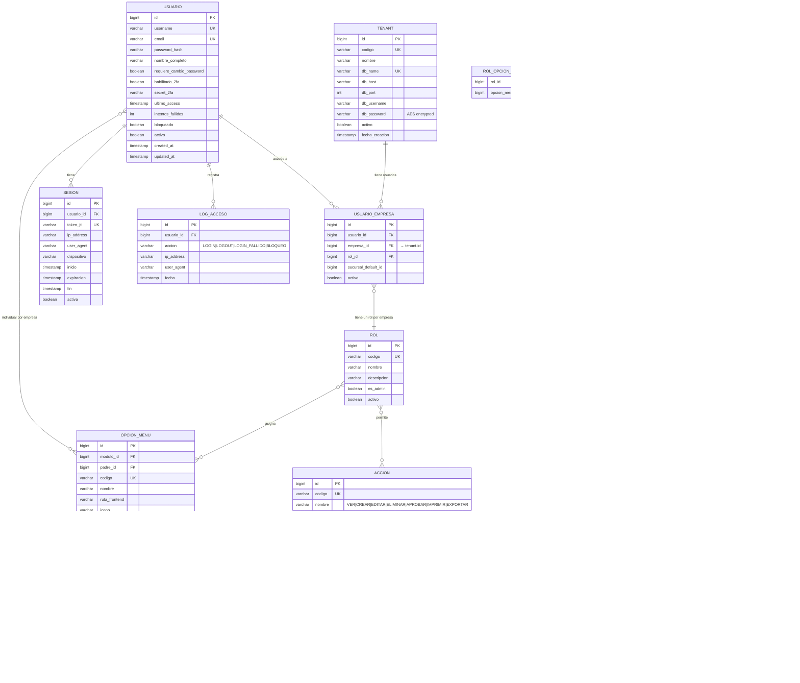

# Diseño de Base de Datos — Restaurant.pe

> Documento complementario a `ARQUITECTURA_RESTAURANT_PE.md`. Contiene la definición detallada de tablas, columnas, índices, migraciones, funciones SQL y diagramas ER por microservicio.

---

## Tabla de contenido

1. [Estrategia Database-per-Tenant](#1-estrategia-database-per-tenant)
2. [Bases de datos y esquemas](#2-bases-de-datos-y-esquemas)
3. [Definición SQL — BD Master](#3-definición-sql--bd-master)
4. [Tablas de seguridad detalladas](#4-tablas-de-seguridad-detalladas)
5. [Convenciones de la base de datos](#5-convenciones-de-la-base-de-datos)
6. [Estrategia de índices](#6-estrategia-de-índices)
7. [Migraciones Flyway (Multi-Tenant)](#7-migraciones-flyway-multi-tenant)
8. [Numeración atómica](#8-numeración-atómica)
9. [Alta de nueva empresa](#9-alta-de-nueva-empresa)
10. [Reportes cruzados entre empresas](#10-reportes-cruzados-entre-empresas)
11. [Diagramas ER detallados por microservicio](#11-diagramas-er-detallados-por-microservicio)
12. [Modelo de datos completo — Conteo de tablas](#12-modelo-de-datos-completo--conteo-de-tablas)

---

## 1. Estrategia Database-per-Tenant

El sistema utiliza el patrón **Database-per-Tenant** de PostgreSQL, aprovechando la función nativa `CREATE DATABASE ... TEMPLATE`. Cada empresa (tenant) tiene su **propia base de datos**, lo que garantiza aislamiento total de datos.

### Diagrama de bases de datos


### Reglas clave

- Las tablas de negocio (secciones 11.2 a 11.10) residen en la **BD por Empresa** (`restaurant_pe_emp_{id}`). Como cada BD es de una sola empresa, estas tablas **NO tienen columna `empresa_id`**.
- Las tablas de seguridad (sección 11.1) residen en la **BD Master** (`restaurant_pe_master`), donde sí existe la referencia a empresa a través de `usuario_empresa.empresa_id`.
- Los microservicios de negocio obtienen las connection strings de sus tenants llamando a `ms-auth-security` (`GET /internal/tenants/active`).
- Cada microservicio crea un **pool HikariCP por cada tenant** y los registra en `TenantRoutingDataSource`.
- Cuando se crea una nueva empresa, `ms-auth-security` publica un evento `tenant.created` vía RabbitMQ, y los demás microservicios agregan el pool dinámicamente (sin reinicio).

---

## 2. Bases de datos y esquemas

| Base de datos | Propósito | Esquemas | Quién conecta |
|---------------|-----------|----------|---------------|
| `restaurant_pe_master` | BD administrativa central | `auth`, `master` | Solo **ms-auth-security** |
| `restaurant_pe_template` | Modelo/plantilla (nunca se usa en producción) | `core`, `almacen`, `compras`, `ventas`, `finanzas`, `contabilidad`, `rrhh`, `activos`, `produccion`, `auditoria` | Solo Flyway (migraciones) |
| `restaurant_pe_emp_{id}` | BD de cada empresa (clon del template) | Mismos 10 esquemas del template | **Todos los ms de negocio** (excepto auth) |

### Esquemas por BD

**BD Master** (`restaurant_pe_master`):

| Esquema | Microservicio | Tablas principales |
|---------|---------------|-------------------|
| `auth` | ms-auth-security | usuario, usuario_empresa, rol, permiso, opcion_menu, sesion, log_acceso |
| `master` | ms-auth-security | tenant (registro de empresas con connection strings) |

**BD por Empresa** (`restaurant_pe_emp_{id}`) — cada empresa tiene estos 10 esquemas:

| Esquema | Microservicio | Tablas principales |
|---------|---------------|-------------------|
| `core` | ms-core-maestros | empresa, sucursal, pais, moneda, articulo, categoria, relacion_comercial, config_*, secuencia_documento |
| `almacen` | ms-almacen | almacen, movimiento_almacen, kardex, stock, inventario_fisico, reserva_stock |
| `compras` | ms-compras | solicitud_compra, cotizacion, orden_compra, orden_servicio, recepcion, secuencia_documento |
| `ventas` | ms-ventas | documento_venta, mesa, zona, orden_venta, comanda, cierre_caja, secuencia_documento |
| `finanzas` | ms-finanzas | cuenta_bancaria, documento_pagar, documento_cobrar, pago, cobro, conciliacion |
| `contabilidad` | ms-contabilidad | cuenta_contable, centro_costo, asiento, pre_asiento, matriz_contable, cierre_contable |
| `rrhh` | ms-rrhh | trabajador, contrato, planilla, asistencia, vacacion, liquidacion |
| `activos` | ms-activos-fijos | activo_fijo, clase_activo, depreciacion, mejora, revaluacion, traslado, mantenimiento |
| `produccion` | ms-produccion | receta, orden_produccion, costeo, control_calidad, programacion |
| `auditoria` | ms-auditoria | log_auditoria |

---

## 3. Definición SQL — BD Master

### 3.1 Esquema `master` — Registro de tenants

```sql
CREATE TABLE master.tenant (
    id              BIGSERIAL PRIMARY KEY,
    codigo          VARCHAR(20) NOT NULL UNIQUE,
    nombre          VARCHAR(200) NOT NULL,
    db_name         VARCHAR(100) NOT NULL UNIQUE,
    db_host         VARCHAR(200) NOT NULL DEFAULT 'localhost',
    db_port         INT NOT NULL DEFAULT 5432,
    db_username     VARCHAR(100) NOT NULL DEFAULT 'rpe_admin',
    db_password     VARCHAR(200) NOT NULL,  -- encriptado con AES
    activo          BOOLEAN NOT NULL DEFAULT true,
    fecha_creacion  TIMESTAMP WITH TIME ZONE DEFAULT NOW(),
    creado_por      VARCHAR(100),
    CONSTRAINT uk_tenant_db UNIQUE (db_host, db_port, db_name)
);
```

### 3.2 Esquema `auth` — Seguridad centralizada

El esquema `auth` reside en la BD master porque **usuarios, roles y permisos son transversales a todas las empresas**. Un usuario puede tener acceso a más de una empresa.

```sql
-- Relación usuario ↔ empresa
CREATE TABLE auth.usuario_empresa (
    id              BIGSERIAL PRIMARY KEY,
    usuario_id      BIGINT NOT NULL REFERENCES auth.usuario(id),
    empresa_id      BIGINT NOT NULL REFERENCES master.tenant(id),
    rol_id          BIGINT NOT NULL REFERENCES auth.rol(id),
    sucursal_default_id BIGINT,
    activo          BOOLEAN NOT NULL DEFAULT true,
    UNIQUE(usuario_id, empresa_id)
);
```

### 3.3 ER de la BD Master


---

## 4. Tablas de seguridad detalladas

> **Importante:** Todas las tablas de seguridad residen en `restaurant_pe_master.auth`, ya que son transversales a todas las empresas.

| Tabla | Columnas |
|-------|----------|
| `usuario` | id, username, password_hash, email, nombre, requiere_cambio_password, habilitado_2fa, secret_2fa, ultimo_acceso, intentos_fallidos, bloqueado, activo, created_at, updated_at |
| `usuario_empresa` | id, usuario_id, **empresa_id** (FK a master.tenant), **rol_id** (FK), sucursal_default_id, activo |
| `rol` | id, codigo, nombre, descripcion, es_admin, activo |
| `modulo` | id, codigo, nombre, icono, orden, activo |
| `opcion_menu` | id, modulo_id, padre_id, codigo, nombre, ruta_frontend, icono, orden, tipo (MENU/SUBMENU/ACCION), activo |
| `accion` | id, codigo, nombre (VER, CREAR, EDITAR, ELIMINAR, APROBAR, IMPRIMIR, EXPORTAR) |
| `permiso` | id, opcion_menu_id, accion_id |
| `rol_opcion_menu` | rol_id, opcion_menu_id (N:M) |
| `rol_opcion_accion` | rol_id, opcion_menu_id, accion_id |
| `rol_permiso` | rol_id, permiso_id |
| `usuario_opcion_menu` | usuario_id, empresa_id, opcion_menu_id (individual/extraordinario por empresa) |
| `usuario_permiso` | usuario_id, empresa_id, permiso_id |
| `usuario_sucursal` | usuario_id, empresa_id, sucursal_id (sucursales asignadas) |
| `sesion` | id, usuario_id, empresa_id, token, ip, fecha_inicio, fecha_fin, activa |
| `log_acceso` | id, usuario_id, empresa_id, accion, ip, fecha, detalle |

**Tabla de tenants** (esquema `master` en BD Master):

| Tabla | Columnas |
|-------|----------|
| `tenant` | id, codigo, nombre, db_name, db_host, db_port, db_username, db_password (AES), activo, fecha_creacion |

---

## 5. Convenciones de la base de datos

| Aspecto | Convención |
|---------|------------|
| **Tablas y columnas** | `snake_case`: `orden_compra`, `fecha_emision` |
| **Claves primarias** | `id BIGSERIAL PRIMARY KEY` (autoincremental) |
| **Claves foráneas** | `{tabla}_id`: `proveedor_id`, `almacen_id` |
| **Multiempresa** | **No se usa `empresa_id`** en tablas de negocio (cada BD es de una empresa) |
| **Multisucursal** | `sucursal_id` donde aplique (tablas operativas) |
| **Auditoría por registro** | `creado_por`, `creado_en`, `modificado_por`, `modificado_en` |
| **Soft delete** | `activo BOOLEAN DEFAULT true` (nunca DELETE físico) |
| **Índices** | Obligatorios en: FKs, campos de búsqueda frecuente, `sucursal_id` |
| **Timestamps** | `TIMESTAMP WITH TIME ZONE` para todos los campos de fecha-hora |
| **Migraciones** | Flyway: `V{version}__{descripcion}.sql` |
| **Enums** | Almacenados como `VARCHAR`, no como tipo ENUM de PostgreSQL (portabilidad) |

---

## 6. Estrategia de índices

> **Nota:** Como cada BD es de una sola empresa, **no se necesita `empresa_id`** en los índices de tablas de negocio.

```sql
-- Índices para búsquedas frecuentes (sin empresa_id)
CREATE INDEX idx_articulo_codigo ON articulo (codigo);
CREATE INDEX idx_articulo_categoria ON articulo (categoria_id);
CREATE INDEX idx_relacion_comercial_doc ON relacion_comercial (numero_documento);

-- Índice para multisucursal
CREATE INDEX idx_movimiento_sucursal ON movimiento_almacen (sucursal_id, fecha);
CREATE INDEX idx_documento_venta_sucursal ON documento_venta (sucursal_id, fecha_emision);

-- Índice para reportes por período
CREATE INDEX idx_movimiento_fecha ON movimiento_almacen (fecha);
CREATE INDEX idx_asiento_periodo ON asiento (periodo_anio, periodo_mes);

-- Índice parcial para registros activos (soft delete)
CREATE INDEX idx_articulo_activo ON articulo (id) WHERE activo = true;
CREATE INDEX idx_relacion_comercial_activo ON relacion_comercial (id) WHERE activo = true;
```

---

## 7. Migraciones Flyway (Multi-Tenant)

Las migraciones se escriben **una sola vez** pero se ejecutan contra **todas las bases de datos de tenant**:

```java
@Component
public class MultiTenantMigrationRunner implements CommandLineRunner {

    @Autowired
    private TenantFeignClient tenantClient;

    @Override
    public void run(String... args) {
        // 1. Migrar la plantilla primero (modelo)
        migrate("restaurant_pe_template");

        // 2. Migrar TODAS las bases de datos de empresas activas
        for (TenantConnectionInfo tenant : tenantClient.getActiveTenants()) {
            migrate(tenant.getJdbcUrl(), tenant.getUsername(), tenant.getPassword());
        }
    }

    private void migrate(String jdbcUrl, String user, String pass) {
        Flyway flyway = Flyway.configure()
            .dataSource(jdbcUrl, user, pass)
            .locations("classpath:db/migration")
            .load();
        flyway.migrate();
    }
}
```

Cada microservicio tiene su carpeta de migraciones:

```
ms-compras/
└── src/main/resources/
    └── db/migration/
        ├── V1__create_schema_compras.sql
        ├── V2__create_table_orden_compra.sql
        ├── V3__create_table_orden_servicio.sql
        ├── V4__create_table_aprobacion.sql
        ├── V5__create_table_recepcion.sql
        └── V6__add_index_orden_compra.sql
```

Cuando se despliega una nueva versión, el runner aplica las migraciones pendientes a **template + todas las empresas** automáticamente. Si una BD ya tiene esas versiones, Flyway las salta.

---

## 8. Numeración atómica

Como cada empresa tiene su propia BD, la tabla de secuencias **ya no necesita `empresa_id`**:

```sql
-- En cada BD de empresa (esquemas ventas, compras, etc.)
CREATE TABLE {schema}.secuencia_documento (
    id              BIGSERIAL PRIMARY KEY,
    sucursal_id     BIGINT NOT NULL,
    tipo_documento  VARCHAR(50) NOT NULL,
    serie           VARCHAR(10) NOT NULL,
    anio            INT NOT NULL,
    ultimo_numero   BIGINT NOT NULL DEFAULT 0,
    UNIQUE(sucursal_id, tipo_documento, serie, anio)
);

-- Función atómica para obtener el siguiente número (sin gaps)
CREATE OR REPLACE FUNCTION {schema}.siguiente_numero(
    p_sucursal_id BIGINT,
    p_tipo_doc    VARCHAR,
    p_serie       VARCHAR,
    p_anio        INT
) RETURNS BIGINT AS $$
DECLARE
    v_numero BIGINT;
BEGIN
    UPDATE {schema}.secuencia_documento
    SET ultimo_numero = ultimo_numero + 1
    WHERE sucursal_id = p_sucursal_id
      AND tipo_documento = p_tipo_doc
      AND serie = p_serie
      AND anio = p_anio
    RETURNING ultimo_numero INTO v_numero;

    IF v_numero IS NULL THEN
        INSERT INTO {schema}.secuencia_documento
            (sucursal_id, tipo_documento, serie, anio, ultimo_numero)
        VALUES (p_sucursal_id, p_tipo_doc, p_serie, p_anio, 1)
        RETURNING ultimo_numero INTO v_numero;
    END IF;

    RETURN v_numero;
END;
$$ LANGUAGE plpgsql;
```

> La función usa `UPDATE ... RETURNING` dentro de la misma transacción del documento. Si la transacción falla, el número se revierte automáticamente — **sin gaps**.

---

## 9. Alta de nueva empresa

```sql
-- 1. Clonar la plantilla (PostgreSQL nativo)
CREATE DATABASE restaurant_pe_emp_4 TEMPLATE restaurant_pe_template;

-- 2. Registrar en la BD master
INSERT INTO master.tenant (codigo, nombre, db_name, db_host, db_port, db_username, db_password, activo)
VALUES ('EMP4', 'Nueva Cadena SRL', 'restaurant_pe_emp_4', 'localhost', 5432, 'rpe_admin', 'encrypted_pass', true);

-- 3. Insertar datos iniciales (seed) en la nueva BD
-- Ejecutado por un endpoint administrativo de ms-auth-security:
--   • Datos de la empresa (razón social, RUC, logo)
--   • País, monedas, impuestos del país
--   • Sucursal principal
--   • Configuraciones default
--   • Plan contable base del país
--   • Secuencias de numeración iniciales
```

---

## 10. Reportes cruzados entre empresas

Para reportes corporativos que consoliden datos de múltiples empresas:

```java
// Endpoint especial que itera sobre las BDs de cada empresa
@GetMapping("/api/reportes/consolidado/ventas")
public ConsolidadoVentas ventasConsolidadas(
        @RequestParam List<Long> empresaIds) {
    List<ResumenVentas> resultados = new ArrayList<>();

    for (Long empresaId : empresaIds) {
        TenantContext.setEmpresaId(empresaId);
        ResumenVentas resumen = ventaService.resumenDelMes();
        resumen.setEmpresaId(empresaId);
        resultados.add(resumen);
    }

    return ConsolidadoVentas.consolidar(resultados);
}
```

A futuro, un **Data Warehouse** que consolide datos de todas las empresas para reportes analíticos avanzados.

---

## 11. Diagramas ER detallados por microservicio

> **NOTA IMPORTANTE (Database-per-Tenant):** Las entidades de las secciones 11.2 a 11.10 representan tablas que residen en la **BD por Empresa** (`restaurant_pe_emp_{id}`). Como cada BD es de una sola empresa, estas tablas **NO tienen columna `empresa_id`**. La sección 11.1 muestra las tablas de la **BD Master** (`restaurant_pe_master`), donde sí existe la referencia a empresa a través de `usuario_empresa.empresa_id`.

### 11.1 ms-auth-security — Esquemas `auth` + `master` (en BD Master)



### 11.2 ms-core-maestros — Esquema `core` (en BD por Empresa)


### 11.3 ms-almacen — Esquema `almacen` (en BD por Empresa)

```mermaid
erDiagram
    ALMACEN {
        bigint id PK
        bigint sucursal_id FK
        varchar codigo UK
        varchar nombre
        varchar direccion
        varchar tipo "PRINCIPAL|TRANSITO|DEVOLUCION|PRODUCCION"
        boolean activo
    }
    UBICACION_ALMACEN {
        bigint id PK
        bigint almacen_id FK
        varchar codigo
        varchar nombre
        varchar pasillo
        varchar estante
        varchar nivel
    }
    TIPO_MOVIMIENTO {
        bigint id PK
        varchar codigo UK
        varchar nombre
        varchar naturaleza "INGRESO|SALIDA"
        varchar tipo_sunat
        boolean afecta_costo
        boolean genera_pre_asiento
        boolean activo
    }
    MOVIMIENTO_ALMACEN {
        bigint id PK
        bigint almacen_id FK
        bigint tipo_movimiento_id FK
        varchar numero UK
        date fecha
        varchar referencia_tipo
        bigint referencia_id
        varchar observacion
        varchar estado "BORRADOR|CONFIRMADO|ANULADO"
        bigint usuario_id FK
        timestamp created_at
    }
    MOVIMIENTO_DETALLE {
        bigint id PK
        bigint movimiento_id FK
        bigint articulo_id FK
        decimal cantidad
        decimal costo_unitario
        decimal costo_total
        bigint ubicacion_id FK
        varchar lote
        date fecha_vencimiento
    }
    STOCK {
        bigint id PK
        bigint almacen_id FK
        bigint articulo_id FK
        decimal cantidad_disponible
        decimal cantidad_reservada
        decimal costo_promedio
        timestamp ultima_actualizacion
    }
    KARDEX {
        bigint id PK
        bigint almacen_id FK
        bigint articulo_id FK
        bigint movimiento_detalle_id FK
        date fecha
        varchar tipo "INGRESO|SALIDA"
        decimal cantidad
        decimal costo_unitario
        decimal costo_total
        decimal saldo_cantidad
        decimal saldo_costo_unitario
        decimal saldo_costo_total
    }
    INVENTARIO_FISICO {
        bigint id PK
        bigint almacen_id FK
        date fecha
        varchar estado "EN_PROCESO|COMPARADO|AJUSTADO|CERRADO"
        bigint usuario_id FK
    }
    INVENTARIO_FISICO_DETALLE {
        bigint id PK
        bigint inventario_fisico_id FK
        bigint articulo_id FK
        decimal cantidad_sistema
        decimal cantidad_fisica
        decimal diferencia
        varchar observacion
    }
    RESERVA_STOCK {
        bigint id PK
        bigint almacen_id FK
        bigint articulo_id FK
        decimal cantidad
        varchar origen_tipo
        bigint origen_id
        timestamp fecha_reserva
        timestamp fecha_expiracion
        varchar estado "ACTIVA|CONSUMIDA|EXPIRADA"
    }
    ALMACEN ||--o{ UBICACION_ALMACEN : contiene
    ALMACEN ||--o{ STOCK : registra
    ALMACEN ||--o{ MOVIMIENTO_ALMACEN : tiene
    MOVIMIENTO_ALMACEN }o--|| TIPO_MOVIMIENTO : es
    MOVIMIENTO_ALMACEN ||--o{ MOVIMIENTO_DETALLE : contiene
    MOVIMIENTO_DETALLE --> KARDEX : genera
    STOCK }o--|| ARTICULO : de
    ALMACEN ||--o{ INVENTARIO_FISICO : ejecuta
    INVENTARIO_FISICO ||--o{ INVENTARIO_FISICO_DETALLE : contiene
    ALMACEN ||--o{ RESERVA_STOCK : tiene
```

### 11.4 ms-compras — Esquema `compras` (en BD por Empresa)


### 11.5 ms-ventas — Esquema `ventas` (en BD por Empresa)


### 11.6 ms-finanzas — Esquema `finanzas` (en BD por Empresa)


### 11.7 ms-contabilidad — Esquema `contabilidad` (en BD por Empresa)


### 11.8 ms-rrhh — Esquema `rrhh` (en BD por Empresa)


### 11.9 ms-activos-fijos — Esquema `activos` (en BD por Empresa)


### 11.10 ms-produccion — Esquema `produccion` (en BD por Empresa)


---

## 12. Modelo de datos completo — Conteo de tablas

| Esquema | Tablas | Descripción |
|---------|:------:|-------------|
| `auth` | 11 | Usuarios, roles, permisos, menú, sesiones |
| `core` | 25+ | Empresa, sucursal, país, moneda, artículos, categorías, impuestos, configuración |
| `almacen` | 7 | Movimientos, kardex, stock, inventario físico |
| `compras` | 7 | OC, OS, aprobaciones, recepción |
| `finanzas` | 12 | CxP, CxC, tesorería, conciliación, adelantos |
| `contabilidad` | 7 | Asientos, pre-asientos, matrices, cierres |
| `rrhh` | 11 | Trabajadores, planilla, asistencia, liquidaciones |
| `activos` | 7 | Activos, depreciación, seguros, traslados |
| `produccion` | 5 | Recetas, órdenes, costeo |
| `auditoria` | 2 | Log de auditoría, log de acceso |
| **Total** | **94+** | |

---

*Documento de diseño de base de datos para el proyecto Restaurant.pe. Complementa a `ARQUITECTURA_RESTAURANT_PE.md` con la definición detallada de tablas, índices, funciones SQL, migraciones y diagramas ER por microservicio. Estrategia: Database-per-Tenant con PostgreSQL.*
