# Diseño de Base de Datos — Restaurant.pe

> Documento complementario a `ARQUITECTURA_RESTAURANT_PE.md`. Contiene la definición detallada de tablas, columnas, índices, migraciones, funciones SQL y diagramas ER por microservicio.

---

## Tabla de contenido

1. [Estrategia Database-per-Tenant](#1-estrategia-database-per-tenant)
2. [Bases de datos y esquemas](#2-bases-de-datos-y-esquemas)
3. [Definición SQL — BD Master](#3-definición-sql--bd-master)
4. [Tablas de seguridad detalladas](#4-tablas-de-seguridad-detalladas)
5. [Convenciones de la base de datos](#5-convenciones-de-la-base-de-datos)
6. [Estrategia de índices](#6-estrategia-de-índices)
7. [Migraciones Flyway (Multi-Tenant)](#7-migraciones-flyway-multi-tenant)
8. [Numeración atómica](#8-numeración-atómica)
9. [Alta de nueva empresa](#9-alta-de-nueva-empresa)
10. [Reportes cruzados entre empresas](#10-reportes-cruzados-entre-empresas)
11. [Diagramas ER detallados por microservicio](#11-diagramas-er-detallados-por-microservicio)
12. [Modelo de datos completo — Conteo de tablas](#12-modelo-de-datos-completo--conteo-de-tablas)
13. [Análisis de la base de datos legada SIGRE](#13-análisis-de-la-base-de-datos-legada-sigre)
14. [Mapeo detallado SIGRE → Restaurant.pe por módulo](#14-mapeo-detallado-sigre--restaurantpe-por-módulo)
15. [Tablas adicionales derivadas del análisis SIGRE](#15-tablas-adicionales-derivadas-del-análisis-sigre)
16. [Tablas SIGRE descartadas (no aplican a restaurantes)](#16-tablas-sigre-descartadas-no-aplican-a-restaurantes)

---

## 1. Estrategia Database-per-Tenant

El sistema utiliza el patrón **Database-per-Tenant** de PostgreSQL, aprovechando la función nativa `CREATE DATABASE ... TEMPLATE`. Cada empresa (tenant) tiene su **propia base de datos**, lo que garantiza aislamiento total de datos.

### Diagrama de bases de datos


### Reglas clave

- Las tablas de negocio (secciones 11.2 a 11.10) residen en la **BD por Empresa** (`restaurant_pe_emp_{id}`). Como cada BD es de una sola empresa, estas tablas **NO tienen columna `empresa_id`**.
- Las tablas de seguridad (sección 11.1) residen en la **BD Master** (`restaurant_pe_master`), donde sí existe la referencia a empresa a través de `usuario_empresa.empresa_id`.
- Los microservicios de negocio obtienen las connection strings de sus tenants llamando a `ms-auth-security` (`GET /internal/tenants/active`).
- Cada microservicio crea un **pool HikariCP por cada tenant** y los registra en `TenantRoutingDataSource`.
- Cuando se crea una nueva empresa, `ms-auth-security` publica un evento `tenant.created` vía RabbitMQ, y los demás microservicios agregan el pool dinámicamente (sin reinicio).

---

## 2. Bases de datos y esquemas

| Base de datos | Propósito | Esquemas | Quién conecta |
|---------------|-----------|----------|---------------|
| `restaurant_pe_master` | BD administrativa central | `auth`, `master` | Solo **ms-auth-security** |
| `restaurant_pe_template` | Modelo/plantilla (nunca se usa en producción) | `core`, `almacen`, `compras`, `ventas`, `finanzas`, `contabilidad`, `rrhh`, `activos`, `produccion`, `auditoria` | Solo Flyway (migraciones) |
| `restaurant_pe_emp_{id}` | BD de cada empresa (clon del template) | Mismos 10 esquemas del template | **Todos los ms de negocio** (excepto auth) |

### Esquemas por BD

**BD Master** (`restaurant_pe_master`):

| Esquema | Microservicio | Tablas principales |
|---------|---------------|-------------------|
| `auth` | ms-auth-security | usuario, usuario_empresa, rol, permiso, opcion_menu, sesion, log_acceso |
| `master` | ms-auth-security | tenant (registro de empresas con connection strings) |

**BD por Empresa** (`restaurant_pe_emp_{id}`) — cada empresa tiene estos 10 esquemas:

| Esquema | Microservicio | Tablas principales |
|---------|---------------|-------------------|
| `core` | ms-core-maestros | empresa, sucursal, pais, moneda, articulo, categoria, relacion_comercial, config_*, secuencia_documento |
| `almacen` | ms-almacen | almacen, movimiento_almacen, kardex, stock, inventario_fisico, reserva_stock |
| `compras` | ms-compras | solicitud_compra, cotizacion, orden_compra, orden_servicio, recepcion, secuencia_documento |
| `ventas` | ms-ventas | documento_venta, mesa, zona, orden_venta, comanda, cierre_caja, secuencia_documento |
| `finanzas` | ms-finanzas | cuenta_bancaria, documento_pagar, documento_cobrar, pago, cobro, conciliacion |
| `contabilidad` | ms-contabilidad | cuenta_contable, centro_costo, asiento, pre_asiento, matriz_contable, cierre_contable |
| `rrhh` | ms-rrhh | trabajador, contrato, planilla, asistencia, vacacion, liquidacion |
| `activos` | ms-activos-fijos | activo_fijo, clase_activo, depreciacion, mejora, revaluacion, traslado, mantenimiento |
| `produccion` | ms-produccion | receta, orden_produccion, costeo, control_calidad, programacion |
| `auditoria` | ms-auditoria | log_auditoria |

---

## 3. Definición SQL — BD Master

### 3.1 Esquema `master` — Registro de tenants

```sql
CREATE TABLE master.tenant (
    id              BIGSERIAL PRIMARY KEY,
    codigo          VARCHAR(20) NOT NULL UNIQUE,
    nombre          VARCHAR(200) NOT NULL,
    db_name         VARCHAR(100) NOT NULL UNIQUE,
    db_host         VARCHAR(200) NOT NULL DEFAULT 'localhost',
    db_port         INT NOT NULL DEFAULT 5432,
    db_username     VARCHAR(100) NOT NULL DEFAULT 'rpe_admin',
    db_password     VARCHAR(200) NOT NULL,  -- encriptado con AES
    activo          BOOLEAN NOT NULL DEFAULT true,
    fecha_creacion  TIMESTAMP WITH TIME ZONE DEFAULT NOW(),
    creado_por      VARCHAR(100),
    CONSTRAINT uk_tenant_db UNIQUE (db_host, db_port, db_name)
);
```

### 3.2 Esquema `auth` — Seguridad centralizada

El esquema `auth` reside en la BD master porque **usuarios, roles y permisos son transversales a todas las empresas**. Un usuario puede tener acceso a más de una empresa.

```sql
-- Relación usuario ↔ empresa
CREATE TABLE auth.usuario_empresa (
    id              BIGSERIAL PRIMARY KEY,
    usuario_id      BIGINT NOT NULL REFERENCES auth.usuario(id),
    empresa_id      BIGINT NOT NULL REFERENCES master.tenant(id),
    rol_id          BIGINT NOT NULL REFERENCES auth.rol(id),
    sucursal_default_id BIGINT,
    activo          BOOLEAN NOT NULL DEFAULT true,
    UNIQUE(usuario_id, empresa_id)
);
```

### 3.3 ER de la BD Master


---

## 4. Tablas de seguridad detalladas

> **Importante:** Todas las tablas de seguridad residen en `restaurant_pe_master.auth`, ya que son transversales a todas las empresas.

| Tabla | Columnas |
|-------|----------|
| `usuario` | id, username, password_hash, email, nombre, requiere_cambio_password, habilitado_2fa, secret_2fa, ultimo_acceso, intentos_fallidos, bloqueado, activo, created_at, updated_at |
| `usuario_empresa` | id, usuario_id, **empresa_id** (FK a master.tenant), **rol_id** (FK), sucursal_default_id, activo |
| `rol` | id, codigo, nombre, descripcion, es_admin, activo |
| `modulo` | id, codigo, nombre, icono, orden, activo |
| `opcion_menu` | id, modulo_id, padre_id, codigo, nombre, ruta_frontend, icono, orden, tipo (MENU/SUBMENU/ACCION), activo |
| `accion` | id, codigo, nombre (VER, CREAR, EDITAR, ELIMINAR, APROBAR, IMPRIMIR, EXPORTAR) |
| `permiso` | id, opcion_menu_id, accion_id |
| `rol_opcion_menu` | rol_id, opcion_menu_id (N:M) |
| `rol_opcion_accion` | rol_id, opcion_menu_id, accion_id |
| `rol_permiso` | rol_id, permiso_id |
| `usuario_opcion_menu` | usuario_id, empresa_id, opcion_menu_id (individual/extraordinario por empresa) |
| `usuario_permiso` | usuario_id, empresa_id, permiso_id |
| `usuario_sucursal` | usuario_id, empresa_id, sucursal_id (sucursales asignadas) |
| `sesion` | id, usuario_id, empresa_id, token, ip, fecha_inicio, fecha_fin, activa |
| `log_acceso` | id, usuario_id, empresa_id, accion, ip, fecha, detalle |

**Tabla de tenants** (esquema `master` en BD Master):

| Tabla | Columnas |
|-------|----------|
| `tenant` | id, codigo, nombre, db_name, db_host, db_port, db_username, db_password (AES), activo, fecha_creacion |

---

## 5. Convenciones de la base de datos

| Aspecto | Convención |
|---------|------------|
| **Tablas y columnas** | `snake_case`: `orden_compra`, `fecha_emision` |
| **Claves primarias** | `id BIGSERIAL PRIMARY KEY` (autoincremental) |
| **Claves foráneas** | `{tabla}_id`: `proveedor_id`, `almacen_id` |
| **Multiempresa** | **No se usa `empresa_id`** en tablas de negocio (cada BD es de una empresa) |
| **Multisucursal** | `sucursal_id` donde aplique (tablas operativas) |
| **Auditoría por registro** | `creado_por`, `creado_en`, `modificado_por`, `modificado_en` |
| **Soft delete** | `activo BOOLEAN DEFAULT true` (nunca DELETE físico) |
| **Índices** | Obligatorios en: FKs, campos de búsqueda frecuente, `sucursal_id` |
| **Timestamps** | `TIMESTAMP WITH TIME ZONE` para todos los campos de fecha-hora |
| **Migraciones** | Flyway: `V{version}__{descripcion}.sql` |
| **Enums** | Almacenados como `VARCHAR`, no como tipo ENUM de PostgreSQL (portabilidad) |

---

## 6. Estrategia de índices

> **Nota:** Como cada BD es de una sola empresa, **no se necesita `empresa_id`** en los índices de tablas de negocio.

```sql
-- Índices para búsquedas frecuentes (sin empresa_id)
CREATE INDEX idx_articulo_codigo ON articulo (codigo);
CREATE INDEX idx_articulo_categoria ON articulo (categoria_id);
CREATE INDEX idx_relacion_comercial_doc ON relacion_comercial (numero_documento);

-- Índice para multisucursal
CREATE INDEX idx_movimiento_sucursal ON movimiento_almacen (sucursal_id, fecha);
CREATE INDEX idx_documento_venta_sucursal ON documento_venta (sucursal_id, fecha_emision);

-- Índice para reportes por período
CREATE INDEX idx_movimiento_fecha ON movimiento_almacen (fecha);
CREATE INDEX idx_asiento_periodo ON asiento (periodo_anio, periodo_mes);

-- Índice parcial para registros activos (soft delete)
CREATE INDEX idx_articulo_activo ON articulo (id) WHERE activo = true;
CREATE INDEX idx_relacion_comercial_activo ON relacion_comercial (id) WHERE activo = true;
```

---

## 7. Migraciones Flyway (Multi-Tenant)

Las migraciones se escriben **una sola vez** pero se ejecutan contra **todas las bases de datos de tenant**:

```java
@Component
public class MultiTenantMigrationRunner implements CommandLineRunner {

    @Autowired
    private TenantFeignClient tenantClient;

    @Override
    public void run(String... args) {
        // 1. Migrar la plantilla primero (modelo)
        migrate("restaurant_pe_template");

        // 2. Migrar TODAS las bases de datos de empresas activas
        for (TenantConnectionInfo tenant : tenantClient.getActiveTenants()) {
            migrate(tenant.getJdbcUrl(), tenant.getUsername(), tenant.getPassword());
        }
    }

    private void migrate(String jdbcUrl, String user, String pass) {
        Flyway flyway = Flyway.configure()
            .dataSource(jdbcUrl, user, pass)
            .locations("classpath:db/migration")
            .load();
        flyway.migrate();
    }
}
```

Cada microservicio tiene su carpeta de migraciones:

```
ms-compras/
└── src/main/resources/
    └── db/migration/
        ├── V1__create_schema_compras.sql
        ├── V2__create_table_orden_compra.sql
        ├── V3__create_table_orden_servicio.sql
        ├── V4__create_table_aprobacion.sql
        ├── V5__create_table_recepcion.sql
        └── V6__add_index_orden_compra.sql
```

Cuando se despliega una nueva versión, el runner aplica las migraciones pendientes a **template + todas las empresas** automáticamente. Si una BD ya tiene esas versiones, Flyway las salta.

---

## 8. Numeración atómica

Como cada empresa tiene su propia BD, la tabla de secuencias **ya no necesita `empresa_id`**:

```sql
-- En cada BD de empresa (esquemas ventas, compras, etc.)
CREATE TABLE {schema}.secuencia_documento (
    id              BIGSERIAL PRIMARY KEY,
    sucursal_id     BIGINT NOT NULL,
    tipo_documento  VARCHAR(50) NOT NULL,
    serie           VARCHAR(10) NOT NULL,
    anio            INT NOT NULL,
    ultimo_numero   BIGINT NOT NULL DEFAULT 0,
    UNIQUE(sucursal_id, tipo_documento, serie, anio)
);

-- Función atómica para obtener el siguiente número (sin gaps)
CREATE OR REPLACE FUNCTION {schema}.siguiente_numero(
    p_sucursal_id BIGINT,
    p_tipo_doc    VARCHAR,
    p_serie       VARCHAR,
    p_anio        INT
) RETURNS BIGINT AS $$
DECLARE
    v_numero BIGINT;
BEGIN
    UPDATE {schema}.secuencia_documento
    SET ultimo_numero = ultimo_numero + 1
    WHERE sucursal_id = p_sucursal_id
      AND tipo_documento = p_tipo_doc
      AND serie = p_serie
      AND anio = p_anio
    RETURNING ultimo_numero INTO v_numero;

    IF v_numero IS NULL THEN
        INSERT INTO {schema}.secuencia_documento
            (sucursal_id, tipo_documento, serie, anio, ultimo_numero)
        VALUES (p_sucursal_id, p_tipo_doc, p_serie, p_anio, 1)
        RETURNING ultimo_numero INTO v_numero;
    END IF;

    RETURN v_numero;
END;
$$ LANGUAGE plpgsql;
```

> La función usa `UPDATE ... RETURNING` dentro de la misma transacción del documento. Si la transacción falla, el número se revierte automáticamente — **sin gaps**.

---

## 9. Alta de nueva empresa

```sql
-- 1. Clonar la plantilla (PostgreSQL nativo)
CREATE DATABASE restaurant_pe_emp_4 TEMPLATE restaurant_pe_template;

-- 2. Registrar en la BD master
INSERT INTO master.tenant (codigo, nombre, db_name, db_host, db_port, db_username, db_password, activo)
VALUES ('EMP4', 'Nueva Cadena SRL', 'restaurant_pe_emp_4', 'localhost', 5432, 'rpe_admin', 'encrypted_pass', true);

-- 3. Insertar datos iniciales (seed) en la nueva BD
-- Ejecutado por un endpoint administrativo de ms-auth-security:
--   • Datos de la empresa (razón social, RUC, logo)
--   • País, monedas, impuestos del país
--   • Sucursal principal
--   • Configuraciones default
--   • Plan contable base del país
--   • Secuencias de numeración iniciales
```

---

## 10. Reportes cruzados entre empresas

Para reportes corporativos que consoliden datos de múltiples empresas:

```java
// Endpoint especial que itera sobre las BDs de cada empresa
@GetMapping("/api/reportes/consolidado/ventas")
public ConsolidadoVentas ventasConsolidadas(
        @RequestParam List<Long> empresaIds) {
    List<ResumenVentas> resultados = new ArrayList<>();

    for (Long empresaId : empresaIds) {
        TenantContext.setEmpresaId(empresaId);
        ResumenVentas resumen = ventaService.resumenDelMes();
        resumen.setEmpresaId(empresaId);
        resultados.add(resumen);
    }

    return ConsolidadoVentas.consolidar(resultados);
}
```

A futuro, un **Data Warehouse** que consolide datos de todas las empresas para reportes analíticos avanzados.

---

## 11. Diagramas ER detallados por microservicio

> **NOTA IMPORTANTE (Database-per-Tenant):** Las entidades de las secciones 11.2 a 11.10 representan tablas que residen en la **BD por Empresa** (`restaurant_pe_emp_{id}`). Como cada BD es de una sola empresa, estas tablas **NO tienen columna `empresa_id`**. La sección 11.1 muestra las tablas de la **BD Master** (`restaurant_pe_master`), donde sí existe la referencia a empresa a través de `usuario_empresa.empresa_id`.

### 11.1 ms-auth-security — Esquemas `auth` + `master` (en BD Master)


### 11.2 ms-core-maestros — Esquema `core` (en BD por Empresa)


### 11.3 ms-almacen — Esquema `almacen` (en BD por Empresa)

```mermaid
erDiagram
    ALMACEN {
        bigint id PK
        bigint sucursal_id FK
        varchar codigo UK
        varchar nombre
        varchar direccion
        varchar tipo "PRINCIPAL|TRANSITO|DEVOLUCION|PRODUCCION"
        boolean activo
    }
    UBICACION_ALMACEN {
        bigint id PK
        bigint almacen_id FK
        varchar codigo
        varchar nombre
        varchar pasillo
        varchar estante
        varchar nivel
    }
    TIPO_MOVIMIENTO {
        bigint id PK
        varchar codigo UK
        varchar nombre
        varchar naturaleza "INGRESO|SALIDA"
        varchar tipo_sunat
        boolean afecta_costo
        boolean genera_pre_asiento
        boolean activo
    }
    MOVIMIENTO_ALMACEN {
        bigint id PK
        bigint almacen_id FK
        bigint tipo_movimiento_id FK
        varchar numero UK
        date fecha
        varchar referencia_tipo
        bigint referencia_id
        varchar observacion
        varchar estado "BORRADOR|CONFIRMADO|ANULADO"
        bigint usuario_id FK
        timestamp created_at
    }
    MOVIMIENTO_DETALLE {
        bigint id PK
        bigint movimiento_id FK
        bigint articulo_id FK
        decimal cantidad
        decimal costo_unitario
        decimal costo_total
        bigint ubicacion_id FK
        varchar lote
        date fecha_vencimiento
    }
    STOCK {
        bigint id PK
        bigint almacen_id FK
        bigint articulo_id FK
        decimal cantidad_disponible
        decimal cantidad_reservada
        decimal costo_promedio
        timestamp ultima_actualizacion
    }
    KARDEX {
        bigint id PK
        bigint almacen_id FK
        bigint articulo_id FK
        bigint movimiento_detalle_id FK
        date fecha
        varchar tipo "INGRESO|SALIDA"
        decimal cantidad
        decimal costo_unitario
        decimal costo_total
        decimal saldo_cantidad
        decimal saldo_costo_unitario
        decimal saldo_costo_total
    }
    INVENTARIO_FISICO {
        bigint id PK
        bigint almacen_id FK
        date fecha
        varchar estado "EN_PROCESO|COMPARADO|AJUSTADO|CERRADO"
        bigint usuario_id FK
    }
    INVENTARIO_FISICO_DETALLE {
        bigint id PK
        bigint inventario_fisico_id FK
        bigint articulo_id FK
        decimal cantidad_sistema
        decimal cantidad_fisica
        decimal diferencia
        varchar observacion
    }
    RESERVA_STOCK {
        bigint id PK
        bigint almacen_id FK
        bigint articulo_id FK
        decimal cantidad
        varchar origen_tipo
        bigint origen_id
        timestamp fecha_reserva
        timestamp fecha_expiracion
        varchar estado "ACTIVA|CONSUMIDA|EXPIRADA"
    }
    ALMACEN ||--o{ UBICACION_ALMACEN : contiene
    ALMACEN ||--o{ STOCK : registra
    ALMACEN ||--o{ MOVIMIENTO_ALMACEN : tiene
    MOVIMIENTO_ALMACEN }o--|| TIPO_MOVIMIENTO : es
    MOVIMIENTO_ALMACEN ||--o{ MOVIMIENTO_DETALLE : contiene
    MOVIMIENTO_DETALLE --> KARDEX : genera
    STOCK }o--|| ARTICULO : de
    ALMACEN ||--o{ INVENTARIO_FISICO : ejecuta
    INVENTARIO_FISICO ||--o{ INVENTARIO_FISICO_DETALLE : contiene
    ALMACEN ||--o{ RESERVA_STOCK : tiene
```

### 11.4 ms-compras — Esquema `compras` (en BD por Empresa)


### 11.5 ms-ventas — Esquema `ventas` (en BD por Empresa)


### 11.6 ms-finanzas — Esquema `finanzas` (en BD por Empresa)

```mermaid
erDiagram
    CUENTA_BANCARIA {
        bigint id PK
        varchar banco
        varchar numero_cuenta UK
        varchar cci
        varchar tipo "AHORRO|CORRIENTE"
        bigint moneda_id FK
        decimal saldo_contable
        boolean activo
    }
    DOCUMENTO_PAGAR {
        bigint id PK
        bigint proveedor_id FK
        varchar tipo "FACTURA|RECIBO|NC|ND"
        varchar serie_numero UK
        date fecha_emision
        date fecha_vencimiento
        bigint moneda_id FK
        decimal tc
        decimal subtotal
        decimal igv
        decimal retencion
        decimal detraccion
        decimal total
        decimal saldo
        varchar estado "PENDIENTE|PARCIAL|PAGADO|ANULADO"
        bigint oc_id FK
    }
    DOCUMENTO_COBRAR {
        bigint id PK
        bigint cliente_id FK
        varchar tipo "FACTURA|BOLETA|LETRA|NC|ND"
        varchar serie_numero UK
        date fecha_emision
        date fecha_vencimiento
        bigint moneda_id FK
        decimal total
        decimal saldo
        varchar estado "PENDIENTE|PARCIAL|COBRADO|ANULADO|PROTESTADA"
    }
    PAGO {
        bigint id PK
        bigint documento_pagar_id FK
        bigint cuenta_bancaria_id FK
        bigint forma_pago_id FK
        date fecha
        decimal monto
        varchar referencia
        varchar numero_operacion
        varchar estado "APLICADO|ANULADO"
    }
    COBRO {
        bigint id PK
        bigint documento_cobrar_id FK
        bigint cuenta_bancaria_id FK
        bigint forma_pago_id FK
        date fecha
        decimal monto
        varchar referencia
        varchar estado "APLICADO|ANULADO"
    }
    MOVIMIENTO_BANCARIO {
        bigint id PK
        bigint cuenta_bancaria_id FK
        date fecha
        varchar tipo "DEPOSITO|RETIRO|TRANSFERENCIA|COMISION|ITF"
        varchar referencia
        decimal monto
        decimal saldo_despues
        boolean conciliado
    }
    CONCILIACION_BANCARIA {
        bigint id PK
        bigint cuenta_bancaria_id FK
        int periodo_anio
        int periodo_mes
        decimal saldo_banco
        decimal saldo_libros
        decimal diferencia
        varchar estado "EN_PROCESO|CONCILIADO|CERRADO"
    }
    CONCILIACION_DETALLE {
        bigint id PK
        bigint conciliacion_id FK
        bigint movimiento_bancario_id FK
        boolean conciliado
        varchar observacion
    }
    ADELANTO {
        bigint id PK
        bigint solicitante_id FK
        bigint proveedor_id FK
        varchar numero UK
        date fecha
        decimal monto
        varchar motivo
        varchar estado "SOLICITADO|APROBADO|DESEMBOLSADO|LIQUIDADO|RECHAZADO"
    }
    PROGRAMACION_PAGO {
        bigint id PK
        date fecha_programada
        varchar estado "PROGRAMADO|EJECUTADO|CANCELADO"
    }
    PROGRAMACION_PAGO_DETALLE {
        bigint id PK
        bigint programacion_id FK
        bigint documento_pagar_id FK
        decimal monto_programado
    }
    FONDO_FIJO {
        bigint id PK
        bigint sucursal_id FK
        bigint responsable_id FK
        decimal monto_autorizado
        decimal monto_disponible
        varchar estado "ACTIVO|RENDICION|REPOSICION"
    }
    RENDICION_GASTO {
        bigint id PK
        bigint fondo_fijo_id FK
        date fecha
        decimal monto
        varchar concepto
        varchar comprobante
        varchar estado "PENDIENTE|APROBADO|RECHAZADO"
    }
    CUENTA_BANCARIA ||--o{ MOVIMIENTO_BANCARIO : tiene
    CUENTA_BANCARIA ||--o{ CONCILIACION_BANCARIA : genera
    CONCILIACION_BANCARIA ||--o{ CONCILIACION_DETALLE : contiene
    DOCUMENTO_PAGAR ||--o{ PAGO : recibe
    DOCUMENTO_COBRAR ||--o{ COBRO : recibe
    PROGRAMACION_PAGO ||--o{ PROGRAMACION_PAGO_DETALLE : contiene
    FONDO_FIJO ||--o{ RENDICION_GASTO : registra
```



### 11.7 ms-contabilidad — Esquema `contabilidad` (en BD por Empresa)


### 11.8 ms-rrhh — Esquema `rrhh` (en BD por Empresa)


### 11.9 ms-activos-fijos — Esquema `activos` (en BD por Empresa)


### 11.10 ms-produccion — Esquema `produccion` (en BD por Empresa)


---

## 12. Modelo de datos completo — Conteo de tablas

| Esquema | Tablas base | Tablas adicionales (SIGRE) | Total | Descripción |
|---------|:-----------:|:--------------------------:|:-----:|-------------|
| `auth` | 14 | — | 14 | Usuarios, roles, permisos, menú, sesiones, log acceso |
| `core` | 25 | 5 | 30 | Empresa, sucursal, país, moneda, artículos, categorías, impuestos, configuración, banco, marca, tipo doc. tributario |
| `almacen` | 9 | 2 | 11 | Movimientos, kardex, stock, inventario físico, guía remisión |
| `compras` | 12 | 2 | 14 | SC, OC, OS, cotización, aprobaciones, recepción, evaluación, contrato marco, comprador |
| `ventas` | 16 | 3 | 19 | Documento venta, orden, comanda, mesa, zona, turno, cierre caja, punto de venta, reservación, carta |
| `finanzas` | 14 | 3 | 17 | CxP, CxC, tesorería, conciliación, adelantos, flujo caja, detracción, retención |
| `contabilidad` | 7 | 1 | 8 | Asientos, pre-asientos, matrices, cierres, distribución contable |
| `rrhh` | 13 | 4 | 17 | Trabajadores, planilla, asistencia, liquidaciones, gratificación, CTS, quinta categoría |
| `activos` | 12 | — | 12 | Activos, depreciación, seguros, traslados, mantenimiento |
| `produccion` | 7 | 1 | 8 | Recetas, órdenes, costeo, ficha técnica |
| `auditoria` | 2 | — | 2 | Log de auditoría |
| **Total** | **131** | **21** | **152** | Incluye tablas derivadas del análisis SIGRE |

> **Nota:** El ERP SIGRE original tiene **2,770 tablas** en Oracle 11gR2, de las cuales **~2,004 son referenciadas** activamente en el código fuente (ws_objects). Restaurant.pe consolida y moderniza esta estructura en **152 tablas** distribuidas en 10 esquemas, eliminando tablas temporales (~770 `TT_*`), numeradores redundantes (~130 `NUM_*`), y tablas específicas de industrias no relacionadas (pesca, agricultura, manufactura textil).

---

## 13. Análisis de la base de datos legada SIGRE

> **Fuente de datos:** Extracción completa de la estructura de Oracle 11gR2 vía `scripts/oracle_extract_schema.sql` → `metadata SIGRE/schema_export.json`. Cruce con tablas referenciadas en ~2,547 archivos PowerBuilder (`.srd`, `.sru`) del directorio `ws_objects/`.

### 13.1 Resumen estadístico

| Métrica | Valor |
|---------|-------|
| Total de tablas en BD Oracle | **2,770** |
| Tablas referenciadas en código fuente | **~2,004** |
| Vistas | **315** |
| Tablas temporales (`TT_*`) | **~770** (28% del total) |
| Tablas de numeradores (`NUM_*`) | **~130** |
| Módulos en `ws_objects/` | **~25** carpetas |
| Archivos DataWindow (`.srd`) | **~2,000** |
| Archivos Script (`.sru`) | **~547** |

### 13.2 Distribución de tablas por módulo en SIGRE

| Módulo SIGRE | Tablas (aprox.) | Tablas en ws_objects | Relevancia para Restaurant.pe |
|--------------|:---------------:|:--------------------:|-------------------------------|
| **Seguridad** (USUARIO, PERFIL, MENU) | 25 | 14 | Alta — base del RBAC |
| **Maestros** (ARTICULO, PROVEEDOR, CLIENTE, MONEDA) | 60 | 125 (CoreLibrary) | Alta — maestros unificados |
| **Almacén** (VALE_MOV, INVENTARIO, STOCK) | 15 | 150 | Alta — gestión de insumos |
| **Compras** (OC, OS, SOL_COMPRA, COTIZACIÓN) | 40 | 211 | Alta — ciclo de compras |
| **Ventas/Comercial** (ORDEN_VENTA, FACTURA, POS) | 25 | 203 | Alta — ventas restaurante |
| **Finanzas** (CxP, CxC, BANCOS, TESORERÍA) | 60 | 244 | Alta — tesorería y pagos |
| **Contabilidad** (ASIENTO, CNTA, CIERRE) | 55 | 251 | Alta — contabilidad integrada |
| **RRHH/Planilla** (EMPLEADOS, CÁLCULO, ASISTENCIA) | 180 | 364 | Alta — gestión de personal |
| **Activos Fijos** (AF_MAESTRO, DEPRECIACIÓN) | 39 | 41 | Media — equipos y mobiliario |
| **Producción** (OT, PLANT_PROD, OPERACIONES) | 80 | 263 | Alta — recetas y producción |
| **Comedor** (COM_TIPO_RACION, COM_PARTE_RAC) | 15 | 53 | Media — referencia para raciones |
| **Presupuesto** (PRESUPUESTO, PRSP_CAJA) | 40 | 163 | Baja — futuro |
| **SIG Gerencial** (INDICADORES, REPORTES) | 20 | 133 | Baja — futuro BI |
| **Pesca/Flota** (TG_, FL_) | 105 | 132+148 | Nula — industria pesquera |
| **Campo/Agricultura** (CAM_, CAMPO, COSECHA) | 50 | 196 | Nula — agroindustria |
| **Otros** (IT, Calidad, Warrant, CRM) | ~80 | ~120 | Baja/Nula |

### 13.3 Tablas más referenciadas en el código (cross-module)

Estas tablas aparecen en la mayoría de los módulos SIGRE, formando el núcleo transversal del ERP:

| Tabla SIGRE | Módulos que la referencian | Equivalente Restaurant.pe |
|-------------|:--------------------------:|---------------------------|
| `USUARIO` | Todos (~25) | `auth.usuario` |
| `ORIGEN` | ~20 | `core.sucursal` |
| `PROVEEDOR` | ~20 | `core.relacion_comercial` |
| `CENTROS_COSTO` | ~18 | `contabilidad.centro_costo` |
| `ARTICULO` | ~17 | `core.articulo` |
| `MONEDA` | ~16 | `core.moneda` |
| `DOC_TIPO` | ~16 | `core.tipo_documento_tributario` |
| `ORDEN_TRABAJO` | ~15 | `produccion.orden_produccion` |
| `VALE_MOV` | ~15 | `almacen.movimiento_almacen` |
| `CNTAS_PAGAR` / `CNTAS_COBRAR` | ~14 | `finanzas.documento_pagar/cobrar` |
| `CNTBL_CNTA` | ~13 | `contabilidad.cuenta_contable` |
| `ORDEN_COMPRA` | ~13 | `compras.orden_compra` |
| `FORMA_PAGO` | ~12 | `core.forma_pago` |
| `LOGPARAM` / `GENPARAM` | ~12 | `core.config_clave + config_*` |
| `CAJA_BANCOS` | ~10 | `finanzas.movimiento_bancario` |

### 13.4 Patrón de numeradores SIGRE vs Restaurant.pe

SIGRE utiliza **~130 tablas individuales** de numeradores (`NUM_ORD_COMP`, `NUM_VALE_MOV`, `NUM_CAJA_BANCOS`, etc.), una por cada tipo de documento. Cada tabla tiene estructura similar:

```sql
-- Patrón SIGRE (Oracle, una tabla por documento)
CREATE TABLE NUM_ORD_COMP (
    numero      NUMBER,
    serie       VARCHAR2(10),
    empresa_id  NUMBER
);
```

Restaurant.pe **consolida todos los numeradores** en una sola tabla parametrizada por esquema:

```sql
-- Patrón Restaurant.pe (PostgreSQL, tabla única por esquema)
CREATE TABLE {schema}.secuencia_documento (
    id              BIGSERIAL PRIMARY KEY,
    sucursal_id     BIGINT NOT NULL,
    tipo_documento  VARCHAR(50) NOT NULL,  -- 'OC', 'OS', 'VALE_MOV', etc.
    serie           VARCHAR(10) NOT NULL,
    anio            INT NOT NULL,
    ultimo_numero   BIGINT NOT NULL DEFAULT 0,
    UNIQUE(sucursal_id, tipo_documento, serie, anio)
);
```

**Ventajas del enfoque Restaurant.pe:**
- 1 tabla vs 130 tablas
- Función atómica `siguiente_numero()` con `UPDATE ... RETURNING` (sin gaps)
- Cada empresa tiene su propia BD (sin `empresa_id`)
- Cada sucursal puede tener su propia serie

### 13.5 Patrón de configuración SIGRE vs Restaurant.pe

SIGRE utiliza **tablas de parámetros por módulo** (`GENPARAM`, `LOGPARAM`, `FINPARAM`, `CNTBLPARAM`, `RRHHPARAM`, `COMEDOR_PARAM`, `PROD_PARAM`, etc.), cada una con estructura propia y columnas diferentes.

Restaurant.pe implementa un **sistema jerárquico de 4 niveles** con una estructura unificada:

| Nivel | Tabla | Prioridad | Ejemplo |
|:-----:|-------|:---------:|---------|
| 1 | `config_empresa` | Más baja | IGV=18%, moneda_default=PEN |
| 2 | `config_pais` | ↑ | formato_fecha=DD/MM/YYYY (Perú), DD/MM/YYYY (Colombia) |
| 3 | `config_sucursal` | ↑ | impresora_default=EPSON-T88, almacen_default=ALM-01 |
| 4 | `config_usuario` | Más alta | tema=DARK, idioma=es |

La resolución siempre aplica: **Usuario > Sucursal > País > Empresa** (el más específico gana).

---

## 14. Mapeo detallado SIGRE → Restaurant.pe por módulo

> **Convenciones:** ✅ = Mapeado directamente | 🔄 = Adaptado/Renombrado | ➕ = Nuevo en Restaurant.pe | ⊘ = Descartado/No aplica

### 14.1 Seguridad (`auth` en BD Master)

| Tabla SIGRE | Tabla Restaurant.pe | Estado | Notas |
|-------------|---------------------|:------:|-------|
| `USUARIO` | `auth.usuario` | ✅ | Se agrega 2FA, bloqueo por intentos |
| `PERFIL` | `auth.rol` | 🔄 | "Perfil" → "Rol"; se agrega `es_admin` |
| `PERFIL_MENU_OP` | `auth.rol_opcion_menu` | 🔄 | Relación N:M rol-opción |
| `PERFIL_WIN_OP` | `auth.rol_opcion_menu` | 🔄 | Unificado con menú (ya no hay ventanas) |
| `MENU` | `auth.modulo` | 🔄 | Menú raíz → Módulo |
| `MENU_OPCIONES` | `auth.opcion_menu` | 🔄 | Se agrega `ruta_frontend`, `tipo` |
| `WINDOW` / `WINDOW_OPCIONES` | `auth.opcion_menu` | 🔄 | Unificado (web no tiene ventanas) |
| `OBJETO_SIS` | `auth.accion` + `auth.permiso` | 🔄 | Granularidad: VER, CREAR, EDITAR, ELIMINAR, APROBAR, IMPRIMIR, EXPORTAR |
| `OBJETO_SIS_MICRO_SEG` | `auth.rol_opcion_accion` | 🔄 | Micro-seguridad → permisos por acción |
| `USUARIO_OBJ` | `auth.usuario_opcion_menu` | 🔄 | Permisos individuales extraordinarios |
| `USR_GRP` / `GRP_OBJ` | `auth.rol` | 🔄 | Grupos de usuario → Roles |
| `LOG_LOGIN` | `auth.log_acceso` | ✅ | Se agrega `user_agent` |
| `LOG_DIARIO` / `LOG_OBJETO` | `auditoria.log_auditoria` | 🔄 | Centralizado en esquema auditoría |
| `LOGINPARAM` | `core.config_clave` | 🔄 | Incorporado en config jerárquica |
| `SISTEMA_APLICATIVO` | `auth.modulo` | 🔄 | Aplicativo → Módulo |
| — | `auth.usuario_empresa` | ➕ | **Nuevo:** relación usuario-empresa-rol (multiempresa) |
| — | `master.tenant` | ➕ | **Nuevo:** registro de empresas con connection strings |
| — | `auth.sesion` | ➕ | **Nuevo:** gestión de sesiones JWT |
| — | `auth.usuario_sucursal` | ➕ | **Nuevo:** sucursales asignadas por usuario |
| `DEVICE_MOBILE` / `SEG_LOGIN_DEVICE` | `auth.sesion.dispositivo` | 🔄 | Dispositivo como campo de sesión |

### 14.2 Core / Maestros (`core` en BD por Empresa)

| Tabla SIGRE | Tabla Restaurant.pe | Estado | Notas |
|-------------|---------------------|:------:|-------|
| `EMPRESA` | `core.empresa` | ✅ | RUC, razón social, logo |
| `PAIS` | `core.pais` | ✅ | Se agrega `zona_horaria`, `formato_fecha` |
| `ORIGEN` (sucursales) | `core.sucursal` | 🔄 | "Origen" → "Sucursal" |
| `MONEDA` | `core.moneda` | ✅ | Se agrega `decimales` |
| `TIPO_CAMBIO` | `core.tipo_cambio` | ✅ | Compra/Venta |
| `ARTICULO` | `core.articulo` | 🔄 | Se agrega `tipo` (PRODUCTO\|SERVICIO\|INSUMO\|ACTIVO), `imagen_url`, `codigo_barras` |
| `ARTICULO_CATEG` | `core.categoria` | 🔄 | Jerárquica con `padre_id` (unifica CATEG + GRUPO + SUB_CATEG) |
| `ARTICULO_GRUPO` | `core.categoria` (nivel 1) | 🔄 | Unificado en categoría jerárquica |
| `ARTICULO_SUB_CATEG` | `core.categoria` (nivel 2+) | 🔄 | Unificado en categoría jerárquica |
| `ARTICULO_UND` / `UNIDAD` | `core.unidad_medida` | 🔄 | Simplificado |
| `UNIDAD_CONV` | `core.conversion_unidad` | ✅ | Factor de conversión |
| `PROVEEDOR` | `core.relacion_comercial` (es_proveedor=true) | 🔄 | **Unificado:** proveedor + cliente + empleado en una sola entidad |
| `PROVEEDOR_TIPO` | `core.relacion_comercial.tipo_*` | 🔄 | Como atributo |
| `CLIENTE` | `core.relacion_comercial` (es_cliente=true) | 🔄 | Unificado |
| `PROVEEDOR_ARTICULO` | Lógica en `ms-compras` | 🔄 | Historial de precios por proveedor |
| `DOC_TIPO` | `core.tipo_documento_tributario` | ➕ | **Nuevo:** Catálogo de tipos de doc. tributario (factura, boleta, NC, ND, guía) |
| `IMPUESTOS_TIPO` | `core.impuesto` | 🔄 | Se agrega `tipo` (IGV\|ISC\|PERCEPCION), `pais_id` |
| `FORMA_PAGO` | `core.forma_pago` | ✅ | Se agrega `tipo` (EFECTIVO\|TARJETA\|TRANSFERENCIA\|DIGITAL) |
| `CONDICION_PAGO` (implícito en FINPARAM) | `core.condicion_pago` | ➕ | **Nuevo:** 30, 60, 90 días, contado |
| `BANCO` | `core.banco` | ➕ | **Nuevo desde SIGRE:** maestro de bancos |
| `BANCO_CNTA` (empresa) | `finanzas.cuenta_bancaria` | 🔄 | Movido a finanzas |
| `MARCA` | `core.marca` | ➕ | **Nuevo desde SIGRE:** marcas de artículos |
| `CONFIGURACION` / `GENPARAM` | `core.config_clave` + `config_empresa` | 🔄 | Configuración jerárquica de 4 niveles |
| `LOGPARAM` / `COMPARAM` / `FINPARAM` / `CNTBLPARAM` / `RRHHPARAM` | `core.config_clave` (por módulo) | 🔄 | Parámetros por módulo → configuración unificada |
| `UIT` | `core.config_clave` | 🔄 | UIT como clave de configuración por país/año |
| `BILLETE` | — | ⊘ | No necesario (cierre caja moderno) |
| `COLOR` | — | ⊘ | No aplica para restaurantes |
| `NUM_*` (130 tablas) | `{schema}.secuencia_documento` | 🔄 | **130 tablas → 1 tabla parametrizada** |
| `SUNAT_*` (15 tablas) | `core.catalogo_sunat` | 🔄 | Catálogos SUNAT como tabla parametrizada |
| `DISTRITO` / `PROVINCIA_CONDADO` / `CIUDAD` | — | ⊘ | Se usa `ubigeo` como campo directo en sucursal |
| `TELEFONOS` | `core.contacto` | 🔄 | Contactos de relaciones comerciales |

### 14.3 Almacén (`almacen` en BD por Empresa)

| Tabla SIGRE | Tabla Restaurant.pe | Estado | Notas |
|-------------|---------------------|:------:|-------|
| `ALMACEN` | `almacen.almacen` | ✅ | Se agrega `tipo` (PRINCIPAL\|TRANSITO\|DEVOLUCION\|PRODUCCION) |
| `ALMACEN_USER` | Lógica en `ms-auth-security` | 🔄 | Permisos por almacén vía RBAC |
| `ALMACEN_TIPO_MOV` | `almacen.tipo_movimiento` | 🔄 | Se agrega `naturaleza`, `afecta_costo`, `genera_pre_asiento` |
| `VALE_MOV` | `almacen.movimiento_almacen` | 🔄 | "Vale de movimiento" → "Movimiento de almacén"; estados mejorados |
| `VALE_MOV` (detalle) | `almacen.movimiento_detalle` | 🔄 | Separado: cabecera + detalle |
| `ARTICULO_ALMACEN` | `almacen.stock` | 🔄 | Stock por almacén/artículo |
| `ARTICULO_SALDO_MENSUAL` | `almacen.kardex` | 🔄 | Kardex valorizado (PEPS/Promedio) |
| `INVENTARIO_CONTEO` | `almacen.inventario_fisico` | 🔄 | Estados: EN_PROCESO → COMPARADO → AJUSTADO → CERRADO |
| `INVENTARIO_SALDOS` | `almacen.inventario_fisico_detalle` | 🔄 | Cantidad sistema vs física |
| `SOL_SALIDA` | `almacen.movimiento_almacen` (tipo=SALIDA) | 🔄 | Unificado como movimiento |
| `ORDEN_TRASLADO` | `almacen.movimiento_almacen` (tipo=TRANSFERENCIA) | 🔄 | Transferencia entre almacenes |
| `VALE_MOV_TRANS` / `VALE_MOV_TRANS_DET` | `almacen.movimiento_almacen` (ref. cruzada) | 🔄 | Transferencias como 2 movimientos vinculados |
| `GUIA` / `GUIA_VALE` | `almacen.guia_remision` | ➕ | **Nuevo desde SIGRE:** guía de remisión (requerida por SUNAT) |
| — | `almacen.guia_remision_detalle` | ➕ | **Nuevo:** detalle de guía de remisión |
| — | `almacen.ubicacion_almacen` | ➕ | **Nuevo:** pasillo/estante/nivel |
| — | `almacen.reserva_stock` | ➕ | **Nuevo:** reservas por OC/OV |
| `MOTIVO_TRASLADO` | `almacen.tipo_movimiento` | 🔄 | Incorporado en tipo de movimiento |
| `ALMACEN_VENTA` | `ventas.punto_venta` (almacen_id) | 🔄 | Referencia desde punto de venta |
| `ALMACEN_TRANSPORT` | — | ⊘ | No aplica para restaurantes |
| `ALMACEN_TACITO` | `core.config_sucursal` | 🔄 | Almacén default como configuración |
| `SALIDA_PESADA` | — | ⊘ | Pesaje industrial, no aplica |

### 14.4 Compras (`compras` en BD por Empresa)

| Tabla SIGRE | Tabla Restaurant.pe | Estado | Notas |
|-------------|---------------------|:------:|-------|
| `SOL_COMPRA` / `SOL_COMP_DET` | `compras.solicitud_compra` + `_detalle` | ✅ | Se agrega `prioridad`, workflow de estados |
| `COTIZACION` / `COTIZACION_PROVEE*` | `compras.cotizacion` + `_detalle` | 🔄 | Simplificado: 1 cotización = 1 proveedor |
| `ORDEN_COMPRA` / `ORDEN_COMPRA_DET` | `compras.orden_compra` + `_detalle` | ✅ | Se agrega `cantidad_pendiente` en detalle |
| `ORDEN_SERVICIO` / `ORDEN_SERVICIO_DET` | `compras.orden_servicio` | ✅ | Simplificado |
| `OC_APROBACION` / `OS_APROBACION` | `compras.aprobacion` | 🔄 | **Unificado:** tabla genérica para cualquier tipo de documento |
| `OC_DESAPROBACION` / `OS_DESAPROBACION` | `compras.aprobacion` (accion=RECHAZADO) | 🔄 | Unificado con aprobación |
| `CONFORMIDAD_SERVICIO*` | `compras.recepcion` (tipo=SERVICIO) | 🔄 | Conformidad como recepción de servicio |
| `REGISTRO_COMPRAS` | Generado por `ms-contabilidad` | 🔄 | Registro de compras = reporte contable |
| `COMPRADOR` / `COMPRADOR_ARTICULO` | `compras.comprador` | ➕ | **Nuevo desde SIGRE:** asignación de compradores |
| `APROBADORES_OC` / `LOGISTICA_APROBADOR` | `compras.aprobador_configurado` | ➕ | **Nuevo desde SIGRE:** configuración de aprobadores por monto |
| `CMP_EVAL_PROVEEDOR` / `CMP_TIPO_EVAL_PROVEEDOR` | `compras.evaluacion_proveedor` | ✅ | Evaluación periódica |
| `PROG_COMPRAS` / `PROG_COMPRAS_DET` | — | ⊘ | Programación de compras (fase futura) |
| `SOL_SERV` / `SOL_SERV_DET` | `compras.solicitud_compra` (tipo=SERVICIO) | 🔄 | Unificado con solicitud de compra |
| `OC_IMPORTACION` | — | ⊘ | Importaciones (fase futura) |
| `OC_NOTA_CREDITO` | `finanzas.documento_pagar` (tipo=NC) | 🔄 | NC como documento financiero |
| `SOLICITUD_ADELANTOS_OC/OS` | `finanzas.adelanto` | 🔄 | Movido a finanzas |

### 14.5 Ventas (`ventas` en BD por Empresa)

| Tabla SIGRE | Tabla Restaurant.pe | Estado | Notas |
|-------------|---------------------|:------:|-------|
| `ORDEN_VENTA` | `ventas.orden_venta` | 🔄 | Adaptado para restaurante: mesa, mesero, comensales |
| `PUNTOS_VENTA` | `ventas.punto_venta` | ➕ | **Nuevo desde SIGRE:** configuración de puntos de venta/caja |
| `VTA_CONFIG` | `core.config_sucursal` | 🔄 | Config ventas → config jerárquica |
| `FS_FACTURA_SIMPL` / `FS_FACTURA_SIMPL_DET` | `ventas.documento_venta` + `_detalle` | 🔄 | Factura simplificada → Documento de venta genérico |
| `FS_FACTURA_SIMPL_PAGOS` | `ventas.pago_venta` | 🔄 | Pagos por documento |
| `FACTURACION_OPERACION` | `ventas.facturacion_electronica` | 🔄 | Integración con OSE/SUNAT |
| `VENDEDOR` | `core.relacion_comercial` (es_empleado) + rol | 🔄 | Vendedor/mesero como trabajador con rol |
| `PROFORMA` / `PROFORMA_DET` | — | ⊘ | No aplica para restaurantes (se usa orden de venta) |
| — | `ventas.zona` | ➕ | **Nuevo:** zonas del restaurante (salón, terraza, bar) |
| — | `ventas.mesa` | ➕ | **Nuevo:** mesas con estado y capacidad |
| — | `ventas.comanda` | ➕ | **Nuevo:** ítems de la orden con estado cocina |
| — | `ventas.turno` | ➕ | **Nuevo:** turnos de caja (apertura/cierre) |
| — | `ventas.cierre_caja` | ➕ | **Nuevo:** cuadre de caja por turno |
| — | `ventas.nota_credito_venta` | ➕ | **Nuevo:** NC de venta |
| — | `ventas.nota_debito_venta` | ➕ | **Nuevo:** ND de venta |
| — | `ventas.descuento_promocion` | ➕ | **Nuevo:** promociones y descuentos |
| — | `ventas.propina` | ➕ | **Nuevo:** propinas por mesero |
| — | `ventas.reservacion` | ➕ | **Nuevo:** reservaciones de mesa |
| — | `ventas.carta` | ➕ | **Nuevo:** carta/menú del restaurante |
| — | `ventas.carta_detalle` | ➕ | **Nuevo:** ítems de la carta con precios |
| `ART_VTA_TARIFA` | `ventas.carta_detalle` | 🔄 | Tarifa de venta → precio en carta |
| `COMISION_*` | Lógica en `ms-rrhh` | 🔄 | Comisiones calculadas en planilla |
| `CANAL_DISTRIBUCION*` | — | ⊘ | No aplica para restaurantes |
| `ZONA_COMERCIAL` / `VTA_ZONA_VENTA` | — | ⊘ | Zonas comerciales (distribución) |

### 14.6 Finanzas (`finanzas` en BD por Empresa)

| Tabla SIGRE | Tabla Restaurant.pe | Estado | Notas |
|-------------|---------------------|:------:|-------|
| `CNTAS_PAGAR` / `CNTAS_PAGAR_DET` | `finanzas.documento_pagar` | 🔄 | Renombrado, saldo calculado |
| `CNTAS_COBRAR` / `CNTAS_COBRAR_DET` | `finanzas.documento_cobrar` | 🔄 | Renombrado |
| `CAJA_BANCOS` / `CAJA_BANCOS_DET` | `finanzas.movimiento_bancario` | 🔄 | Simplificado |
| `BANCO_CNTA` | `finanzas.cuenta_bancaria` | ✅ | Se agrega `saldo_contable` |
| `CHEQUE_EMITIR` / `CHEQUES_EXTERNOS` | `finanzas.pago` (forma_pago=CHEQUE) | 🔄 | Cheque como forma de pago |
| `SALDO_BANCO_MES` | `finanzas.conciliacion_bancaria` | 🔄 | Saldos mensuales en conciliación |
| `PROGRAMACION_PAGOS*` | `finanzas.programacion_pago` + `_detalle` | ✅ | Programación de pagos |
| `PLN_COBRANZA*` | `finanzas.cobro` | 🔄 | Plan de cobranza simplificado |
| `SOLICITUD_GIRO*` | `finanzas.adelanto` | 🔄 | Solicitud de giro → adelanto |
| `FORMA_PAGO` / `MEDIOS_DE_PAGO` | `core.forma_pago` | 🔄 | Movido a core (maestro) |
| `CONCEPTO_FINANCIERO` | `core.config_clave` | 🔄 | Conceptos como configuración |
| `DETRACCION` / `DETRACCION_ENVIO` / `DETR_*` | `finanzas.detraccion` | ➕ | **Nuevo desde SIGRE:** detracciones SUNAT |
| `CREDITO_FISCAL` / `RETENCION_IGV_CRT` | `finanzas.retencion` | ➕ | **Nuevo desde SIGRE:** retenciones IGV |
| `FLUJO_CAJA` / `FLUJO_CAJA_PROY` / `CODIGO_FLUJO_CAJA` | `finanzas.flujo_caja` | ➕ | **Nuevo desde SIGRE:** flujo de caja proyectado |
| `DEUDA_FINANCIERA*` | — | ⊘ | Deuda financiera (fase futura) |
| `FINANCIAMIENTO*` | — | ⊘ | Financiamiento (fase futura) |
| `TASA_INTERES` | — | ⊘ | Tasas de interés (fase futura) |
| `LETRAS_X_COBRAR` / `LETRAS_X_PAGAR` | — | ⊘ | Letras (fase futura) |
| `WARRANT*` | — | ⊘ | Warrants (no aplica) |
| `FONDO_FIJO` (SIGRE implícito) | `finanzas.fondo_fijo` | ✅ | Caja chica |
| `RENDICION_GASTO` (SIGRE implícito) | `finanzas.rendicion_gasto` | ✅ | Rendición de caja chica |

### 14.7 Contabilidad (`contabilidad` en BD por Empresa)

| Tabla SIGRE | Tabla Restaurant.pe | Estado | Notas |
|-------------|---------------------|:------:|-------|
| `CNTBL_CNTA` | `contabilidad.cuenta_contable` | ✅ | Plan de cuentas jerárquico |
| `CNTBL_CNTA_ALTERNATIVA` | — | ⊘ | Cuentas alternativas (no necesario inicialmente) |
| `CENTROS_COSTO` / `CENCOS_NIV1..3` | `contabilidad.centro_costo` | 🔄 | Unificado con `padre_id` jerárquico |
| `CENTRO_COSTO_GRUPO*` | `contabilidad.centro_costo` (padre_id) | 🔄 | Grupos como niveles jerárquicos |
| `CNTBL_ASIENTO` / `CNTBL_ASIENTO_DET` / `_DET_AUX` | `contabilidad.asiento` + `asiento_detalle` | ✅ | Se agrega `moneda_id`, `tc`, `modulo_origen` |
| `CNTBL_PRE_ASIENTO` / `_DET` / `_DET_AUX` | `contabilidad.pre_asiento` | 🔄 | Pre-asiento como JSON (`data_contable`) para desacoplamiento |
| `CNTBL_LIBRO` / `CNTBL_LIBRO_MES` | `contabilidad.libro_contable` | 🔄 | Libros contables simplificados |
| `CNTBL_CIERRE` / `CNTBL_CIERRE_GRUPO` | `contabilidad.cierre_contable` | 🔄 | Cierre mensual/anual |
| `CNTBL_MATRIZ` / `MATRIZ_CNTBL*` | `contabilidad.matriz_contable` | 🔄 | Matriz contable unificada |
| `CNTBL_CTAS_AUT` | `contabilidad.matriz_contable` | 🔄 | Cuentas automáticas → matriz |
| `CNTBL_RESUMEN_*` | Reportes generados | 🔄 | Resúmenes como reportes (no tablas) |
| `CNTBLPARAM` | `core.config_clave` (modulo=CONTABILIDAD) | 🔄 | Parámetros en config jerárquica |
| `DISTRIBUCION_CNTBLE` | `contabilidad.distribucion_contable` | ➕ | **Nuevo desde SIGRE:** distribución de gastos entre centros de costo |
| `DEVENGADO*` / `DIFERIDO` | — | ⊘ | Devengados/diferidos (fase futura) |
| `CNTA_CNTBL_SUNAT` | `core.tipo_documento_tributario` | 🔄 | Cuentas SUNAT como referencia |
| `INDICE_AJUSTE` | — | ⊘ | Ajuste por inflación (no aplica actualmente) |

### 14.8 RRHH (`rrhh` en BD por Empresa)

| Tabla SIGRE | Tabla Restaurant.pe | Estado | Notas |
|-------------|---------------------|:------:|-------|
| `EMPLEADOS` / `MAESTRO` (trabajador) | `rrhh.trabajador` | 🔄 | Maestro unificado con `relacion_comercial_id` |
| `SITUACION_TRABAJADOR` / `TIPO_TRABAJADOR` | `rrhh.trabajador.estado` / `.regimen_laboral` | 🔄 | Como campos del trabajador |
| `CONTRATO_RRHH*` | `rrhh.contrato` | ✅ | Se agrega `asignacion_familiar` |
| `CARGO` / `CARGO_CATEGORIA` | `rrhh.cargo` | 🔄 | Se agrega `sueldo_minimo/maximo` |
| `AREA` / `AREA_GESTION` / `SECCION` | `rrhh.area` | 🔄 | Jerárquico con `padre_id` |
| `ADMIN_AFP` | `rrhh.afp` | ✅ | Comisión, prima seguro, aporte |
| `TURNO` | `rrhh.horario` | 🔄 | "Turno" → "Horario" con días de la semana |
| `ASISTENCIA` / `MARCACION_*` | `rrhh.asistencia` | 🔄 | Se agrega `tipo_marca` (BIOMETRICO\|MANUAL\|APP\|GPS) |
| `PROGRAMACION_TURNOS` / `RRHH_ASIGNACION_TURNOS` | `rrhh.asistencia` (horario implícito) | 🔄 | Simplificado para restaurantes |
| `CONCEPTO` | `rrhh.concepto_planilla` | 🔄 | Se agrega `formula`, `afecto_quinta`, `afecto_essalud` |
| `CALCULO` / `HISTORICO_CALCULO` | `rrhh.planilla` + `planilla_detalle` | 🔄 | Cálculo → Planilla con estados |
| `GAN_DESCT_FIJO` / `GAN_DESCT_VARIABLE` | `rrhh.planilla_detalle` | 🔄 | Ganancias/descuentos como conceptos en detalle |
| `FACTOR_PLANILLA` | `rrhh.concepto_planilla.formula` | 🔄 | Factor como fórmula del concepto |
| `VACACION` / `VACAC_DEVENGADAS*` | `rrhh.vacacion` | 🔄 | Simplificado: derechos, gozados, pendientes |
| `LIQUIDACION` / `LIQUIDACION_DET` / `LIQUIDACION_BENEF` | `rrhh.liquidacion` | 🔄 | Se agrega CTS, vacaciones truncas, gratificación trunca, indemnización |
| `GRATIFICACION` / `GRATIFICACION_DET` | `rrhh.gratificacion` | ➕ | **Nuevo desde SIGRE:** cálculo de gratificaciones julio/diciembre |
| `CNTA_CRRTE_CTS` / `ADEL_CNTA_CTS` | `rrhh.cts` | ➕ | **Nuevo desde SIGRE:** cálculo y depósito de CTS |
| `QUINTA_CATEGORIA` | `rrhh.quinta_categoria` | ➕ | **Nuevo desde SIGRE:** proyección y retención 5ta categoría |
| `INASISTENCIA` | `rrhh.asistencia` (estado=FALTA) | 🔄 | Inasistencia como estado de asistencia |
| `SOBRETIEMPO_TURNO` | `rrhh.asistencia.horas_extra` | 🔄 | Campo en asistencia |
| — | `rrhh.permiso_licencia` | ➕ | **Nuevo:** permisos y licencias con workflow |
| — | `rrhh.prestamo` | ➕ | **Nuevo:** préstamos a trabajadores |
| `RRHHPARAM*` | `core.config_clave` (modulo=RRHH) | 🔄 | Parámetros en config jerárquica |
| `CARGA_FAMILIAR` / `PARENTESCO` | — | ⊘ | Cargas familiares (fase futura) |
| `CURSO` / `TIPO_CAPACITACION` / `INV_NECESIDAD_CAPACITACION` | — | ⊘ | Capacitación (fase futura) |
| `RH_EVALUACION_PERSONAL` / `RH_COMPETENCIA*` | — | ⊘ | Evaluación de desempeño (fase futura) |
| `RRHH_UTILIDADES*` | — | ⊘ | Utilidades (fase futura) |
| `RRHH_*_RTPS` (20+ tablas) | — | ⊘ | T-Registro SUNAT (fase futura, integración directa) |
| `PERIODOS_PAGO` | `rrhh.planilla.tipo` | 🔄 | Período como tipo de planilla |

### 14.9 Activos Fijos (`activos` en BD por Empresa)

| Tabla SIGRE | Tabla Restaurant.pe | Estado | Notas |
|-------------|---------------------|:------:|-------|
| `AF_MAESTRO` / `ACTIVO_FIJO` | `activos.activo_fijo` | 🔄 | Se agrega `codigo_qr`, `valor_residual` |
| `AF_CLASE` / `AF_SUB_CLASE` | `activos.clase_activo` | 🔄 | Se agrega `metodo_depreciacion`, cuentas contables |
| `AF_UBICACION` / `AF_UBICACION_DET` | `activos.ubicacion_fisica` | 🔄 | Jerárquico con `padre_id` |
| `AF_CALCULO_CNTBL` / `AF_CALCULO_PARAM` | `activos.depreciacion` | 🔄 | Cálculo mensual automatizado |
| `AF_REVALUACION` / `ACTIVO_FIJO_REVALUACION` | `activos.revaluacion` | ✅ | Con sustento y perito |
| `AF_POLIZA_SEGURO` / `AF_ASEGURADORA` | `activos.poliza_seguro` + `aseguradora` | ✅ | Se agrega `poliza_activo` (N:M) |
| `AF_TRASLADO` / `ACTIVO_FJOS_TRANSFERENCIAS` | `activos.traslado_activo` | 🔄 | Con workflow de aprobación |
| `AF_OPERACIONES` | `activos.mantenimiento_activo` | 🔄 | Operaciones → Mantenimiento |
| `AF_ACCESORIOS` | `activos.componente_activo` | 🔄 | Accesorios → Componentes |
| `AF_SOFTWARE` | `activos.activo_fijo` (clase=SOFTWARE) | 🔄 | Software como clase de activo |
| `AF_VENTA` | `activos.activo_fijo` (estado=BAJA) + documento | 🔄 | Baja por venta |
| `AF_ADAPTACION` / `AF_INCIDENCIA*` | `activos.mejora_activo` | 🔄 | Adaptaciones/incidencias → Mejoras |
| `AF_INDICE_PRECIO` / `AF_FACTOR_*` | — | ⊘ | Indexación por inflación (no aplica actualmente) |
| `AF_PARAM` | `core.config_clave` (modulo=ACTIVOS) | 🔄 | Parámetros en config jerárquica |

### 14.10 Producción (`produccion` en BD por Empresa)

| Tabla SIGRE | Tabla Restaurant.pe | Estado | Notas |
|-------------|---------------------|:------:|-------|
| `ARTICULO_COMPOSICION` / `ARTICULO_ESTRUCTURA` | `produccion.receta` + `receta_detalle` | 🔄 | Composición/BOM → Receta (adaptado a restaurante) |
| `PLANT_PROD` / `PLANT_PROD_ARTICULO` / `PLANT_PROD_ESTRUCTURA` | `produccion.receta` | 🔄 | Plantilla de producción → Receta |
| `ORDEN_TRABAJO` (producción) | `produccion.orden_produccion` | 🔄 | OT → Orden de producción de cocina |
| `PROD_PARTE_PRODUCCION` | `produccion.orden_produccion` | 🔄 | Parte de producción → Orden |
| `OPERACIONES` / `OPER_PROCESOS` | — | ⊘ | Operaciones industriales (no aplica) |
| `LABOR` / `LABOR_PRODUCCION` | — | ⊘ | Labores de campo (no aplica) |
| `CENTRO_BENEFICIO` / `CENTRO_BENEF_*` | `contabilidad.centro_costo` | 🔄 | Centro beneficio → Centro de costo |
| `COSTOS_ARTICULO_PERIODO` | `produccion.costeo_produccion` | 🔄 | Costeo por período → Costeo por orden |
| `PLANTILLA_COSTO*` | `produccion.costeo_produccion` | 🔄 | Plantilla de costo → Costeo real |
| — | `produccion.receta_subreceta` | ➕ | **Nuevo:** sub-recetas (salsas, bases, preparaciones previas) |
| — | `produccion.control_calidad` | ➕ | **Nuevo:** inspección de producción |
| — | `produccion.programacion_produccion` | ➕ | **Nuevo:** programación de producción diaria |
| — | `produccion.ficha_tecnica` | ➕ | **Nuevo:** ficha técnica del plato (alérgenos, valores nutricionales) |
| `PROD_PARAM` | `core.config_clave` (modulo=PRODUCCION) | 🔄 | Parámetros en config jerárquica |
| `TG_*` (55 tablas) | — | ⊘ | Producción pesquera/conservas (no aplica) |

### 14.11 Comedor SIGRE → Referencia para Restaurante

El módulo **Comedor** de SIGRE (`COM_*`) gestiona comedores industriales (raciones para trabajadores). Aunque el dominio es diferente al de un restaurante comercial, algunos conceptos son reutilizables:

| Concepto SIGRE (Comedor) | Aplicación en Restaurant.pe | Ubicación |
|--------------------------|----------------------------|-----------|
| `COM_TIPO_RACION` (tipo de ración) | Concepto de "menú del día" o "set lunch" | `ventas.carta_detalle` (tipo=MENU_DIA) |
| `COM_PARTE_RAC` (parte de ración diario) | Control de producción diaria de menús | `produccion.programacion_produccion` |
| `COM_PARTE_RAC_RATIO` (ratios insumo/ración) | Costo de insumo por plato | `produccion.receta_detalle` |
| `COM_TIPO_COMED` (tipos de comedor) | Zonas del restaurante | `ventas.zona` |
| `COMEDOR_PARAM` | Configuración de producción cocina | `core.config_clave` (modulo=PRODUCCION) |

---

## 15. Tablas adicionales derivadas del análisis SIGRE

Las siguientes tablas fueron identificadas como necesarias tras el análisis del ERP SIGRE y no estaban contempladas en el diseño original. Se presentan con su definición y diagrama ER.

### 15.1 Tablas adicionales para `core`


> **Origen SIGRE:** `BANCO` (referenciado en ~10 módulos), `MARCA` (artículos), `DOC_TIPO` (referenciado en ~16 módulos), `SUNAT_*` (15 tablas de catálogos tributarios).

### 15.2 Tablas adicionales para `almacen`


> **Origen SIGRE:** `GUIA` + `GUIA_VALE` (referenciadas en ~15 módulos). La guía de remisión es **obligatoria por SUNAT** para el traslado de bienes.

### 15.3 Tablas adicionales para `compras`


> **Origen SIGRE:** `COMPRADOR` + `COMPRADOR_ARTICULO` + `COMPRADOR_SERV_ORIGEN` (asignación de compradores por categoría), `APROBADORES_OC` + `LOGISTICA_APROBADOR` (niveles de aprobación por monto).

### 15.4 Tablas adicionales para `ventas`


> **Origen SIGRE:** `PUNTOS_VENTA` (configuración de caja/POS), `ART_VTA_TARIFA` (precios de venta diferenciados). Las tablas `RESERVACION`, `CARTA` y `CARTA_DETALLE` son **nuevas para Restaurant.pe** y no tienen equivalente en SIGRE (que no maneja restaurantes comerciales).

### 15.5 Tablas adicionales para `finanzas`


> **Origen SIGRE:** `DETRACCION` + `DETRACCION_ENVIO` + `DETR_BIEN_SERV` (detracciones SUNAT), `CREDITO_FISCAL` + `RETENCION_IGV_CRT` (retenciones IGV), `FLUJO_CAJA` + `FLUJO_CAJA_PROY` + `CODIGO_FLUJO_CAJA` (flujo de caja). Estas son **obligatorias por normativa tributaria peruana** (SUNAT).

### 15.6 Tabla adicional para `contabilidad`


> **Origen SIGRE:** `DISTRIBUCION_CNTBLE` (distribución de gastos entre centros de costo). Usado para prorratear gastos indirectos (alquiler, servicios, etc.) entre áreas del restaurante.

### 15.7 Tablas adicionales para `rrhh`


> **Origen SIGRE:** `GRATIFICACION` + `GRATIFICACION_DET` (cálculo de gratificaciones, requerido por ley peruana), `CNTA_CRRTE_CTS` + `ADEL_CNTA_CTS` (CTS, obligatorio por ley), `QUINTA_CATEGORIA` (retención IR 5ta categoría), `RH_EVALUACION_PERSONAL` + `RRHH_CALIFICACION_DESEMPENO` (evaluación de desempeño).

### 15.8 Tabla adicional para `produccion`


> **Origen:** No existe equivalente en SIGRE. Tabla **nueva para Restaurant.pe**, diseñada específicamente para la industria gastronómica (normativa sanitaria, información para el comensal).

---

## 16. Tablas SIGRE descartadas (no aplican a restaurantes)

Las siguientes familias de tablas del ERP SIGRE **no se migran** a Restaurant.pe por pertenecer a industrias o funcionalidades no relacionadas con la gestión de restaurantes:

| Familia de tablas | Cantidad | Industria/Función | Motivo de exclusión |
|-------------------|:--------:|-------------------|---------------------|
| `TT_*` (tablas temporales) | ~770 | Transversal | Tablas de trabajo para reportes; en Restaurant.pe los reportes se generan con queries directos o vistas materializadas |
| `TG_*` (producción pesquera) | ~55 | Pesca/Conservas | Partes de piso, empaque, envasado, naves, especies marinas |
| `FL_*` (flota pesquera) | ~50 | Pesca | Bitácora, partes de pesca, tripulantes, cuotas IMARPE |
| `CAM_*` / `CAMPO*` / `COSECHA*` | ~50 | Agroindustria | Cuarteles, ciclos agrícolas, riegos, maduración, cosecha |
| `LAB_*` (laboratorio) | ~25 | Industrial | Análisis de laboratorio, parámetros de calidad industrial |
| `IH_*` (IT/Hardware) | ~25 | TI | Gestión de equipos de cómputo, licencias software |
| `ZC_*` (calzado) | ~10 | Manufactura textil | Líneas, acabados, suelas, tacos |
| `SACPT*` (calidad ISO) | ~15 | Industrial | Acciones correctivas/preventivas, no conformidades |
| `CD_*` (control documental) | ~10 | Administrativo | Remesas, rutas documentarias |
| `WARRANT*` | 5 | Financiero avanzado | Warrants agrarios/pesqueros |
| `SIC_*` (certificación orgánica) | ~10 | Agroindustria | Certificaciones orgánicas |
| `SEM_*` (semillas) | ~10 | Agroindustria | Contratos de semillas |
| `BASC*` / `SEG_*` (seguridad física) | ~15 | Industrial | Control de acceso físico, vehículos |
| `PRY_*` (proyectos) | ~15 | Gestión de proyectos | Actividades, costos por proyecto (fase futura) |
| `PRESUPUESTO*` / `PRSP_*` | ~40 | Presupuestal | Presupuestos (fase futura) |
| **Total descartado** | **~1,105** | | **40% de las tablas SIGRE no aplican a restaurantes** |

### Resumen de reducción

```mermaid
pie title Distribución de tablas SIGRE (2,770 total)
    "Mapeadas a Restaurant.pe" : 152
    "Tablas temporales (TT_)" : 770
    "Numeradores (NUM_)" : 130
    "Industria pesquera" : 105
    "Agroindustria" : 70
    "Otras industrias" : 85
    "Futuras (presupuesto, proyectos)" : 55
    "Descartadas definitivamente" : 1403
```

> **Resultado:** De las **2,770 tablas** de SIGRE, Restaurant.pe consolida la funcionalidad relevante en **152 tablas** distribuidas en 11 esquemas (auth + 10 esquemas de negocio). Esto representa una reducción del **94.5%** en cantidad de tablas, manteniendo la misma cobertura funcional para la industria gastronómica.

---

*Documento de diseño de base de datos para el proyecto Restaurant.pe. Complementa a `ARQUITECTURA_RESTAURANT_PE.md` con la definición detallada de tablas, índices, funciones SQL, migraciones, diagramas ER y el mapeo completo desde el ERP legado SIGRE (Oracle 11gR2, 2,770 tablas) hacia la nueva arquitectura (PostgreSQL 16, 152 tablas, Database-per-Tenant).*
