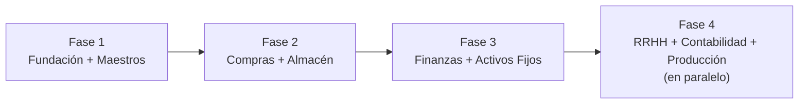
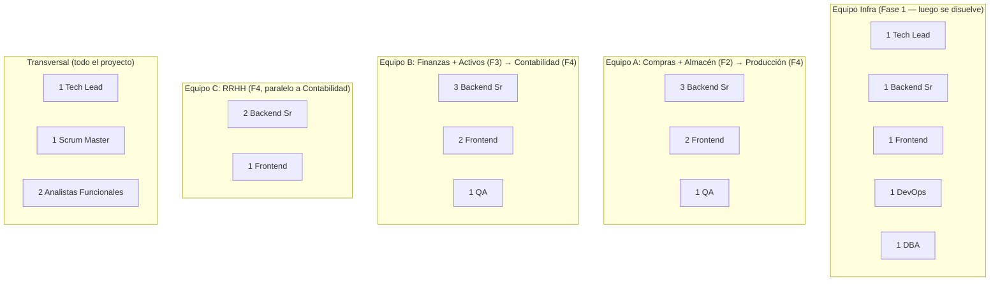
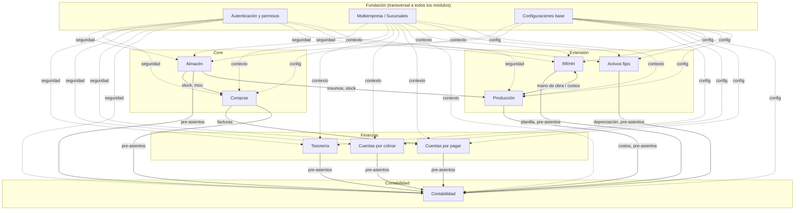
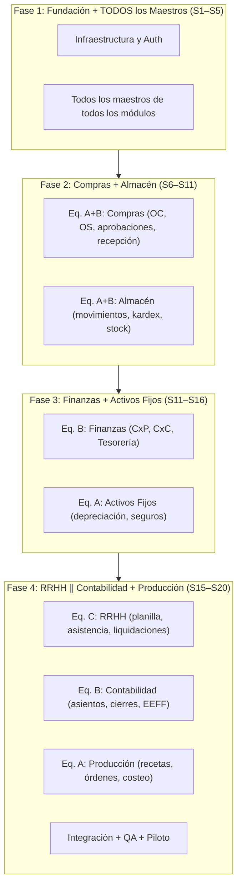
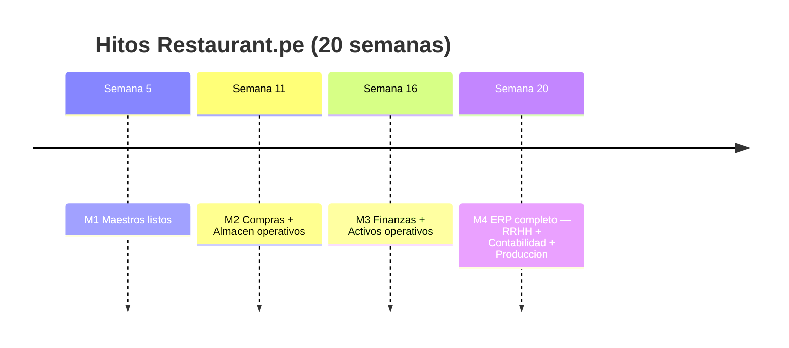
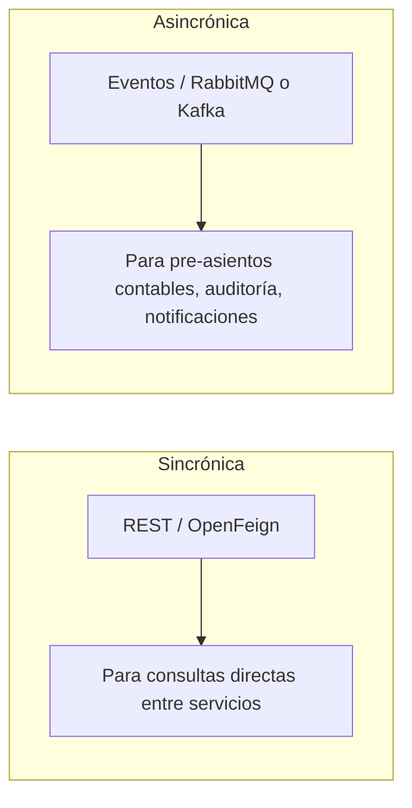
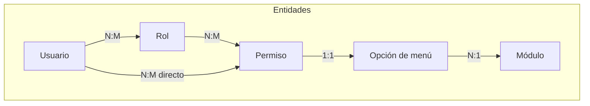
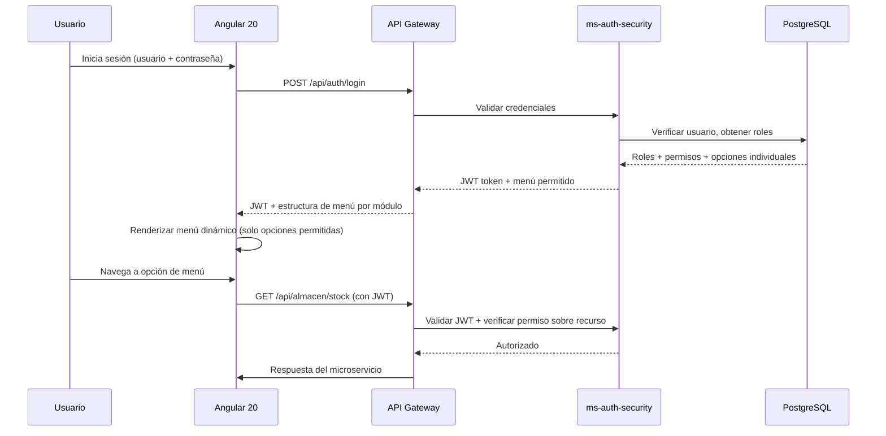
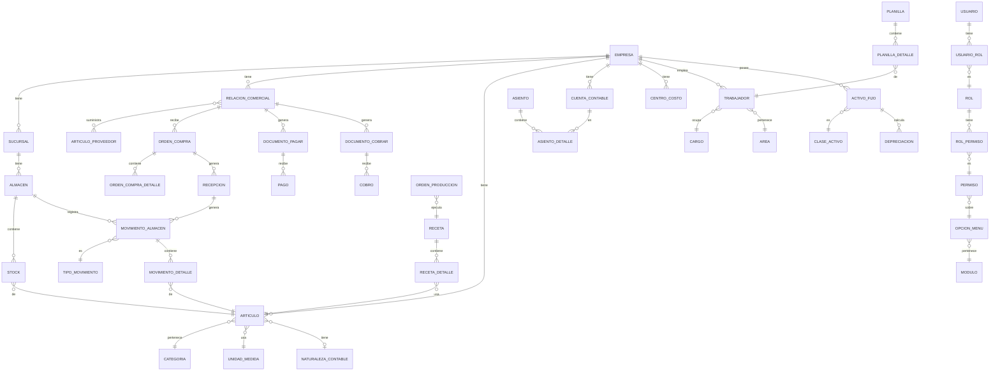

# Roadmap — Proyecto Restaurant.pe

**Documento:** Mapa de ruta para el desarrollo del ERP Restaurant.pe  
**Alcance:** 9 módulos, multipaís, multiempresa, multisucursal  
**Stack:** Backend Java/Spring Boot · Frontend Angular 20 · Base de datos PostgreSQL  
**Plazo objetivo:** 5 meses (20 semanas)  

---

## 1. Visión y objetivo del roadmap

El roadmap ordena el desarrollo siguiendo la misma lógica de dependencias del ERP SIGRE:

1. **Maestros primero:** Todos los maestros de todos los módulos se construyen en la primera fase. Sin datos maestros, ningún proceso puede operar.
2. **Compras + Almacén:** Son el motor operativo del ERP. Compras genera documentos de adquisición, Almacén recibe mercadería y controla stock. Son inseparables.
3. **Finanzas + Activos Fijos:** Finanzas necesita que Compras genere documentos por pagar (CxP). Activos Fijos se alimenta de las compras de activos y requiere la estructura financiera.
4. **RRHH en paralelo con Contabilidad:** RRHH necesita la infraestructura financiera lista (cuentas bancarias, formas de pago). Contabilidad necesita que todos los módulos generen pre-asientos. Ambos son independientes entre sí y se desarrollan en paralelo.
5. **Producción** se desarrolla junto con RRHH/Contabilidad, ya que solo necesita Almacén (que ya está listo).
6. **Plazo total:** Máximo **5 meses** (20 semanas).



---

## 2. Equipo de desarrollo

### 2.1 Composición total: 21 personas

Para cumplir con el plazo de 5 meses se requieren **3 equipos funcionales** trabajando en paralelo desde la Fase 2, más un equipo transversal.

| Rol | Cant. | Dedicación | Responsabilidad |
|-----|:-----:|:----------:|-----------------|
| **Tech Lead / Arquitecto** | 1 | 100% todo el proyecto | Arquitectura de microservicios, revisiones de código, decisiones técnicas, integración entre equipos |
| **Scrum Master / PM** | 1 | 100% todo el proyecto | Gestión de sprints, seguimiento de hitos, gestión de impedimentos |
| **Analista Funcional / BA** | 2 | 100% todo el proyecto | Refinamiento de HUs, validación funcional, criterios de aceptación, pruebas UAT |
| **DevOps** | 1 | 100% todo el proyecto | CI/CD, entornos, Docker, despliegues, monitoreo |
| **DBA** | 1 | 100% Fases 1–2, 50% Fases 3–4 | Modelo de datos, migraciones Flyway, performance, índices |
| **Backend Senior (Java/Spring Boot)** | 8 | 100% asignados a equipos | Desarrollo de microservicios, APIs REST, lógica de negocio |
| **Frontend (Angular 20)** | 5 | 100% asignados a equipos | Pantallas, componentes, integración con APIs, UX |
| **QA / Tester** | 2 | 100% desde Fase 2 | Pruebas funcionales, regresión, automatización, pruebas de integración |

### 2.2 Distribución por equipo



> **Nota:** En la Fase 1 todo el equipo trabaja junto en fundación y maestros. En la Fase 2, el Equipo A (Compras+Almacén) toma el liderazgo mientras B apoya. En la Fase 3, el Equipo B lidera Finanzas+Activos. En la Fase 4, los tres equipos trabajan en paralelo: A (Producción), B (Contabilidad), C (RRHH).

---

## 3. Diagrama de dependencias entre módulos

El orden de las fases respeta las dependencias funcionales: Contabilidad **recibe** información de todos los módulos operativos (Almacén, Compras, Finanzas, RRHH, Activos Fijos, Producción). Los módulos de Fundación (Auth, Multiempresa, Configuraciones) son transversales y requeridos por todos.



> **Leyenda:** Las líneas punteadas (`-.->`） representan dependencias transversales de Fundación (seguridad, contexto multiempresa, configuraciones). Las líneas sólidas (`-->`) representan flujo de datos operativos entre módulos. Contabilidad es el receptor final de todos los módulos.

---

## 4. Fases del proyecto (4 fases, 20 semanas)



---

## 5. Timeline global — Gantt detallado (20 semanas)

```mermaid
gantt
    title Roadmap Restaurant.pe — 20 semanas (5 meses)
    dateFormat YYYY-MM-DD
    axisFormat %d/%m

    section Fase 1 — Fundación + TODOS los Maestros
    Infraestructura (Eureka, Gateway, Config, Auth)          :f1a, 2026-03-02, 2w
    Maestros Core (empresa, sucursal, país, moneda, TC)      :f1b, 2026-03-02, 2w
    Maestros Relaciones Comerciales (prov/cli unificado)     :f1c, 2026-03-16, 2w
    Maestros Artículos (categorías, unidades, naturaleza)    :f1d, 2026-03-16, 2w
    Maestros Almacén + Compras + Finanzas + Contab + RRHH    :f1e, 2026-03-30, 1w
    Maestros Activos Fijos + Producción + Auditoría          :f1f, 2026-03-30, 1w
    Frontend Shell + Login + Menú dinámico + CRUDs           :f1fe, 2026-03-02, 5w
    Hito M1 — Maestros listos                                :milestone, m1, 2026-04-06, 0d

    section Fase 2 — Compras + Almacén
    Compras: OC + OS + aprobaciones multinivel               :f2a1, 2026-04-06, 3w
    Compras: Recepción + integración almacén                 :f2a2, after f2a1, 1w
    Almacén: Movimientos + kardex + valorización             :f2a3, 2026-04-06, 3w
    Almacén: Inventario físico + ajustes + devoluciones      :f2a4, after f2a3, 1w
    Reportes Compras + Almacén                               :f2a5, after f2a2, 2w
    Hito M2 — Compras + Almacén operativos                   :milestone, m2, 2026-05-18, 0d

    section Fase 3 — Finanzas + Activos Fijos
    Finanzas: CxP (facturas, pagos, NC/ND)                   :f3a1, 2026-05-11, 2w
    Finanzas: CxC (cobros, aplicación, letras)               :f3a2, 2026-05-11, 2w
    Finanzas: Tesorería + conciliaciones bancarias            :f3a3, after f3a1, 2w
    Finanzas: Adelantos + fondo fijo + caja chica             :f3a4, after f3a3, 1w
    Activos: Registro + depreciación + revaluación            :f3b1, 2026-05-11, 2w
    Activos: Seguros + pólizas + bajas + traslados            :f3b2, after f3b1, 2w
    Reportes Finanzas + Activos Fijos                         :f3a5, after f3a4, 1w
    Hito M3 — Finanzas + Activos operativos                   :milestone, m3, 2026-06-22, 0d

    section Fase 4 — RRHH + Contabilidad + Producción (paralelo)
    Eq.C RRHH: Ficha trabajador + contratos                   :f4c1, 2026-06-15, 2w
    Eq.C RRHH: Asistencia (POS/App/GPS)                       :f4c2, after f4c1, 1w
    Eq.C RRHH: Planilla + CTS + gratificaciones               :f4c3, after f4c2, 2w
    Eq.C RRHH: Liquidaciones + propinas + regulatorios         :f4c4, after f4c3, 1w
    Eq.C RRHH: Reportes + archivos (PLAME)                    :f4c5, after f4c4, 1w
    Eq.B Contabilidad: Asientos manuales + automáticos         :f4b1, 2026-06-15, 2w
    Eq.B Contabilidad: Pre-asientos desde todos los módulos    :f4b2, after f4b1, 1w
    Eq.B Contabilidad: Cierres mensual + anual + EEFF          :f4b3, after f4b2, 2w
    Eq.B Contabilidad: Libros electrónicos (PLE/SIRE)          :f4b4, after f4b3, 1w
    Eq.A Producción: Recetas + órdenes + costeo                :f4a1, 2026-06-15, 3w
    Eq.A Producción: Consumo almacén + reportes                :f4a2, after f4a1, 1w
    Integración contable de TODOS los módulos                  :f4int, 2026-07-13, 1w
    QA integral + pruebas end-to-end                           :f4qa, after f4int, 1w
    Piloto con usuarios reales                                 :f4pilot, after f4qa, 1w
    Hito M4 — ERP completo en producción                       :milestone, m4, 2026-08-03, 0d
```

---

## 6. Detalle por fase

### Fase 1: Fundación + TODOS los Maestros (Semanas 1–5)

**Duración:** 5 semanas  
**Equipo:** Todo el equipo (21 personas)  
**Objetivo:** Infraestructura lista y TODOS los maestros de TODOS los módulos construidos (backend + frontend).

#### Semanas 1–2: Infraestructura y maestros organizacionales

| Responsable | Tarea |
|-------------|-------|
| Tech Lead + DevOps | Eureka Server, Config Server, API Gateway, CI/CD pipelines |
| Backend 1–2 | ms-auth-security: login, JWT, usuarios, roles dinámicos, permisos, opciones de menú |
| Backend 3–4 | ms-core-maestros: empresa, sucursal, país, departamento, provincia, distrito, moneda, tipo de cambio |
| Backend 5–6 | ms-core-maestros: impuestos, retenciones, detracciones, parámetros del sistema, ejercicios/períodos |
| DBA | Esquemas PostgreSQL, migraciones Flyway iniciales, índices base |
| Frontend 1–2 | Angular shell, layout principal, login, selección empresa/sucursal |
| Frontend 3 | Componentes reutilizables (tablas, formularios, filtros, paginación) |
| Analistas | Validación de campos y reglas de negocio de cada maestro |

#### Semanas 3–4: Maestros de negocio

| Responsable | Tarea |
|-------------|-------|
| Backend 1–2 | ms-core-maestros: relacion_comercial (unificado prov/cli), tipo_documento_identidad, contactos, cuentas bancarias |
| Backend 3–4 | ms-core-maestros: artículo, categoría (4 niveles), unidad_medida, conversión, naturaleza_contable, artículo_proveedor, artículo_almacén |
| Backend 5 | ms-core-maestros: condición_pago, forma_pago, numeradores |
| Backend 6 | ms-almacen: almacén (maestro), tipo_movimiento |
| Backend 7 | ms-contabilidad: cuenta_contable (plan contable jerárquico), centro_costo, libro_contable, matriz_contable |
| Backend 8 | ms-rrhh: área, cargo, concepto_planilla, AFP · ms-activos-fijos: clase_activo, ubicación_física, aseguradora |
| Frontend 1–5 | CRUD de todos los maestros (pantallas de mantenimiento) |
| DBA | Migraciones de todos los esquemas, datos iniciales (países, monedas, impuestos) |

#### Semana 5: Maestros restantes + validación cruzada

| Responsable | Tarea |
|-------------|-------|
| Backend todos | ms-finanzas: cuenta_bancaria, caja, concepto_financiero, flujo_caja_concepto |
| Backend todos | ms-produccion: receta (estructura), receta_detalle |
| Backend todos | ms-auditoria: log_auditoria, log_acceso |
| Frontend todos | Menú dinámico funcional, CRUDs completos, validaciones |
| QA | Pruebas de todos los maestros, validación de datos, permisos |
| Analistas | UAT de maestros con reglas de negocio |

**Criterio de salida (Hito M1):** Todos los maestros con CRUD funcional en backend y frontend. Menú dinámico cargando por roles. Auth + multiempresa operativo.

---

### Fase 2: Compras + Almacén (Semanas 6–11)

**Duración:** 6 semanas  
**Equipos:** A lidera, B apoya (todo el equipo técnico concentrado en los procesos core)  
**Referencia SIGRE:** Estos son los módulos con mayor volumen transaccional. En SIGRE, Compras y Almacén comparten más de 1,500 objetos de código fuente.

#### Compras (5 Backend + 3 Frontend + 1 QA)

| Semana | Backend | Frontend |
|:------:|---------|----------|
| S6–S8 | OC: emisión, detalle, estados, numeración automática por sucursal | Pantalla OC con búsqueda proveedor/artículos |
| S6–S8 | OS: emisión, detalle, vinculación a proveedor de servicio | Pantalla OS |
| S8 | Workflow aprobación multinivel (configurable por monto/tipo) | Bandeja de aprobaciones |
| S9 | Recepción: vinculación con OC, generación automática mov. almacén | Pantalla recepción con validación contra OC |
| S10 | Devoluciones a proveedores, solicitudes de reposición | Pantallas devolución y reposición |
| S10–S11 | Reportes: OC pendientes, compras por proveedor, por período | Reportes con filtros y export Excel/PDF |

#### Almacén (3 Backend + 2 Frontend + 1 QA)

| Semana | Backend | Frontend |
|:------:|---------|----------|
| S6–S8 | Movimientos ingreso/salida/traslado, confirmación, validación stock | Pantalla de movimientos con detalle |
| S8–S9 | Kardex valorizado (promedio ponderado), cálculo stock, precio promedio | Consulta de kardex y stock |
| S9 | Inventario físico: toma, comparación con stock sistema, ajustes | Pantalla inventario físico |
| S10 | Traslados entre almacenes, stock en tránsito | Pantalla traslados |
| S10–S11 | Reportes: stock actual, movimientos por período, valorización | Reportes con filtros y export |

**Criterio de salida (Hito M2):** Flujo completo Proveedor → OC → Aprobación → Recepción → Movimiento Almacén → Stock → Kardex operativo. Devoluciones y ajustes funcionales.

---

### Fase 3: Finanzas + Activos Fijos (Semanas 11–16)

**Duración:** 6 semanas  
**Equipos:** B lidera Finanzas, A lidera Activos Fijos  
**Referencia SIGRE:** Finanzas es el módulo más complejo después de Compras/Almacén. Involucra CxP, CxC, Tesorería, conciliaciones y adelantos. Activos Fijos gestiona depreciación, seguros y control patrimonial.

#### Equipo B: Finanzas (4 Backend + 2 Frontend + 1 QA)

| Semana | Backend | Frontend |
|:------:|---------|----------|
| S11–S12 | CxP: registro facturas (desde OC y directas), estados, NC/ND | Pantalla CxP con vinculación a OC |
| S11–S12 | CxC: registro cobros, aplicación a documentos, letras | Pantalla CxC |
| S13–S14 | Tesorería: movimientos bancarios, transferencias, programación pagos | Pantalla tesorería |
| S14 | Conciliación bancaria + conciliación con pasarelas (Niubiz, Yape, Plin) | Pantalla conciliación |
| S15 | Adelantos/OG, fondo fijo por PdV, caja chica, liquidaciones | Pantallas adelantos y cajas |
| S16 | Reportes: estado cuenta proveedor/cliente, flujo caja, antigüedad saldos | Reportes con filtros y export |

#### Equipo A: Activos Fijos (3 Backend + 2 Frontend)

| Semana | Backend | Frontend |
|:------:|---------|----------|
| S11–S12 | Registro de activos, vinculación a compra/factura, datos técnicos | Pantalla ficha activo completa |
| S13–S14 | Depreciación mensual automática, revaluación, cálculo valor neto | Pantalla depreciación + ejecución masiva |
| S14–S15 | Seguros/pólizas, traslados con workflow, bajas | Pantallas seguros y traslados |
| S16 | Reportes: depreciación acumulada, activos por ubicación, seguros vigentes | Reportes |

**Criterio de salida (Hito M3):** Ciclo CxP (factura → programación → pago) y CxC (documento → cobro → aplicación) operativos. Conciliación bancaria funcional. Activos con depreciación mensual calculada.

---

### Fase 4: RRHH ∥ Contabilidad + Producción (Semanas 15–20)

**Duración:** 6 semanas (con overlap de 1 semana sobre Fase 3)  
**Equipos:** 3 equipos en paralelo — C (RRHH), B (Contabilidad), A (Producción)  
**Referencia SIGRE:** RRHH necesita la infraestructura financiera (cuentas bancarias, formas de pago) que ya estará lista. Contabilidad es el receptor final de pre-asientos de todos los módulos. Producción solo necesita Almacén.

> **Justificación del paralelismo:** RRHH y Contabilidad son funcionalmente independientes durante el desarrollo. RRHH gestiona personas y planilla; Contabilidad gestiona asientos y cierres. La integración (pre-asientos de planilla) se cierra en las últimas semanas.

#### Equipo C: RRHH (2 Backend + 1 Frontend)

| Semana | Backend | Frontend |
|:------:|---------|----------|
| S15–S16 | Ficha trabajador completa, contratos, renovaciones, historial | Pantalla ficha empleado |
| S16 | Asistencia: marcaciones POS/App/biométrico, reglas tardanza/falta | Pantalla asistencia y marcación |
| S17–S18 | Planilla: cálculo sueldo, horas extra, CTS, gratificaciones, AFP, EsSalud | Pantalla cálculo planilla |
| S18 | Liquidaciones, beneficios sociales, propinas, recargo al consumo | Pantalla liquidaciones |
| S19 | PLAME, archivos regulatorios, boletas de pago electrónicas | Generación archivos y boletas |
| S19–S20 | Reportes: planilla, asistencia, headcount, rotación, KPIs | Reportes |

#### Equipo B: Contabilidad (3 Backend + 2 Frontend + 1 QA)

| Semana | Backend | Frontend |
|:------:|---------|----------|
| S15–S16 | Asientos manuales + asientos automáticos desde matrices contables | Pantalla asiento contable |
| S17 | Motor de pre-asientos: recepción desde Compras, Almacén, Finanzas, Activos | Motor de procesamiento |
| S17–S18 | Pre-asientos desde RRHH (planilla) y Producción (costos) | Integración asincrónica |
| S18–S19 | Cierres: mensual (bloqueo período), anual (traslado resultados) | Pantalla cierre contable |
| S19 | EEFF: Balance General, Estado de Resultados, Flujo de Efectivo, Patrimonio | Pantalla EEFF con export |
| S19 | Libros electrónicos (PLE/SIRE u equivalente por país) | Generación archivos |

#### Equipo A: Producción (2 Backend + 1 Frontend)

| Semana | Backend | Frontend |
|:------:|---------|----------|
| S15–S16 | Recetas (detalle insumos con merma), versiones de receta | Pantalla receta con drag & drop insumos |
| S17 | Órdenes de producción, consumo automático de almacén | Pantalla orden de producción |
| S18 | Costeo por receta (materia prima + mano de obra + indirectos) | Pantalla costeo consolidado |
| S18 | Reportes: costos, consumos, rendimiento por receta | Reportes |

#### Integración y cierre (Todo el equipo, Semanas 18–20)

| Semana | Actividad |
|:------:|-----------|
| S18–S19 | Integración contable de TODOS los módulos (verificar que todos generen pre-asientos correctos) |
| S19 | QA integral: pruebas end-to-end de flujos completos (compra → almacén → CxP → pago → asiento contable) |
| S20 | Piloto con usuarios reales, corrección de bugs críticos |
| S20 | Documentación operativa y entrega |

**Criterio de salida (Hito M4):** ERP completo operativo. Planilla calculada y pagada. Cierre contable ejecutado. Producción con costeo. Al menos un piloto exitoso con usuarios reales.

---

## 7. Hitos principales

| # | Hito | Semana | Fecha estimada | Descripción |
|---|------|:------:|:--------------:|-------------|
| M1 | Maestros listos | S5 | Fin mes 1 | Todos los CRUD de maestros funcionales, auth + menú dinámico |
| M2 | Compras + Almacén operativos | S11 | Fin mes 2.5 | Flujo OC → Aprobación → Recepción → Stock → Kardex cerrado |
| M3 | Finanzas + Activos operativos | S16 | Fin mes 4 | CxP/CxC, tesorería, conciliación, depreciación de activos |
| M4 | ERP completo en producción | S20 | Fin mes 5 | RRHH + Contabilidad + Producción cerrados, piloto exitoso |



---

## 8. Arquitectura de microservicios

### 8.1 Visión general

El backend se construye como un ecosistema de **microservicios** independientes, cada uno con su propia responsabilidad, comunicados a través de un **API Gateway** y registrados en un **Eureka Server** (service discovery).

```mermaid
flowchart TB
    subgraph Cliente
        ANG[Angular 20 - SPA]
    end
    subgraph Infraestructura
        GW[API Gateway - Spring Cloud Gateway]
        EU[Eureka Server - Service Discovery]
        CFG[Config Server - Spring Cloud Config]
    end
    subgraph Microservicios
        MS_AUTH[ms-auth-security]
        MS_CORE[ms-core-maestros]
        MS_ALM[ms-almacen]
        MS_COM[ms-compras]
        MS_FIN[ms-finanzas]
        MS_CNT[ms-contabilidad]
        MS_RRHH[ms-rrhh]
        MS_AF[ms-activos-fijos]
        MS_PROD[ms-produccion]
        MS_AUD[ms-auditoria]
        MS_RPT[ms-reportes]
        MS_NOTIF[ms-notificaciones]
    end
    subgraph BD["PostgreSQL (esquemas por servicio)"]
        DB1[(schema: auth)]
        DB2[(schema: core)]
        DB3[(schema: almacen)]
        DB4[(schema: compras)]
        DB5[(schema: finanzas)]
        DB6[(schema: contabilidad)]
        DB7[(schema: rrhh)]
        DB8[(schema: activos)]
        DB9[(schema: produccion)]
        DB10[(schema: auditoria)]
    end
    ANG --> GW
    GW --> EU
    GW --> MS_AUTH
    GW --> MS_CORE
    GW --> MS_ALM
    GW --> MS_COM
    GW --> MS_FIN
    GW --> MS_CNT
    GW --> MS_RRHH
    GW --> MS_AF
    GW --> MS_PROD
    GW --> MS_AUD
    GW --> MS_RPT
    GW --> MS_NOTIF
    MS_AUTH --> DB1
    MS_CORE --> DB2
    MS_ALM --> DB3
    MS_COM --> DB4
    MS_FIN --> DB5
    MS_CNT --> DB6
    MS_RRHH --> DB7
    MS_AF --> DB8
    MS_PROD --> DB9
    MS_AUD --> DB10
    MS_AUTH --> EU
    MS_CORE --> EU
    MS_ALM --> EU
    MS_COM --> EU
    MS_FIN --> EU
    MS_CNT --> EU
    MS_RRHH --> EU
    MS_AF --> EU
    MS_PROD --> EU
    MS_AUD --> EU
    MS_RPT --> EU
    MS_NOTIF --> EU
    CFG --> MS_AUTH
    CFG --> MS_CORE
    CFG --> MS_ALM
```



### 8.2 Catálogo de microservicios (15 servicios)

| # | Microservicio | Puerto base | Responsabilidad | Fase |
|---|--------------|:-----------:|----------------|:----:|
| 1 | **eureka-server** | 8761 | Service discovery. Todos los servicios se registran aquí | 1 |
| 2 | **config-server** | 8888 | Configuración centralizada (perfiles dev/qa/prod, por país) | 1 |
| 3 | **api-gateway** | 8080 | Punto de entrada único. Ruteo, rate limiting, CORS, balanceo | 1 |
| 4 | **ms-auth-security** | 9001 | Autenticación (JWT), usuarios, roles, permisos, opciones de menú, auditoría de acceso | 1 |
| 5 | **ms-core-maestros** | 9002 | Maestros compartidos: empresas, sucursales, países, monedas, tipo de cambio, impuestos, relaciones comerciales (proveedores/clientes), artículos, categorías, unidades de medida, numeradores | 1 |
| 6 | **ms-almacen** | 9003 | Almacenes, tipos de movimiento, movimientos de inventario, kardex, valorización, stock, devoluciones, traslados | 2 |
| 7 | **ms-compras** | 9004 | Condiciones de pago, OC, OS, aprobaciones, recepción, planificación de abastecimiento | 2 |
| 8 | **ms-finanzas** | 9005 | Tesorería, CxC, CxP, adelantos, cuentas bancarias, conciliaciones, flujo de caja, programación de pagos | 3 |
| 9 | **ms-contabilidad** | 9006 | Plan contable, centros de costo, asientos, pre-asientos, matrices contables, cierres, libros electrónicos, EEFF | 4 |
| 10 | **ms-rrhh** | 9007 | Trabajadores, contratos, asistencia, nómina, beneficios, liquidaciones, reclutamiento, talento, archivos regulatorios | 2–3 |
| 11 | **ms-activos-fijos** | 9008 | Registro de activos, depreciación, revaluación, seguros, bajas, traslados | 3 |
| 12 | **ms-produccion** | 9009 | Recetas, órdenes de producción, costeo por receta, consumo de inventario | 4 |
| 13 | **ms-auditoria** | 9010 | Registro centralizado de auditoría: quién, cuándo, qué, desde dónde (todos los servicios envían eventos) | 1 |
| 14 | **ms-reportes** | 9011 | Motor de reportes (JasperReports o similar), exportación PDF/Excel, reportes compartidos entre módulos | 2 |
| 15 | **ms-notificaciones** | 9012 | Envío de correos, alertas del sistema, recordatorios, notificaciones push | 2 |

### 8.3 Comunicación entre microservicios



| Tipo | Uso | Ejemplo |
|------|-----|---------|
| **REST + OpenFeign** | Consultas sincrónicas entre servicios | ms-compras consulta a ms-core-maestros para validar proveedor |
| **Eventos (mensajería)** | Operaciones que disparan acciones en otros servicios | ms-almacen emite evento "movimiento_creado" → ms-contabilidad genera pre-asiento |
| **API Gateway** | Toda comunicación del frontend pasa por aquí | Angular llama a `/api/almacen/stock` → Gateway rutea a ms-almacen |

---

## 9. Control de acceso: roles, permisos y menú dinámico

### 9.1 Modelo de seguridad

El sistema de acceso se basa en **roles creados a demanda por el usuario administrador**, con asignación granular de permisos a nivel de opción de menú.



### 9.2 Reglas de negocio del control de acceso

1. **Roles dinámicos:** Los roles NO son fijos en código. El usuario administrador crea, modifica y elimina roles a demanda (ej.: "Jefe de almacén Lima", "Contador corporativo", "Cajero sucursal X").
2. **Opciones de menú por rol:** Cada rol tiene asociadas las opciones de menú que puede ver. Al iniciar sesión, el frontend carga **únicamente** las opciones que corresponden a los roles del usuario.
3. **Asignación individual:** Además de los roles, se puede asignar o revocar opciones de menú a un usuario **de manera individual**, para excepciones (ej.: un usuario que necesita acceso a una sola pantalla de un módulo que no le corresponde por rol).
4. **Menú cargado por módulo:** El frontend organiza las opciones de menú agrupadas por módulo. Solo se muestran los módulos que tengan al menos una opción permitida.
5. **Permisos por acción:** Cada opción de menú puede tener permisos granulares: ver, crear, editar, eliminar, aprobar, imprimir, exportar.
6. **Scope multiempresa:** Los permisos aplican dentro del contexto de la empresa/sucursal seleccionada. Un usuario puede tener roles distintos por empresa.

### 9.3 Flujo de carga del menú dinámico



### 9.4 Estructura de datos de seguridad (esquema `auth`)

| Tabla | Campos principales | Descripción |
|-------|-------------------|-------------|
| `usuario` | id, username, password_hash, email, nombre, activo, empresa_default_id | Usuarios del sistema |
| `rol` | id, codigo, nombre, descripcion, empresa_id, activo | Roles creados a demanda |
| `usuario_rol` | usuario_id, rol_id, empresa_id | Asignación de roles a usuario (por empresa) |
| `modulo` | id, codigo, nombre, icono, orden | Módulos del ERP (Almacén, Compras, etc.) |
| `opcion_menu` | id, modulo_id, padre_id, codigo, nombre, ruta_frontend, icono, orden, activo | Opciones del menú (jerárquicas) |
| `accion` | id, codigo, nombre | Acciones posibles (ver, crear, editar, eliminar, aprobar, imprimir, exportar) |
| `permiso` | id, opcion_menu_id, accion_id | Permiso = opción + acción |
| `rol_permiso` | rol_id, permiso_id | Permisos asignados al rol |
| `usuario_permiso` | usuario_id, permiso_id, tipo (CONCEDER/REVOCAR) | Permisos individuales (excepciones) |
| `sesion` | id, usuario_id, token, ip, fecha_inicio, fecha_fin, activa | Control de sesiones |

---

## 10. Base de datos — PostgreSQL

### 10.1 Estrategia de esquemas

Se usa **una sola instancia de PostgreSQL** con **esquemas separados por microservicio**. Esto permite:

- Aislamiento lógico entre módulos.
- Consultas cruzadas cuando sea necesario (con permisos controlados).
- Un solo punto de backup y administración.

| Esquema | Microservicio | Tablas principales |
|---------|---------------|--------------------|
| `auth` | ms-auth-security | usuario, rol, permiso, opcion_menu, sesion |
| `core` | ms-core-maestros | empresa, sucursal, pais, moneda, tipo_cambio, relacion_comercial, articulo, categoria, unidad_medida, impuesto, numerador |
| `almacen` | ms-almacen | almacen, tipo_movimiento, movimiento_almacen, movimiento_detalle, kardex, stock, inventario_fisico |
| `compras` | ms-compras | condicion_pago, orden_compra, orden_compra_detalle, orden_servicio, orden_servicio_detalle, aprobacion_oc, recepcion |
| `finanzas` | ms-finanzas | cuenta_bancaria, movimiento_bancario, documento_cobrar, documento_pagar, pago, cobro, conciliacion, flujo_caja, adelanto |
| `contabilidad` | ms-contabilidad | plan_contable, cuenta_contable, centro_costo, asiento, asiento_detalle, pre_asiento, matriz_contable, periodo_contable, libro_electronico |
| `rrhh` | ms-rrhh | trabajador, contrato, cargo, area, concepto_planilla, planilla, planilla_detalle, asistencia, vacacion, liquidacion |
| `activos` | ms-activos-fijos | activo_fijo, clase_activo, ubicacion, depreciacion, seguro, poliza, revaluacion, baja_activo |
| `produccion` | ms-produccion | receta, receta_detalle, orden_produccion, orden_produccion_detalle, costeo_produccion |
| `auditoria` | ms-auditoria | log_auditoria, log_acceso |

### 10.2 Convenciones de la base de datos

- **Naming:** snake_case para tablas y columnas.
- **Claves primarias:** `id BIGSERIAL PRIMARY KEY` (autoincremental).
- **Multiempresa:** todas las tablas de negocio llevan `empresa_id` como columna obligatoria.
- **Multisucursal:** las tablas operativas llevan `sucursal_id` donde aplique.
- **Auditoría mínima por registro:** `creado_por`, `creado_en`, `modificado_por`, `modificado_en` en todas las tablas.
- **Soft delete:** `activo BOOLEAN DEFAULT true` (no se elimina físicamente).
- **Migraciones:** Flyway o Liquibase para versionado de esquema.

---

## 11. Maestros detallados

A continuación se detallan **todas las tablas maestras** del sistema, agrupadas por esquema/microservicio.

### 11.1 Esquema `core` — Maestros compartidos (ms-core-maestros)

Estos maestros son consumidos por todos los demás microservicios.

#### 11.1.1 Empresa y estructura organizacional

| Tabla | Campos | Descripción |
|-------|--------|-------------|
| **empresa** | id, ruc_nit, razon_social, nombre_comercial, pais_id, moneda_base_id, logo_url, direccion, telefono, email, regimen_tributario, activo | Empresa o razón social (multiempresa) |
| **sucursal** | id, empresa_id, codigo, nombre, direccion, telefono, pais_id, ciudad, departamento, ubigeo, tipo (PROPIA/FRANQUICIA), activo | Sucursal, local o punto de operación |
| **almacen** | id, sucursal_id, empresa_id, codigo, nombre, tipo (FISICO/VIRTUAL/TRANSITO), direccion, responsable_id, activo | Almacenes por sucursal (un local puede tener varios almacenes) |

#### 11.1.2 Geografía y localización

| Tabla | Campos | Descripción |
|-------|--------|-------------|
| **pais** | id, codigo_iso, nombre, moneda_default_id, formato_ruc, nombre_ruc (RUC/NIT/RNC/RFC), activo | Países soportados |
| **departamento** | id, pais_id, codigo, nombre | División política nivel 1 |
| **provincia** | id, departamento_id, codigo, nombre | División política nivel 2 |
| **distrito** | id, provincia_id, codigo, ubigeo, nombre | División política nivel 3 |

#### 11.1.3 Monedas y tipo de cambio

| Tabla | Campos | Descripción |
|-------|--------|-------------|
| **moneda** | id, codigo_iso (PEN, USD, COP, CLP, DOP), nombre, simbolo, decimales, activo | Catálogo de monedas |
| **tipo_cambio** | id, empresa_id, moneda_origen_id, moneda_destino_id, fecha, tasa_compra, tasa_venta, fuente | Tipo de cambio diario |

#### 11.1.4 Relaciones comerciales (maestro unificado proveedor/cliente)

| Tabla | Campos | Descripción |
|-------|--------|-------------|
| **relacion_comercial** | id, empresa_id, tipo_documento_identidad, numero_documento, razon_social, nombre_comercial, direccion, telefono, email, contacto_nombre, contacto_telefono, contacto_email, pais_id, departamento_id, provincia_id, distrito_id, es_proveedor, es_cliente, es_empleado, es_otro, condicion_pago_default_id, moneda_default_id, observaciones, activo | **Maestro unificado.** Una misma entidad puede ser proveedor Y cliente. El campo booleano define su naturaleza. Equivalente al "Código de Relación" de SIGRE |
| **tipo_documento_identidad** | id, pais_id, codigo, nombre, longitud, validacion_regex | Tipos: RUC, DNI, NIT, Cédula, Pasaporte, RNC, RFC, etc. |
| **contacto_relacion** | id, relacion_comercial_id, nombre, cargo, telefono, email, es_principal | Contactos adicionales de la relación comercial |
| **cuenta_bancaria_relacion** | id, relacion_comercial_id, banco, numero_cuenta, cci, moneda_id, tipo_cuenta, es_principal | Cuentas bancarias del proveedor/cliente |

#### 11.1.5 Artículos y clasificación

| Tabla | Campos | Descripción |
|-------|--------|-------------|
| **categoria** | id, empresa_id, codigo, nombre, padre_id, nivel (1=Cat, 2=SubCat, 3=Familia, 4=Línea), activo | Clasificación jerárquica de artículos (hasta 4 niveles) |
| **unidad_medida** | id, codigo, nombre, abreviatura, activo | Unidades: KG, LT, UND, CJ, BLS, etc. |
| **conversion_unidad** | id, unidad_origen_id, unidad_destino_id, factor, articulo_id (nullable) | Factor de conversión entre unidades (global o por artículo) |
| **articulo** | id, empresa_id, codigo, nombre, descripcion, categoria_id, unidad_medida_id, unidad_compra_id, factor_compra, marca, modelo, codigo_barras, peso_neto, peso_bruto, volumen, es_inventariable, es_comprable, es_vendible, es_producible, es_servicio, imagen_url, stock_minimo, stock_maximo, punto_reorden, precio_ultima_compra, precio_promedio, precio_venta, naturaleza_contable_id, cuenta_contable_inventario, cuenta_contable_costo, cuenta_contable_gasto, impuesto_id, activo | Maestro central de artículos (productos, insumos, servicios) |
| **articulo_proveedor** | id, articulo_id, relacion_comercial_id, codigo_proveedor, precio_referencia, moneda_id, tiempo_entrega_dias, es_preferido | Relación artículo-proveedor con precio y tiempos |
| **articulo_almacen** | id, articulo_id, almacen_id, ubicacion, stock_minimo, stock_maximo, punto_reorden | Configuración de stock por artículo y almacén |
| **naturaleza_contable** | id, empresa_id, codigo, nombre, descripcion, cuenta_inventario, cuenta_costo, cuenta_gasto, cuenta_ingreso, activo | Naturaleza contable (clase de artículo con cuentas asociadas) |

#### 11.1.6 Impuestos y retenciones

| Tabla | Campos | Descripción |
|-------|--------|-------------|
| **impuesto** | id, pais_id, codigo, nombre, tipo (IGV/IVA/ITBIS/ISV), porcentaje, cuenta_contable, vigente_desde, vigente_hasta, activo | Impuestos por país con vigencia |
| **retencion** | id, pais_id, codigo, nombre, tipo (RENTA/IVA/ISR), porcentaje, monto_minimo, cuenta_contable, activo | Retenciones fiscales por país |
| **detraccion** | id, pais_id, codigo, nombre, porcentaje, bien_servicio, cuenta_contable, activo | Detracciones (Perú - SPOT) |

#### 11.1.7 Numeradores

| Tabla | Campos | Descripción |
|-------|--------|-------------|
| **numerador** | id, empresa_id, sucursal_id, tipo_documento, serie, correlativo_actual, formato, longitud, reinicio (ANUAL/MENSUAL/NUNCA), activo | Numeración automática por tipo de documento, empresa y sucursal |

#### 11.1.8 Tablas auxiliares generales

| Tabla | Campos | Descripción |
|-------|--------|-------------|
| **parametro_sistema** | id, empresa_id, modulo, clave, valor, tipo_dato, descripcion | Parámetros de configuración por empresa y módulo |
| **ejercicio_periodo** | id, empresa_id, anio, mes, estado (ABIERTO/CERRADO/EN_CIERRE), fecha_cierre | Ejercicios y períodos contables |
| **condicion_pago** | id, empresa_id, codigo, nombre, dias, tipo (CONTADO/CREDITO), numero_cuotas, activo | Condiciones de pago/cobro |
| **forma_pago** | id, codigo, nombre, tipo (EFECTIVO/TRANSFERENCIA/CHEQUE/TARJETA/YAPE/PLIN/NIUBIZ/OTRO), requiere_referencia, activo | Formas/medios de pago |

---

### 11.2 Esquema `almacen` — Maestros y transaccionales

| Tabla | Campos | Descripción |
|-------|--------|-------------|
| **tipo_movimiento** | id, empresa_id, codigo, nombre, naturaleza (INGRESO/SALIDA), afecta_costo, requiere_referencia, tipo_referencia (OC/OS/TRASLADO/AJUSTE/PRODUCCION/VENTA/DEVOLUCION), cuenta_contable_debe, cuenta_contable_haber, activo | Tipos de movimiento de almacén configurables |
| **movimiento_almacen** | id, empresa_id, sucursal_id, almacen_id, tipo_movimiento_id, numero, fecha, estado (BORRADOR/CONFIRMADO/ANULADO), referencia_tipo, referencia_id, referencia_numero, almacen_destino_id (para traslados), observaciones, total_valorizado | Cabecera de movimiento de inventario |
| **movimiento_detalle** | id, movimiento_almacen_id, articulo_id, cantidad, unidad_medida_id, costo_unitario, costo_total, lote, fecha_vencimiento, ubicacion | Detalle del movimiento (cada artículo) |
| **kardex** | id, empresa_id, almacen_id, articulo_id, fecha, tipo_movimiento_id, movimiento_id, cantidad_entrada, cantidad_salida, costo_unitario, costo_total, saldo_cantidad, saldo_valorizado, metodo_costeo (PROMEDIO/PEPS/UEPS) | Kardex valorizado por artículo y almacén |
| **stock** | id, empresa_id, almacen_id, articulo_id, cantidad_disponible, cantidad_reservada, cantidad_transito, costo_promedio, costo_ultima_compra, fecha_ultima_entrada, fecha_ultima_salida | Saldo de stock en tiempo real |
| **inventario_fisico** | id, empresa_id, almacen_id, fecha, estado (EN_PROCESO/FINALIZADO/AJUSTADO), responsable_id | Cabecera de toma de inventario |
| **inventario_fisico_detalle** | id, inventario_fisico_id, articulo_id, stock_sistema, stock_fisico, diferencia, costo_unitario, costo_diferencia, ajuste_aplicado | Detalle con diferencias por artículo |

---

### 11.3 Esquema `compras` — Maestros y transaccionales

| Tabla | Campos | Descripción |
|-------|--------|-------------|
| **orden_compra** | id, empresa_id, sucursal_id, numero, fecha, proveedor_id, condicion_pago_id, moneda_id, tipo_cambio, almacen_destino_id, estado (BORRADOR/PENDIENTE_APROBACION/APROBADA/PARCIAL/COMPLETADA/ANULADA), subtotal, impuesto_total, total, observaciones, fecha_entrega_estimada | Cabecera de orden de compra |
| **orden_compra_detalle** | id, orden_compra_id, articulo_id, descripcion, cantidad, unidad_medida_id, precio_unitario, descuento_porcentaje, descuento_monto, impuesto_id, impuesto_monto, subtotal, total, cantidad_recibida, cantidad_pendiente | Detalle de OC |
| **orden_servicio** | id, empresa_id, sucursal_id, numero, fecha, proveedor_id, condicion_pago_id, moneda_id, tipo_cambio, estado, subtotal, impuesto_total, total, descripcion_servicio, fecha_inicio, fecha_fin, observaciones | Cabecera de orden de servicio |
| **orden_servicio_detalle** | id, orden_servicio_id, descripcion, cantidad, unidad_medida_id, precio_unitario, descuento_porcentaje, impuesto_id, impuesto_monto, subtotal, total | Detalle de OS |
| **aprobacion** | id, documento_tipo (OC/OS), documento_id, nivel, aprobador_id, estado (PENDIENTE/APROBADO/RECHAZADO), fecha, comentario | Workflow de aprobación multinivel |
| **recepcion** | id, empresa_id, sucursal_id, numero, fecha, orden_compra_id, proveedor_id, almacen_id, estado (BORRADOR/CONFIRMADA/ANULADA), guia_remision, observaciones | Recepción de mercadería vinculada a OC |
| **recepcion_detalle** | id, recepcion_id, orden_compra_detalle_id, articulo_id, cantidad_recibida, cantidad_rechazada, motivo_rechazo, costo_unitario | Detalle de recepción |

---

### 11.4 Esquema `finanzas` — Maestros y transaccionales

| Tabla | Campos | Descripción |
|-------|--------|-------------|
| **cuenta_bancaria** | id, empresa_id, banco, numero_cuenta, cci, moneda_id, tipo_cuenta (CORRIENTE/AHORRO/MAESTRA), cuenta_contable_id, saldo_actual, activo | Cuentas bancarias de la empresa |
| **caja** | id, empresa_id, sucursal_id, codigo, nombre, tipo (PRINCIPAL/CHICA/PDV), moneda_id, saldo_actual, fondo_fijo, responsable_id, activo | Cajas de la empresa (por sucursal y PdV) |
| **documento_pagar** | id, empresa_id, proveedor_id, tipo_documento, serie, numero, fecha_emision, fecha_vencimiento, moneda_id, tipo_cambio, subtotal, impuesto, total, saldo_pendiente, estado (PENDIENTE/PARCIAL/PAGADO/ANULADO), orden_compra_id, orden_servicio_id, concepto_financiero_id | Facturas y documentos por pagar |
| **documento_cobrar** | id, empresa_id, cliente_id, tipo_documento, serie, numero, fecha_emision, fecha_vencimiento, moneda_id, tipo_cambio, subtotal, impuesto, total, saldo_pendiente, estado, concepto_financiero_id | Facturas y documentos por cobrar |
| **pago** | id, empresa_id, documento_pagar_id, fecha, monto, moneda_id, tipo_cambio, forma_pago_id, cuenta_bancaria_id, caja_id, referencia, estado (CONFIRMADO/ANULADO) | Registro de pagos a proveedores |
| **cobro** | id, empresa_id, documento_cobrar_id, fecha, monto, moneda_id, tipo_cambio, forma_pago_id, cuenta_bancaria_id, caja_id, referencia, estado | Registro de cobros a clientes |
| **movimiento_bancario** | id, cuenta_bancaria_id, fecha, tipo (INGRESO/EGRESO), concepto, referencia, monto, saldo, conciliado, conciliacion_id | Movimientos de cuenta bancaria |
| **conciliacion** | id, empresa_id, cuenta_bancaria_id, periodo_anio, periodo_mes, estado (EN_PROCESO/FINALIZADA), saldo_banco, saldo_sistema, diferencia, fecha_conciliacion | Conciliación bancaria |
| **concepto_financiero** | id, empresa_id, codigo, nombre, grupo, tipo (INGRESO/EGRESO), cuenta_contable_id, flujo_caja_id, activo | Conceptos financieros para clasificar operaciones |
| **flujo_caja_concepto** | id, empresa_id, codigo, nombre, grupo_id, tipo (INGRESO/EGRESO), orden, activo | Estructura de flujo de caja |
| **adelanto** | id, empresa_id, numero, fecha, solicitante_id, monto, moneda_id, motivo, estado (SOLICITADO/APROBADO/LIQUIDADO/CERRADO/RECHAZADO), aprobador_id, fecha_aprobacion | Adelantos / órdenes de giro |
| **adelanto_liquidacion** | id, adelanto_id, fecha, monto_gastado, monto_devuelto, estado (PENDIENTE/APROBADO/CERRADO) | Liquidación de adelantos |

---

### 11.5 Esquema `contabilidad` — Maestros y transaccionales

| Tabla | Campos | Descripción |
|-------|--------|-------------|
| **cuenta_contable** | id, empresa_id, codigo, nombre, nivel, tipo (ACTIVO/PASIVO/PATRIMONIO/INGRESO/GASTO/COSTO), naturaleza (DEUDORA/ACREEDORA), padre_id, acepta_movimiento, moneda_id, cuenta_sunat, activo | Plan de cuentas contable jerárquico |
| **centro_costo** | id, empresa_id, codigo, nombre, nivel, padre_id, tipo (ADMINISTRATIVO/OPERATIVO/VENTAS/PRODUCCION), responsable_id, activo | Centros de costo jerárquicos |
| **asiento** | id, empresa_id, libro_id, numero, fecha, periodo_anio, periodo_mes, glosa, tipo (MANUAL/AUTOMATICO/APERTURA/CIERRE), origen_modulo, origen_documento_tipo, origen_documento_id, estado (BORRADOR/CONFIRMADO/ANULADO), total_debe, total_haber | Cabecera de asiento contable |
| **asiento_detalle** | id, asiento_id, cuenta_contable_id, centro_costo_id, relacion_comercial_id, debe, haber, moneda_id, tipo_cambio, debe_me, haber_me, glosa_detalle, documento_tipo, documento_serie, documento_numero, documento_fecha | Líneas del asiento |
| **pre_asiento** | id, empresa_id, modulo_origen, tipo_operacion, documento_tipo, documento_id, fecha, estado (PENDIENTE/PROCESADO/ERROR), datos_json, error_mensaje | Pre-asientos generados por otros módulos, pendientes de convertir en asientos |
| **matriz_contable** | id, empresa_id, modulo, tipo_operacion, descripcion, cuenta_debe_id, cuenta_haber_id, centro_costo_id, activo | Reglas para generación automática de asientos |
| **libro_contable** | id, empresa_id, codigo, nombre, tipo (DIARIO/MAYOR/CAJA/COMPRAS/VENTAS), activo | Libros contables |

---

### 11.6 Esquema `rrhh` — Maestros y transaccionales

| Tabla | Campos | Descripción |
|-------|--------|-------------|
| **trabajador** | id, empresa_id, relacion_comercial_id, codigo, fecha_ingreso, fecha_cese, estado (ACTIVO/CESADO/SUSPENDIDO/VACACIONES), sucursal_id, area_id, cargo_id, centro_costo_id, tipo_trabajador, regimen_laboral, regimen_pensionario, afp_id, eps_id, cuenta_bancaria_sueldo, tipo_contrato, remuneracion_basica, moneda_id, foto_url | Ficha del trabajador |
| **area** | id, empresa_id, codigo, nombre, padre_id, nivel, responsable_id, activo | Áreas organizacionales (jerárquicas) |
| **cargo** | id, empresa_id, codigo, nombre, area_id, nivel, banda_salarial_min, banda_salarial_max, activo | Cargos / puestos |
| **contrato** | id, trabajador_id, tipo, fecha_inicio, fecha_fin, renovacion_numero, remuneracion, moneda_id, estado (VIGENTE/VENCIDO/RENOVADO/TERMINADO), documento_url | Contratos laborales |
| **concepto_planilla** | id, empresa_id, codigo, nombre, tipo (INGRESO/DESCUENTO/APORTE_EMPLEADOR), naturaleza (FIJO/VARIABLE), afecto_renta, afecto_essalud, afecto_pension, cuenta_contable_id, activo | Conceptos de planilla (sueldo, bonos, AFP, etc.) |
| **planilla** | id, empresa_id, periodo_anio, periodo_mes, tipo (MENSUAL/QUINCENAL/SEMANAL/GRATIFICACION/CTS/LIQUIDACION/UTILIDADES), estado (BORRADOR/CALCULADA/APROBADA/PAGADA/CERRADA), fecha_calculo, fecha_pago | Cabecera de planilla |
| **planilla_detalle** | id, planilla_id, trabajador_id, concepto_id, monto, dias, horas, base_calculo, porcentaje | Detalle por trabajador y concepto |
| **asistencia** | id, trabajador_id, fecha, hora_entrada, hora_salida, tipo_marcacion (POS/APP/BIOMETRICO/MANUAL), latitud, longitud, dispositivo, estado (PRESENTE/TARDANZA/FALTA/PERMISO/VACACION) | Registro de asistencia |
| **vacacion** | id, trabajador_id, periodo_desde, periodo_hasta, dias_derecho, dias_gozados, dias_pendientes, estado | Control de vacaciones |
| **liquidacion** | id, trabajador_id, fecha, tipo (RENUNCIA/DESPIDO/MUTUO_ACUERDO/JUBILACION), estado, monto_total, detalle_json | Liquidación de beneficios sociales |
| **afp** | id, pais_id, codigo, nombre, comision_porcentaje, prima_seguro, aporte_obligatorio, activo | Administradoras de fondos de pensiones |

---

### 11.7 Esquema `activos` — Maestros y transaccionales

| Tabla | Campos | Descripción |
|-------|--------|-------------|
| **clase_activo** | id, empresa_id, codigo, nombre, padre_id, nivel (CLASE/SUBCLASE), vida_util_anios, tasa_depreciacion, metodo_depreciacion (LINEAL/DECRECIENTE/UNIDADES), cuenta_activo, cuenta_depreciacion_acum, cuenta_gasto_depreciacion, activo | Clasificación de activos con cuentas contables |
| **ubicacion_fisica** | id, empresa_id, sucursal_id, codigo, nombre, tipo (EDIFICIO/PISO/OFICINA/ALMACEN/COCINA/SALON), padre_id, activo | Ubicaciones físicas jerárquicas |
| **activo_fijo** | id, empresa_id, codigo, nombre, descripcion, clase_activo_id, ubicacion_id, responsable_id, sucursal_id, centro_costo_id, fecha_adquisicion, fecha_alta, proveedor_id, orden_compra_id, factura_numero, valor_adquisicion, moneda_id, valor_residual, vida_util_restante, depreciacion_acumulada, valor_neto, estado (ACTIVO/BAJA/EN_TRASLADO/REVALUADO), marca, modelo, serie, placa, foto_url | Ficha del activo fijo |
| **depreciacion** | id, activo_fijo_id, periodo_anio, periodo_mes, valor_inicio_periodo, tasa, monto_depreciacion, depreciacion_acumulada, valor_neto, asiento_id | Cálculo mensual de depreciación |
| **aseguradora** | id, nombre, ruc, contacto, telefono, email, activo | Compañías aseguradoras |
| **poliza_seguro** | id, activo_fijo_id, aseguradora_id, numero_poliza, tipo_seguro, fecha_inicio, fecha_fin, prima_total, prima_mensual, deducible, cobertura_monto, estado (VIGENTE/VENCIDA/SINIESTRADA) | Pólizas de seguro de activos |
| **traslado_activo** | id, activo_fijo_id, ubicacion_origen_id, ubicacion_destino_id, fecha_solicitud, fecha_aprobacion, estado (SOLICITADO/APROBADO/EJECUTADO/RECHAZADO), aprobador_id, motivo | Traslados con workflow |

---

### 11.8 Esquema `produccion` — Maestros y transaccionales

| Tabla | Campos | Descripción |
|-------|--------|-------------|
| **receta** | id, empresa_id, codigo, nombre, articulo_producto_id, categoria_id, rendimiento_cantidad, rendimiento_unidad_id, costo_estandar, tiempo_preparacion_min, instrucciones, version, estado (ACTIVA/INACTIVA/BORRADOR), activo | Receta = lista de materiales (BOM gastronómico) |
| **receta_detalle** | id, receta_id, articulo_insumo_id, cantidad, unidad_medida_id, costo_unitario_estandar, merma_porcentaje, es_opcional, observaciones | Ingredientes de la receta con merma |
| **orden_produccion** | id, empresa_id, sucursal_id, numero, fecha, receta_id, cantidad_a_producir, cantidad_producida, estado (PLANIFICADA/EN_PROCESO/COMPLETADA/CANCELADA), almacen_consumo_id, almacen_destino_id, costo_total, observaciones | Orden de producción |
| **orden_produccion_detalle** | id, orden_produccion_id, articulo_id, cantidad_requerida, cantidad_consumida, costo_unitario, costo_total, almacen_id | Consumo real de insumos |
| **costeo_produccion** | id, orden_produccion_id, costo_materia_prima, costo_mano_obra, costo_indirecto, costo_total, costo_unitario, fecha_costeo | Costeo consolidado por orden |

---

### 11.9 Esquema `auditoria`

| Tabla | Campos | Descripción |
|-------|--------|-------------|
| **log_auditoria** | id, empresa_id, usuario_id, modulo, entidad, entidad_id, accion (CREAR/EDITAR/ELIMINAR/APROBAR/ANULAR/IMPRIMIR), datos_anteriores_json, datos_nuevos_json, ip, user_agent, fecha | Log detallado de todas las acciones |
| **log_acceso** | id, usuario_id, tipo (LOGIN/LOGOUT/LOGIN_FALLIDO), ip, user_agent, fecha | Control de accesos al sistema |

---

### 11.10 Diagrama resumen de relaciones entre maestros principales



---

## 12. Riesgos y mitigaciones

| Riesgo | Mitigación |
|--------|------------|
| Alcance demasiado grande por fase | Priorizar HUs por fase; dejar "nice to have" para siguientes releases |
| Integración contable retrasada | Definir modelo de pre-asientos y matrices en Fase 1; implementar procesamiento en Fase 4 |
| Multipaís complejiza plazos | Arrancar con un país (ej. Perú); añadir países en iteraciones posteriores |
| Dependencia de POS actual | Mantener contratos claros con el equipo POS; definir APIs de ventas/cobro desde Fase 1 |
| Comunicación entre microservicios frágil | Definir contratos de API (OpenAPI) desde Fase 1; usar versionado de API |
| Base de datos crece sin control | Aplicar migraciones versionadas (Flyway) desde el primer día; revisiones de esquema por sprint |
| Plazo agresivo de 5 meses | Equipos paralelos, sprints de 1 semana, demos semanales, decisiones rápidas |

---

## 13. Próximos pasos recomendados

1. **Validar y ajustar** este roadmap con negocio y equipo técnico (prioridades, plazos, recursos).
2. **Refinar estimaciones** por módulo (story points o semanas por equipo) al priorizar las HUs.
3. **Detallar la arquitectura** de cada microservicio (paquetes, capas, contratos de API) en documentos técnicos por servicio.
4. **Fijar hitos** en fechas concretas y revisar el roadmap cada mes.
5. **Definir estándares de API** (OpenAPI/Swagger), patrones de error, paginación y versionado.
6. **Implementar CI/CD** desde la Semana 1: build, test, análisis de código y deploy automatizado por microservicio.

---

*Roadmap para el proyecto Restaurant.pe. Stack: Backend Java/Spring Boot (microservicios con API Gateway y Eureka), Frontend Angular 20, Base de datos PostgreSQL. Plazo: 5 meses, 21 personas, 3 equipos en paralelo. Incluye arquitectura de microservicios, modelo de seguridad con roles dinámicos y menú por permisos, y maestros detallados por módulo.*
